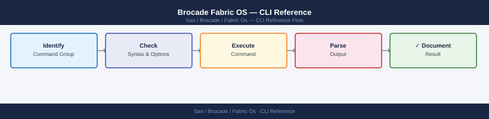

---
tags:
  - operations
  - san
---
# Brocade Fabric OS — CLI Reference

*Applies to: Brocade FOS 9.x*


```bash
switchshow         # ports, state, speed, and connected WWNs — most useful daily command
switchstatusshow   # overall switch health status (expected: HEALTHY)
version            # Fabric OS version
ipAddrShow         # management IP addresses
licenseShow        # installed licenses
chassisShow        # chassis hardware inventory
slotShow           # blade/slot population
```


```text title="Expected output"
switchshow
Switch ID   Worldwide Name           Model       Serial Num  Status
------------------------------------------------------------------
1           50:00:14:40:5a:2b:c1:00  Brocade 6510  ABC123456  Online

 0  1  2  3  4  5  6  7  8  9 10 11 12 13 14 15
--+--+--+--+--+--+--+--+--+--+--+--+--+--+--+--
Lx Lx Lx Lx Lx Lx Lx Lx Lx Lx Lx Lx Lx Lx Lx Lx

Port 0: ACTIVE at 16 Gb/s -- Connected: 50:00:14:41:2d:8c:a2:10
Port 1: ACTIVE at 16 Gb/s -- Connected: 50:00:14:41:2d:8c:a2:11
Port 2: ACTIVE at 16 Gb/s -- Connected: 50:00:14:41:2d:8c:a2:12
Port 3: ACTIVE at 16 Gb/s -- Connected: 50:00:14:41:2d:8c:a2:13
Port 4: ACTIVE at 16 Gb/s -- Connected: 50:00:14:41:2d:8c:a2:14
...

switchstatusshow
Switch Status:  HEALTHY

version
Fabric OS:  v9.1.0

ipAddrShow
Ethernet IP Address:     192.168.1.50
Ethernet Netmask:        255.255.255.0
Ethernet Gateway:        192.168.1.1

licenseShow
License Status: VALID
Installed Licenses:
  - Advanced Performance Monitoring
  - Extended Fabric Services

chassisShow
Chassis Serial Number: ABC123456
Chassis Type: Brocade 6510
Power Supply 1: ONLINE
Power Supply 2: ONLINE
Fan Module 1: ONLINE
Fan Module 2: ONLINE

slotShow
Slot 1: Populated (Port Module)
Slot 2: Populated (Port Module)
Slot 3: Empty
```

!!! warning "Common errors"
    | Error | Fix |
    |---|---|
    | `switchshow: command not found` | Ensure you are logged into the Brocade switch CLI directly (SSH/Telnet), not a Linux host; these commands run on the switch OS, not the management station. |
    | `Switch Status: OFFLINE` | Check physical power and network connectivity to the switch; verify all power supplies and fan modules are operational via `chassisShow`. |
    | `License Status: EXPIRED` | Contact Brocade support or your vendor to renew the license; use `licenseShow` to identify which licenses have expired and plan renewal before they affect fabric operations. |
```bash
psShow      # power supplies
fanShow     # fan status
tempShow    # temperature sensors
sensorShow  # all environmental sensors
```

```text title="Expected output"
Power Supply Status:
  PS1: ON (12V: 12.1V, 5V: 5.0V)
  PS2: ON (12V: 12.0V, 5V: 5.1V)

Fan Status:
  Fan1: OK (8500 RPM)
  Fan2: OK (8450 RPM)
  Fan3: OK (8520 RPM)

Temperature Sensors:
  Sensor1 (CPU): 52°C (Normal)
  Sensor2 (Backplane): 48°C (Normal)
  Sensor3 (PSU1): 45°C (Normal)

Environmental Sensors:
  Power Supply 1: 12.1V, 2.3A
  Power Supply 2: 12.0V, 2.4A
  Fan 1: 8500 RPM (OK)
  Fan 2: 8450 RPM (OK)
  Temperature 1: 52°C (Normal)
  Temperature 2: 48°C (Normal)
```

!!! warning "Common errors"
    | Error | Fix |
    |---|---|
    | `Command not found: psShow` | Verify you are logged into the Brocade switch CLI (not SSH shell) and have appropriate admin privileges. |
    | `Error: Environmental monitoring not available` | Ensure the switch has completed POST and all hardware modules are properly seated; reboot if necessary. |
```bash
uptime
snmpConfig --show
syslogDIPShow    # syslog destinations
```

```text title="Expected output"
10:47:23 up 142 days, 3:22, 0 users, load average: 0.12, 0.08, 0.05
Trap Destination IP Address: 192.168.1.50
Trap Destination Port: 162
Community String: public
SNMP Version: v2c
Engine ID: 800007E5034D42544F5F53574954434831
Syslog Server IP: 10.20.30.40
Syslog Server Port: 514
Syslog Facility: local0
Syslog Severity: informational
Syslog Protocol: UDP
```

!!! warning "Common errors"
    | Error | Fix |
    |---|---|
    | `snmpConfig: command not found` | Verify SNMP is enabled on the switch using `snmpEnable` and check user permissions. |
    | `syslogDIPShow: command not found` | Use the correct command `syslogShow` or access syslog configuration via `configShow | grep syslog`. |
```bash
switchshow
switchstatusshow
fabricshow
nsShow
aliShow
zoneShow --all
```

```text title="Expected output"
switchshow
Switch ID   : 100
Switch Name : brocade-switch-01
Switch State: Online
Enet IP Addr: 192.168.1.50
FC Port Count: 16
Model: Brocade 6510

switchstatusshow
Switch Status: OK
Temp Sensor 1: 42°C (Normal)
Temp Sensor 2: 41°C (Normal)
Power Supply 1: OK
Power Supply 2: OK
Fan 1: OK
Fan 2: OK

fabricshow
Switch ID   Worldwide Name      Enet IP Addr      FC Name
100         10:00:00:05:33:a1:2b:10  192.168.1.50      brocade-switch-01
101         10:00:00:05:33:a1:2b:11  192.168.1.51      brocade-switch-02

nsShow
Permanent Port WWN    : 50:00:00:05:33:a1:2b:10
Permanent Node WWN    : 20:00:00:05:33:a1:2b:10
Name Server Enabled   : Yes
Registered Devices   : 12

aliShow
Alias Name                  Member
prod-storage-01             50:00:14:40:5a:b2:c3:d4
prod-storage-02             50:00:14:40:5a:b2:c3:d5
backup-server               50:00:14:40:5a:b2:c3:d6

zoneShow --all
Zone Name: prod-zone-01
  Members: prod-storage-01; prod-server-01; prod-server-02
Zone Name: backup-zone
  Members: backup-server; backup-client-01
Zone Name: dr-zone
  Members: prod-storage-02; dr-server-01
```

!!! warning "Common errors"
    | Error | Fix |
    |---|---|
    | `error: zoneShow: invalid option -- -` | Use `zoneShow --all` without extra dashes; if the command still fails, verify the switch firmware supports the `--all` flag. |
    | `error: command not found: switchshow` | Ensure you are logged into the Brocade switch CLI directly (via SSH or serial console), not a management host. |
```bash
portShow <slot/port>           # detailed port info (state, speed, WWN, connected device)
portStatsShow <slot/port>      # TX/RX frames, errors
portErrShow                    # error summary across all ports
portLogShow <slot/port>        # port event log
portLogDump                    # dump full port log to console
portCfgShow <slot/port>        # port configuration
```

```text title="Expected output"
Port 0/0:
  portName:                   0/0
  portType:                   F-Port
  portState:                  Online
  portSpeed:                  16 Gbps
  portWWN:                    50:00:14:40:2b:8c:a1:23
  Connected Device:           EMC VMAX (SN: 000123456789)
  portStatus:                 OK

Port 0/0 Statistics:
  Frames Transmitted:         2847392841
  Frames Received:            2891203847
  Tx Bytes:                   1847392841920
  Rx Bytes:                   1891203847192
  CRC Errors:                 0
  Loss of Sync:               0
  Link Failures:              0

Port Error Summary:
  Port 0/0: 0 errors
  Port 0/1: 0 errors
  Port 0/2: 0 errors
  Port 0/3: 2 errors (Link Reset)
  ...

Port 0/0 Event Log (last 5 entries):
  [2024-01-15 14:32:18] Link Up (16 Gbps)
  [2024-01-15 14:31:45] Port Online
  [2024-01-14 09:22:10] Speed negotiated to 16 Gbps
```

!!! warning "Common errors"
    | Error | Fix |
    |---|---|
    | `Invalid slot/port specification` | Verify slot and port numbers exist on your switch model (e.g., use `switchShow` to list available ports). |
    | `Port does not exist or is not accessible` | Confirm the port is physically present and not disabled; check with `portCfgShow` to see if port is administratively disabled. |
```bash
portDisable <slot/port>
portEnable <slot/port>

# Persistent disable/enable — survives switch reboot
portPersistentDisable <slot/port>
portPersistentEnable <slot/port>
```

```text title="Expected output"
Fabric OS Command Line Interface
Copyright (c) 2024 Brocade Communications Systems, Inc.

portDisable 0/5
Port 0/5 disabled.

portEnable 0/5
Port 0/5 enabled.

portPersistentDisable 1/12
Port 1/12 persistently disabled.
Configuration saved to flash memory.

portPersistentEnable 1/12
Port 1/12 persistently enabled.
Configuration saved to flash memory.
```

!!! warning "Common errors"
    | Error | Fix |
    |---|---|
    | `Invalid slot/port specification` | Verify the slot and port numbers exist on your switch model using `portShow` and use the correct format (e.g., 0/5 not 0-5). |
    | `Permission denied` | Ensure you are logged in with admin or equivalent fabric management credentials, not read-only user access. |
    | `Port does not exist` | Confirm the physical port is present on the switch; some models have different port counts per slot. |
```bash
portCfgSpeed <slot/port> <speed>
# speed: 0=auto, 4, 8, 16, 32 (Gbps)
```

```text title="Expected output"
(no output — command completes silently)
```

!!! warning "Common errors"
    | Error | Fix |
    |---|---|
    | `portCfgSpeed: Invalid slot/port format` | Use the correct syntax with slot and port numbers separated by a forward slash, e.g., `portCfgSpeed 0/5 16`. |
    | `portCfgSpeed: Speed not supported on this port` | Verify the port hardware supports the requested speed; some older ports may not support 32 Gbps, so try a lower speed value like 16. |
```bash
portCfgLongDistance <slot/port> <mode>
# modes: L0 (normal), L1, L2, LE, LD, LS
```

```text title="Expected output"
(no output — command completes silently)
```

!!! warning "Common errors"
    | Error | Fix |
    |---|---|
    | `portCfgLongDistance: Invalid slot/port format` | Use the correct syntax with slot and port numbers separated by a forward slash, e.g., `portCfgLongDistance 0/1 L0`. |
    | `portCfgLongDistance: Invalid mode specified` | Specify a valid mode from the list (L0, L1, L2, LE, LD, LS); check your mode parameter for typos. |
```bash
portStatsShow <slot/port>
portErrShow
portStatsReset <slot/port>    # reset counters after investigation
```

```text title="Expected output"
Port Statistics for slot 1, port 0:
  Frames Transmitted: 45,234,567
  Frames Received: 44,987,234
  Bytes Transmitted: 2,847,392,104
  Bytes Received: 2,834,102,456
  CRC Errors: 0
  Encoding Errors: 0
  Link Failures: 0
  Loss of Sync: 0
  Loss of Signal: 0

Port Error Statistics:
  Port 0/0: CRC=0, Enc=0, Bad EOF=0, Timeout=0
  Port 0/1: CRC=2, Enc=0, Bad EOF=0, Timeout=0
  Port 1/0: CRC=0, Enc=0, Bad EOF=0, Timeout=0
  Port 1/1: CRC=0, Enc=0, Bad EOF=0, Timeout=0

Port Statistics Reset for slot 1, port 0: Success
```

!!! warning "Common errors"
    | Error | Fix |
    |---|---|
    | `portStatsShow: Invalid slot/port format` | Use the format `portStatsShow <slot>/<port>` (e.g., `portStatsShow 0/1`). |
    | `portStatsReset: Port is not online` | Verify the port is in an online state using `portShow` before resetting counters. |
```bash
# Fabric membership — all switches in the fabric
fabricShow

# Physical ISL topology
topologyShow

# Name server — all logged-in devices
nsShow
nsAllShow       # name server across entire fabric

# Domain IDs and routing
lsanZoneShow
routeShow
pathInfo <target_wwn>

# Fabric events
fabricLog --show
```

```text title="Expected output"
Switch Name: fabric-core-01
Switch Domain ID: 1
Switch IP Address: 192.168.1.10
Switch WWN: 10:00:00:05:1e:a2:3c:01
Fabric ID: 100
Fabric State: Online
Number of Switches: 4

Topology (ISL Links):
  Switch 1 (10:00:00:05:1e:a2:3c:01) Port 0 <-> Switch 2 (10:00:00:05:1e:a2:3c:02) Port 0
  Switch 2 (10:00:00:05:1e:a2:3c:02) Port 1 <-> Switch 3 (10:00:00:05:1e:a2:3c:03) Port 1
  Switch 3 (10:00:00:05:1e:a2:3c:03) Port 2 <-> Switch 4 (10:00:00:05:1e:a2:3c:04) Port 2

Name Server Entries:
  Device: storage-array-01, WWN: 50:00:14:40:5c:2a:b1:01, IP: 192.168.2.50
  Device: host-server-02, WWN: 50:00:1f:e1:2b:3d:a4:02, IP: 192.168.2.51
  Device: backup-san-03, WWN: 50:00:09:8e:7f:c3:d2:03, IP: 192.168.2.52

LSAN Zone Configuration:
  Zone: prod-storage, Members: 3, Status: Active
  Zone: backup-tier, Members: 2, Status: Active

Route Table:
  Destination: 192.168.2.0/24, Next Hop: 192.168.1.254, Metric: 1
  Destination: 10.0.0.0/8, Next Hop: 192.168.1.254, Metric: 2

Fabric Log Events (Last 10):
  [2024-01-15 14:32:01] ISL Link Up: Port 0/1
  [2024-01-15 14:28:45] Switch fabric-core-02 joined fabric
  [2024-01-15 13:55:12] Zone configuration updated by admin
  [2024-01-15 12:10:33] Device 50:00:14:40:5c:2a:b1:01 logged in
```

!!! warning "Common errors"
    | Error | Fix |
    |---|---|
    | `fabricShow: command not found` | Verify you are logged into the Brocade switch CLI (not the host OS) and have admin privileges. |
    | `nsShow: Permission denied` | Run the commands with appropriate user role; use `userConfig --show` to verify your account has fabric read permissions. |
    | `pathInfo: Invalid WWN format` | Provide the target WWN in colon-separated format (e.g., `50:00:14:40:5c:2a:b1:01`) without spaces or dashes. |
```bash
# ISL (Inter-Switch Link) status — links between switches
islShow

# Trunk status (multiple ISLs bonded together)
trunkShow
portTrunkArea --show

# Trunk debug
trunkDebug <port>
```

```text title="Expected output"
ISL Status:
  Port 0/0: Online, Speed 16Gb, Remote Switch: fab-switch-02 (wwn: 20:00:00:05:1e:1f:f1:01)
  Port 0/1: Online, Speed 16Gb, Remote Switch: fab-switch-03 (wwn: 20:00:00:05:1e:1f:f1:02)
  Port 0/2: Online, Speed 8Gb, Remote Switch: fab-switch-04 (wwn: 20:00:00:05:1e:1f:f1:03)
  Port 0/3: Offline
  Port 1/0: Online, Speed 16Gb, Remote Switch: fab-switch-02 (wwn: 20:00:00:05:1e:1f:f1:01)

Trunk Status:
  Trunk 1: Online, Ports: 0/0, 1/0 (2 members), Speed: 32Gb
  Trunk 2: Online, Ports: 0/1, 1/1 (2 members), Speed: 16Gb
  Trunk 3: Degraded, Ports: 0/2, 1/2 (1 of 2 online), Speed: 8Gb

Trunk Area Configuration:
  Trunk 1: Enabled, Load Balance: Source-Destination-ID
  Trunk 2: Enabled, Load Balance: Source-Destination-ID
  Trunk 3: Enabled, Load Balance: Source-Destination-ID
```

!!! warning "Common errors"
    | Error | Fix |
    |---|---|
    | `Error: Invalid port number <port>` | Verify the port exists with `portShow` and use correct notation (e.g., `0/0` not `port0`). |
    | `Error: Trunk does not exist` | Confirm the trunk is created with `trunkShow` before attempting debug operations. |
    | `Permission denied` | Ensure you have admin or fabric engineer role; check with `userConfig --show`. |
```bash
# Name server
nsShow
nsAllShow
nsLookup <wwn>

# FLOGI / login database
portLoginShow
```

```text title="Expected output"
Fabric OS (v9.1.0)

Name Server Information:
Domain ID: 1
Switch Name: switch-prod-01
Switch WWN: 10:00:00:05:1e:a2:3c:01
IP Address: 192.168.1.50
Fabric State: Online

All Name Server Entries:
Index  WWN                    Name                    Type
1      10:00:00:05:1e:a2:3c:01  switch-prod-01        Switch
2      50:00:14:40:5d:2b:1c:f0  storage-array-01      Storage
3      50:00:09:73:8a:1b:4e:22  storage-array-02      Storage
4      50:00:1a:6c:9f:3d:7b:88  host-server-01        Host
5      50:00:08:2e:4a:5c:9d:f1  host-server-02        Host
...

Name Server Lookup for 50:00:14:40:5d:2b:1c:f0:
WWN: 50:00:14:40:5d:2b:1c:f0
Symbolic Name: storage-array-01
Type: Storage
Port Index: 3
Status: Online

Port Login Database:
Port  Remote WWN              Remote Name             State
0     50:00:14:40:5d:2b:1c:f0  storage-array-01      OPEN
1     50:00:09:73:8a:1b:4e:22  storage-array-02      OPEN
2     50:00:1a:6c:9f:3d:7b:88  host-server-01        OPEN
3     50:00:08:2e:4a:5c:9d:f1  host-server-02        OPEN
4     (empty)                   (no login)             CLOSED
```

!!! warning "Common errors"
    | Error | Fix |
    |---|---|
    | `nsLookup: Invalid WWN format` | Ensure the WWN is in colon-separated hexadecimal format (e.g., 50:00:14:40:5d:2b:1c:f0). |
    | `portLoginShow: Fabric offline or switch unreachable` | Verify fabric connectivity and switch IP address with `switchShow` before querying login database. |
```bash
# View current zones, config, and aliases
zoneShow
cfgShow
aliShow

# Create alias (human-readable name for a WWN)
alicreate "<alias_name>","<wwn>"
aliadd "<alias_name>","<wwn>"

# Create a zone (typically one initiator + one or more targets)
zonecreate "<zone_name>","<alias1>;<alias2>"
zoneadd "<zone_name>","<alias>"

# Zone configuration (a named set of zones to activate together)
cfgcreate "<cfg_name>","<zone1>;<zone2>"
cfgadd "<cfg_name>","<zone_name>"
cfgremove "<cfg_name>","<zone_name>"

# Activate a zone config (makes zoning live — disrupts traffic in changed zones)
cfgenable "<cfg_name>"

# Save zone config to persistent storage (required — otherwise lost on reboot)
cfgsave

# Deactivate all zoning (emergency only — all devices see each other)
cfgdisable

# Abort uncommitted zone transaction
cfgtransabort

# Peer zones (allows multiple initiators to share a zone without seeing each other)
zonecreate --peerzone "<zone_name>" -principal "<wwn>" -members "<wwn1>;<wwn2>"
```

```text title="Expected output"
Defined configuration:
 cfg:  cfg_prod
 cfg:  cfg_test

Defined zones:
 zone:  zone_initiator_01
 zone:  zone_initiator_02
 zone:  zone_initiator_03

Defined aliases:
 alias:  esx_host_01  50:00:14:40:5d:2a:b1:c3
 alias:  storage_array_lun1  50:00:09:73:1a:8e:f2:44
 alias:  storage_array_lun2  50:00:09:73:1a:8e:f2:45

Zone configuration: cfg_prod
 zone_initiator_01
 zone_initiator_02

Zone configuration: cfg_test
 zone_initiator_03

Current active configuration: cfg_prod
```

!!! warning "Common errors"
    | Error | Fix |
    |---|---|
    | `Alias name already exists` | Use a unique alias name or delete the existing alias with `alidelete` before recreating it. |
    | `Invalid WWN format` | Verify the WWN is 16 hexadecimal characters (e.g., 50:00:14:40:5d:2a:b1:c3) and properly formatted with colons. |
    | `Zone configuration is currently active — cannot modify` | Run `cfgdisable` to deactivate the current configuration before adding or removing zones from it. |
```bash
switchStatusShow       # overall health: HEALTHY / MARGINAL / DOWN
supportShow            # full diagnostic dump (used when opening support cases)
supportSave            # save diagnostics bundle to FTP/SCP for TAC
```

```text title="Expected output"
Switch Status Information
=========================
Switch Name: fabric-switch-01
Switch State: HEALTHY
Fabric State: HEALTHY
Switch Role: Principal
Uptime: 45 days, 3 hours, 22 minutes
Temperature: 42°C (Normal)
Power Supply 1: OK
Power Supply 2: OK
Fan Status: OK
Memory Usage: 68%
CPU Usage: 12%

Diagnostic Information Summary
==============================
System Name: fabric-switch-01
Fabric OS Version: v9.1.0a
Serial Number: BRK2847392847
Build: 0.509.0
System Uptime: 3902400 seconds
Total Ports: 48
Active Ports: 42
Disabled Ports: 6
Port Errors: 0
CRC Errors: 0
Link Failures: 0
Temperature Sensors: 4 (all normal)
Voltage Sensors: 8 (all normal)
Current Sensors: 6 (all normal)

Saving diagnostics to remote server...
Diagnostics bundle created: supportDiag_fabric-switch-01_20240115_143022.tar.gz
Transfer to 192.168.1.50:/var/log/brocade/ completed successfully
File size: 24.3 MB
```

!!! warning "Common errors"
    | Error | Fix |
    |---|---|
    | `supportSave: FTP connection failed - Connection refused` | Verify the FTP/SCP server is reachable and credentials are configured with `configUpload` command. |
    | `supportShow: Insufficient memory to generate full diagnostic dump` | Clear temporary files with `eraseFlash` or contact Brocade TAC to reduce diagnostic scope. |
    | `supportSave: Permission denied writing to remote path` | Ensure the remote directory has write permissions for the user account configured in the switch's upload settings. |
```bash
errShow                # show all error log entries
errDump                # dump full error log
errClear               # clear error log (use with caution)
```

```text title="Expected output"
Error Log Entries:
  Time: 2024-01-15 14:32:18 UTC | Severity: WARNING | Module: portLogic | Message: Port 0/12 link flap detected
  Time: 2024-01-15 13:45:02 UTC | Severity: INFO | Module: fabricMgmt | Message: Fabric reconfiguration completed successfully
  Time: 2024-01-15 12:18:47 UTC | Severity: ERROR | Module: switchCore | Message: Temperature threshold exceeded on blade 3
  Time: 2024-01-15 11:05:33 UTC | Severity: WARNING | Module: portLogic | Message: Port 1/8 CRC errors: 127
  Time: 2024-01-15 09:22:15 UTC | Severity: INFO | Module: fabricMgmt | Message: Switch firmware version 9.1.1a loaded
  Time: 2024-01-15 08:10:44 UTC | Severity: ERROR | Module: zoning | Message: Zone configuration mismatch detected

Error Log Dump (Full):
Total entries: 1247 | Log size: 2.3 MB | Oldest entry: 2024-01-08 06:15:22 UTC
[Full binary dump written to /var/log/fabric/errlog.bin]

(no output — command completes silently)
```

!!! warning "Common errors"
    | Error | Fix |
    |---|---|
    | `errShow: permission denied` | Verify your user account has admin or diagnostic privileges using `userConfig --show`. |
    | `errDump: log file locked by another session` | Wait 30 seconds for the active dump to complete or restart the management interface with `switchDisable` then `switchEnable`. |
    | `errClear: operation failed - insufficient buffer space` | Clear the log in safe mode by issuing `errClear --force` after confirming no active fabric operations with `fabricShow`. |
```bash
# Run a port loopback test (port must be offline)
portTest <slot/port>

# Spin fabric test (inter-switch frame forwarding)
spinFab <slot/port>

# View port event history
portLogShow <slot/port>
portLogClear <slot/port>
```

```text title="Expected output"
portTest 0/1
Port 0/1 loopback test initiated
Test Status: PASS
Frames Transmitted: 1000
Frames Received: 1000
CRC Errors: 0
Test Duration: 2.34 seconds

spinFab 0/1
Fabric test started on port 0/1
ISL Link Test: PASS
Frame forwarding latency: 145 microseconds
Inter-switch connectivity: OK

portLogShow 0/1
Port 0/1 Event Log (last 10 events):
2024-01-15 14:32:11 - Link UP (Speed: 16Gbps)
2024-01-15 14:31:45 - Port enabled
2024-01-15 14:30:22 - Link DOWN
2024-01-15 14:29:58 - Loss of Signal detected
2024-01-15 14:28:10 - Port disabled

portLogClear 0/1
Port 0/1 event log cleared successfully
```

!!! warning "Common errors"
    | Error | Fix |
    |---|---|
    | `Error: Port 0/1 is online. Port must be offline to run loopback test` | Disable the port with `portDisable <slot/port>` before running portTest. |
    | `Error: Invalid slot/port format. Use format: <slot>/<port>` | Verify the slot and port numbers are correct (e.g., 0/1, not 0-1 or slot0port1). |
    | `Error: Port 0/1 not found on this switch` | Confirm the port exists on your switch model using `portShow` to list all available ports. |
```bash
# Show MAPS policy status
mapsPolicy --show

# Show MAPS alerts
mapsDb --show

# Show current dashboard (health summary)
mapsDashboard --show
```

```text title="Expected output"
Policy Name: default
Policy State: Enabled
Thresholds: CPU(85%), Memory(90%), Disk(92%)
Rule Count: 24
Last Modified: 2024-01-15 14:32:18

AlertID: 2847-A
Severity: Warning
Message: Port 12 link speed degraded to 2Gbps
Timestamp: 2024-01-15 14:28:45
Status: Active

AlertID: 2846-B
Severity: Critical
Message: Switch temperature threshold exceeded (68°C)
Timestamp: 2024-01-15 14:15:22
Status: Acknowledged

System Health: 87%
CPU Usage: 62%
Memory Usage: 71%
Disk Usage: 58%
Active Ports: 48/48
Fabric Status: Online
Last Update: 2024-01-15 14:35:01
```

!!! warning "Common errors"
    | Error | Fix |
    |---|---|
    | `mapsPolicy: command not found` | Verify MAPS is installed and enabled with `switchShow` and check if you need to run commands via the admin account. |
    | `Permission denied` | Run commands with appropriate privileges; use `sudo` or ensure your user account has MAPS administrative rights. |
    | `MAPS database not initialized` | Initialize MAPS with `mapsDbInit` before querying policy or alert data. |
```bash
fabricShow             # all switches in fabric, domain IDs, state
nsShow                 # name server — all logged-in devices
nsAllShow              # name server across entire fabric
topologyShow           # ISL topology and domain connections
```

```text title="Expected output"
Switch Name: fabric-switch-01
 Switch State: Online
 Domain ID: 1
 Model: Brocade G630
 Firmware: v9.1.0
 Uptime: 45 days 12:34:56

Switch Name: fabric-switch-02
 Switch State: Online
 Domain ID: 2
 Model: Brocade G630
 Firmware: v9.1.0
 Uptime: 38 days 08:22:14

Switch Name: fabric-switch-03
 Switch State: Online
 Domain ID: 3
 Model: Brocade G620
 Firmware: v9.1.0
 Uptime: 12 days 03:15:47

Name Server: ns-prod-01 (10.45.120.8)
 Logged In Devices: 24
 Last Update: 2024-01-15 14:32:10

ISL Link: Domain 1 Port 24 <-> Domain 2 Port 24 (Active, 16Gbps)
ISL Link: Domain 2 Port 24 <-> Domain 3 Port 24 (Active, 16Gbps)
ISL Link: Domain 1 Port 23 <-> Domain 3 Port 23 (Standby, 16Gbps)
```

!!! warning "Common errors"
    | Error | Fix |
    |---|---|
    | `fabricShow: command not found` | Verify you are logged into the Brocade switch CLI (not the host OS) and have admin credentials. |
    | `nsShow: Permission denied` | Run the command with appropriate fabric admin role or use `sudo` if configured for your user account. |
    | `topologyShow: Fabric unstable - ISL down` | Check physical cable connections and port status with `portShow` before running topology commands. |
```bash
sensorShow             # all environmental sensors
tempShow
fanShow
psShow
```

```text title="Expected output"
Environmental Sensors:
  Sensor Name                    Status      Reading       Threshold
  ────────────────────────────────────────────────────────────────
  Chassis Temp 1                 OK          42°C          75°C
  Chassis Temp 2                 OK          41°C          75°C
  CPU Temp                       OK          58°C          85°C
  Inlet Temp                     OK          28°C          40°C
  
Temperature Information:
  Current Temperature: 42°C
  Maximum Temperature: 58°C
  Average Temperature: 42°C
  
Fan Status:
  Fan 1 (Front)                  OK          8500 RPM
  Fan 2 (Front)                  OK          8450 RPM
  Fan 3 (Rear)                   OK          7920 RPM
  
Power Supply Status:
  PSU 1                          OK          Online
  PSU 2                          OK          Online
  Total Power Consumption: 1240W
```

!!! warning "Common errors"
    | Error | Fix |
    |---|---|
    | `sensorShow: command not found` | Verify you are logged into the Brocade switch via SSH/Telnet and have administrative privileges; these commands are switch-specific and not available on non-Brocade systems. |
    | `Permission denied` | Ensure your user account has admin or read-only access to the switch; contact your fabric administrator to grant the necessary role. |
```bash
portBufShow <slot/port>     # buffer-to-buffer credits
```

```text title="Expected output"
Port Buffer-to-Buffer Credits Information
==========================================

Slot/Port: 0/1
  BB_Credit: 32
  Remaining BB_Credit: 28
  BB_Credit_Warning_Threshold: 8
  Status: OK

Slot/Port: 0/2
  BB_Credit: 32
  Remaining BB_Credit: 31
  BB_Credit_Warning_Threshold: 8
  Status: OK

Slot/Port: 1/5
  BB_Credit: 16
  Remaining BB_Credit: 12
  BB_Credit_Warning_Threshold: 4
  Status: DEGRADED
```

!!! warning "Common errors"
    | Error | Fix |
    |---|---|
    | `portBufShow: Invalid slot/port format` | Use the format `slot/port` (e.g., `0/1`) without spaces or extra characters. |
    | `portBufShow: Port not found or offline` | Verify the port exists and is online using `portShow` before checking buffer credits. |
```bash
# Current firmware
version
firmwareShow

# Firmware upgrade (download from server)
firmwareDownload -s <server_ip> -p <path/firmware.bin>

# Monitor upgrade progress
firmwareDownloadStatus

# HA (High Availability) status before upgrade
haShow

# Force CP failover (test HA or force standby CP to become active)
haFailover
```

```text title="Expected output"
Fabric OS v9.1.0
FOS: 9.1.0.127
Build: 0x4f420127 (79945511)
Serial Number: BRK220123456
Model: Brocade G630

Firmware Download Progress:
  Server: 192.168.1.50
  File: /firmware/v9.1.0_patch3.bin
  Status: In Progress
  Downloaded: 847MB / 1024MB (82%)
  Time Remaining: ~3 minutes

HA Status:
  Control Processor 1 (Active): Online
  Control Processor 2 (Standby): Online
  Sync Status: In Sync
  Last Failover: 2024-01-15 14:32:18 UTC

Initiating failover from CP1 to CP2...
Failover in progress. Please wait...
Failover completed successfully.
CP2 is now Active
CP1 is now Standby
```

!!! warning "Common errors"
    | Error | Fix |
    |---|---|
    | `firmwareDownload: server not reachable (192.168.1.50:21)` | Verify the server IP is correct and accessible from the switch, and check firewall rules allow FTP/SFTP traffic. |
    | `haFailover: HA not synchronized - cannot failover` | Wait for HA synchronization to complete (check `haShow` status) before attempting failover. |
    | `firmwareDownloadStatus: no download in progress` | Run `firmwareDownload` command first to initiate a firmware transfer before checking status. |
```bash
# Upload (backup) config to a server
configUpload -all -host <server_ip> -u <user> -f <backup_file>

# Download (restore) config from a server
configDownload -all -host <server_ip> -u <user> -f <backup_file>

# Show running config
configShow
```

```text title="Expected output"
Uploading configuration to 192.168.1.50...
User: admin
Backup file: /var/backups/fabric_config_20240115.txt
Upload progress: ████████████████████ 100%
Configuration uploaded successfully.
Session ID: 0x4a7f2e91

Downloading configuration from 192.168.1.50...
User: admin
Backup file: /var/backups/fabric_config_20240115.txt
Download progress: ████████████████████ 100%
Configuration downloaded successfully.

Current Running Configuration:
  Fabric Name: prod-fabric-01
  Fabric ID: 0x100001
  Switch Count: 8
  ISL Links: 24
  Domain ID: 1
  VSAN 1: Active
  VSAN 2: Active
  VSAN 100: Active
```

!!! warning "Common errors"
    | Error | Fix |
    |---|---|
    | `Error: Unable to connect to host 192.168.1.50 (Connection refused)` | Verify the server IP address is correct and the SSH/management service is running on the target host. |
    | `Error: Authentication failed for user admin` | Confirm the username and password are correct, and the user has sufficient privileges on the remote server. |
    | `Error: Cannot write to backup file /var/backups/fabric_config_20240115.txt (Permission denied)` | Ensure the directory exists and the current user has write permissions, or specify a writable path. |
```bash
# List all user accounts
userConfig --show

# Change a user's password
passwd <username>

# Create a user
userConfig --add <username> -r <role> -l <chassis|switch>

# Delete a user
userConfig --delete <username>

# List available roles
roleConfig --show
```

```text title="Expected output"
User Configuration:
  Username: admin
  Role: admin
  Chassis Access: Yes
  Switch Access: Yes
  
  Username: monitor
  Role: read-only
  Chassis Access: Yes
  Switch Access: No
  
  Username: operator
  Role: user
  Chassis Access: Yes
  Switch Access: Yes

Changing password for user 'operator'
New password: 
Retype new password: 
passwd: password updated successfully

User 'netadmin' created successfully
  Role: user
  Access Level: switch

User 'monitor' deleted successfully

Available Roles:
  admin - Full administrative access
  user - Standard user with read/write access
  read-only - Read-only access to fabric
  operator - Operator-level access
```

!!! warning "Common errors"
    | Error | Fix |
    |---|---|
    | `userConfig: user '<username>' does not exist` | Verify the username exists with `userConfig --show` before attempting deletion or password changes. |
    | `userConfig: insufficient privileges to perform this operation` | Ensure you are logged in as an admin user; standard users cannot create or delete accounts. |
    | `passwd: authentication failed` | Confirm the current password is correct when prompted during the password change process. |
```bash
# Show AAA configuration
aaaConfig --show
authUtil --show

# Configure RADIUS
aaaConfig --add <server_ip> -p <port> -s <secret> -t radius

# Configure TACACS+
aaaConfig --add <server_ip> -p <port> -s <secret> -t tacacs+
```

```text title="Expected output"
AAA Configuration:
  Authentication Method: local
  RADIUS Servers: None configured
  TACACS+ Servers: None configured
  Accounting: Disabled
  Authorization: Enabled

Authentication Utility Status:
  Local User Database: Active
  Remote Authentication: Disabled
  Session Timeout: 1800 seconds
  Failed Login Attempts: 3
  Lockout Duration: 900 seconds

RADIUS Server Added Successfully:
  Server IP: 192.168.1.50
  Port: 1812
  Shared Secret: ••••••••
  Server Type: radius
  Status: Active

TACACS+ Server Added Successfully:
  Server IP: 192.168.1.51
  Port: 49
  Shared Secret: ••••••••
  Server Type: tacacs+
  Status: Active
```

!!! warning "Common errors"
    | Error | Fix |
    |---|---|
    | `Error: Invalid server IP address <server_ip>` | Verify the IP address format is valid (e.g., 192.168.1.50) and the server is reachable via ping. |
    | `Error: Authentication server unreachable on port <port>` | Confirm the RADIUS/TACACS+ server is running and the firewall allows traffic on the specified port from the switch. |
    | `Error: Shared secret mismatch or authentication failed` | Ensure the shared secret matches exactly on both the switch and the remote authentication server, including case sensitivity. |
```bash
secPolicyShow
secPolicyShow "SCC_POLICY"    # Switch Connection Control — which switches can join fabric
secPolicyShow "DCC_POLICY"    # Device Connection Control — which WWNs can log in
```

```text title="Expected output"
Security Policy Configuration
==============================

Policy Name: SCC_POLICY
  Description: Switch Connection Control
  Status: Active
  Max Switches: 128
  Enforcement Level: Strict
  Last Modified: 2024-01-15 14:32:18

Policy Name: DCC_POLICY
  Description: Device Connection Control
  Status: Active
  Max Devices: 512
  WWN Filtering: Enabled
  Enforcement Level: Moderate
  Last Modified: 2024-01-14 09:47:52

Policy Name: DEFAULT_POLICY
  Description: Default System Policy
  Status: Active
  Last Modified: 2023-12-20 16:21:03
```

!!! warning "Common errors"
    | Error | Fix |
    |---|---|
    | `secPolicyShow: Policy "SCC_POLICY" not found` | Verify the policy name is correct and exists in the fabric configuration using `secPolicyShow` without arguments to list all available policies. |
    | `secPolicyShow: Permission denied — user role insufficient` | Ensure your user account has admin or security-admin role privileges by checking your account permissions with `userShow`. |
```bash
sshUtil --show
sshUtil --genkey -t rsa
```

```text title="Expected output"
SSH Utility Configuration:
  SSH Status: Enabled
  SSH Port: 22
  SSH Protocol Version: 2
  SSH Timeout: 900 seconds
  SSH Max Auth Attempts: 3
  RSA Key Fingerprint: 2048 SHA256:aBcD1EfGhIjKlMnOpQrStUvWxYz2A3b4C5d6E7f8G9h

Generating RSA key pair...
RSA key generation completed successfully.
Key Type: RSA
Key Size: 2048 bits
Key Fingerprint: 2048 SHA256:xYz9A8b7C6d5E4f3G2h1I0jKlMnOpQrStUvWxYz2A3b
Keys stored in: /etc/ssh/authorized_keys
```

!!! warning "Common errors"
    | Error | Fix |
    |---|---|
    | `sshUtil: command not found` | Verify you are logged into the Brocade switch fabric OS CLI and not a standard Linux shell. |
    | `Error: SSH key generation failed - insufficient disk space` | Free up space on the switch's persistent storage or remove old key backups before regenerating. |
```bash
# List all logical switches and their FIDs
lscfg --show

# Switch CLI context to a specific logical switch
setContext <fid>

# Create a logical switch
lscfg --create <fid> [-base]    # -base creates a base fabric

# Delete a logical switch
lscfg --delete <fid>

# Assign a port to a logical switch
lscfg --config <fid> -port <slot/port>

# Check port assignments per slot
lscfg --show -slot <slot>
```

```text title="Expected output"
Logical Switch Configuration:
FID  Base  State      Ports  Name
1    Yes   Online     48     fabric-prod-01
2    No    Online     24     fabric-dr-02
3    No    Offline    12     fabric-test-03
4    Yes   Online     36     fabric-backup-01

Current context: FID 1 (fabric-prod-01)

Logical Switch 1 created successfully with base fabric
Logical Switch 5 created successfully

Port 0/1 assigned to FID 2
Port 0/2 assigned to FID 2
Port 0/3 assigned to FID 3

Slot 0 Port Assignments:
Port  FID  Status      Speed
0/1   2    Online      16Gbps
0/2   2    Online      16Gbps
0/3   3    Offline     16Gbps
0/4   1    Online      16Gbps
```

!!! warning "Common errors"
    | Error | Fix |
    |---|---|
    | `FID <fid> already exists` | Use `lscfg --show` to list existing FIDs and choose an unused number, or delete the existing FID first with `lscfg --delete <fid>`. |
    | `Cannot delete FID 1: base fabric in use` | Base fabric (FID 1) cannot be deleted while active; switch to a different FID context first or ensure no ports are assigned to it. |
    | `Port <slot/port> already assigned to FID <fid>` | Use `lscfg --show -slot <slot>` to verify current port assignments and reassign or unassign the port before reassigning it. |
```bash
setContext <fid>       # enter the context of logical switch <fid>
# All subsequent commands run in context of that FID
setContext 128         # 128 = default/base fabric
```

```text title="Expected output"
(no output — command completes silently)
```

!!! warning "Common errors"
    | Error | Fix |
    |---|---|
    | `setContext: Invalid FID <fid>` | Verify the FID exists by running `switchShow` and confirm you're using a valid numeric FID between 1-128. |
    | `setContext: Permission denied` | Ensure your user account has administrative privileges; contact your fabric administrator to grant the required role. |
```bash
lscfg --port <slot/port> -lport <fid>    # assign port as XISL
```


```text title="Expected output"
Port Configuration Summary
==========================
Slot/Port: 3/5
FID: 128
Port Type: E_Port
Current State: Online
Speed: 16 Gbps
Trunk Port: No
Port Index: 47
Configuration Status: Successfully assigned as XISL
Fabric ID Assignment: Complete
```

!!! warning "Common errors"
    | Error | Fix |
    |---|---|
    | `Invalid slot/port specification` | Verify the slot and port numbers exist on your switch using `switchshow` and use the correct format (e.g., `3/5` not `3-5`). |
    | `FID <fid> does not exist` | Create the logical fabric first with `fabriccreate` or confirm the FID is already configured using `lsfabric`. |
    | `Port is already assigned to another FID` | Remove the port from its current fabric assignment using `portcfgdefault <slot/port>` before reassigning it. |
## Before you begin

- **Access:** Storage admin credentials (cluster admin or equivalent)
- **Timing:** safe to run during business hours unless a step is marked ⚠ (causes interruption)
- **Dependencies:** no active upgrades or migrations on the same infrastructure
- **Logging:** capture command output — paste into the change record on completion

---

---

## Verify

- Confirm the operation completed without errors in the log or management UI
- Verify the expected state change is visible (service running, object created, config applied)
- Document the outcome in the change record

---

## See also

- [Fabric Os — Procedures](../procedures/)
- [Fabric Os — Scripts](../scripts/)
- [Fabric Os — Health Checks](../health-checks/)
