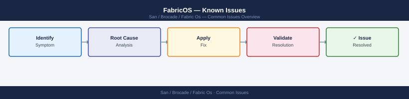

---
tags:
  - operations
  - san
---
# FabricOS — Known Issues

Known Issues reference covering Incident Triage, Port Issues, Zoning Issues, Switch / Fabric Issues, MAPS and Alerting and 1 more sections.

*Applies to: Brocade FOS 9.x*

> Part of the [Operations](index.md) reference.

---

## Before you begin

- **Access:** Storage admin credentials (cluster admin or equivalent)
- **Timing:** safe to run during business hours unless a step is marked ⚠ (causes interruption)
- **Dependencies:** no active upgrades or migrations on the same infrastructure
- **Logging:** capture command output — paste into the change record on completion

---

## Incident Triage

- [ ] Run `switchshow` — identify any offline, faulty, or unexpected port states
- [ ] Run `porterrshow` — look for error counter spikes on specific ports; note `enc_in`, `loss_sync`, `link_fail`
- [ ] Run `fabricshow` — check for fabric segmentation, missing switches, or unexpected principal election
- [ ] Run `errshow` — review log for root cause events, timestamps, and switch identity
- [ ] Run `islshow` — confirm ISLs are up; a downed ISL can cause fabric segmentation
- [ ] Check SFP health on affected ports: `sfpshow <slot/port>`
- [ ] Verify zoning has not changed unexpectedly: `cfgshow` and compare to backup
- [ ] Escalate to Brocade TAC if hardware failure confirmed or log entries indicate switch fault

| Question | Answer |
|---|---|
| Which ports are offline or faulty? | `switchshow` output |
| Are there error counter spikes? | `porterrshow` — check `enc_in`, `loss_sync`, `link_fail` |
| Is the fabric segmented? | `fabricshow` — missing domain IDs indicate segmentation |
| What does the error log show? | `errshow` — timestamps and event codes |
| Are ISLs intact? | `islshow` — down ISL = likely root cause of isolation |

---

## Port Issues

| Issue | Check | Action |
|---|---|---|
| Port shows No_Light | SFP installed? | Seat SFP; check cable |
| Port flapping | Signal quality | Replace SFP; check cable |
| High error count | Encoding or signal | `portErrShow`; replace SFP |
| Device not logging in | Port state = Offline | `portEnable`; check zoning |

---

## Zoning Issues

| Symptom | Command | Action |
|---|---|---|
| Host HBA not visible in name server | `nsshow` | Check cable, HBA driver, FLOGI; confirm VSAN membership |
| Host can't see LUNs | `zoneshow "<alias>"` | Confirm zone is in active zone set; check alias WWN |
| Zone set not active | `cfgshow` — no asterisk | Run `cfgenable "<zset>"` then `cfgsave` |
| Two hosts in same zone | `zoneshow` | Split into single-initiator zones immediately |
| Alias WWN is wrong | `alishow` | Delete and recreate alias with correct WWN |
| Change not persisted after reboot | | Run `cfgsave` after every change |

---

## Switch / Fabric Issues

| Issue | Check | Action |
|---|---|---|
| Switch status not HEALTHY | Environmental or hardware | Check `psShow`, `fanShow`, `tempShow` |
| Firmware version mismatch | `version` | Schedule Fabric OS upgrade |
| License missing | `licenseShow` | Add license key via `licenseAdd` |
| Fabric segmented | `fabricshow` | Investigate ISL state, domain ID conflicts |
| Principal switch changed | `fabricshow` | Review recent switch events; verify domain ID settings |

---

## MAPS and Alerting

| Issue | Check | Action |
|---|---|---|
| Switch status MARGINAL | `errShow` | Investigate hardware errors |
| Port diagnostics fail | Port offline | Disable port before running `portTest` |
| MAPS alert firing | `mapsDb --show` | Investigate threshold breach |
| High error rate | `errShow` | Correlate with port errors |

---

## Virtual Fabrics (VF) Issues

| Issue | Check | Action |
|---|---|---|
| Device not visible | Wrong FID context | `setContext <fid>` then `switchshow` |
| Port in wrong FID | `lscfg --show` | Reassign port to correct FID |
| VF not enabled | License | Verify VF license with `licenseShow` |

---

## Verify

- Confirm the operation completed without errors in the log or management UI
- Verify the expected state change is visible (service running, object created, config applied)
- Document the outcome in the change record

## See also

- [FabricOS — Backup & Restore](backup-restore.md)
- [Brocade Fabric OS — CLI Reference](cli-reference.md)
- [FabricOS — Health Checks](health-checks.md)
- [FabricOS — Operations](index.md)
- [Brocade Fabric OS — Architecture](../../architecture/)
- [Brocade FabricOS — Initial Deployment](../../deploy/)
- [FabricOS — Security](../../security/)
- [FabricOS — Troubleshooting](../../troubleshooting/)
