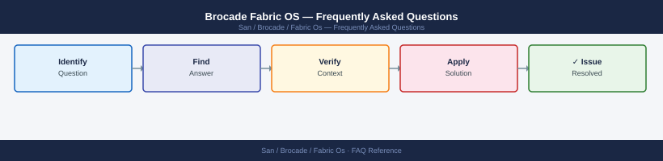

---
tags:
  - fabric-os
  - faq
  - operations
---
# Brocade Fabric OS — Frequently Asked Questions

Common questions about Brocade Fabric OS operations, configuration, and troubleshooting. For step-by-step procedures, see the <a href="index.md">Operations</a> section.

## General

**Q: What Fabric OS version is recommended for new deployments?**
A: FOS 9.2.x is the current recommended release for Gen 7 (64G) switches. For Gen 6 (32G), FOS 8.2.x. Check with `version` CLI command on the switch.

**Q: How do I check the current Brocade Fabric OS version?**
A: `version`

## Configuration

**Q: What is the default zoning mode and when should it change?**
A: Soft zoning (WWN-based) is the default but provides no enforcement at the ASIC level. Use hard zoning (port-based) for security-sensitive environments. Enable with `defzone --noaccess`.

**Q: How do I enable FIPS mode on Fabric OS?**
A: Run `fipscfg --enable` after verifying all connected devices support FIPS-compliant algorithms. Note: FIPS mode disables older SSH/TLS cipher suites — test connectivity first. Reboot required after enabling.

## Operations

**Q: How do I perform a non-disruptive firmware upgrade on a Brocade switch?**
A: Use `firmwaredownload -s` (single reboot) for non-disruptive upgrade on supported platforms. For chassis switches, upgrade one blade at a time using `firmwaredownload -b`. Verify ISL stability post-upgrade with `islshow`.

**Q: What is the correct procedure to add a new host to an existing zone?**
A: Get the host HBA WWN with `nsshow`. Add to the zone: `zoneadd zonename --member <wwn>`. Save config: `cfgsave`. Enable: `cfgenable configname`. Verify with `zoneshow`.

## Troubleshooting

**Q: Switch shows 'E_Port Isolated' on an ISL. What does it mean?**
A: The ISL is isolated due to a fabric parameter mismatch (e.g., BB credit, speed, or domain ID conflict). Check `islshow` and `errdump`. Common causes: speed mismatch, duplicate domain IDs, or incompatible fabric parameters.

**Q: FC fabric throughput degraded — where do I start?**
A: Run `perfshow` or `toptalkers` to identify congested ports. Check BB credit zero counts with `portperfshow`. Look for SCSI timeouts in host logs. Check ISL utilisation — add ISLs if above 70% sustained.

## Backup and Recovery

**Q: How often should I back up Fabric OS switch configuration?**
A: Weekly via `configupload` to a SFTP server. Back up before any firmware upgrade or zoning change. Store named configs with date stamps. Test restore on a lab switch annually.

**Q: Can I restore a single zone without a full configuration restore?**
A: Yes — export the zone database with `configupload -all`, edit the zone file, then `configdownload` the modified file. Alternatively, re-create the zone manually with `zonecreate` and `zoneadd` commands.

## See Also

- [Brocade Fabric OS Operations](index.md)
- [Brocade Fabric OS Troubleshooting](../../../troubleshooting/index.md)
