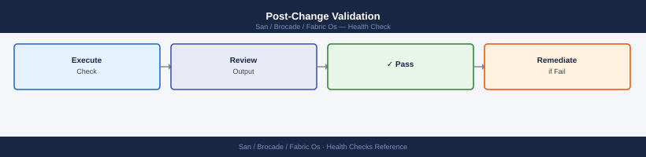

---
tags:
  - operations
  - san
---
# FabricOS — Health Checks


<div class="kb-summary">
Health Checks reference covering Daily Checks, Health Check Checklist, Post-Change Validation.

*Applies to: Brocade FOS 9.x*
</div>


```d2
direction: right

hub: "Brocade Fabric OS\nOperations" {shape: hexagon}
run_this_routine: "Run This Routine" {shape: rectangle}
postchange_validation: "Post-Change Validation" {shape: rectangle}
verify: "Verify" {shape: rectangle}

hub -> run_this_routine
hub -> postchange_validation
hub -> verify
```

## Before you begin

- **Access:** Storage admin credentials (cluster admin or equivalent)
- **Timing:** safe to run during business hours unless a step is marked ⚠ (causes interruption)
- **Dependencies:** no active upgrades or migrations on the same infrastructure
- **Logging:** capture command output — paste into the change record on completion

---

## Run This Routine

1. `switchshow` — verify all ports show **Online**; check switch state field shows **Healthy**
2. `fabricshow` — list all switches in fabric; flag any missing domain IDs or disconnected members
3. `porterrshow` — scan every port for non-zero CRC, LR_IN, or LR_OUT; non-zero requires immediate investigation
4. `cfgshow` — confirm active cfg name matches expected zoning configuration for this fabric
5. `islshow` — all ISLs should show **Up** at expected speed and link distance; investigate any Down ISLs
6. `sfpshow` — review Tx/Rx power dBm for every port against SFP vendor thresholds; replace out-of-range SFPs
7. `portshow <port>` on all F-ports (NPIV environments) — verify expected initiator WWNs are logged in
8. `configshow -all | wc -l` — confirm non-zero output; then `configupload` to save current config to backup server

---

## Post-Change Validation



- [ ] `switchshow` — all ports back in expected state, no unexpected offline ports
- [ ] `fabricshow` — fabric membership intact, principal switch unchanged
- [ ] `islshow` — all ISLs up and at expected speed
- [ ] `porterrshow` — no new error counter increments since change completed
- [ ] `cfgshow` — active zone config name and contents match expected post-change state
- [ ] Host multipath paths are active and balanced (check host-side multipath tool)
- [ ] Management platform (SANnav) shows no new alarms for affected fabric
- [ ] Close change ticket with validation evidence attached

---

## Verify

- Confirm the operation completed without errors in the log or management UI
- Verify the expected state change is visible (service running, object created, config applied)
- Document the outcome in the change record

---

## See also

- [Fabric Os — Procedures](procedures/)
- [Fabric Os — CLI Reference](cli-reference/)
- [Fabric Os — Common Issues](../troubleshooting/common-issues/)
