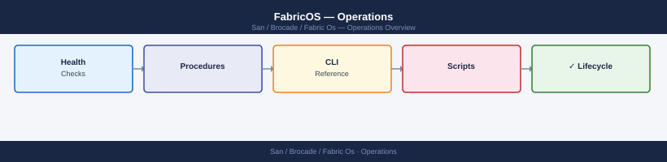

---
tags:
  - operations
  - san
---
# FabricOS — Operations

Brocade FabricOS day-to-day operations — zoning, port management, fabric health monitoring, and switch administration.

*Applies to: Brocade FOS 9.x*

<a class="kb-card" href="procedures/">
  <strong>Procedures</strong>
  Step-by-step operational procedures and runbooks.
</a>

<a class="kb-card" href="health-checks/">
  <strong>Health Checks</strong>
  Proactive fabric health monitoring and validation routines.
</a>

<a class="kb-card" href="common-issues/">
  <strong>Common Issues</strong>
  Known problems, symptoms, and resolution steps.
</a>

<a class="kb-card" href="install-upgrade/">
  <strong>Install & Upgrade</strong>
  FabricOS installation, upgrade procedures, and version management.
</a>

<a class="kb-card" href="backup-restore/">
  <strong>Backup & Restore</strong>
  Configuration backup, restore operations, and recovery validation.
</a>

<a class="kb-card" href="cli-reference/">
  <strong>CLI Reference</strong>
  FabricOS command reference for day-to-day operations.
</a>

<a class="kb-card" href="scripts/">
  <strong>Scripts</strong>
  Automation scripts for common operational tasks.
</a>

  <a class="kb-card" href="faq/"><strong>FAQ</strong>Frequently asked questions, common issues, and quick answers for day-to-day operations.</a>

> Part of the [Brocade Fabric OS](../index.md) reference.
