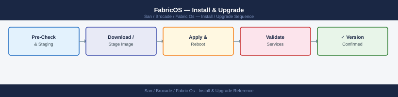
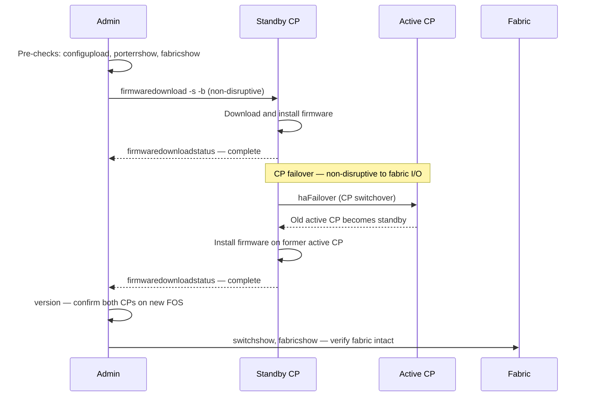

---
tags:
  - operations
  - san
---
# FabricOS — Install & Upgrade

<div class="kb-summary">
FabricOS install and upgrade: `firmwaredownload` from SCP/FTP, firmware commit procedure, HA failover test, and downgrade rollback steps.

*Applies to: Brocade FOS 9.x*
</div>


---

## Before you begin

- **Access:** Storage admin credentials (cluster admin or equivalent)
- **Timing:** safe to run during business hours unless a step is marked ⚠ (causes interruption)
- **Dependencies:** no active upgrades or migrations on the same infrastructure
- **Logging:** capture command output — paste into the change record on completion

---

## Firmware Upgrade Sequence (HA Director)



3. Connect ISL cables to the edge ports of the core switch.
4. Verify the new switch joins the fabric:

```bash
fabricshow     # New switch should appear
topologyshow   # ISL path visible
```

5. Configure trunk groups on the ISL ports:
```bash
# Verify trunking formed automatically (requires same speed on both ends)
trunkshow
```

6. Update CMDB and SAN design register with the new domain ID and port map.

---

## Switch Replacement

When replacing a failed switch with an identical model:

1. Collect the config backup from the original switch (if available) or restore from the latest `configupload` backup.
2. Apply the same static domain ID on the new switch before connecting to the fabric.
3. Restore configuration: `configdownload`
4. Connect to the fabric and verify all devices re-login:

```bash
nsshow    # All devices logged in
cfgshow   # Zone database present and correct
```

5. Activate the zone set if it was not restored automatically:
```bash
cfgenable <zoneset-name>
```

---

## Firmware

### Firmware Commands

```bash
# Current firmware
version
firmwareShow

# Firmware upgrade
firmwareDownload -s <server_ip> -p <path/firmware.bin>
firmwareDownloadStatus

# Boot check
haShow          # Check HA / CP status
haFailover      # Force CP failover
```

### Firmware Standards

- All switches in a fabric must run the same Fabric OS version (FOS)
- New FOS versions applied to Fabric B first, validated, then Fabric A
- Minimum: stay within 1 major FOS version of Broadcom's current release
- Check FOS EOL: [support.broadcom.com](https://support.broadcom.com) → Product Lifecycle

---

## Verify

- Confirm the operation completed without errors in the log or management UI
- Verify the expected state change is visible (service running, object created, config applied)
- Document the outcome in the change record

---

## See also

- [Fabric Os — Procedures](../procedures/)
- [Fabric Os — Health Checks](../health-checks/)
- [Fabric Os — Deploy](../deploy/)
