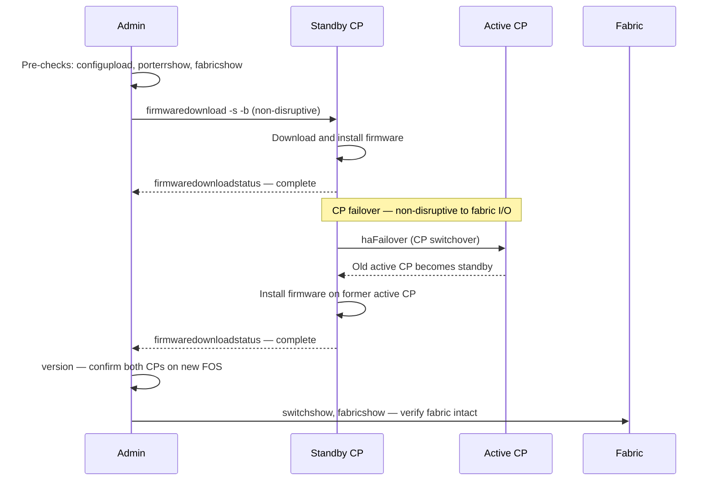

---
tags:
  - operations
  - san
description: "FabricOS install and upgrade: firmwaredownload from SCP/FTP, firmware commit procedure, HA failover test, and downgrade rollback steps."
---
# FabricOS — Install & Upgrade

<div class="kb-summary">
FabricOS install and upgrade: `firmwaredownload` from SCP/FTP, firmware commit procedure, HA failover test, and downgrade rollback steps.

*Applies to: Brocade FOS 9.x*
</div>


---

## Before you begin

- **Access:** Storage admin credentials (cluster admin or equivalent)
- **Timing:** safe to run during business hours unless a step is marked ⚠ (causes interruption)
- **Dependencies:** no active upgrades or migrations on the same infrastructure
- **Logging:** capture command output — paste into the change record on completion

---

## Firmware Upgrade Sequence (HA Director)



3. Connect ISL cables to the edge ports of the core switch.
4. Verify the new switch joins the fabric:

```bash
fabricshow     # New switch should appear
topologyshow   # ISL path visible
```


```text title="Expected output"
Switch ID   Worldwide Name      Fabric Name         FC Router  Firmware
   0   10:00:00:05:1e:2a:3c:4d   prod-fabric-01         No      v9.1.1a
   1   10:00:00:05:1e:2a:3c:4e   prod-fabric-01         No      v9.1.1a
   2   10:00:00:05:1e:2a:3c:4f   prod-fabric-01         No      v9.1.1a

Fabric Information:
  Fabric Name: prod-fabric-01
  Fabric State: Online
  Switch Count: 3

Topology Information:
  Switch 0 (10:00:00:05:1e:2a:3c:4d) port 0 --ISL--> Switch 1 port 0
  Switch 1 (10:00:00:05:1e:2a:3c:4e) port 0 --ISL--> Switch 2 port 0
  Switch 2 (10:00:00:05:1e:2a:3c:4f) port 1 --ISL--> Switch 0 port 1
  Path redundancy: 2 paths available
```

!!! warning "Common errors"
    **`switchshow: No such file or directory`** — Ensure you are logged into the switch via SSH or serial console, not a management station.
    **`Fabric State: Offline`** — Verify all ISL cables are seated firmly and check `portshow` for link errors on ISL ports.
    **`Switch ID mismatch detected`** — Run `fabricshow --reset` to resynchronize the fabric configuration after hardware changes.
5. Configure trunk groups on the ISL ports:
```bash
# Verify trunking formed automatically (requires same speed on both ends)
trunkshow
```


```text title="Expected output"
TrunkIndex: 0
    Master    : 0, 1
    Master    : 1, 0
    TrunkName : trunk0
    State     : TRUNK
    Speed     : 16Gb
    Distance  : --
    PortName  : 0/0 to 0/3
    PortName  : 1/0 to 1/3
    Trunk Mode: ON

TrunkIndex: 1
    Master    : 2, 3
    Master    : 3, 2
    TrunkName : trunk1
    State     : TRUNK
    Speed     : 8Gb
    Distance  : --
    PortName  : 2/0 to 2/1
    PortName  : 3/0 to 3/1
    Trunk Mode: ON
```

!!! warning "Common errors"
    **`trunkshow: command not found`** — Verify you are logged into the Brocade switch CLI (not the Linux shell) by checking the prompt shows `switch>` or `switch#`.
    **`No trunks configured`** — Ensure both switch ports have matching speeds and are directly connected; use `portshow` to verify port speed compatibility before trunk formation.
6. Update CMDB and SAN design register with the new domain ID and port map.

---

## Switch Replacement

When replacing a failed switch with an identical model:

1. Collect the config backup from the original switch (if available) or restore from the latest `configupload` backup.
2. Apply the same static domain ID on the new switch before connecting to the fabric.
3. Restore configuration: `configdownload`
4. Connect to the fabric and verify all devices re-login:

```bash
nsshow    # All devices logged in
cfgshow   # Zone database present and correct
```


```text title="Expected output"
Fabric OS v9.1.0
Brocade 6505 Switch

 N Port  Device Name       Node Name                 State   Speed
================================================================================
  0   50:00:14:40:1b:22:aa:01  esx-host-01.prod.local  esx-host-01         Online  16G
  1   50:00:14:40:1b:22:aa:02  esx-host-02.prod.local  esx-host-02         Online  16G
  2   50:00:14:40:1b:22:bb:01  storage-array-01        storage-array-01    Online  16G
  3   50:00:14:40:1b:22:bb:02  storage-array-02        storage-array-02    Online  16G
  4   50:00:14:40:1b:22:cc:01  backup-server.local     backup-server       Online   8G

Defined configuration:
 cfg:  prod-zones
 zone: prod-esx-storage (members: 2)
 zone: prod-backup-storage (members: 2)
 zone: prod-replication (members: 2)
 zone: mgmt-access (members: 3)

Active configuration:  prod-zones
```

!!! warning "Common errors"
    **`nsshow: command not found`** — Ensure you are logged into the Brocade switch via SSH or serial console, not the local server; the command runs on the fabric switch itself.
    **`cfgshow: Access denied`** — Verify your user account has fabric administrator privileges; request elevated permissions or use an admin account.
5. Activate the zone set if it was not restored automatically:
```bash
cfgenable <zoneset-name>
```


```text title="Expected output"
Effective configuration: <zoneset-name>
Zone configuration has been enabled.
```

!!! warning "Common errors"
    **`Error: Zone set <zoneset-name> not found`** — Verify the zoneset name exists with `cfgshow` and use the correct spelling.
    **`Error: Operation failed - fabric locked`** — Wait for any ongoing fabric operations to complete or use `lockshow` to check lock status, then retry.
---

## Firmware

### Firmware Commands

```bash
# Current firmware
version
firmwareShow

# Firmware upgrade
firmwareDownload -s <server_ip> -p <path/firmware.bin>
firmwareDownloadStatus

# Boot check
haShow          # Check HA / CP status
haFailover      # Force CP failover
```


```text title="Expected output"
Fabric OS v9.1.0
FOS Version: 9.1.0
Serial Number: SN20240156789
Build: 0x0c060b0e
Checksum: 0x12ab34cd

Firmware Download Progress:
  Server: 192.168.1.50
  File: /firmware/v9.1.0_patch3.bin
  Status: In Progress
  Bytes Downloaded: 524288000 / 1048576000 (50%)
  Time Elapsed: 2m 15s

HA Status:
  HA Enabled: true
  Current Principal: switch-fab1 (10.0.0.1)
  Standby Control Point: switch-fab2 (10.0.0.2)
  HA State: Active
  Last Failover: 2024-01-15 14:32:00

Failover initiated. Switching control point from switch-fab1 to switch-fab2...
Failover complete. New Principal CP: switch-fab2
```

!!! warning "Common errors"
    **`firmwareDownload: Server not reachable (192.168.1.50:21)`** — Verify the server IP is correct and accessible from the switch, and that FTP/SFTP service is running on the firmware server.
    **`haFailover: HA not enabled or no standby CP available`** — Enable HA mode first using `haEnable`, or ensure a secondary control point is properly configured and synchronized.
    **`firmwareDownloadStatus: No download in progress`** — Run `firmwareDownload` with valid server credentials and path before checking status.
### Firmware Standards

- All switches in a fabric must run the same Fabric OS version (FOS)
- New FOS versions applied to Fabric B first, validated, then Fabric A
- Minimum: stay within 1 major FOS version of Broadcom's current release
- Check FOS EOL: [support.broadcom.com](https://support.broadcom.com) → Product Lifecycle

---

## Verify

- Confirm the operation completed without errors in the log or management UI
- Verify the expected state change is visible (service running, object created, config applied)
- Document the outcome in the change record

---

## See also

- [Fabric Os — Procedures](../procedures/)
- [Fabric Os — Health Checks](../health-checks/)
- [Fabric Os — Deploy](../../deploy/)
