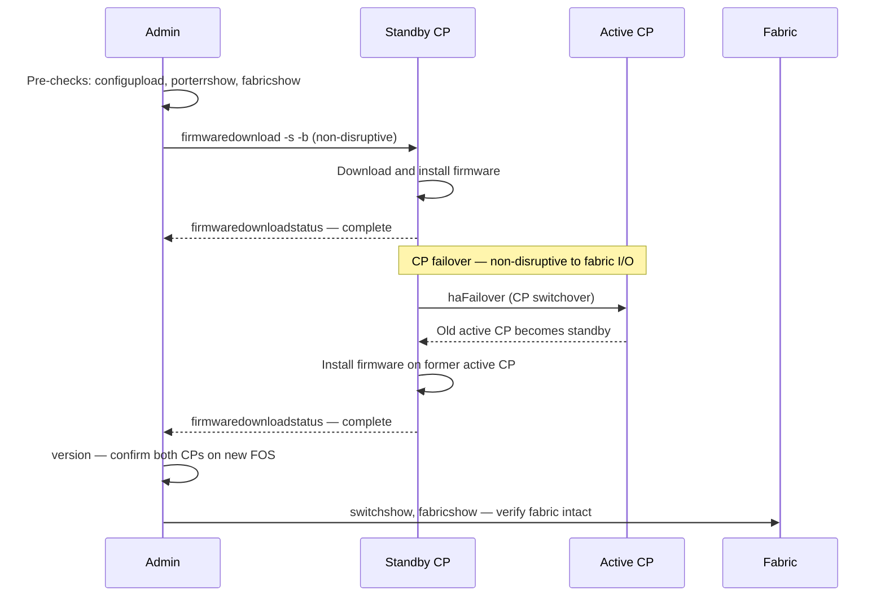

# FabricOS — Install & Upgrade

> Part of the [Operations](../index.md) reference.

---

## Firmware Upgrade Sequence (HA Director)


┌─────────────────────────────── Brocade Fabric OS — Install and Upgrade ───────────────────────────────┐
│                                                                                                       │
│   ┌───────────────────────────────────────────────────────────────────────────────────────────────┐   │
│   │              FOS firmware upgrade: firmwaredownload command; NDU for HA directors             │   │
│   │          Pre-checks: switchshow all Online, no MAPS critical alerts, config backed up         │   │
│   │        Download: firmwaredownload -s <scp-server> <path>; switch reboots automatically        │   │
│   │          Director NDU: upgrades standby CP first, then failover; no fabric disruption         │   │
│   │            Post-checks: firmwareshow, switchshow, porterrshow; verify no new errors           │   │
│   └───────────────────────────────────────────────────────────────────────────────────────────────┘   │
│                                                                                                       │
│    Pre-checks -> firmware stage -> upgrade trigger -> reboot -> post-verify -> sign-off               │
│                                                                                                       │
│                  ▼                                ▼                                ▼                  │
│                                                                                                       │
│   ┌─────────────────────────────┐  ┌─────────────────────────────┐  ┌─────────────────────────────┐   │
│   │          Pre-Checks         │  │           Upgrade           │  │         Post-Checks         │   │
│   │        switchshow OK        │  │       firmwaredownload      │  │         firmwareshow        │   │
│   │        No MAPS alerts       │  │        Stage firmware       │  │          switchshow         │   │
│   │       Config backed up      │  │       CP failover NDU       │  │         porterrshow         │   │
│   │        Change ticket        │  │         Auto-reboot         │  │          fabricshow         │   │
│   │        Peer fabric OK       │  │       Rollback option       │  │          MAPS check         │   │
│   └─────────────────────────────┘  └─────────────────────────────┘  └─────────────────────────────┘   │
│                                                                                                       │
│    Always upgrade one fabric at a time; never both A and B fabrics simultaneously                     │
│                                                                                                       │
│                  ▼                                ▼                                ▼                  │
│                                                                                                       │
│   ┌───────────────────────────────────────────────────────────────────────────────────────────────┐   │
│   │       Step       │      Action      │      Command      │     Expected     │      Notes       │   │
│   │       Pre        │   Health check   │     switchshow    │    All Online    │    Per switch    │   │
│   │     Upgrade      │   Download FW    │  firmwaredownload │    Rebooting     │   NDU director   │   │
│   │       Post       │  Verify version  │    firmwareshow   │   New version    │   Check errors   │   │
│   └───────────────────────────────────────────────────────────────────────────────────────────────┘   │
│                                                                                                       │
│    Physical: SCP server with FOS image · switch mgmt Ethernet · console for recovery                  │
│                                                                                                       │
│    Key terms:                                                                                         │
│                                                                                                       │
│    firmwaredownload = Downloads FOS image and reboots switch to activate new version                  │
│    NDU            = Non-Disruptive Upgrade; director upgrades without disrupting FC traffic           │
│    firmwareshow   = Displays current and committed FOS version on each blade                          │
│    Stage firmware = Download to flash before activating; allows verification before commit            │
│    CP failover    = Standby CP takes over; data plane continues; new standby then upgrades            │
│    Rollback       = firmwaredownload to prior version if new version has critical defects             │
│    Pre-checks     = Confirm fabric is healthy before maintenance; document baseline state             │
│    Change ticket  = All firmware upgrades require approved change management ticket                   │
│    Peer fabric    = Verify peer fabric (B while upgrading A) is fully healthy first                   │
│    Post-verify    = Check firmwareshow, switchshow, porterrshow, MAPS after upgrade                   │
│    SCP image      = FOS firmware .zip downloaded from Broadcom support portal                         │
│    One fabric     = Upgrade one fabric completely before touching the peer fabric                     │
│                                                                                                       │
└───────────────────────────────────────────────────────────────────────────────────────────────────────┘

---

## Adding a New Switch to the Fabric

1. Pre-configure the new switch: hostname, domain ID, NTP, AAA, SNMP, syslog.
2. Set the domain ID statically before connecting ISLs to avoid domain ID conflict:

```bash
configure
# Set Fabric Parameters → insistDomainId = 1
# Set Domain ID to the assigned value from the SAN design register
```

3. Connect ISL cables to the edge ports of the core switch.
4. Verify the new switch joins the fabric:

```bash
fabricshow     # New switch should appear
topologyshow   # ISL path visible
```

5. Configure trunk groups on the ISL ports:
```bash
# Verify trunking formed automatically (requires same speed on both ends)
trunkshow
```

6. Update CMDB and SAN design register with the new domain ID and port map.

---

## Switch Replacement

When replacing a failed switch with an identical model:

1. Collect the config backup from the original switch (if available) or restore from the latest `configupload` backup.
2. Apply the same static domain ID on the new switch before connecting to the fabric.
3. Restore configuration: `configdownload`
4. Connect to the fabric and verify all devices re-login:

```bash
nsshow    # All devices logged in
cfgshow   # Zone database present and correct
```

5. Activate the zone set if it was not restored automatically:
```bash
cfgenable <zoneset-name>
```

---

## Firmware

### Firmware Commands

```bash
# Current firmware
version
firmwareShow

# Firmware upgrade
firmwareDownload -s <server_ip> -p <path/firmware.bin>
firmwareDownloadStatus

# Boot check
haShow          # Check HA / CP status
haFailover      # Force CP failover
```

### Firmware Standards

- All switches in a fabric must run the same Fabric OS version (FOS)
- New FOS versions applied to Fabric B first, validated, then Fabric A
- Minimum: stay within 1 major FOS version of Broadcom's current release
- Check FOS EOL: [support.broadcom.com](https://support.broadcom.com) → Product Lifecycle
