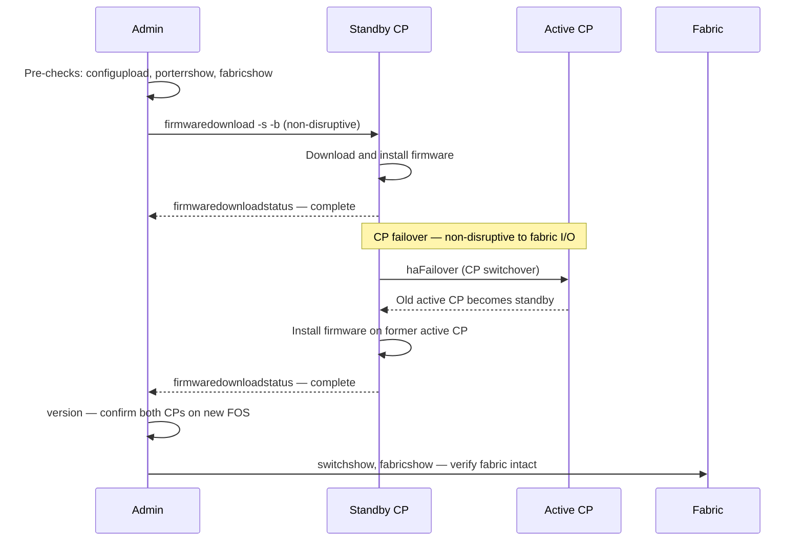

# FabricOS — Install & Upgrade

> Part of the [Operations](../index.md) reference.

---

## Firmware Upgrade Sequence (HA Director)



## Version Tracking

Fabric OS versions are tracked against the Broadcom end-of-support schedule. Version selection is driven by:

- HCL requirements of connected host HBA drivers
- HCL requirements of connected storage arrays (PowerMax, Pure, NetApp)
- Broadcom recommended release for each platform
- End-of-sale / end-of-support dates

| Platform | FOS Track | Notes |
|---|---|---|
| G620 / G720 | FOS 9.x | Current generation |
| X7-4 / X7-8 | FOS 9.x | Director-class, extended support |
| 6505 / 6510 | FOS 8.x | End-of-sale — plan migration to G-series |

End-of-support dates are tracked in the CMDB. Alerts are triggered 18 months before end-of-support.

---

## Firmware Upgrade Procedure

Brocade firmware upgrades use the `firmwaredownload` command. For HA directors (X7 series), the upgrade is non-disruptive — the standby CP is upgraded first, then a failover occurs, and the other CP is upgraded.

**Pre-upgrade checklist:**

- [ ] Current FOS version noted: `version`
- [ ] Running config saved: `configupload` (backs up to FTP/SCP)
- [ ] HCL compatibility confirmed for target FOS version
- [ ] Fabric health confirmed: `fabricshow`, `porterrshow` clean
- [ ] ISLs are trunked and redundant — a reload on one switch should not impact fabric connectivity
- [ ] Change window scheduled and approved

**Upgrade steps:**

```bash
# Step 1 — Upload the firmware image to an FTP/SCP server reachable from the switch

# Step 2 — Start firmwaredownload (non-disruptive on directors; disruptive on fixed switches)
firmwaredownload -s -b -n <ftp-server> <path-to-image> <username> <password>
# -s = activate after download
# -b = non-disruptive (HA chassis only)
# -n = no auto-reboot (for manual activation control)

# Step 3 — Monitor the upgrade progress
firmwaredownloadstatus

# Step 4 — On fixed switches (non-disruptive upgrade not available), the switch reboots
# Monitor from SANnav or reconnect after ~3-5 minutes

# Step 5 — Verify after upgrade
version
switchshow    # all ports up
fabricshow    # fabric intact
```

---

## Adding a New Switch to the Fabric

1. Pre-configure the new switch: hostname, domain ID, NTP, AAA, SNMP, syslog.
2. Set the domain ID statically before connecting ISLs to avoid domain ID conflict:

```bash
configure
# Set Fabric Parameters → insistDomainId = 1
# Set Domain ID to the assigned value from the SAN design register
```

3. Connect ISL cables to the edge ports of the core switch.
4. Verify the new switch joins the fabric:

```bash
fabricshow     # New switch should appear
topologyshow   # ISL path visible
```

5. Configure trunk groups on the ISL ports:
```bash
# Verify trunking formed automatically (requires same speed on both ends)
trunkshow
```

6. Update CMDB and SAN design register with the new domain ID and port map.

---

## Switch Replacement

When replacing a failed switch with an identical model:

1. Collect the config backup from the original switch (if available) or restore from the latest `configupload` backup.
2. Apply the same static domain ID on the new switch before connecting to the fabric.
3. Restore configuration: `configdownload`
4. Connect to the fabric and verify all devices re-login:

```bash
nsshow    # All devices logged in
cfgshow   # Zone database present and correct
```

5. Activate the zone set if it was not restored automatically:
```bash
cfgenable <zoneset-name>
```

---

## Firmware

### Firmware Commands

```bash
# Current firmware
version
firmwareShow

# Firmware upgrade
firmwareDownload -s <server_ip> -p <path/firmware.bin>
firmwareDownloadStatus

# Boot check
haShow          # Check HA / CP status
haFailover      # Force CP failover
```

### Firmware Standards

- All switches in a fabric must run the same Fabric OS version (FOS)
- New FOS versions applied to Fabric B first, validated, then Fabric A
- Minimum: stay within 1 major FOS version of Broadcom's current release
- Check FOS EOL: [support.broadcom.com](https://support.broadcom.com) → Product Lifecycle
