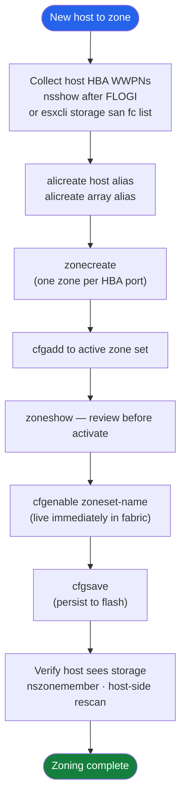

---
tags:
  - operations
  - san
---
# FabricOS — Procedures


<div class="kb-summary">
FabricOS procedures: `switchshow`, `fabricshow`, zone configuration with `cfgadd`/`cfgsave`/`cfgenable`, ISL management, and port enable/disable.

*Applies to: Brocade FOS 9.x*
</div>

---

## Before you begin

- **Access:** Storage admin credentials (cluster admin or equivalent)
- **Timing:** safe to run during business hours unless a step is marked ⚠ (causes interruption)
- **Dependencies:** no active upgrades or migrations on the same infrastructure
- **Logging:** capture command output — paste into the change record on completion

---

## Zoning Workflow




### Create Aliases


```bash
# Host HBA
alicreate "esxi01_hba0", "10:00:00:00:c9:ab:cd:ef"

# Array port
alicreate "fa01_ct0_p0", "52:4a:93:7c:00:00:00:01"
alicreate "fa01_ct0_p1", "52:4a:93:7c:00:00:00:02"
```

### Create and Manage Zones


```bash
# Create zone
zonecreate "esxi01_hba0__fa01_ct0_p0", "esxi01_hba0; fa01_ct0_p0; fa01_ct0_p1"

# Add member to existing zone
zoneadd "esxi01_hba0__fa01_ct0_p0", "fa01_ct0_p2"

# Remove member from zone
zoneremove "esxi01_hba0__fa01_ct0_p0", "fa01_ct0_p2"

# Delete a zone (remove from zone set first)
zonedelete "esxi01_hba0__fa01_ct0_p0"
```

### Zone Set Management


```bash
# Create zone set and add initial members
cfgcreate "dc1-fabA-prod", "esxi01_hba0__fa01_ct0_p0; esxi01_hba1__fa01_ct1_p0"

# Add zone to existing zone set
cfgadd "dc1-fabA-prod", "esxi02_hba0__fa01_ct0_p0"

# Remove zone from zone set
cfgremove "dc1-fabA-prod", "esxi02_hba0__fa01_ct0_p0"

# Activate zone set (live immediately in fabric)
cfgenable "dc1-fabA-prod"

# Save to flash (persists across reboot)
cfgsave
```

### Example: Zone a New Host to FlashArray


```bash
# 1. Create host HBA aliases
alicreate "web01_hba0", "10:00:00:90:fa:12:34:56"
alicreate "web01_hba1", "10:00:00:90:fa:12:34:57"

# 2. Create zones (Fabric A — HBA0 to CT0 ports)
zonecreate "web01_hba0__fa01_ct0_p0", "web01_hba0; fa01_ct0_p0; fa01_ct0_p1"

# 3. Create zones (Fabric B switch — HBA1 to CT1 ports)
zonecreate "web01_hba1__fa01_ct1_p0", "web01_hba1; fa01_ct1_p0; fa01_ct1_p1"

# 4. Add to zone set
cfgadd "dc1-fabA-prod", "web01_hba0__fa01_ct0_p0"

# 5. Activate and save
cfgenable "dc1-fabA-prod"
cfgsave
```

### Zone Audit


```bash
# Show all zones and member count — find zones with > 1 initiator
zoneshow

# Cross-check alias WWNs against physical HBA WWNs
alishow
# Compare with: host: cat /sys/class/fc_host/host*/port_name

# Show what a WWN can talk to
nszonemember "<alias_or_wwn>"
```

### Zoning Troubleshooting


| Symptom | Command | Action |
|---|---|---|
| Host HBA not visible in name server | `nsshow` | Check cable, HBA driver, FLOGI; confirm VSAN membership |
| Host can't see LUNs | `zoneshow "<alias>"` | Confirm zone is in active zone set; check alias WWN |
| Zone set not active | `cfgshow` — no asterisk | Run `cfgenable "<zset>"` then `cfgsave` |
| Two hosts in same zone | `zoneshow` | Split into single-initiator zones immediately |
| Alias WWN is wrong | `alishow` | Delete and recreate alias with correct WWN |
| Change not persisted after reboot | | Run `cfgsave` after every change |

## Add a New Switch to an Existing Fabric

Connect ISL cables → `switchDisable` on new switch → configure domain ID (must be unique in fabric) → set fabric parameters to match existing → `switchEnable` → verify `fabricshow` shows new switch.

```bash
# Disable new switch before connecting to fabric
switchDisable

# Set domain ID (must be unique across the fabric)
configure
# Answer domain ID prompt with a unique value

# Re-enable switch
switchEnable

# Verify new switch appears in fabric
fabricshow
```

## Create a Zone and Zone Configuration

`zonecreate "zone_host01_array01", "10:00:00:00:00:00:00:01; 50:00:00:00:00:00:00:02"` → `cfgadd "cfg_prod", "zone_host01_array01"` → `cfgsave` → `cfgenable "cfg_prod"`.

```bash
zonecreate "zone_host01_array01", "10:00:00:00:00:00:00:01; 50:00:00:00:00:00:00:02"
cfgadd "cfg_prod", "zone_host01_array01"
cfgsave
cfgenable "cfg_prod"
```

## Add a Member to an Existing Zone

`zoneadd "zone_host01_array01", "10:00:00:00:00:00:00:03"` → `cfgsave` → `cfgenable "cfg_prod"`.

```bash
zoneadd "zone_host01_array01", "10:00:00:00:00:00:00:03"
cfgsave
cfgenable "cfg_prod"
```

## Remove a Zone Member

`zoneremove "zone_host01_array01", "10:00:00:00:00:00:00:03"` → `cfgsave` → `cfgenable`.

```bash
zoneremove "zone_host01_array01", "10:00:00:00:00:00:00:03"
cfgsave
cfgenable "cfg_prod"
```

## Replace a Failed SFP

Identify failed port with `portshow <port>` → hot-replace SFP (no switch reboot needed) → verify with `sfpshow <port>`.

```bash
# Identify the failed port
portshow <port>

# Hot-replace SFP (no reboot needed)
# -- Physical replacement --

# Verify new SFP
sfpshow <port>
```

## Replace a Failed Switch (Fabric Resilience)

ISL failover to redundant paths → install replacement switch → restore domain ID and port config from backup → reconnect ISLs → verify fabric.

```bash
# Verify redundant paths are carrying traffic before replacing
fabricshow
portshow

# After replacement: restore config from backup
configdownload -all -P ftp -h <server> -u <user> -f <filename>

# Verify fabric topology is restored
fabricshow
```

## Collect Support Bundle

`supportsave` → saves fabric and switch state to USB or remote FTP — use for TAC cases.

```bash
supportsave
```

## Monitor Port Errors

`porterrshow` — shows CRC errors, LR in/out, link failures per port; investigate any port with non-zero CRC.

```bash
porterrshow
```

## Back Up Switch Configuration

`configupload -all -P ftp -h <server> -u <user> -f <filename>` — saves running configuration for DR.

```bash
configupload -all -P ftp -h <server> -u <user> -f <filename>
```

---

### Enable and Disable Ports


Control individual FC ports for maintenance or isolation.

```bash
# Take a port offline
portdisable <port-number>

# Bring a port back online
portenable <port-number>

# Disable a range of ports
portdisable --range 0-7

# Verify port state
switchshow | grep -E "^<port>"
```

Always disable both ends of an ISL before removing a cable. Never disable a port that is the only active path to a host.

### Configure an ISL (E-Port / Trunk)


Inter-switch links connect fabric switches. Connect cables first, then verify E-port negotiation.

```bash
# Confirm the port has negotiated as E-Port
switchshow

# Enable trunking on the ISL port
portcfgtrunkport <port-number> 1

# Set ISL R_RDY mode for best performance
portcfg isl <port-number>

# View current trunk groups
trunkshow

# Verify fabric topology and switch membership
fabricshow
nsallshow
```

The port column in `switchshow` must show `E-Port` before enabling trunking. Fabric parameters (BB credit, speed, distance) must match on both ends.

### Firmware Upgrade


Download and apply a Fabric OS upgrade one switch at a time. Never upgrade both fabric planes simultaneously.

```bash
# Step 1: Download firmware — -b triggers HA boot to standby CP first
firmwaredownload -s -b -n <ftp-or-sftp-host> <path/to/FOS_image>

# Step 2: Monitor download and install progress
firmwaredownloadstatus

# Step 3: Confirm both CPs are on the new version
firmwareshow
```

The `-b` flag causes the standby CP to upgrade and reboot first; the active CP follows automatically. Verify all ISLs are healthy and no alarms are present before starting.

### Switch Health Check


Full health snapshot to run before any change window.

```bash
# Overall pass/fail status
switchstatusshow

# Temperature, fan, and power sensor readings
sensorshow

# Blade and slot status (chassis switches)
slotshow

# Per-port detail for a specific port
portshow <port>

# Error log — last 100 entries
errdump

# Fabric membership — count expected switches
fabricshow
```

Flag any `FAIL` or `MARGINAL` result before proceeding. A healthy switch shows all sensors `OK` and all expected switches in `fabricshow`.

### User and RBAC Management


Create role-based accounts for operators and admins. Brocade FOS supports predefined roles: `user`, `admin`, `securityadmin`, `zoneadmin`, `fabricadmin`.

```bash
# Add a read-only operator account
userconfig --add <username> -r user -p <password>

# Add a full admin account
userconfig --add <username> -r admin -p <password>

# Add a zone-admin-only account
userconfig --add zone-admin -r zoneadmin -p <password>

# List all local accounts
userconfig --show -a

# Change a user's password
passwd <username>

# Delete a user account
userconfig --delete <username>
```

Verify: `userconfig --show -a` should list the account with the correct role. Use `securityadmin` role for managing certificates and security policies only.

### Port Diagnostics


Run loopback and frame tests to verify port hardware health.

```bash
# Internal loopback — no cable needed, tests internal hardware path
portloopbacktest -port <port>

# External loopback — requires loopback SFP installed
portloopbacktest -port <port> -type eloopback

# Real-time frame counts and error rates on a connected port
portperfshow <port>

# Check BB credit starvation — B2B credit 0 count indicates congestion
portbuffershow <port>

# Per-port CRC, LR, and link failure counters
porterrshow
```

A non-zero B2B credit 0 count in `portbuffershow` indicates the remote end is not returning credits fast enough — investigate slow-drain devices on that path. `portperfshow` output auto-refreshes every second; press Ctrl-C to exit.

---

## Verify

- Confirm the operation completed without errors in the log or management UI
- Verify the expected state change is visible (service running, object created, config applied)
- Document the outcome in the change record

---

## See also

- [Fabric Os — Health Checks](health-checks/)
- [Fabric Os — CLI Reference](cli-reference/)
- [Fabric Os — Common Issues](../troubleshooting/common-issues/)
