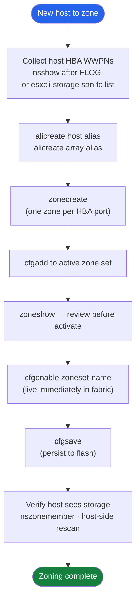

# FabricOS — Procedures

> Part of the [Operations](../index.md) reference.

---

## Zoning Workflow



## Change Readiness

- [ ] Zone configuration backup taken: run `cfgsave` and export offline copy via `configupload`
- [ ] Both Fabric A and Fabric B are healthy before touching either
- [ ] ISL utilization has headroom — no ISL above 70% sustained load
- [ ] NPIV usage documented: note which ports have NPIV-enabled devices logged in
- [ ] `porterrshow` counters clear or baselined before change
- [ ] Maintenance window approved and communicated to affected teams
- [ ] Rollback plan documented: zone config restore procedure confirmed

| Item | Status | Notes |
|---|---|---|
| Zone config backup | | `configupload` to jump host |
| Both fabrics healthy | | `switchshow` on both |
| ISL headroom confirmed | | `islshow` bandwidth check |
| NPIV inventory current | | Port-to-host mapping |
| Change window approved | | Ticket reference |

---

## Maintenance Window

1. Confirm both fabrics are healthy via `switchshow` and `fabricshow` on all switches
2. Take a configuration backup: `configupload` to a secure jump host
3. Notify storage and compute teams that Fabric A (or B) will be affected
4. Perform the change on one fabric only — leave the other fabric carrying full host I/O
5. After change, run `switchshow`, `fabricshow`, and `islshow` to confirm fabric is stable
6. Validate host multipath paths via host-side `esxcli storage nmp device list` or `multipath -ll`
7. Confirm zone configuration is correct: `cfgshow` and compare to pre-change backup
8. Repeat procedure on second fabric only after first fabric is fully validated

---

## Zoning

### Zone Membership Model

### Zoning Rules

| Rule | Reason |
|---|---|
| Single-initiator zoning — one HBA per zone | Prevents cross-talk between hosts; limits fault blast radius |
| Zone by WWN (alias-based) — not port ID | Port-based zones break on cable moves or switch port changes |
| Use aliases for all WWNs | Aliases make zones readable and portable across fabrics |
| One zone per initiator per target array | LUN masking is handled on the array — zones control path visibility only |
| Name: `<host>_<hbaN>__<array>_<ctrl>_<portN>` | Consistent naming makes audit and troubleshooting fast |

### Naming Convention

```yaml
  Alias:    <hostname>_<hbaN>               e.g.  esxi01_hba0
  Alias:    <array>_<controller>_<portN>    e.g.  fa01_ct0_p0
  Zone:     <host-alias>__<array-alias>     e.g.  esxi01_hba0__fa01_ct0_p0
  Zone set: <sitecode>-<fabric>-prod        e.g.  dc1-fabA-prod
```

### View Current State

```bash
# Show active zone set and all member zones
cfgshow

# Show all defined aliases
alishow

# Show all defined zones
zoneshow

# Show zones for a specific alias
zoneshow "esxi01_hba0"

# Show name server — all logged-in devices in fabric
nsshow
nsallshow
```

### Create Aliases

```bash
# Host HBA
alicreate "esxi01_hba0", "10:00:00:00:c9:ab:cd:ef"

# Array port
alicreate "fa01_ct0_p0", "52:4a:93:7c:00:00:00:01"
alicreate "fa01_ct0_p1", "52:4a:93:7c:00:00:00:02"
```

### Create and Manage Zones

```bash
# Create zone
zonecreate "esxi01_hba0__fa01_ct0_p0", "esxi01_hba0; fa01_ct0_p0; fa01_ct0_p1"

# Add member to existing zone
zoneadd "esxi01_hba0__fa01_ct0_p0", "fa01_ct0_p2"

# Remove member from zone
zoneremove "esxi01_hba0__fa01_ct0_p0", "fa01_ct0_p2"

# Delete a zone (remove from zone set first)
zonedelete "esxi01_hba0__fa01_ct0_p0"
```

### Zone Set Management

```bash
# Create zone set and add initial members
cfgcreate "dc1-fabA-prod", "esxi01_hba0__fa01_ct0_p0; esxi01_hba1__fa01_ct1_p0"

# Add zone to existing zone set
cfgadd "dc1-fabA-prod", "esxi02_hba0__fa01_ct0_p0"

# Remove zone from zone set
cfgremove "dc1-fabA-prod", "esxi02_hba0__fa01_ct0_p0"

# Activate zone set (live immediately in fabric)
cfgenable "dc1-fabA-prod"

# Save to flash (persists across reboot)
cfgsave
```

### Example: Zone a New Host to FlashArray

```bash
# 1. Create host HBA aliases
alicreate "web01_hba0", "10:00:00:90:fa:12:34:56"
alicreate "web01_hba1", "10:00:00:90:fa:12:34:57"

# 2. Create zones (Fabric A — HBA0 to CT0 ports)
zonecreate "web01_hba0__fa01_ct0_p0", "web01_hba0; fa01_ct0_p0; fa01_ct0_p1"

# 3. Create zones (Fabric B switch — HBA1 to CT1 ports)
zonecreate "web01_hba1__fa01_ct1_p0", "web01_hba1; fa01_ct1_p0; fa01_ct1_p1"

# 4. Add to zone set
cfgadd "dc1-fabA-prod", "web01_hba0__fa01_ct0_p0"

# 5. Activate and save
cfgenable "dc1-fabA-prod"
cfgsave
```

### Zone Audit

```bash
# Show all zones and member count — find zones with > 1 initiator
zoneshow

# Cross-check alias WWNs against physical HBA WWNs
alishow
# Compare with: host: cat /sys/class/fc_host/host*/port_name

# Show what a WWN can talk to
nszonemember "<alias_or_wwn>"
```

### Zoning Troubleshooting

| Symptom | Command | Action |
|---|---|---|
| Host HBA not visible in name server | `nsshow` | Check cable, HBA driver, FLOGI; confirm VSAN membership |
| Host can't see LUNs | `zoneshow "<alias>"` | Confirm zone is in active zone set; check alias WWN |
| Zone set not active | `cfgshow` — no asterisk | Run `cfgenable "<zset>"` then `cfgsave` |
| Two hosts in same zone | `zoneshow` | Split into single-initiator zones immediately |
| Alias WWN is wrong | `alishow` | Delete and recreate alias with correct WWN |
| Change not persisted after reboot | | Run `cfgsave` after every change |
