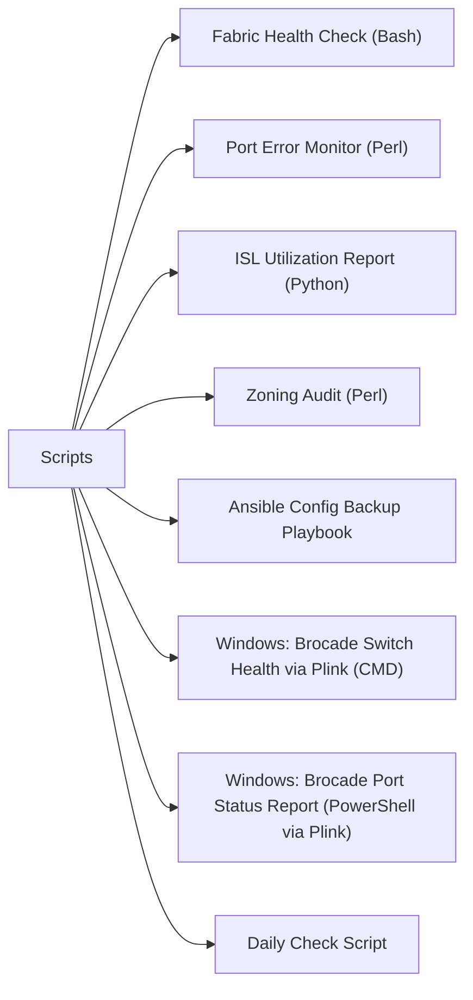

# Scripts

> Part of the [Brocade Fabric OS](../) reference.

---



## Fabric Health Check (Bash)

SSH to a Brocade switch, collect key diagnostic outputs, parse for errors, and print a PASS/WARNING/CRITICAL summary for each section.

~~~bash
#!/bin/bash
# brocade_fabric_health.sh
# Usage: ./brocade_fabric_health.sh
# Requires: sshpass (or pre-shared SSH key)

SWITCH_HOST="${SWITCH_HOST:-192.168.1.10}"
SWITCH_USER="${SWITCH_USER:-admin}"
SSH_OPTS="-o StrictHostKeyChecking=no -o ConnectTimeout=10"
PASS=0; WARN=1; CRIT=2

run_cmd() {
  ssh $SSH_OPTS "${SWITCH_USER}@${SWITCH_HOST}" "$1" 2>/dev/null
}

status_label() {
  case $1 in
    0) echo "PASS"   ;;
    1) echo "WARNING";;
    2) echo "CRITICAL";;
  esac
}

overall=0

echo "=============================="
echo " Brocade Fabric Health Check"
echo " Host : ${SWITCH_HOST}"
echo " $(date -u '+%Y-%m-%dT%H:%M:%SZ')"
echo "=============================="

# --- switchshow ---
ss_out=$(run_cmd "switchshow")
faulty_ports=$(echo "$ss_out" | awk '$NF ~ /Faulty|No_Module|In_Sync==No/' | wc -l | tr -d ' ')
if   [ "$faulty_ports" -gt 5 ]; then s=$CRIT
elif [ "$faulty_ports" -gt 0 ]; then s=$WARN
else s=$PASS; fi
[ $s -gt $overall ] && overall=$s
printf "[%-8s] switchshow  — %d port(s) in error/faulty state\n" "$(status_label $s)" "$faulty_ports"

# --- fabricshow ---
fab_out=$(run_cmd "fabricshow")
seg=$(echo "$fab_out" | grep -ic "segmented") || seg=0
if   [ "$seg" -gt 0 ]; then s=$CRIT
else s=$PASS; fi
[ $s -gt $overall ] && overall=$s
printf "[%-8s] fabricshow  — %d segmented domain(s)\n" "$(status_label $s)" "$seg"

# --- islshow ---
isl_out=$(run_cmd "islshow")
isl_down=$(echo "$isl_out" | grep -ic " down ") || isl_down=0
if   [ "$isl_down" -gt 1 ]; then s=$CRIT
elif [ "$isl_down" -gt 0 ]; then s=$WARN
else s=$PASS; fi
[ $s -gt $overall ] && overall=$s
printf "[%-8s] islshow     — %d ISL(s) down\n" "$(status_label $s)" "$isl_down"

# --- port error delta (clear, wait, collect) ---
run_cmd "portstatsclear" > /dev/null
sleep 30
ps_out=$(run_cmd "portstatsshow")
enc_total=$(echo "$ps_out" | awk '/enc_in|enc_out/{sum+=$2} END{print sum+0}')
losync=$(echo "$ps_out" | awk '/loss_sync/{sum+=$2} END{print sum+0}')
if   [ "$enc_total" -gt 500 ] || [ "$losync" -gt 50 ]; then s=$CRIT
elif [ "$enc_total" -gt 100 ] || [ "$losync" -gt 10 ];  then s=$WARN
else s=$PASS; fi
[ $s -gt $overall ] && overall=$s
printf "[%-8s] portstats   — enc_total=%d  loss_sync=%d (30 s delta)\n" \
       "$(status_label $s)" "$enc_total" "$losync"

# --- errshow ---
err_out=$(run_cmd "errshow")
err_lines=$(echo "$err_out" | grep -c "Error") || err_lines=0
if   [ "$err_lines" -gt 10 ]; then s=$CRIT
elif [ "$err_lines" -gt 0  ]; then s=$WARN
else s=$PASS; fi
[ $s -gt $overall ] && overall=$s
printf "[%-8s] errshow     — %d error log line(s)\n" "$(status_label $s)" "$err_lines"

# --- sfpshow ---
sfp_out=$(run_cmd "sfpshow")
sfp_warn=$(echo "$sfp_out" | grep -ic "Warning\|Alarm") || sfp_warn=0
if   [ "$sfp_warn" -gt 3 ]; then s=$CRIT
elif [ "$sfp_warn" -gt 0 ]; then s=$WARN
else s=$PASS; fi
[ $s -gt $overall ] && overall=$s
printf "[%-8s] sfpshow     — %d SFP warning/alarm(s)\n" "$(status_label $s)" "$sfp_warn"

echo "=============================="
printf " Overall: %s\n" "$(status_label $overall)"
echo "=============================="

exit $overall
~~~

#### How to run this script — step by step

**Before you start — what you need**
- A Linux or macOS machine (or WSL on Windows)
- `ssh` installed (already present on Linux/Mac; install OpenSSH on WSL)
- Network access to the Brocade switch management IP
- Brocade switch admin credentials with SSH access

**Step 1 — Save the file**

1. Open a text editor
2. Copy the entire code block above
3. Save it as `brocade_fabric_health.sh`

**Step 2 — Fill in your details**

Edit these lines near the top of the script:

| Variable | What to put here | How to find it |
|---|---|---|
| `SWITCH_HOST` | IP address of the Brocade switch | Check your switch management console or ask your SAN admin |
| `SWITCH_USER` | SSH username | Usually `admin` |

**Step 3 — Open a terminal**

- **For .sh:** Open Terminal on Linux/Mac, or use Git Bash / WSL on Windows

**Step 4 — Make the script executable and run it**

```
chmod +x brocade_fabric_health.sh
SWITCH_HOST=192.168.1.10 SWITCH_USER=admin ./brocade_fabric_health.sh
```

When prompted, enter the SSH password for the switch.

**What you should see**

Six check sections, each labelled PASS, WARNING, or CRITICAL: switch port states, fabric segmentation, ISL link status, port error counters (after a 30-second collection window), error log entries, and SFP optical warnings. The final line shows the overall status.

---

## Port Error Monitor (Perl)

Run every 15 minutes via cron. Reads a baseline file, compares current `portstatsshow` counters, and alerts if any delta exceeds threshold.

~~~perl
#!/usr/bin/env perl
# brocade_port_error_monitor.pl
# Cron: */15 * * * * /opt/scripts/brocade_port_error_monitor.pl
# Config via environment: SWITCH_HOST, SWITCH_USER, BASELINE_FILE

use strict;
use warnings;
use POSIX qw(strftime);

my $SWITCH_HOST    = $ENV{SWITCH_HOST}    // '192.168.1.10';
my $SWITCH_USER    = $ENV{SWITCH_USER}    // 'admin';
my $BASELINE_FILE  = $ENV{BASELINE_FILE}  // '/var/tmp/brocade_baseline.dat';
my $SSH_OPTS       = '-o StrictHostKeyChecking=no -o ConnectTimeout=10 -o BatchMode=yes';

# Per-counter thresholds (delta over 15 min)
my %THRESHOLD = (
    enc_in      => 100,
    enc_out     => 100,
    bad_eof     => 20,
    disc_c3     => 50,
    timeout_c3  => 50,
    link_fail   => 5,
    loss_sig    => 5,
    loss_sync   => 10,
);

sub run_switch_cmd {
    my ($cmd) = @_;
    my $out = `ssh $SSH_OPTS ${SWITCH_USER}\@${SWITCH_HOST} "$cmd" 2>/dev/null`;
    die "SSH failed for command: $cmd\n" if $? != 0;
    return $out;
}

# Parse portstatsshow output into { portN => { counter => value } }
sub parse_portstats {
    my ($raw) = @_;
    my %data;
    my $cur_port;
    for my $line (split /\n/, $raw) {
        if ($line =~ /^port\s+(\d+)/i) {
            $cur_port = "port$1";
        } elsif ($cur_port && $line =~ /^\s*(enc_in|enc_out|bad_eof|disc_c3|timeout_c3|link_fail|loss_sig|loss_sync)\s+(\d+)/) {
            $data{$cur_port}{$1} = int($2);
        }
    }
    return %data;
}

# Load baseline from file
sub load_baseline {
    my %base;
    return %base unless -f $BASELINE_FILE;
    open my $fh, '<', $BASELINE_FILE or return %base;
    while (<$fh>) {
        chomp;
        my ($port, $counter, $val) = split /\t/;
        $base{$port}{$counter} = int($val);
    }
    close $fh;
    return %base;
}

# Save current readings as new baseline
sub save_baseline {
    my (%data) = @_;
    open my $fh, '>', $BASELINE_FILE or die "Cannot write baseline: $!\n";
    for my $port (sort keys %data) {
        for my $counter (sort keys %{$data{$port}}) {
            print $fh "${port}\t${counter}\t$data{$port}{$counter}\n";
        }
    }
    close $fh;
}

# --- Main ---
my $ts = strftime('%Y-%m-%dT%H:%M:%SZ', gmtime);
my $raw    = run_switch_cmd('portstatsshow');
my %current = parse_portstats($raw);
my %baseline = load_baseline();

my @alerts;

for my $port (sort keys %current) {
    for my $counter (sort keys %{$current{$port}}) {
        my $cur = $current{$port}{$counter};
        my $base = $baseline{$port}{$counter} // 0;
        my $delta = $cur - $base;
        $delta = 0 if $delta < 0;   # counter wrap
        my $thresh = $THRESHOLD{$counter} // 9999;
        if ($delta >= $thresh) {
            push @alerts, sprintf("  %-12s  %-12s  delta=%d  (threshold=%d)",
                $port, $counter, $delta, $thresh);
        }
    }
}

if (@alerts) {
    print "[$ts] ALERT: Brocade port error threshold exceeded on $SWITCH_HOST\n";
    print "$_\n" for @alerts;
    # Replace with your alerting mechanism (mail, PagerDuty, etc.)
} else {
    print "[$ts] OK: All port error counters within threshold on $SWITCH_HOST\n";
}

save_baseline(%current);
exit scalar(@alerts) ? 1 : 0;
~~~

#### How to run this script — step by step

**Before you start — what you need**
- A Linux or macOS machine with Perl installed (`perl --version` to check; install with `sudo apt install perl`)
- SSH key-based authentication set up to the Brocade switch (so the script can run non-interactively via cron)
- Network access to the Brocade switch management IP

**Step 1 — Save the file**

1. Open a text editor
2. Copy the entire code block above
3. Save it as `brocade_port_error_monitor.pl` in `/opt/scripts/` or your home directory

**Step 2 — Fill in your details**

Edit the variables near the top of the script:

| Variable | What to put here | How to find it |
|---|---|---|
| `$SWITCH_HOST` | IP address of the Brocade switch | Switch management IP |
| `$SWITCH_USER` | SSH username | Usually `admin` |
| `$BASELINE_FILE` | Path to store the counter baseline | Any writable path, e.g. `/var/tmp/brocade_baseline.dat` |

You can also set these as environment variables instead of editing the script.

**Step 3 — Open a terminal**

- **For .pl:** Open Terminal on Linux/Mac, or use WSL on Windows

**Step 4 — Make the script executable and run it manually first**

```
chmod +x /opt/scripts/brocade_port_error_monitor.pl
SWITCH_HOST=192.168.1.10 SWITCH_USER=admin /opt/scripts/brocade_port_error_monitor.pl
```

**Step 5 — Schedule it to run every 15 minutes via cron**

```
crontab -e
```
Add this line:
```
*/15 * * * * SWITCH_HOST=192.168.1.10 SWITCH_USER=admin /opt/scripts/brocade_port_error_monitor.pl >> /var/log/brocade_monitor.log 2>&1
```

**What you should see**

On the first run: `OK: All port error counters within threshold` and a baseline file is created. On subsequent runs, if any counter delta exceeds the threshold you will see an `ALERT` line with the port name, counter name, and delta value.

---

## ISL Utilization Report (Python)

SSH to every switch in the fabric, collect `portperfshow` on ISL ports, and print a per-switch/per-port utilization table.

~~~python
#!/usr/bin/env python3
"""
brocade_isl_utilization.py
Usage: python3 brocade_isl_utilization.py
"""

import os, re, sys
import paramiko

SWITCH_HOSTS = os.environ.get("SWITCH_HOSTS", "192.168.1.10,192.168.1.11").split(",")
SWITCH_USER  = os.environ.get("SWITCH_USER", "admin")
SSH_KEY      = os.environ.get("SSH_KEY", os.path.expanduser("~/.ssh/id_rsa"))
WARN_PERCENT = 70

# Map speed string to Gbps
SPEED_MAP = {"1G": 1, "2G": 2, "4G": 4, "8G": 8, "16G": 16, "32G": 32, "64G": 64}


def ssh_run(host, cmd):
    client = paramiko.SSHClient()
    client.set_missing_host_key_policy(paramiko.AutoAddPolicy())
    client.connect(host, username=SWITCH_USER, key_filename=SSH_KEY, timeout=15)
    _, stdout, stderr = client.exec_command(cmd)
    out = stdout.read().decode()
    client.close()
    return out


def get_isl_ports(islshow_out):
    """Return list of port numbers that are ISLs."""
    ports = []
    for line in islshow_out.splitlines():
        m = re.match(r'^\s*\d+:\s+(\d+)', line)
        if m:
            ports.append(m.group(1))
    return ports


def parse_portperf(portperf_out):
    """
    portperfshow output contains lines like:
      port   0:    tx  1234 KB/s   rx  5678 KB/s  ...
    Returns dict { port_num: (tx_kbps, rx_kbps) }
    """
    result = {}
    for line in portperf_out.splitlines():
        m = re.search(r'port\s+(\d+):\s+tx\s+(\d+)\s+KB/s\s+rx\s+(\d+)\s+KB/s', line)
        if m:
            result[m.group(1)] = (int(m.group(2)), int(m.group(3)))
    return result


def get_port_speed(switchshow_out, port):
    """Extract speed for a given port number from switchshow output."""
    for line in switchshow_out.splitlines():
        if re.match(rf'^\s*{port}\s+', line):
            for sp in sorted(SPEED_MAP.keys(), key=lambda x: -len(x)):
                if sp in line:
                    return SPEED_MAP[sp]
    return 16  # default assumption


def util_pct(kbps, speed_gbps):
    capacity_kbps = speed_gbps * 1024 * 1024 / 8  # Gbps -> KB/s
    return round(kbps / capacity_kbps * 100, 2)


print(f"{'Switch':<20} {'Port':<6} {'Speed':>6} {'TX MB/s':>9} {'TX%':>7} {'RX MB/s':>9} {'RX%':>7} {'Status':<10}")
print("-" * 85)

any_warn = False

for host in SWITCH_HOSTS:
    host = host.strip()
    try:
        islshow    = ssh_run(host, "islshow")
        portperf   = ssh_run(host, "portperfshow")
        switchshow = ssh_run(host, "switchshow")
    except Exception as e:
        print(f"{host:<20}  ERROR: {e}")
        continue

    isl_ports = get_isl_ports(islshow)
    perf_data = parse_portperf(portperf)

    for port in isl_ports:
        tx_kbps, rx_kbps = perf_data.get(port, (0, 0))
        speed = get_port_speed(switchshow, port)
        tx_mbps = round(tx_kbps / 1024, 1)
        rx_mbps = round(rx_kbps / 1024, 1)
        tx_pct  = util_pct(tx_kbps, speed)
        rx_pct  = util_pct(rx_kbps, speed)
        status  = "OK"
        if tx_pct > WARN_PERCENT or rx_pct > WARN_PERCENT:
            status = "WARNING"
            any_warn = True
        print(f"{host:<20} {port:<6} {str(speed)+'G':>6} {tx_mbps:>9} {tx_pct:>7} {rx_mbps:>9} {rx_pct:>7} {status:<10}")

print()
sys.exit(1 if any_warn else 0)
~~~

#### How to run this script — step by step

**Before you start — what you need**
- Python 3.7 or later installed (`python3 --version` to check; install from python.org)
- The `paramiko` SSH library: install with `pip install paramiko`
- An SSH key pair set up for the Brocade switch (or modify the script to use password auth)
- Network access to all Brocade switch management IPs

**Step 1 — Save the file**

1. Open a text editor
2. Copy the entire code block above
3. Save it as `brocade_isl_utilization.py`

**Step 2 — Fill in your details**

Edit the variables near the top or set them as environment variables:

| Variable | What to put here | How to find it |
|---|---|---|
| `SWITCH_HOSTS` | Comma-separated list of switch IPs | All Brocade switch management IPs in your fabric |
| `SWITCH_USER` | SSH username | Usually `admin` |
| `SSH_KEY` | Path to your SSH private key file | Typically `~/.ssh/id_rsa` |

**Step 3 — Open a terminal**

- **For .py:** Open Terminal (Linux/Mac) or Command Prompt / Git Bash (Windows). Install Python from python.org. Install packages: `pip install paramiko`

**Step 4 — Run the script**

```
SWITCH_HOSTS=192.168.1.10,192.168.1.11 SWITCH_USER=admin python3 brocade_isl_utilization.py
```

**What you should see**

A table with one row per ISL port per switch, showing port speed, TX/RX throughput in MB/s, and utilisation percentage. Any port above 70% utilisation is flagged as WARNING.

---

## Zoning Audit (Perl)

SSH to a switch, parse `cfgshow` and `zoneshow`, and flag common zoning hygiene issues.

~~~perl
#!/usr/bin/env perl
# brocade_zoning_audit.pl
# Usage: SWITCH_HOST=sw1 SWITCH_USER=admin perl brocade_zoning_audit.pl

use strict;
use warnings;

my $SWITCH_HOST   = $ENV{SWITCH_HOST}  // '192.168.1.10';
my $SWITCH_USER   = $ENV{SWITCH_USER}  // 'admin';
my $SSH_OPTS      = '-o StrictHostKeyChecking=no -o ConnectTimeout=10 -o BatchMode=yes';

sub ssh_cmd {
    my ($cmd) = @_;
    return `ssh $SSH_OPTS ${SWITCH_USER}\@${SWITCH_HOST} "$cmd" 2>/dev/null`;
}

my $cfgshow  = ssh_cmd('cfgshow');
my $zoneshow = ssh_cmd('zoneshow');

# --- Parse active config member zones ---
my %active_zones;
if ($cfgshow =~ /Effective configuration:\s*\n.*?cfg:\s*\S+\s*\n(.*?)(?:\n\s*\n|\z)/s) {
    my $block = $1;
    while ($block =~ /^\s+(\S+)/mg) {
        $active_zones{$1} = 1;
    }
}

# --- Parse alias definitions ---
my %aliases;
my $cur_alias;
for my $line (split /\n/, $zoneshow) {
    if ($line =~ /^alias:\s+(\S+)/) {
        $cur_alias = $1;
        $aliases{$cur_alias} = [];
    } elsif ($cur_alias && $line =~ /^\s+(\S.+)$/) {
        push @{$aliases{$cur_alias}}, split(/;\s*/, $1);
    } elsif ($line =~ /^\S/ && $line !~ /^alias:/) {
        $cur_alias = undef;
    }
}

# --- Parse zone definitions ---
my %zones;
my $cur_zone;
for my $line (split /\n/, $zoneshow) {
    if ($line =~ /^zone:\s+(\S+)/) {
        $cur_zone = $1;
        $zones{$cur_zone} = [];
    } elsif ($cur_zone && $line =~ /^\s+(\S.+)$/) {
        push @{$zones{$cur_zone}}, split(/;\s*/, $1);
    } elsif ($line =~ /^\S/ && $line !~ /^zone:/) {
        $cur_zone = undef;
    }
}

my @findings;
my $zone_count = scalar keys %zones;

print "=== Brocade Zoning Audit: $SWITCH_HOST ===\n";
printf "Zones defined: %d  |  Active-config zones: %d\n\n", $zone_count, scalar keys %active_zones;

for my $zone (sort keys %zones) {
    my @members = @{$zones{$zone}};
    my $member_count = scalar @members;

    # Single-member zone
    if ($member_count < 2) {
        push @findings, "WARN  Single-member zone: $zone ($member_count member)";
    }

    # Zone not in active config
    unless (exists $active_zones{$zone}) {
        push @findings, "INFO  Zone not in active config: $zone";
    }

    # Check for d,p notation (domain,port) vs WWN zoning
    my $dp_count  = grep { /^\d+,\d+$/ } @members;
    my $wwn_count = grep { /^[0-9a-fA-F]{2}(:[0-9a-fA-F]{2}){7}$/ } @members;
    if ($dp_count > 0 && $wwn_count > 0) {
        push @findings, "WARN  Mixed d,p and WWN zoning in zone: $zone";
    } elsif ($dp_count > 0) {
        push @findings, "INFO  Domain,Port (d,p) zoning in zone: $zone — consider WWN zoning";
    }

    # Aliases referenced that don't exist
    for my $member (@members) {
        if ($member !~ /^\d+,\d+$/ && $member !~ /^[0-9a-fA-F]{2}(:[0-9a-fA-F]{2}){7}$/) {
            # Likely an alias reference
            unless (exists $aliases{$member}) {
                push @findings, "CRIT  Zone '$zone' references undefined alias: $member";
            }
        }
    }

    # Single-initiator-multi-target heuristic: zone with exactly 1 alias and >2 WWN members
    if ($member_count > 2) {
        my $alias_members = grep { exists $aliases{$_} } @members;
        if ($alias_members == 1) {
            push @findings, "INFO  Zone '$zone' may be single-init/multi-target (non-standard)";
        }
    }
}

if (@findings) {
    print "$_\n" for @findings;
} else {
    print "No issues found.\n";
}

print "\nDone.\n";
exit scalar(grep { /^CRIT/ } @findings) ? 2
     : scalar(grep { /^WARN/ } @findings) ? 1
     : 0;
~~~

#### How to run this script — step by step

**Before you start — what you need**
- A Linux or macOS machine with Perl installed
- SSH key-based authentication to the Brocade switch (or password auth with `sshpass`)
- Network access to the Brocade switch management IP

**Step 1 — Save the file**

1. Open a text editor
2. Copy the entire code block above
3. Save it as `brocade_zoning_audit.pl`

**Step 2 — Fill in your details**

| Variable | What to put here | How to find it |
|---|---|---|
| `$SWITCH_HOST` | IP address of the Brocade switch | Switch management IP |
| `$SWITCH_USER` | SSH username | Usually `admin` |

**Step 3 — Open a terminal**

- **For .pl:** Open Terminal on Linux/Mac, or use WSL on Windows. Install Strawberry Perl from strawberryperl.com if on Windows native.

**Step 4 — Make the script executable and run it**

```
chmod +x brocade_zoning_audit.pl
SWITCH_HOST=192.168.1.10 SWITCH_USER=admin perl brocade_zoning_audit.pl
```

**What you should see**

Total count of zones defined vs zones in the active config, followed by a list of findings. Each finding is prefixed with CRIT (critical — e.g. undefined alias reference), WARN (warning — e.g. single-member zone), or INFO (informational — e.g. d,p zoning). Exit code 0 means no issues, 1 means warnings, 2 means critical issues.

---

## Ansible Config Backup Playbook

Back up Brocade switch configurations via `configupload`, capture firmware version and switch state, and archive with a datestamp.

~~~yaml
---
# brocade_backup.yml
# Usage: ansible-playbook -i inventory brocade_backup.yml
# Inventory group: brocade_switches
# Required vars: switch_user, backup_server, backup_path

- name: Brocade Fabric OS — Configuration Backup
  hosts: brocade_switches
  gather_facts: false
  vars:
    switch_user: admin
    backup_server: 10.0.0.5
    backup_path: /backups/brocade
    date_stamp: "{{ lookup('pipe', 'date +%Y%m%d_%H%M%S') }}"

  tasks:

    - name: Upload switch configuration via configupload (SCP)
      ansible.builtin.raw: >
        configupload -all -scp
        {{ switch_user }}@{{ backup_server }}:{{ backup_path }}/{{ inventory_hostname }}_config_{{ date_stamp }}.txt
      register: configupload_result
      failed_when: "'ERROR' in configupload_result.stdout"

    - name: Capture firmware version
      ansible.builtin.raw: firmwareshow
      register: firmware_output

    - name: Save firmware output to local file
      ansible.builtin.copy:
        content: "{{ firmware_output.stdout }}"
        dest: "/tmp/{{ inventory_hostname }}_firmware_{{ date_stamp }}.txt"
      delegate_to: localhost

    - name: Capture switchshow output
      ansible.builtin.raw: switchshow
      register: switchshow_output

    - name: Save switchshow output to local file
      ansible.builtin.copy:
        content: "{{ switchshow_output.stdout }}"
        dest: "/tmp/{{ inventory_hostname }}_switchshow_{{ date_stamp }}.txt"
      delegate_to: localhost

    - name: Archive all outputs to backup server
      ansible.builtin.shell: |
        tar czf {{ backup_path }}/{{ inventory_hostname }}_backup_{{ date_stamp }}.tar.gz \
          /tmp/{{ inventory_hostname }}_firmware_{{ date_stamp }}.txt \
          /tmp/{{ inventory_hostname }}_switchshow_{{ date_stamp }}.txt
      delegate_to: localhost

    - name: Report backup completion
      ansible.builtin.debug:
        msg: "Backup complete for {{ inventory_hostname }} — archive: {{ backup_path }}/{{ inventory_hostname }}_backup_{{ date_stamp }}.tar.gz"
~~~

#### How to run this script — step by step

**Before you start — what you need**
- A Linux or WSL machine with Ansible installed (`pip install ansible`)
- An Ansible inventory file listing your Brocade switches under the group `brocade_switches`
- SSH access from the Ansible control machine to each switch
- A backup server with SSH/SCP access (or change the backup path to local storage)

**Step 1 — Save the file**

1. Open a text editor
2. Copy the entire code block above
3. Save it as `brocade_backup.yml`

**Step 2 — Fill in your details**

Edit the `vars:` section in the playbook:

| Variable | What to put here | How to find it |
|---|---|---|
| `switch_user` | SSH username for the switches | Usually `admin` |
| `backup_server` | IP of the server to receive config backups | Your backup server IP |
| `backup_path` | Directory on the backup server | e.g. `/backups/brocade` — must exist |

**Step 3 — Create an inventory file**

Create a file called `inventory` next to the playbook:
```
[brocade_switches]
switch1 ansible_host=192.168.1.10
switch2 ansible_host=192.168.1.11
```

**Step 4 — Open a terminal**

- **For .yml (Ansible):** Requires Linux/WSL. Open a Linux or WSL terminal.

**Step 5 — Run the playbook**

```
ansible-playbook -i inventory brocade_backup.yml
```

**What you should see**

Ansible runs each task in sequence for every switch in the inventory. The final debug task prints the path to the backup archive for each switch. Check the backup server to confirm the `.tar.gz` files are there.

---

## Windows: Brocade Switch Health via Plink (CMD)

Use plink.exe to SSH to a Brocade switch and run key health commands, each with a labelled header, to produce a quick health report from a Windows PC.

~~~batch
@echo off
REM brocade-health.bat — Brocade switch health check via SSH (plink)
REM Uses plink.exe (from PuTTY) for SSH. Download: https://www.putty.org
REM
REM FIRST-TIME SETUP — Accept SSH fingerprint (run once):
REM   plink.exe -ssh admin@YOUR_SWITCH_IP
REM   Type 'y' to accept the fingerprint, then Ctrl+C.

set SWITCH_HOST=192.168.1.10
set SSH_USER=admin
set PLINK=plink.exe

echo.
echo === Brocade Fabric Health Check ===
echo Switch: %SWITCH_HOST%
echo.

echo ----------------------------------------
echo SWITCH STATUS (switchshow)
echo ----------------------------------------
%PLINK% -ssh -l %SSH_USER% -batch %SWITCH_HOST% "switchshow"
if %ERRORLEVEL% neq 0 (
    echo ERROR: Could not connect to %SWITCH_HOST%.
    echo Check: 1) hostname is correct, 2) SSH is enabled on the switch,
    echo        3) you have accepted the SSH fingerprint (run plink manually once).
    exit /b 1
)

echo.
echo ----------------------------------------
echo FABRIC TOPOLOGY (fabricshow)
echo ----------------------------------------
%PLINK% -ssh -l %SSH_USER% -batch %SWITCH_HOST% "fabricshow"

echo.
echo ----------------------------------------
echo ERROR LOG (errdump)
echo ----------------------------------------
%PLINK% -ssh -l %SSH_USER% -batch %SWITCH_HOST% "errdump"

echo.
echo ----------------------------------------
echo INSTALLED LICENSES (licenseshow)
echo ----------------------------------------
%PLINK% -ssh -l %SSH_USER% -batch %SWITCH_HOST% "licenseshow"

echo.
echo ----------------------------------------
echo COMPREHENSIVE DIAGNOSTICS (supportshow)
echo ----------------------------------------
echo NOTE: supportshow output can be very long. This may take 1-2 minutes.
%PLINK% -ssh -l %SSH_USER% -batch %SWITCH_HOST% "supportshow"

echo.
echo Done.
~~~

#### How to run this script — step by step

**Before you start — what you need**
- PuTTY installed on Windows — download from https://www.putty.org
- `plink.exe` available (installed with PuTTY, usually at `C:\Program Files\PuTTY\plink.exe`)
- SSH access to the Brocade switch management IP
- Brocade switch admin credentials

**Step 1 — Save the file**

1. Open **Notepad** (Windows key → search Notepad)
2. Copy the entire code block above
3. Click **File → Save As**
4. Change "Save as type" to **All Files**
5. Save it as `brocade-health.bat` on your Desktop

**Step 2 — Fill in your details**

Open the saved file and change these lines:

| Variable | What to put here | How to find it |
|---|---|---|
| `SWITCH_HOST` | IP address of the Brocade switch | Switch management IP — ask your SAN admin |
| `SSH_USER` | SSH username | Usually `admin` |
| `PLINK` | Path to plink.exe | Default `plink.exe` if PuTTY is in your PATH, otherwise `C:\Program Files\PuTTY\plink.exe` |

**Step 3 — Accept the SSH fingerprint first (one-time step)**

Open Command Prompt and run:
```
plink.exe -ssh admin@192.168.1.10
```
Type `y` when asked to accept the fingerprint, then press Ctrl+C. You only need to do this once per switch.

**Step 4 — Open a terminal**

Open **Command Prompt**: Windows key → search `cmd` → press Enter

**Step 5 — Run the script**

```
cd C:\Users\YourName\Desktop
brocade-health.bat
```

**What you should see**

Five labelled sections of output: switch port status and firmware (switchshow), fabric topology (fabricshow), recent error log (errdump), installed feature licences (licenseshow), and a comprehensive diagnostic dump (supportshow — this section is long and may take 1-2 minutes).

---

## Windows: Brocade Port Status Report (PowerShell via Plink)

Use PowerShell to call plink and capture Brocade CLI output, then parse it to find offline ports or ports with errors, and print a clean status table.

~~~powershell
# brocade-port-report.ps1
# Usage: .\brocade-port-report.ps1 -SwitchHost <IP> -SshUser <user> -PlinkPath <path>
# Requires: plink.exe from PuTTY (https://www.putty.org)
# FIRST-TIME: run  plink.exe -ssh admin@<IP>  and accept the fingerprint.

param(
    [Parameter(Mandatory)][string]$SwitchHost,
    [string]$SshUser   = "admin",
    [string]$PlinkPath = "plink.exe"
)

function Invoke-Plink {
    param([string]$Command)
    $output = & $PlinkPath -ssh -l $SshUser -batch $SwitchHost $Command 2>&1
    if ($LASTEXITCODE -ne 0) {
        Write-Host "ERROR: plink failed for command: $Command" -ForegroundColor Red
        Write-Host "Make sure you have accepted the SSH fingerprint by running plink manually once." -ForegroundColor Yellow
        exit 1
    }
    return $output
}

Write-Host ""
Write-Host "=== Brocade Port Status Report ===" -ForegroundColor Cyan
Write-Host "Switch : $SwitchHost"
Write-Host "Date   : $(Get-Date -Format 'yyyy-MM-dd HH:mm:ss')"
Write-Host ""

# --- Get switchshow output ---
Write-Host "Collecting port data from switch..." -ForegroundColor DarkYellow
$switchShowLines = Invoke-Plink "switchshow"

# --- Parse ports from switchshow ---
# switchshow lines look like:
#   0  0   010000   id    N4   Online  FC  F-Port  10:00:... (connected device)
#   1  1   010100   id    N4   No_Light FC  --
$ports = @()
foreach ($line in $switchShowLines) {
    # Match lines that start with a port index number
    if ($line -match '^\s*(\d+)\s+\d+\s+\S+\s+\S+\s+(\S+)\s+(Online|No_Light|Offline|Faulty|In_Sync|No_Module|Testing)\s+FC\s+(\S+)') {
        $ports += [PSCustomObject]@{
            Port   = $Matches[1]
            Speed  = $Matches[2]
            State  = $Matches[3]
            Mode   = $Matches[4]
        }
    }
}

# --- Get portstatsshow for error counters ---
Write-Host "Collecting port error counters..." -ForegroundColor DarkYellow
$portStatsLines = Invoke-Plink "portstatsshow"

# Parse enc_in per port
$errorMap = @{}
$currentPort = $null
foreach ($line in $portStatsLines) {
    if ($line -match '^port\s+(\d+)') {
        $currentPort = $Matches[1]
    } elseif ($currentPort -and $line -match '^\s+(enc_in|loss_sync|link_fail)\s+(\d+)') {
        if (-not $errorMap.ContainsKey($currentPort)) {
            $errorMap[$currentPort] = @{ enc_in = 0; loss_sync = 0; link_fail = 0 }
        }
        $errorMap[$currentPort][$Matches[1]] = [int]$Matches[2]
    }
}

# --- Print report ---
Write-Host ""
Write-Host ("{0,-6} {1,-8} {2,-12} {3,-10} {4,-8} {5,-8} {6}" -f `
    "Port", "Speed", "State", "Mode", "EncErr", "LossSync", "LinkFail")
Write-Host ("-" * 65)

$problemPorts = 0
foreach ($p in $ports | Sort-Object { [int]$_.Port }) {
    $enc      = if ($errorMap.ContainsKey($p.Port)) { $errorMap[$p.Port]["enc_in"] } else { 0 }
    $lossSync = if ($errorMap.ContainsKey($p.Port)) { $errorMap[$p.Port]["loss_sync"] } else { 0 }
    $linkFail = if ($errorMap.ContainsKey($p.Port)) { $errorMap[$p.Port]["link_fail"] } else { 0 }

    $hasError = ($p.State -ne "Online") -or ($enc -gt 0) -or ($lossSync -gt 0) -or ($linkFail -gt 0)
    $color = if ($hasError) { "Red" } else { "Green" }
    if ($hasError) { $problemPorts++ }

    Write-Host ("{0,-6} {1,-8} {2,-12} {3,-10} {4,-8} {5,-8} {6}" -f `
        $p.Port, $p.Speed, $p.State, $p.Mode, $enc, $lossSync, $linkFail) -ForegroundColor $color
}

Write-Host ""
if ($problemPorts -gt 0) {
    Write-Host "RESULT: $problemPorts port(s) with issues (shown in red)." -ForegroundColor Red
} else {
    Write-Host "RESULT: All ports Online with no errors." -ForegroundColor Green
}
~~~

#### How to run this script — step by step

**Before you start — what you need**
- Windows 10 or 11 with PowerShell (already installed)
- PuTTY installed — download from https://www.putty.org — this provides `plink.exe`
- Network access to the Brocade switch management IP
- Brocade switch admin credentials

**Step 1 — Save the file**

1. Open **Notepad** (Windows key → search Notepad)
2. Copy the entire code block above
3. Click **File → Save As**
4. Change "Save as type" to **All Files**
5. Save it as `brocade-port-report.ps1` on your Desktop

**Step 2 — Fill in your details**

You pass all values on the command line. Note what each means:

| Variable | What to put here | How to find it |
|---|---|---|
| `$SwitchHost` | IP address of the Brocade switch | Switch management IP |
| `$SshUser` | SSH username | Usually `admin` |
| `$PlinkPath` | Full path to plink.exe | Default: `plink.exe` if in PATH, or `C:\Program Files\PuTTY\plink.exe` |

**Step 3 — Accept the SSH fingerprint first (one-time step)**

Open Command Prompt and run:
```
plink.exe -ssh admin@192.168.1.10
```
Type `y` when asked, then Ctrl+C. Do this once per switch.

**Step 4 — Open a terminal**

Windows key → search `PowerShell` → right-click → **Run as Administrator**

**Step 5 — Allow scripts to run**

```
Set-ExecutionPolicy -Scope Process -ExecutionPolicy Bypass
```

**Step 6 — Run the script**

```
cd C:\Users\YourName\Desktop
.\brocade-port-report.ps1 -SwitchHost 192.168.1.10 -SshUser admin -PlinkPath "C:\Program Files\PuTTY\plink.exe"
```

**What you should see**

A table with one row per FC port showing port number, speed, state, mode (F-Port/E-Port etc.), encoding errors, loss-of-sync count, and link failures. Ports with any issue are highlighted in red. The final line shows the overall result.

---

## Daily Check Script

SSH to the Brocade switch, confirm it is Online, check for ports in unexpected fault or disabled state, verify fabric connectivity, and flag recent errors.

~~~bash
#!/bin/bash
# brocade_daily_check.sh
# Usage: SWITCH_HOST=<ip> SSH_USER=admin ./brocade_daily_check.sh

SWITCH_HOST="${SWITCH_HOST:-192.168.1.10}"
SSH_USER="${SSH_USER:-admin}"
SSH_OPTS="-o BatchMode=yes -o StrictHostKeyChecking=no -o ConnectTimeout=10"
FAIL=0

ssh_cmd() { ssh $SSH_OPTS "$SSH_USER@$SWITCH_HOST" "$1" 2>/dev/null; }
check() {
  local label="$1"; local result="$2"; local expect="$3"
  if echo "$result" | grep -qiE "$expect"; then
    echo "[FAIL] $label"; FAIL=$((FAIL+1))
  else
    echo "[OK]   $label"
  fi
}

echo "=== Brocade Daily Check: $SWITCH_HOST — $(date) ==="

# Switch Online
SS=$(ssh_cmd "switchshow")
if echo "$SS" | grep -qi "switchState.*Online"; then
  echo "[OK]   Switch is Online"
else
  echo "[FAIL] Switch is NOT Online"; FAIL=$((FAIL+1))
fi

# No ports in fault/disabled state unexpectedly
FAULT_PORTS=$(echo "$SS" | awk '$NF ~ /Faulty|No_Module/' | wc -l | tr -d ' ')
if [ "$FAULT_PORTS" -gt 0 ]; then
  echo "[FAIL] $FAULT_PORTS port(s) in Faulty/No_Module state"; FAIL=$((FAIL+1))
else
  echo "[OK]   No faulty ports"
fi

# Fabric connectivity
FAB=$(ssh_cmd "fabricshow")
SEG=$(echo "$FAB" | grep -ic "segmented" || true)
check "Fabric not segmented" "$SEG" "^[1-9]"

# Recent errors (errdump — last 24h heuristic: any entries present)
ERRS=$(ssh_cmd "errdump" | grep -c "Error" || true)
if [ "$ERRS" -gt 0 ]; then
  echo "[FAIL] $ERRS error(s) in errdump"; FAIL=$((FAIL+1))
else
  echo "[OK]   No errors in errdump"
fi

echo ""
echo "Daily check: $FAIL failure(s)"
[ "$FAIL" -gt 0 ] && exit 2 || exit 0
~~~

---

## Incident Triage Script

Capture a full diagnostic snapshot to a timestamped file for use during incident investigation.

~~~bash
#!/bin/bash
# brocade_triage.sh
# Usage: SWITCH_HOST=<ip> SSH_USER=admin ./brocade_triage.sh

SWITCH_HOST="${SWITCH_HOST:-192.168.1.10}"
SSH_USER="${SSH_USER:-admin}"
SSH_OPTS="-o BatchMode=yes -o StrictHostKeyChecking=no -o ConnectTimeout=10"
OUTFILE="/tmp/brocade_triage_${SWITCH_HOST}_$(date +%Y%m%d_%H%M%S).txt"

ssh_cmd() { ssh $SSH_OPTS "$SSH_USER@$SWITCH_HOST" "$1" 2>/dev/null; }

{
  echo "=== Brocade Incident Triage: $SWITCH_HOST — $(date) ==="
  echo ""
  echo "--- switchshow ---"
  ssh_cmd "switchshow"
  echo ""
  echo "--- fabricshow ---"
  ssh_cmd "fabricshow"
  echo ""
  echo "--- errdump ---"
  ssh_cmd "errdump"
  echo ""
  echo "--- supportshow (last 200 lines) ---"
  ssh_cmd "supportshow" | tail -200
  echo ""
  echo "--- portshow all ---"
  ssh_cmd "portshow all"
  echo ""
  echo "--- zoneshow --active ---"
  ssh_cmd "zoneshow --active"
} > "$OUTFILE" 2>&1

echo "Triage data saved to: $OUTFILE"
~~~

---

## Change Pre-Check Script

Validate switch state before a firmware upgrade or zone change. Exits 2 on any failure.

~~~bash
#!/bin/bash
# brocade_precheck.sh
# Usage: SWITCH_HOST=<ip> SSH_USER=admin ./brocade_precheck.sh

SWITCH_HOST="${SWITCH_HOST:-192.168.1.10}"
SSH_USER="${SSH_USER:-admin}"
SSH_OPTS="-o BatchMode=yes -o StrictHostKeyChecking=no -o ConnectTimeout=10"
FAIL=0

ssh_cmd() { ssh $SSH_OPTS "$SSH_USER@$SWITCH_HOST" "$1" 2>/dev/null; }

echo "=== Brocade Pre-Change Check: $SWITCH_HOST — $(date) ==="

SS=$(ssh_cmd "switchshow")

# All expected ports Online
if echo "$SS" | grep -qiE "Faulty|No_Module"; then
  echo "[FAIL] Ports in fault state — do not proceed"; FAIL=$((FAIL+1))
else
  echo "[OK]   No faulty ports"
fi

# No active RASlog errors in last hour (errdump proxy)
ERRS=$(ssh_cmd "errdump" | grep -c "Error" || true)
if [ "$ERRS" -gt 0 ]; then
  echo "[FAIL] $ERRS active error(s) in errdump"; FAIL=$((FAIL+1))
else
  echo "[OK]   No errors in errdump"
fi

# HA state (dual-blade switches)
HA=$(ssh_cmd "hashow" 2>/dev/null || true)
if echo "$HA" | grep -qi "Heartbeat Up"; then
  echo "[OK]   HA state: Heartbeat Up"
elif [ -z "$HA" ]; then
  echo "[INFO] hashow not applicable (single-blade switch)"
else
  echo "[FAIL] HA state unexpected: $HA"; FAIL=$((FAIL+1))
fi

# Firmware version
FW=$(ssh_cmd "firmwareshow" | head -5)
echo "[INFO] Firmware: $(echo "$FW" | head -2)"

# Fabric stable
SEG=$(ssh_cmd "fabricshow" | grep -ic "segmented" || true)
if [ "$SEG" -gt 0 ]; then
  echo "[FAIL] Fabric has segmented domain(s)"; FAIL=$((FAIL+1))
else
  echo "[OK]   Fabric stable"
fi

echo ""
echo "Pre-check: $FAIL failure(s)"
[ "$FAIL" -gt 0 ] && exit 2 || exit 0
~~~

---

## Post-Change Validation Script

Confirm the switch has returned to a healthy state after a firmware upgrade or zone change.

~~~bash
#!/bin/bash
# brocade_postcheck.sh
# Usage: SWITCH_HOST=<ip> SSH_USER=admin ./brocade_postcheck.sh

SWITCH_HOST="${SWITCH_HOST:-192.168.1.10}"
SSH_USER="${SSH_USER:-admin}"
SSH_OPTS="-o BatchMode=yes -o StrictHostKeyChecking=no -o ConnectTimeout=10"
FAIL=0

ssh_cmd() { ssh $SSH_OPTS "$SSH_USER@$SWITCH_HOST" "$1" 2>/dev/null; }

echo "=== Brocade Post-Change Validation: $SWITCH_HOST — $(date) ==="

# Switch Online
SS=$(ssh_cmd "switchshow")
if echo "$SS" | grep -qi "switchState.*Online"; then
  echo "[OK]   Switch is Online"
else
  echo "[FAIL] Switch is NOT Online"; FAIL=$((FAIL+1))
fi

# Ports in expected state
FAULT=$(echo "$SS" | awk '$NF ~ /Faulty|No_Module/' | wc -l | tr -d ' ')
if [ "$FAULT" -gt 0 ]; then
  echo "[FAIL] $FAULT port(s) in Faulty/No_Module state"; FAIL=$((FAIL+1))
else
  echo "[OK]   No faulty ports"
fi

# Zone config active
ZONE=$(ssh_cmd "zoneshow --active")
if echo "$ZONE" | grep -qi "no active"; then
  echo "[FAIL] No active zone config found"; FAIL=$((FAIL+1))
else
  echo "[OK]   Active zone config present"
fi

# Logged-in devices still present (nsshow)
NS=$(ssh_cmd "nsshow" | grep -c "N " || true)
echo "[INFO] $NS device(s) in name server"

# No new errors
ERRS=$(ssh_cmd "errdump" | grep -c "Error" || true)
if [ "$ERRS" -gt 0 ]; then
  echo "[WARN] $ERRS error(s) in errdump after change — review"
else
  echo "[OK]   No errors in errdump"
fi

echo ""
echo "Post-change validation: $FAIL failure(s)"
[ "$FAIL" -gt 0 ] && exit 2 || exit 0
~~~

---

## Health Check Script

Cron-safe summary: switch name, firmware version, port counts, error count, and fabric member count. Exits 0 (OK), 1 (WARNING), or 2 (CRITICAL).

~~~bash
#!/bin/bash
# brocade_health_check.sh
# Cron: */5 * * * * SWITCH_HOST=<ip> SSH_USER=admin /opt/scripts/brocade_health_check.sh

SWITCH_HOST="${SWITCH_HOST:-192.168.1.10}"
SSH_USER="${SSH_USER:-admin}"
SSH_OPTS="-o BatchMode=yes -o StrictHostKeyChecking=no -o ConnectTimeout=10"

ssh_cmd() { ssh $SSH_OPTS "$SSH_USER@$SWITCH_HOST" "$1" 2>/dev/null; }

SS=$(ssh_cmd "switchshow")
FW=$(ssh_cmd "version" | grep "Fabric OS" | awk '{print $NF}')
ONLINE=$(echo "$SS" | grep -c "Online" || true)
FAULT=$(echo "$SS" | awk '$NF ~ /Faulty|No_Module/' | wc -l | tr -d ' ')
ERRS=$(ssh_cmd "errdump" | grep -c "Error" || true)
FAB_MEMBERS=$(ssh_cmd "fabricshow" | grep -c ">" || true)

echo "switch=$SWITCH_HOST firmware=$FW online_ports=$ONLINE fault_ports=$FAULT errors_24h=$ERRS fabric_members=$FAB_MEMBERS"

if [ "$FAULT" -gt 0 ] || [ "$ERRS" -gt 5 ]; then
  exit 2
elif [ "$ERRS" -gt 0 ]; then
  exit 1
fi
exit 0
~~~
