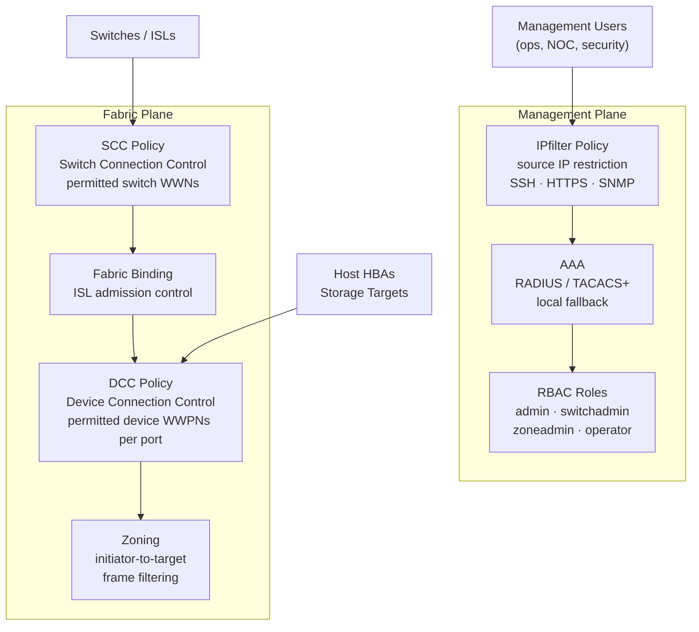

---
tags:
  - san
  - security
---
# FabricOS — Access Control


<div class="kb-summary">
Part of the [Security](index.md) reference.

*Applies to: Brocade FOS 9.x*
</div>

---

## Before you begin

- **Access:** Storage admin credentials (cluster admin or equivalent)
- **Change management:** security changes require CAB approval in most environments
- **Rollback plan:** document current state before any security control change
- **Testing:** validate in a non-production environment first where possible

---

## Access Control Architecture


```text
┌───────────────────────────────── Brocade Fabric OS — Access Control ──────────────────────────────────┐
│                                                                                                       │
│  Access control: RBAC roles, login accounts, TACACS+/RADIUS, SCC/DCC zoning policies.                 │
│                                                                                                       │
│   ┌──────────────────────────────────────────────┐  ┌─────────────────────────────────────────────┐   │
│   │             User Accounts & RBAC             │  │         Remote Auth (TACACS+/RADIUS)        │   │
│   │        Built-in roles: admin/user/ops        │  │         TACACS+ server primary/back         │   │
│   │         Custom roles via roleConfig          │  │          RADIUS: fallback to local          │   │
│   │        userconfig: create/modify user        │  │          aaaconfig: set auth order          │   │
│   │         Account lockout: 3 attempts          │  │          acp filter: ACL on switch          │   │
│   │       Virtual Fabric RBAC per chassis        │  │          Audit log for all CLI cmds         │   │
│   └──────────────────────────────────────────────┘  └─────────────────────────────────────────────┘   │
│                                                                                                       │
│  Local RBAC and remote TACACS+/RADIUS enforce who can run CLI commands on the switch.                 │
│                                                                                                       │
│                          ▼                                                 ▼                          │
│                                                                                                       │
│   ┌──────────────────────────────────────────────┐  ┌─────────────────────────────────────────────┐   │
│   │              SCC / DCC Policies              │  │          Management Access Control          │   │
│   │        SCC: switch connection control        │  │           SSH only: no Telnet/FTP           │   │
│   │        DCC: device connection control        │  │           HTTPS for Web GUI / API           │   │
│   │        SCC: limit which switches join        │  │         IP filter: src IP whitelist         │   │
│   │         DCC: bind ports to WWN list          │  │          Out-of-band mgmt: eth port         │   │
│   │         secpolicyadd to build policy         │  │          SNMPv3 only: disable v1/v2         │   │
│   └──────────────────────────────────────────────┘  └─────────────────────────────────────────────┘   │
│                                                                                                       │
│  Physical Infrastructure (the hardware everything above runs on):                                     │
│  Brocade switch chassis · management Ethernet port · TACACS+ / RADIUS server                          │
│                                                                                                       │
│  Key terms:                                                                                           │
│                                                                                                       │
│  RBAC           = Role-Based Access Control; Fabric OS roles control CLI permissions                  │
│  roleConfig     = CLI command to create/modify custom RBAC role definitions                           │
│  userconfig     = Fabric OS CLI to create, modify, or delete local user accounts                      │
│  TACACS+        = Terminal Access Controller Access Control System; centralized CLI auth              │
│  aaaconfig      = CLI to set authentication order (local, TACACS+, RADIUS)                            │
│  SCC            = Switch Connection Control policy; restricts which switches join fabric              │
│  DCC            = Device Connection Control policy; binds host WWNs to specific ports                 │
│  secpolicyadd   = CLI to add members to SCC/DCC security policies                                     │
│  Virtual Fabric = logical switch partitioning on Brocade directors; per-VF RBAC                       │
│  acp            = Access Control Policy; IP-level ACL for switch management access                    │
│  SNMPv3         = SNMP version 3; provides authentication and encryption for SNMP                     │
│  WWN            = World Wide Name; 64-bit FC identifier for HBAs and switch ports                     │
│                                                                                                       │
└───────────────────────────────────────────────────────────────────────────────────────────────────────┘
```

> **Warning:** Always verify your management workstation's source IP is in the permitted range before activating an IPfilter policy. An incorrect policy will lock you out of the switch — recovery requires console access.

### Modify an Existing IPfilter Policy

```bash
# Clone the active policy before modifying (safe approach)
ipfilter --clone san_mgmt_policy -name san_mgmt_policy_new

# Add a rule to the cloned policy
ipfilter --addrule san_mgmt_policy_new \
  -sip 10.10.200.0/24 -dp 22 -proto tcp -act permit

# Activate the updated policy
ipfilter --activate san_mgmt_policy_new

# Delete the old policy
ipfilter --delete san_mgmt_policy
```

### Show Current IPfilter State

```bash
# List all IPfilter policies
ipfilter --show

# Show rules in a specific policy
ipfilter --show san_mgmt_policy

# Show which policy is active
ipfilter --show -active
```

---

## Secure Fabric OS Policies

Secure Fabric OS provides fabric-plane access control — controlling which switches can join the fabric (SCC) and which devices can log in on specific ports (DCC).

### SCC Policy (Switch Connection Control)

SCC defines which switches are permitted to form ISLs and join the fabric. Any switch not in the SCC policy is rejected when it attempts to connect.

```bash
# Show current SCC policy
secpolicyshow "SCC_POLICY"

# Add a switch to the SCC policy (by switch WWN)
secpolicyadd "SCC_POLICY", "<switch-wwn>"

# Show all defined security policies
secpolicyshow

# Activate the security policy database
secpolicyactivate

# Save the security policy database
secpolicysave
```

### DCC Policy (Device Connection Control)

DCC restricts which device WWPNs are permitted to log into specific switch ports. This prevents unauthorised devices from connecting to the SAN fabric even if they have physical access to a switch port.

```bash
# Show current DCC policy
secpolicyshow "DCC_POLICY"

# Add a device WWPN to a specific port in the DCC policy
# Format: <device-wwpn> on port <domain_id>,<port>
secpolicyadd "DCC_POLICY", "<device-wwpn>;*"    # Allow on any port
secpolicyadd "DCC_POLICY", "<device-wwpn>;<domain-id>,<port>"   # Allow on specific port only

# Activate changes
secpolicyactivate
```

DCC is most valuable in high-security environments where physical port access cannot be fully controlled. For most enterprise SANs, zoning provides sufficient fabric-plane access control without the overhead of DCC management.

---

## Fabric Binding

Fabric binding prevents unauthorised switches from joining the fabric by requiring all member switches to be listed in the fabric binding list. It is enforced at the ISL level.

```bash
# Show fabric binding status
fabricbinding --show

# Show the list of permitted switches in the binding
fabricbinding --show -details

# Add a switch to the binding list
fabricbinding --add <switch-wwn>

# Enable fabric binding enforcement
fabricbinding --enable

# Verify
fabricbinding --show
```

---

## Access Control Standards

| Control | Standard | Verification |
|---|---|---|
| Management access role | `operator` minimum for NOC; `switchadmin` for SAN engineering | `userconfig --show` |
| Zone changes | `zoneadmin` role — separate from switch admin | `userconfig --show` |
| Break-glass account | `admin` role; stored in vault; not used in daily ops | Vault policy |
| IPfilter | Management subnet restriction on all production switches | `ipfilter --show` |
| SNMP | Read-only SNMP v3 for monitoring platforms | `snmpconfig --show` |
| Fabric binding | Enabled on all production fabrics | `fabricbinding --show` |

---

## Troubleshooting Access Control

| Symptom | Triage | Fix |
|---|---|---|
| User can log in but cannot run commands | Role too restrictive | `userconfig --show <username>` — adjust role |
| SSH refused from management workstation | IPfilter blocking source IP | `ipfilter --show` — add management IP to policy |
| New switch rejected when connecting ISL | Fabric binding or SCC policy | `secpolicyshow SCC_POLICY` — add switch WWN |
| Unauthorised device logged into fabric | DCC policy not enforced | Enable DCC policy; add authorised WWPNs |
| IPfilter locked out all access | Incorrect policy activated | Recover via console port; review and correct policy |

---

## See also

- [Fabric Os — Authentication](authentication/)
- [Fabric Os — Hardening](hardening/)
- [Fabric Os — Encryption](encryption/)
