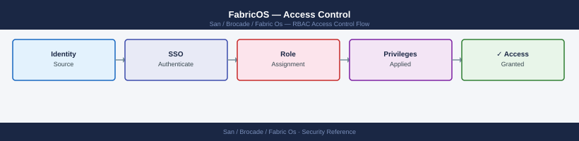
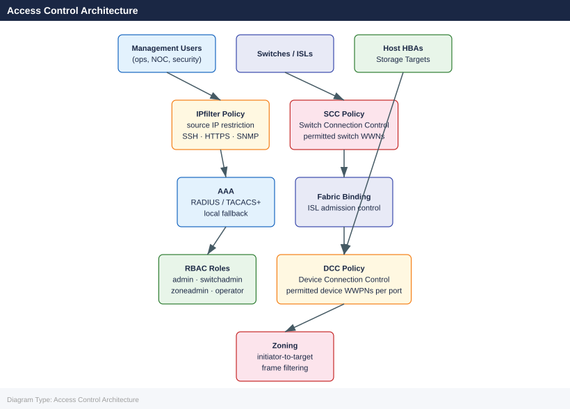

---
tags:
  - san
  - security
description: "FabricOS access control: RBAC role assignment, userconfig CLI, default account password policy, and chassis-level admin vs. operator permissions."
---
# FabricOS — Access Control

<div class="kb-summary">
FabricOS access control: RBAC role assignment, `userconfig` CLI, default account password policy, and chassis-level admin vs. operator permissions.

*Applies to: Brocade FOS 9.x*
</div>


---

## Before you begin

- **Access:** Storage admin credentials (cluster admin or equivalent)
- **Change management:** security changes require CAB approval in most environments
- **Rollback plan:** document current state before any security control change
- **Testing:** validate in a non-production environment first where possible

---

## Access Control Architecture



> **Warning:** Always verify your management workstation's source IP is in the permitted range before activating an IPfilter policy. An incorrect policy will lock you out of the switch — recovery requires console access.

### Modify an Existing IPfilter Policy

```bash
# Clone the active policy before modifying (safe approach)
ipfilter --clone san_mgmt_policy -name san_mgmt_policy_new

# Add a rule to the cloned policy
ipfilter --addrule san_mgmt_policy_new \
  -sip 10.10.200.0/24 -dp 22 -proto tcp -act permit

# Activate the updated policy
ipfilter --activate san_mgmt_policy_new

# Delete the old policy
ipfilter --delete san_mgmt_policy
```


```text title="Expected output"
Policy san_mgmt_policy cloned successfully to san_mgmt_policy_new
Rule added: Source IP 10.10.200.0/24, Destination Port 22, Protocol TCP, Action PERMIT
Policy san_mgmt_policy_new activated successfully
Active policy changed from san_mgmt_policy to san_mgmt_policy_new
Policy san_mgmt_policy deleted successfully
```

!!! warning "Common errors"
    **`Error: Cannot delete active policy san_mgmt_policy`** — Ensure the new policy is activated before attempting to delete the old one; verify with `ipfilter --show` that san_mgmt_policy_new is marked as active.
    **`Error: Policy san_mgmt_policy_new already exists`** — Use a unique policy name for the clone or delete the existing policy first with `ipfilter --delete san_mgmt_policy_new`.
    **`Error: Invalid CIDR notation in rule`** — Verify the subnet mask is valid (e.g., /24 for 255.255.255.0) and use `ipfilter --addrule --help` to confirm correct syntax.
### Show Current IPfilter State

```bash
# List all IPfilter policies
ipfilter --show

# Show rules in a specific policy
ipfilter --show san_mgmt_policy

# Show which policy is active
ipfilter --show -active
```


```text title="Expected output"
Policy Name                          Status      Rules
san_mgmt_policy                      Active      12
san_data_policy                      Inactive    8
san_backup_policy                    Inactive    5
san_guest_policy                     Inactive    3

Policy: san_mgmt_policy
Rule ID  Source          Destination     Protocol  Action   Priority
1        10.20.0.0/16    any             TCP       Permit   1
2        192.168.1.0/24  any             TCP       Permit   2
3        0.0.0.0/0       any             TCP       Deny     100
4        10.20.50.0/24   10.20.100.0/24  UDP       Permit   3
5        any             any             ICMP      Deny     101
...

Active Policy: san_mgmt_policy
Status: Enabled
Last Modified: 2024-01-15 14:32:18 UTC
```

!!! warning "Common errors"
    **`ipfilter: command not found`** — Verify you are logged into the Brocade switch CLI (not the Linux host) and have administrative privileges.
    **`Policy 'san_mgmt_policy' not found`** — Check the exact policy name with `ipfilter --show` first, as policy names are case-sensitive.
    **`Permission denied: insufficient user role`** — Ensure your user account has the "admin" or "security_admin" role assigned via `userconfig --show`.
---

## Secure Fabric OS Policies

Secure Fabric OS provides fabric-plane access control — controlling which switches can join the fabric (SCC) and which devices can log in on specific ports (DCC).

### SCC Policy (Switch Connection Control)

SCC defines which switches are permitted to form ISLs and join the fabric. Any switch not in the SCC policy is rejected when it attempts to connect.

```bash
# Show current SCC policy
secpolicyshow "SCC_POLICY"

# Add a switch to the SCC policy (by switch WWN)
secpolicyadd "SCC_POLICY", "<switch-wwn>"

# Show all defined security policies
secpolicyshow

# Activate the security policy database
secpolicyactivate

# Save the security policy database
secpolicysave
```


```text title="Expected output"
Security Policy Configuration: SCC_POLICY
  Policy Name: SCC_POLICY
  Policy Type: Switch Certification
  Status: Inactive
  Member Count: 3
  Last Modified: 2024-01-15 14:32:18

Switch WWN 50:00:09:73:a2:1c:4d:e1 added to SCC_POLICY successfully.

Security Policies Defined:
  1. SCC_POLICY (Switch Certification) - 4 members - Inactive
  2. DEFAULT_POLICY (Default) - 12 members - Active
  3. FABRIC_SECURE (Custom) - 2 members - Inactive

Activating security policy database...
Security policy database activated successfully.
Timestamp: 2024-01-15 14:33:42

Saving security policy database...
Configuration saved to persistent storage.
Save completed at 2024-01-15 14:33:45
```

!!! warning "Common errors"
    **`secpolicyadd: Invalid WWN format`** — Verify the switch WWN is in the correct format (50:00:xx:xx:xx:xx:xx:xx) and enclose it in quotes.
    **`secpolicyactivate: Policy database is locked by another session`** — Wait a few seconds and retry, or use `secpolicyunlock` if the lock is stale.
    **`secpolicysave: Permission denied`** — Ensure you have admin-level credentials and are not in read-only mode; use `userconfig` to verify your role.
### DCC Policy (Device Connection Control)

DCC restricts which device WWPNs are permitted to log into specific switch ports. This prevents unauthorised devices from connecting to the SAN fabric even if they have physical access to a switch port.

```bash
# Show current DCC policy
secpolicyshow "DCC_POLICY"

# Add a device WWPN to a specific port in the DCC policy
# Format: <device-wwpn> on port <domain_id>,<port>
secpolicyadd "DCC_POLICY", "<device-wwpn>;*"    # Allow on any port
secpolicyadd "DCC_POLICY", "<device-wwpn>;<domain-id>,<port>"   # Allow on specific port only

# Activate changes
secpolicyactivate
```


```text title="Expected output"
DCC_POLICY
===========
Policy Name: DCC_POLICY
Policy Type: Device Control and Configuration
Status: Active
Enabled: Yes

Current Entries:
50:00:09:73:00:1a:2b:4c;*
50:00:09:73:00:1a:2b:4d;1,3
50:00:09:73:00:1a:2b:4e;2,5-6

Policy activation completed successfully.
Effective immediately on all switches in fabric.
```

!!! warning "Common errors"
    **`secpolicyadd: Policy DCC_POLICY not found`** — Verify the policy name with `secpolicyshow` and ensure it exists before adding entries.
    **`secpolicyadd: Invalid WWPN format '<device-wwpn>'`** — Use the correct 16-character hexadecimal format (e.g., `50:00:09:73:00:1a:2b:4c`) without angle brackets.
    **`secpolicyactivate: Changes pending on other switches in fabric`** — Run `secpolicyactivate` on all switches in the fabric or use `--force` flag to override.
DCC is most valuable in high-security environments where physical port access cannot be fully controlled. For most enterprise SANs, zoning provides sufficient fabric-plane access control without the overhead of DCC management.

---

## Fabric Binding

Fabric binding prevents unauthorised switches from joining the fabric by requiring all member switches to be listed in the fabric binding list. It is enforced at the ISL level.

```bash
# Show fabric binding status
fabricbinding --show

# Show the list of permitted switches in the binding
fabricbinding --show -details

# Add a switch to the binding list
fabricbinding --add <switch-wwn>

# Enable fabric binding enforcement
fabricbinding --enable

# Verify
fabricbinding --show
```


```text title="Expected output"
Fabric Binding Status: Disabled
Fabric Binding Mode: Enforce
Number of Switches in Binding List: 3

Fabric Binding Status: Disabled
Fabric Binding Mode: Enforce
Number of Switches in Binding List: 3
Permitted Switches:
  Switch WWN: 10:00:00:05:1e:a2:c3:f0 (switch-prod-01)
  Switch WWN: 10:00:00:05:1e:a2:c3:f1 (switch-prod-02)
  Switch WWN: 10:00:00:05:1e:a2:c3:f2 (switch-prod-03)

Switch 10:00:00:05:1e:a2:c4:b8 added to fabric binding list successfully.

Fabric Binding enforcement enabled successfully.

Fabric Binding Status: Enabled
Fabric Binding Mode: Enforce
Number of Switches in Binding List: 4
```

!!! warning "Common errors"
    **`fabricbinding: command not found`** — Verify you are logged into the Brocade switch directly (via SSH or console) and have administrative privileges.
    **`Error: Invalid WWN format`** — Ensure the switch WWN is in the correct format (10:00:00:xx:xx:xx:xx:xx) and verify the WWN with `switchshow`.
    **`Error: Fabric binding is already enabled`** — The binding is already active; use `fabricbinding --disable` first if you need to modify the list.
---

## Access Control Standards

| Control | Standard | Verification |
|---|---|---|
| Management access role | `operator` minimum for NOC; `switchadmin` for SAN engineering | `userconfig --show` |
| Zone changes | `zoneadmin` role — separate from switch admin | `userconfig --show` |
| Break-glass account | `admin` role; stored in vault; not used in daily ops | Vault policy |
| IPfilter | Management subnet restriction on all production switches | `ipfilter --show` |
| SNMP | Read-only SNMP v3 for monitoring platforms | `snmpconfig --show` |
| Fabric binding | Enabled on all production fabrics | `fabricbinding --show` |

---

## Troubleshooting Access Control

| Symptom | Triage | Fix |
|---|---|---|
| User can log in but cannot run commands | Role too restrictive | `userconfig --show <username>` — adjust role |
| SSH refused from management workstation | IPfilter blocking source IP | `ipfilter --show` — add management IP to policy |
| New switch rejected when connecting ISL | Fabric binding or SCC policy | `secpolicyshow SCC_POLICY` — add switch WWN |
| Unauthorised device logged into fabric | DCC policy not enforced | Enable DCC policy; add authorised WWPNs |
| IPfilter locked out all access | Incorrect policy activated | Recover via console port; review and correct policy |

---

## See also

- [Fabric Os — Authentication](../authentication/)
- [Fabric Os — Hardening](../hardening/)
- [Fabric Os — Encryption](../encryption/)
