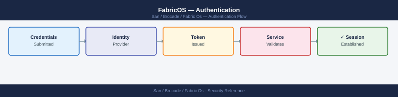

---
tags:
  - san
  - security
description: "FabricOS authentication: RADIUS and LDAP server configuration with aaaconfig, local account fallback policy, and SSH key-based admin access."
---
# FabricOS — Authentication

<div class="kb-summary">
FabricOS authentication: RADIUS and LDAP server configuration with `aaaconfig`, local account fallback policy, and SSH key-based admin access.

*Applies to: Brocade FOS 9.x*
</div>


---

## Before you begin

- **Access:** Storage admin credentials (cluster admin or equivalent)
- **Change management:** security changes require CAB approval in most environments
- **Rollback plan:** document current state before any security control change
- **Testing:** validate in a non-production environment first where possible

---

## Authentication Flow

```d2
direction: right

loginAttempt: "SSH / HTTPS login attempt" {shape: rectangle}
ipCheck: "IPfilter\nsource IP permitted?" {shape: rectangle}
reject: "Connection refused" {shape: rectangle}
authOrder: "Auth order\nRADIUS first?" {shape: rectangle}
radiusReach: "RADIUS server\nreachable?" {shape: rectangle}
localFallback: "Fallback to LOCAL\naccounts on switch" {shape: rectangle}
radiusAuth: "RADIUS\nauthentication?" {shape: rectangle}
reject2: "Login denied\n(no local fallback if\nLOCAL not in authorder" {shape: rectangle}
vsaRole: "Map VSA attribute\nto FabricOS role" {shape: rectangle}
tacacsAuth: "TACACS+\nauthentication?" {shape: rectangle}
tacacsRole: "Role from TACACS+\nper-command authz available" {shape: rectangle}
localAuth: "Local account\nvalid credentials?" {shape: rectangle}
localRole: "Assign local role" {shape: rectangle}
reject3: "Login denied" {shape: rectangle}
session: "CLI / Web session\nopened with assigned role" {shape: rectangle}

loginAttempt -> ipCheck
ipCheck -> reject
ipCheck -> authOrder
authOrder -> radiusReach
radiusReach -> localFallback
radiusReach -> radiusAuth
radiusAuth -> reject2
radiusAuth -> vsaRole
authOrder -> tacacsAuth
tacacsAuth -> tacacsRole
tacacsAuth -> localFallback
localFallback -> localAuth
localAuth -> localRole
localAuth -> reject3
vsaRole -> tacacsRole
tacacsRole -> localRole
localRole -> session
```

If RADIUS authentication fails, the fallback to `LOCAL` authentication ensures break-glass access remains available. Always test RADIUS before relying on it.

---

## TACACS+ Authentication

TACACS+ provides finer-grained authorization than RADIUS — it can enforce per-command authorization in addition to per-user role assignment.

### Configure TACACS+

```bash
# Add TACACS+ server
aaaconfig --add <tacacs-server-ip> -conf tacacs+ -p 49 -s <shared-secret>

# Set authentication order: TACACS+ primary, local fallback
aaaconfig --authorder TACACS+;LOCAL

# Show current AAA configuration
aaaconfig --show
authutil --show
```


```text title="Expected output"
Adding TACACS+ server 192.168.100.50...
TACACS+ server added successfully.
Authentication order set to: TACACS+;LOCAL

AAA Configuration:
  TACACS+ Server: 192.168.100.50
  Port: 49
  Timeout: 5 seconds
  Retries: 3
  Authentication Order: TACACS+;LOCAL
  Accounting: Disabled
  Authorization: Disabled

Authentication Utility Status:
  Local User Database: Enabled
  TACACS+ Status: Active
  Last TACACS+ Contact: 2024-01-15 14:32:18
  Failed Attempts (last 24h): 0
```

!!! warning "Common errors"
    | Error | Fix |
    |---|---|
    | `TACACS+ server 192.168.100.50 is unreachable on port 49` | Verify network connectivity to the TACACS+ server and confirm the port is open in your firewall rules. |
    | `Invalid shared secret format: secret must be 8-32 characters` | Ensure the shared secret meets length requirements and matches the TACACS+ server configuration exactly. |
    | `Authentication order syntax error: use semicolon separator` | Correct the command to use `--authorder TACACS+;LOCAL` with a semicolon between methods, no spaces. |
### TACACS+ vs RADIUS — Choosing Between Them

| Feature | RADIUS | TACACS+ |
|---|---|---|
| Authentication | Yes | Yes |
| Authorization (per-command) | No | Yes |
| Accounting | Limited | Full |
| Transport | UDP | TCP |
| Encryption | Password only | Full packet |
| Common use | Most enterprise SANs | Environments requiring audit of individual commands |

If the environment uses Cisco ISE or ClearPass as the AAA platform, check whether it supports TACACS+ for device administration (most do). Either is acceptable for Brocade switch authentication.

---

## Local Accounts

Local accounts are stored on the switch. They bypass RADIUS/TACACS+ and authenticate directly against the switch credential store.

### Manage Local Accounts

```bash
# List all local accounts and their roles
userconfig --show

# Create a local account with a specific role
userconfig --add <username> -r <role> -p <password>

# Modify an existing account's role
userconfig --change <username> -r <role>

# Delete a local account
userconfig --delete <username>

# Change a password
passwd <username>

# List available roles
roleconfig --show
```


```text title="Expected output"
# userconfig --show
User Name          Role              Login Method
admin              admin             local
monitor            user              local
backup_svc         admin             local

# userconfig --add testuser -r user -p MyP@ssw0rd
User account 'testuser' created successfully with role 'user'

# userconfig --change testuser -r admin
User 'testuser' role changed to 'admin'

# userconfig --delete testuser
User account 'testuser' deleted successfully

# passwd admin
Changing password for user 'admin'
New password: 
Retype new password: 
passwd: password updated successfully

# roleconfig --show
Available Roles:
  admin          - Full administrative access
  user           - Read-only access to fabric information
  secadmin       - Security and user management only
```

!!! warning "Common errors"
    | Error | Fix |
    |---|---|
    | `Error: User 'testuser' already exists` | Choose a different username or delete the existing account first with `userconfig --delete testuser`. |
    | `Error: Invalid role 'invalid_role' specified` | Run `roleconfig --show` to list valid roles and use one of the available options. |
    | `Error: Password does not meet complexity requirements` | Ensure the password is at least 8 characters and includes uppercase, lowercase, numbers, and special characters. |
### Built-in Roles

| Role | Capabilities |
|---|---|
| `admin` | Full switch and chassis access — all commands |
| `switchadmin` | Switch-level operations — port management, diagnostics, no security config |
| `fabricadmin` | Fabric-level operations — can manage all switches in fabric |
| `zoneadmin` | Zone management only — cannot change port config or security settings |
| `operator` | Read-only access — all show commands, no modifications |
| `user` | Minimal read access — very limited show commands |
| `securityadmin` | Security configuration only — certificates, IPfilter, policies |

### Break-Glass Account Standards

- The local `admin` account on every switch must have a strong, unique password stored in the enterprise vault.
- Break-glass accounts must not be used for day-to-day operations — all regular access via RADIUS/TACACS+.
- Break-glass password retrieval must be logged in the vault and reviewed quarterly.
- After any break-glass use, rotate the local admin password and update the vault entry.

---

## SSH Configuration

### SSH Key Management

```bash
# Show current SSH configuration and enabled services
sshutil --show

# Generate RSA host key (2048-bit minimum; 4096-bit recommended)
sshutil --genkey -t rsa

# Generate ECDSA host key (preferred on FOS 9.x)
sshutil --genkey -t ecdsa

# Import an authorized public key for key-based authentication
sshutil --add -user <username> -host <management-server-ip> -file /path/to/id_rsa.pub

# Show imported public keys
sshutil --show -user <username>
```


```text title="Expected output"
SSH Configuration and Enabled Services:
  SSH Status: Enabled
  SSH Port: 22
  SSH Protocol Version: 2
  Host Key Type: rsa
  Host Key Fingerprint: 2048 SHA256:aBcD1EfGhIjKlMnOpQrStUvWxYz2345678901234567
  Key Exchange Algorithms: diffie-hellman-group14-sha1, ecdh-sha2-nistp256
  Encryption Algorithms: aes128-ctr, aes256-ctr
  MAC Algorithms: hmac-sha2-256, hmac-sha2-512
  Authentication Methods: password, publickey

Generating RSA host key (2048-bit)...
RSA host key generated successfully.
Host Key Fingerprint: 2048 SHA256:xYz9876543210AbCdEfGhIjKlMnOpQrStUvWxYz12

Generating ECDSA host key...
ECDSA host key generated successfully.
Host Key Fingerprint: 256 SHA256:pQrStUvWxYz1234567890AbCdEfGhIjKlMnOpQrSt

Importing public key for user 'admin' from 192.168.1.50...
Public key imported successfully.

Authorized public keys for user 'admin':
  Key 1: 2048 SHA256:aBcD1EfGhIjKlMnOpQrStUvWxYz2345678901234567 (imported: 2024-01-15 14:32:18)
```

!!! warning "Common errors"
    | Error | Fix |
    |---|---|
    | `sshutil: command not found` | Verify you are running this command on a Brocade switch with FOS installed, not a Linux management server. |
    | `Error: Invalid file path /path/to/id_rsa.pub` | Replace `/path/to/id_rsa.pub` with the actual absolute path to your public key file and ensure the file is readable. |
    | `Error: User <username> does not exist` | Create the user account on the switch first using `userconfig --add -name <username>` before importing SSH keys. |
### Disabling Telnet

Telnet must be disabled on all production switches. Verify after every new switch deployment and firmware upgrade.

```bash
# Disable Telnet via configure
configure
# Navigate to: System Services → Telnet → enter 0 (disable)

# Verify Telnet is disabled
sshutil --show
# Expected: "telnetd" = disabled
```


```text title="Expected output"
FOS Switch Configuration Utility
Type "help" for command list.
switch:admin> configure
You are in configuration mode. Type "exit" to return to admin mode.
switch:admin:config> System Services
switch:admin:config:System Services> Telnet
switch:admin:config:System Services:Telnet> 0
Telnet service disabled.
switch:admin:config:System Services:Telnet> exit
switch:admin:config> exit
switch:admin> sshutil --show
SSH Status: enabled
Telnet Status: disabled
SSH Port: 22
Telnet Port: 23
switch:admin>
```

!!! warning "Common errors"
    | Error | Fix |
    |---|---|
    | `configure: command not found` | Ensure you are logged into the Brocade switch CLI directly (not a Linux shell); type `exit` if in a nested shell context. |
    | `Telnet Status: enabled` | Navigate to the correct menu path (System Services → Telnet) and confirm you entered `0` to disable, then run `configupload` to persist changes. |
    | `Permission denied: configure` | Verify your user account has admin-level privileges; contact the fabric administrator to grant configuration rights. |
---

## NTP Requirement

NTP synchronisation is mandatory for:

- Accurate log timestamps — required for security incident correlation
- Certificate-based authentication — certificates fail validation if the clock is wrong
- RADIUS authentication — some RADIUS servers enforce time-based token validation

```bash
# Configure NTP server (minimum two servers for redundancy)
tsclockserver "<ntp-server-1> <ntp-server-2>"

# Verify NTP synchronisation
tsclockserver              # Show configured NTP servers
date                       # Check current system time against expected

# Check NTP sync status (FOS 9.x)
ntpshow
```


```text title="Expected output"
NTP Server(s) set to: 192.168.1.50 203.0.113.10
(no output — command completes silently)

NTP Server(s): 192.168.1.50 203.0.113.10

Fri Mar 15 14:32:47 UTC 2024

NTP status: synchronized
NTP server: 192.168.1.50
Stratum: 2
Offset: 0.002345 seconds
Delay: 0.015678 seconds
Jitter: 0.001234 seconds
Last update: 3 seconds ago
```

!!! warning "Common errors"
    | Error | Fix |
    |---|---|
    | `NTP Server(s) set to: (none)` | Verify both NTP servers are reachable and specify them with `tsclockserver "server1 server2"` using valid hostnames or IPs. |
    | `ntpshow: command not found` | Confirm you are running FOS 9.x or later; use `firmwareshow` to verify the FOS version and upgrade if necessary. |
    | `NTP status: unsynchronized` | Check network connectivity to the NTP servers with `ping`, verify firewall rules allow UDP port 123, and wait 5-10 minutes for initial synchronization. |
NTP servers should be on the management network, reachable from the switch management IP. Use internal NTP stratum 2 servers — do not rely on public internet NTP from a SAN switch.

---

## Authentication Troubleshooting

| Symptom | Triage | Fix |
|---|---|---|
| RADIUS login fails for all users | `ping <radius-server-ip>` from switch | Verify network path; check RADIUS server is running |
| RADIUS login fails for one user | Test user account on RADIUS server directly | Check AD group membership; verify VSA attribute |
| Local fallback not working | `aaaconfig --show` — check order is `RADIUS;LOCAL` | Confirm `authorder` includes LOCAL |
| Account locked after failed attempts | Account lock threshold hit | Unlock via local console or another admin account |
| SSH connection refused | `sshutil --show` — SSH enabled? | Enable SSH; check IPfilter is not blocking port 22 |
| Certificate errors on SSH connection | Host key changed (after regen) | Clear known_hosts entry on management workstation |
| TACACS+ authentication slow | TCP connection timeout | Check TACACS+ server reachability; firewall rules on port 49 |
---

## Related Reference

- [Standard LDAP Integration](../../../../security/ldap-integration/index.md) — field reference, service account standards, TLS requirements, and connectivity testing

---

## See also

- [Fabric Os — Access Control](../access-control/)
- [Fabric Os — Hardening](../hardening/)
- [Fabric Os — Encryption](../encryption/)
