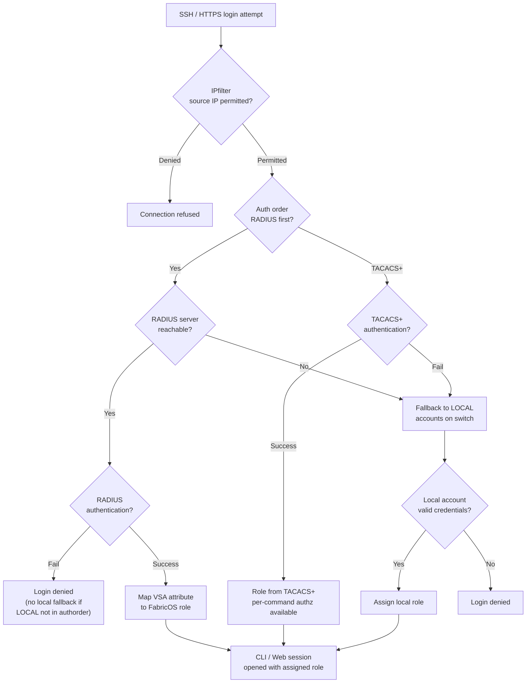

# FabricOS — Authentication


<div class="kb-summary">
> Part of the [Security](../index.md) reference.
</div>

---

## Authentication Flow


┌───────────────────────────────── Brocade Fabric OS — Authentication ──────────────────────────────────┐
│                                                                                                       │
│  Authentication: DH-CHAP for switch-to-switch, FCAP, TACACS+, and local login methods.                │
│                                                                                                       │
│   ┌──────────────────────────────────────────────┐  ┌─────────────────────────────────────────────┐   │
│   │       Switch-to-Switch Auth (DH-CHAP)        │  │          User Login Authentication          │   │
│   │        DH-CHAP: HMAC-SHA256 exchange         │  │          SSH key-based admin login          │   │
│   │          FCAP: cert-based ISL auth           │  │         TACACS+: privilege level map        │   │
│   │           authutil --set -a dhchap           │  │          RADIUS: challenge-response         │   │
│   │        Group shared secret per fabric        │  │          Local: password + lockout          │   │
│   │        ISL formed only if auth passes        │  │         passwdcfg: complexity rules         │   │
│   └──────────────────────────────────────────────┘  └─────────────────────────────────────────────┘   │
│                                                                                                       │
│  DH-CHAP authenticates switches before ISL formation; user auth via TACACS+ or local.                 │
│                                                                                                       │
│                          ▼                                                 ▼                          │
│                                                                                                       │
│   ┌──────────────────────────────────────────────┐  ┌─────────────────────────────────────────────┐   │
│   │            PKI / Certificate Auth            │  │           Audit & Session Control           │   │
│   │          FCAP: X.509 cert exchange           │  │         audit log: all CLI commands         │   │
│   │         certutil: manage local certs         │  │          Security event ID tracking         │   │
│   │          HTTPS cert bind to web GUI          │  │         Session timeout: 30 min idle        │   │
│   │        CA-signed vs self-signed cert         │  │         Concurrent sessions limited         │   │
│   │        Revocation: CRL check on auth         │  │          syslog auth events to SIEM         │   │
│   └──────────────────────────────────────────────┘  └─────────────────────────────────────────────┘   │
│                                                                                                       │
│  Physical Infrastructure (the hardware everything above runs on):                                     │
│  Brocade FC switch · management Ethernet · TACACS+ server · PKI CA infrastructure                     │
│                                                                                                       │
│  Key terms:                                                                                           │
│                                                                                                       │
│  DH-CHAP        = Diffie-Hellman CHAP; cryptographic switch-to-switch auth on ISL                     │
│  FCAP           = Fibre Channel Authentication Protocol; X.509 cert-based ISL auth                    │
│  authutil       = CLI to configure and test switch authentication (DH-CHAP/FCAP)                      │
│  ISL            = Inter-Switch Link; E_Port connection between two FC switches                        │
│  TACACS+        = centralised CLI auth server; maps privilege levels to Fabric OS roles               │
│  passwdcfg      = password configuration CLI; sets complexity, expiry, lockout policy                 │
│  certutil       = Fabric OS CLI to import, export, and manage X.509 certificates                      │
│  HTTPS cert     = TLS certificate bound to management GUI; must be CA-signed in prod                  │
│  CRL            = Certificate Revocation List; checked during FCAP auth to block revoked              │
│  Audit log      = tamper-evident log of all CLI sessions and commands with user/timestamp             │
│  SSH key        = RSA/ECDSA key pair for passwordless admin SSH; stored in authorized_keys            │
│  Session timeout= idle session termination; Fabric OS default 30 minutes inactivity                   │
│                                                                                                       │
└───────────────────────────────────────────────────────────────────────────────────────────────────────┘
```
```text

If RADIUS authentication fails, the fallback to `LOCAL` authentication ensures break-glass access remains available. Always test RADIUS before relying on it.

---

## TACACS+ Authentication

TACACS+ provides finer-grained authorization than RADIUS — it can enforce per-command authorization in addition to per-user role assignment.

### Configure TACACS+

```bash
# Add TACACS+ server
aaaconfig --add <tacacs-server-ip> -conf tacacs+ -p 49 -s <shared-secret>

# Set authentication order: TACACS+ primary, local fallback
aaaconfig --authorder TACACS+;LOCAL

# Show current AAA configuration
aaaconfig --show
authutil --show
```

### TACACS+ vs RADIUS — Choosing Between Them

| Feature | RADIUS | TACACS+ |
|---|---|---|
| Authentication | Yes | Yes |
| Authorization (per-command) | No | Yes |
| Accounting | Limited | Full |
| Transport | UDP | TCP |
| Encryption | Password only | Full packet |
| Common use | Most enterprise SANs | Environments requiring audit of individual commands |

If the environment uses Cisco ISE or ClearPass as the AAA platform, check whether it supports TACACS+ for device administration (most do). Either is acceptable for Brocade switch authentication.

---

## Local Accounts

Local accounts are stored on the switch. They bypass RADIUS/TACACS+ and authenticate directly against the switch credential store.

### Manage Local Accounts

```bash
# List all local accounts and their roles
userconfig --show

# Create a local account with a specific role
userconfig --add <username> -r <role> -p <password>

# Modify an existing account's role
userconfig --change <username> -r <role>

# Delete a local account
userconfig --delete <username>

# Change a password
passwd <username>

# List available roles
roleconfig --show
```

### Built-in Roles

| Role | Capabilities |
|---|---|
| `admin` | Full switch and chassis access — all commands |
| `switchadmin` | Switch-level operations — port management, diagnostics, no security config |
| `fabricadmin` | Fabric-level operations — can manage all switches in fabric |
| `zoneadmin` | Zone management only — cannot change port config or security settings |
| `operator` | Read-only access — all show commands, no modifications |
| `user` | Minimal read access — very limited show commands |
| `securityadmin` | Security configuration only — certificates, IPfilter, policies |

### Break-Glass Account Standards

- The local `admin` account on every switch must have a strong, unique password stored in the enterprise vault.
- Break-glass accounts must not be used for day-to-day operations — all regular access via RADIUS/TACACS+.
- Break-glass password retrieval must be logged in the vault and reviewed quarterly.
- After any break-glass use, rotate the local admin password and update the vault entry.

---

## SSH Configuration

### SSH Key Management

```bash
# Show current SSH configuration and enabled services
sshutil --show

# Generate RSA host key (2048-bit minimum; 4096-bit recommended)
sshutil --genkey -t rsa

# Generate ECDSA host key (preferred on FOS 9.x)
sshutil --genkey -t ecdsa

# Import an authorized public key for key-based authentication
sshutil --add -user <username> -host <management-server-ip> -file /path/to/id_rsa.pub

# Show imported public keys
sshutil --show -user <username>
```

### Disabling Telnet

Telnet must be disabled on all production switches. Verify after every new switch deployment and firmware upgrade.

```bash
# Disable Telnet via configure
configure
# Navigate to: System Services → Telnet → enter 0 (disable)

# Verify Telnet is disabled
sshutil --show
# Expected: "telnetd" = disabled
```

---

## NTP Requirement

NTP synchronisation is mandatory for:

- Accurate log timestamps — required for security incident correlation
- Certificate-based authentication — certificates fail validation if the clock is wrong
- RADIUS authentication — some RADIUS servers enforce time-based token validation

```bash
# Configure NTP server (minimum two servers for redundancy)
tsclockserver "<ntp-server-1> <ntp-server-2>"

# Verify NTP synchronisation
tsclockserver              # Show configured NTP servers
date                       # Check current system time against expected

# Check NTP sync status (FOS 9.x)
ntpshow
```

NTP servers should be on the management network, reachable from the switch management IP. Use internal NTP stratum 2 servers — do not rely on public internet NTP from a SAN switch.

---

## Authentication Troubleshooting

| Symptom | Triage | Fix |
|---|---|---|
| RADIUS login fails for all users | `ping <radius-server-ip>` from switch | Verify network path; check RADIUS server is running |
| RADIUS login fails for one user | Test user account on RADIUS server directly | Check AD group membership; verify VSA attribute |
| Local fallback not working | `aaaconfig --show` — check order is `RADIUS;LOCAL` | Confirm `authorder` includes LOCAL |
| Account locked after failed attempts | Account lock threshold hit | Unlock via local console or another admin account |
| SSH connection refused | `sshutil --show` — SSH enabled? | Enable SSH; check IPfilter is not blocking port 22 |
| Certificate errors on SSH connection | Host key changed (after regen) | Clear known_hosts entry on management workstation |
| TACACS+ authentication slow | TCP connection timeout | Check TACACS+ server reachability; firewall rules on port 49 |
---

## Related Reference

- [Standard LDAP Integration](../../../../../security/ldap-integration/index.md) — field reference, service account standards, TLS requirements, and connectivity testing
