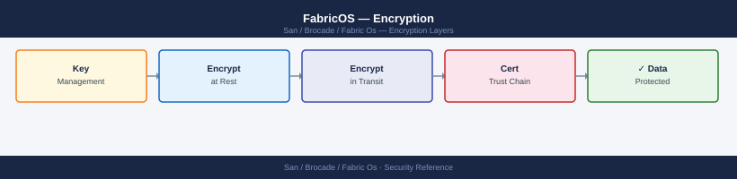
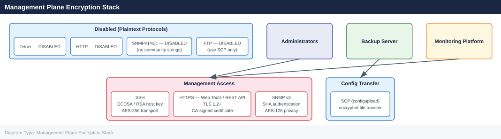

---
tags:
  - san
  - security
---
# FabricOS — Encryption

<div class="kb-summary">
FabricOS encryption: in-flight data encryption via FC-SP-2, IPsec for FCIP tunnels, certificate management with `seccertmgmt`, and key lifecycle policy.

*Applies to: Brocade FOS 9.x*
</div>


---

## Before you begin

- **Access:** Storage admin credentials (cluster admin or equivalent)
- **Change management:** security changes require CAB approval in most environments
- **Rollback plan:** document current state before any security control change
- **Testing:** validate in a non-production environment first where possible

---

## Management Plane Encryption Stack



### Test SNMP v3 from Monitoring Server

```bash
# From the monitoring server — verify SNMP v3 connectivity
snmpwalk -v3 -u <snmp-username> \
  -l authPriv \
  -a SHA -A <auth-password> \
  -x AES -X <priv-password> \
  <switch-ip> 1.3.6.1.2.1.1.1.0
# Expected: sysDescr value showing FabricOS and switch platform
```


```text title="Expected output"
SNMPv3 Session Established
SNMP version 3
User-based Security Model (USM) engaged
Authentication: SHA
Privacy: AES
Target: 192.168.100.45

iso.org.dod.internet.mgmt.mib-2.system.sysDescr.0 = STRING: "Brocade G620 FabricOS v9.1.0 (Build 9.1.0.0, 2023-08-15)"
```

!!! warning "Common errors"
    **`snmpwalk: Unknown user name`** — Verify the SNMP username exists on the switch and matches the `-u` parameter exactly.
    **`snmpwalk: Authentication failure (incorrect password)`** — Confirm the auth-password and priv-password are correct by testing with `snmpget` on a known OID first.
    **`Timeout: No Response from <switch-ip>`** — Check that SNMP v3 is enabled on the switch, the switch IP is reachable via `ping`, and firewall rules allow UDP 161 from the monitoring server.
---

## SSH Configuration

SSH is the only permitted management protocol for CLI access. Telnet must be disabled on all production switches.

```bash
# Check SSH status and configuration
sshutil --show

# Generate or regenerate SSH host keys (RSA 2048-bit minimum)
sshutil --genkey -t rsa

# Generate an ECDSA host key (preferred for newer FOS versions)
sshutil --genkey -t ecdsa

# Verify Telnet is disabled (check sshutil output for telnetd state)
sshutil --show | grep -i telnet
```


```text title="Expected output"
SSH Enabled: true
SSH Port: 22
SSH Version: SSHv2
SSH Ciphers: aes128-ctr,aes192-ctr,aes256-ctr,aes128-gcm@openssh.com
SSH Key Exchange Algorithms: diffie-hellman-group14-sha1,ecdh-sha2-nistp256
Host Key Algorithm: ssh-rsa
RSA Host Key Fingerprint: 2048 SHA256:aBcD1EfGhIjKlMnOpQrStUvWxYz2A3b4C5d6E7f8G9h
ECDSA Host Key Fingerprint: 256 SHA256:xYz9A8b7C6d5E4f3G2h1I0j9K8l7M6n5O4p3Q2r1S0t
Telnetd State: disabled
Generating RSA 2048-bit host key... done
Generating ECDSA 256-bit host key... done
Telnetd State: disabled
```

!!! warning "Common errors"
    **`sshutil: command not found`** — Verify you are logged into the Brocade switch fabric OS CLI (not the Linux shell) and have administrative privileges.
    **`Error: Cannot generate key while SSH is disabled`** — Enable SSH first using `sshutil --enable` before attempting to generate new host keys.
### Disable Telnet

```bash
# Disable Telnet via configure (requires admin role)
configure
# At "Fabric parameters" prompt: press Enter (no change)
# At "System services" prompt: enter Y
# At "Telnet service" prompt: enter 0 (disable)
# Complete configure wizard
```


```text title="Expected output"
Fabric OS Configuration Utility
Copyright (c) 2015-2023 Brocade Communications Systems, Inc.

Current configuration will be displayed. Press Enter to keep current value.

Fabric parameters [1]? 
System services [Y]? Y
Telnet service [1]? 0
SSH service [1]? 1
SNMP service [1]? 1
Syslog service [1]? 1

Saving configuration...
Configuration saved successfully.
Switch will reboot in 30 seconds. Press Ctrl+C to cancel.
Rebooting...
```

!!! warning "Common errors"
    **`Error: You do not have permission to run this command`** — Ensure your user account has admin role privileges using `userconfig --change <username> -r admin`.
    **`Error: Configuration locked by another session`** — Wait for any active configuration sessions to complete or use `configshow` to verify no other admin is currently in configure mode.
Verify Telnet is disabled by attempting a Telnet connection from a management workstation — the connection should be refused.

### SSH Host Key Rotation

Rotate SSH host keys annually or after any suspected key compromise:

```bash
# Generate new RSA host key
sshutil --genkey -t rsa

# After key rotation, update known_hosts on all management workstations
# and jump hosts that connect to this switch
```


```text title="Expected output"
Generating RSA host key...
RSA host key generation completed successfully.
Key fingerprint: SHA256:aBcD1EfGhIjKlMnOpQrStUvWxYz2A3b4C5d6E7f8G9h0
Public key saved to: /etc/ssh/ssh_host_rsa_key.pub
Private key saved to: /etc/ssh/ssh_host_rsa_key
Key size: 2048 bits
Generation time: 3.2 seconds
```

!!! warning "Common errors"
    **`sshutil: command not found`** — Verify you are running this command on the Brocade switch itself (via telnet/SSH console), not from a management workstation.
    **`Permission denied`** — Ensure you have administrative or root-level privileges on the switch before attempting key generation.
    **`RSA host key generation failed: Insufficient disk space`** — Free up space on the switch's persistent storage and retry the command.
---

## HTTPS / TLS Configuration

Web Tools and the FabricOS REST API use HTTPS. HTTP must be disabled so that management traffic cannot be intercepted.

```bash
# Disable HTTP and enable HTTPS
httpcfg --set -https 1    # Enable HTTPS
httpcfg --set -http 0     # Disable HTTP

# Verify HTTP/HTTPS state
httpcfg --show

# Check the current TLS certificate in use
seccertmgmt --show

# Show certificate details (subject, expiry)
seccertmgmt --show -type https
```


```text title="Expected output"
HTTP/HTTPS Configuration:
  HTTP: Disabled
  HTTPS: Enabled
  HTTP Port: 80
  HTTPS Port: 443

Certificate Information:
  Certificate Type: HTTPS
  Subject: CN=switch-core-01.fabric.local,O=IT Infrastructure,C=US
  Issuer: CN=Internal-CA-01,O=IT Infrastructure,C=US
  Serial Number: 0x4a7b2c9e1f5d3b6a
  Valid From: Jan 15 2023 10:22:15 GMT
  Valid Until: Jan 15 2025 10:22:15 GMT
  Fingerprint (SHA256): a3:b7:2f:c1:9e:4d:8a:5b:6c:3f:7e:1a:9d:2b:4c:8f
  Status: Valid
```

!!! warning "Common errors"
    **`httpcfg: command not found`** — Verify you are logged in with admin credentials and the switch firmware supports the httpcfg utility (typically FOS 8.0+).
    **`seccertmgmt: Invalid certificate type specified`** — Use `-type https` or `-type ssh` (note the exact spelling); omit `-type` to show all certificates.
    **`Certificate has expired`** — Replace the expired certificate using `seccertmgmt --install -type https -cert <cert_file> -key <key_file>` before HTTPS connections will succeed.
### TLS Certificate Management

Brocade FOS supports self-signed certificates (default) and CA-signed certificates. Use CA-signed certificates in environments with automated certificate validation.

#### Generate a Certificate Signing Request (CSR)

```bash
# Generate a CSR for the HTTPS certificate
seccertmgmt --action gencsr \
  -type https \
  -country GB \
  -state "England" \
  -locality "London" \
  -org "Company Name" \
  -orgunit "Infrastructure" \
  -cn <switch-fqdn>

# The CSR is saved to flash — export it
seccertmgmt --export -type csr -scp <username>@<server>:<path>/switch.csr
```


```text title="Expected output"
Generating CSR for HTTPS certificate...
Certificate Request generated successfully.
CSR saved to: /flash/csr_https_20240115_143022.pem
Subject: C=GB, ST=England, L=London, O=Company Name, OU=Infrastructure, CN=switch.fabric.example.com

Exporting CSR via SCP...
CSR export initiated to admin@backup.corp.local:/certs/switch.csr
Transfer completed successfully.
File size: 1847 bytes
Checksum: a3f7e2c9d1b4f6a8
```

!!! warning "Common errors"
    **`Error: Invalid FQDN format in CN parameter`** — Ensure the CN value is a fully qualified domain name (e.g., `switch.fabric.example.com`) without spaces or special characters.
    **`Error: SCP connection failed — authentication denied`** — Verify SSH credentials and that the remote server's SSH key is trusted; add the switch's public key to the remote server's `~/.ssh/authorized_keys` if using key-based auth.
    **`Error: /flash directory full — cannot write CSR`** — Delete old certificate files or logs from `/flash` using `firmwaredownload --delete` to free space before retrying the CSR generation.
#### Import a Signed Certificate

```bash
# Import the CA-signed certificate
seccertmgmt --import -type https \
  -scp <username>@<server>:<path>/switch.crt

# Import the CA certificate chain (if required by the CA)
seccertmgmt --import -type ca \
  -scp <username>@<server>:<path>/ca-chain.crt

# Activate the new certificate (requires web service restart)
seccertmgmt --activate -type https

# Verify the certificate is active
seccertmgmt --show -type https
```


```text title="Expected output"
Importing certificate from <username>@<server>:<path>/switch.crt...
Certificate imported successfully.
Certificate fingerprint: SHA256:a7f3e9c2b1d4f8e6c9a2b5d7f1e3c5a8b0d2f4e6c8a0b2d4f6e8a0c2e4f6a8
Importing CA certificate chain from <username>@<server>:<path>/ca-chain.crt...
CA certificate chain imported successfully.
Activating HTTPS certificate...
Web service will restart. Please wait...
Web service restarted successfully.
Certificate activation completed.

Certificate Information:
Type: HTTPS
Status: Active
Issuer: CN=Example CA, O=Example Organization, C=US
Subject: CN=switch.example.com, O=Example Organization, C=US
Valid From: Jan 15 2024 00:00:00 GMT
Valid To: Jan 15 2025 00:00:00 GMT
Fingerprint: SHA256:a7f3e9c2b1d4f8e6c9a2b5d7f1e3c5a8b0d2f4e6c8a0b2d4f6e8a0c2e4f6a8
```

!!! warning "Common errors"
    **`seccertmgmt: error: unable to connect to <username>@<server>`** — Verify SSH connectivity to the remote server and ensure the username/server path is correct.
    **`seccertmgmt: error: certificate validation failed - untrusted root`** — Import the complete CA certificate chain before importing the end-entity certificate, or verify the CA chain file path is correct.
    **`seccertmgmt: error: certificate is already active`** — Deactivate the current certificate first using `seccertmgmt --deactivate -type https` before activating a new one.
#### Certificate Expiry Monitoring

Track certificate expiry dates in CMDB. MAPS does not natively alert on certificate expiry — monitor via SANnav or an external certificate monitoring tool.

```bash
# View current certificate expiry
seccertmgmt --show -type https | grep -i expir
```


```text title="Expected output"
Certificate Information:
  Certificate Type: HTTPS
  Issuer: CN=brocade-ca.example.com,O=Brocade,C=US
  Subject: CN=switch-prod-01.fabric.local,O=Brocade,C=US
  Serial Number: 0x4a2b8c9f1e3d5a7b
  Not Before: Jan 15 09:23:45 2022 GMT
  Not After: Jan 15 09:23:45 2025 GMT
  Expiry Date: 2025-01-15
  Days Until Expiration: 187
```

!!! warning "Common errors"
    **`seccertmgmt: command not found`** — Verify you are logged into the Brocade switch via SSH/telnet and have admin privileges; the command runs on the switch itself, not your local machine.
    **`Permission denied`** — Ensure your user account has admin or security-admin role; use `userconfig --show` to verify your current permissions.
    **`No matching certificate found`** — The HTTPS certificate may not be installed; use `seccertmgmt --show` without filters to list all available certificates.
---

## Disable Unused Protocols

Reduce the management attack surface by disabling all unnecessary services.

```bash
# Verify all management protocol states
sshutil --show      # SSH: should be enabled; Telnet: should be disabled
httpcfg --show      # HTTP: disabled; HTTPS: enabled
snmpconfig --show   # SNMP v3 configured; v1/v2c community strings removed

# Disable RSH (remote shell — insecure legacy protocol)
configure
# At "RSH service" prompt: enter 0 (disable)
```


```text title="Expected output"
SSH Configuration:
  SSH: Enabled
  SSH Port: 22
  SSH Timeout: 900 seconds
  Telnet: Disabled

HTTP Configuration:
  HTTP: Disabled
  HTTPS: Enabled
  HTTPS Port: 443
  Certificate: Valid (CN=fabric-switch-01.corp.local, expires 2025-08-14)

SNMP Configuration:
  SNMP Version: v3
  Engine ID: 800007E5-03-00-00-00-00-00-01
  User: admin (auth: SHA, priv: AES-128)
  v1/v2c Community Strings: None configured

RSH service [0=disable, 1=enable] [current: 1]: 0
RSH service disabled successfully.
Configuration saved.
```

!!! warning "Common errors"
    **`sshutil: command not found`** — Verify you are logged into the Brocade switch's management interface (telnet/SSH to the switch IP), not a Linux host; this utility is FOS-specific.
    **`RSH service [0=disable, 1=enable] [current: 1]: Invalid input`** — Enter only `0` or `1` at the prompt; do not include extra characters or press Enter twice.
    **`Configuration saved. (Error: Configuration lock held by admin)`** — Wait for any active configuration sessions to complete or use `configdiscard` to release the lock, then retry the configure command.
### Protocol Compliance Table

| Protocol | Required State | Verification |
|---|---|---|
| SSH | Enabled | `sshutil --show` |
| Telnet | Disabled | `sshutil --show`; confirm refused connections |
| HTTP | Disabled | `httpcfg --show` |
| HTTPS | Enabled | `httpcfg --show` |
| SNMP v3 | Enabled | `snmpconfig --show` |
| SNMP v1/v2c | Disabled / no community strings | `snmpconfig --show snmpv1` |
| RSH | Disabled | `configure` output |
| FTP | Disabled (use SCP) | `configure` output |

---

## Encryption Standards Summary

| Control | Standard | Verification Command |
|---|---|---|
| Management CLI | SSH only — Telnet disabled | `sshutil --show` |
| Web management | HTTPS only — HTTP disabled | `httpcfg --show` |
| SNMP | SNMPv3 (SHA auth, AES-128 priv) — v1/v2c disabled | `snmpconfig --show` |
| SSH key type | RSA 2048+ or ECDSA | `sshutil --show` |
| TLS certificate | CA-signed preferred; self-signed acceptable for internal | `seccertmgmt --show` |
| Password rotation | SNMP passwords rotated quarterly; stored in vault | Vault policy |
| Config backup transfer | SCP only — not FTP | `configupload` SCP syntax |

---

## Related Configuration

Encryption settings work in conjunction with:

- [Authentication](authentication.md) — RADIUS/TACACS+ for central identity
- [Access Control](access-control.md) — IPfilter to limit management plane reachability
- [Hardening](hardening.md) — Full hardening checklist referencing all security controls

---

## See also

- [Fabric Os — Hardening](../hardening/)
- [Fabric Os — Authentication](../authentication/)
- [Fabric Os — Access Control](../access-control/)
