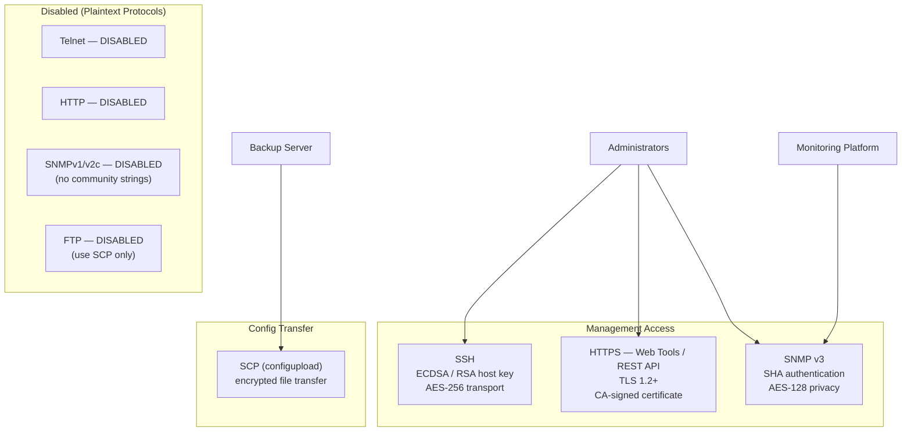

---
tags:
  - san
  - security
---
# FabricOS — Encryption

<div class="kb-summary">
FabricOS encryption: in-flight data encryption via FC-SP-2, IPsec for FCIP tunnels, certificate management with `seccertmgmt`, and key lifecycle policy.

*Applies to: Brocade FOS 9.x*
</div>


---

## Before you begin

- **Access:** Storage admin credentials (cluster admin or equivalent)
- **Change management:** security changes require CAB approval in most environments
- **Rollback plan:** document current state before any security control change
- **Testing:** validate in a non-production environment first where possible

---

## Management Plane Encryption Stack



### Test SNMP v3 from Monitoring Server

```bash
# From the monitoring server — verify SNMP v3 connectivity
snmpwalk -v3 -u <snmp-username> \
  -l authPriv \
  -a SHA -A <auth-password> \
  -x AES -X <priv-password> \
  <switch-ip> 1.3.6.1.2.1.1.1.0
# Expected: sysDescr value showing FabricOS and switch platform
```

---

## SSH Configuration

SSH is the only permitted management protocol for CLI access. Telnet must be disabled on all production switches.

```bash
# Check SSH status and configuration
sshutil --show

# Generate or regenerate SSH host keys (RSA 2048-bit minimum)
sshutil --genkey -t rsa

# Generate an ECDSA host key (preferred for newer FOS versions)
sshutil --genkey -t ecdsa

# Verify Telnet is disabled (check sshutil output for telnetd state)
sshutil --show | grep -i telnet
```

### Disable Telnet

```bash
# Disable Telnet via configure (requires admin role)
configure
# At "Fabric parameters" prompt: press Enter (no change)
# At "System services" prompt: enter Y
# At "Telnet service" prompt: enter 0 (disable)
# Complete configure wizard
```

Verify Telnet is disabled by attempting a Telnet connection from a management workstation — the connection should be refused.

### SSH Host Key Rotation

Rotate SSH host keys annually or after any suspected key compromise:

```bash
# Generate new RSA host key
sshutil --genkey -t rsa

# After key rotation, update known_hosts on all management workstations
# and jump hosts that connect to this switch
```

---

## HTTPS / TLS Configuration

Web Tools and the FabricOS REST API use HTTPS. HTTP must be disabled so that management traffic cannot be intercepted.

```bash
# Disable HTTP and enable HTTPS
httpcfg --set -https 1    # Enable HTTPS
httpcfg --set -http 0     # Disable HTTP

# Verify HTTP/HTTPS state
httpcfg --show

# Check the current TLS certificate in use
seccertmgmt --show

# Show certificate details (subject, expiry)
seccertmgmt --show -type https
```

### TLS Certificate Management

Brocade FOS supports self-signed certificates (default) and CA-signed certificates. Use CA-signed certificates in environments with automated certificate validation.

#### Generate a Certificate Signing Request (CSR)

```bash
# Generate a CSR for the HTTPS certificate
seccertmgmt --action gencsr \
  -type https \
  -country GB \
  -state "England" \
  -locality "London" \
  -org "Company Name" \
  -orgunit "Infrastructure" \
  -cn <switch-fqdn>

# The CSR is saved to flash — export it
seccertmgmt --export -type csr -scp <username>@<server>:<path>/switch.csr
```

#### Import a Signed Certificate

```bash
# Import the CA-signed certificate
seccertmgmt --import -type https \
  -scp <username>@<server>:<path>/switch.crt

# Import the CA certificate chain (if required by the CA)
seccertmgmt --import -type ca \
  -scp <username>@<server>:<path>/ca-chain.crt

# Activate the new certificate (requires web service restart)
seccertmgmt --activate -type https

# Verify the certificate is active
seccertmgmt --show -type https
```

#### Certificate Expiry Monitoring

Track certificate expiry dates in CMDB. MAPS does not natively alert on certificate expiry — monitor via SANnav or an external certificate monitoring tool.

```bash
# View current certificate expiry
seccertmgmt --show -type https | grep -i expir
```

---

## Disable Unused Protocols

Reduce the management attack surface by disabling all unnecessary services.

```bash
# Verify all management protocol states
sshutil --show      # SSH: should be enabled; Telnet: should be disabled
httpcfg --show      # HTTP: disabled; HTTPS: enabled
snmpconfig --show   # SNMP v3 configured; v1/v2c community strings removed

# Disable RSH (remote shell — insecure legacy protocol)
configure
# At "RSH service" prompt: enter 0 (disable)
```

### Protocol Compliance Table

| Protocol | Required State | Verification |
|---|---|---|
| SSH | Enabled | `sshutil --show` |
| Telnet | Disabled | `sshutil --show`; confirm refused connections |
| HTTP | Disabled | `httpcfg --show` |
| HTTPS | Enabled | `httpcfg --show` |
| SNMP v3 | Enabled | `snmpconfig --show` |
| SNMP v1/v2c | Disabled / no community strings | `snmpconfig --show snmpv1` |
| RSH | Disabled | `configure` output |
| FTP | Disabled (use SCP) | `configure` output |

---

## Encryption Standards Summary

| Control | Standard | Verification Command |
|---|---|---|
| Management CLI | SSH only — Telnet disabled | `sshutil --show` |
| Web management | HTTPS only — HTTP disabled | `httpcfg --show` |
| SNMP | SNMPv3 (SHA auth, AES-128 priv) — v1/v2c disabled | `snmpconfig --show` |
| SSH key type | RSA 2048+ or ECDSA | `sshutil --show` |
| TLS certificate | CA-signed preferred; self-signed acceptable for internal | `seccertmgmt --show` |
| Password rotation | SNMP passwords rotated quarterly; stored in vault | Vault policy |
| Config backup transfer | SCP only — not FTP | `configupload` SCP syntax |

---

## Related Configuration

Encryption settings work in conjunction with:

- [Authentication](authentication/index.md) — RADIUS/TACACS+ for central identity
- [Access Control](access-control/index.md) — IPfilter to limit management plane reachability
- [Hardening](hardening/index.md) — Full hardening checklist referencing all security controls

---

## See also

- [Fabric Os — Hardening](../hardening/)
- [Fabric Os — Authentication](../authentication/)
- [Fabric Os — Access Control](../access-control/)
