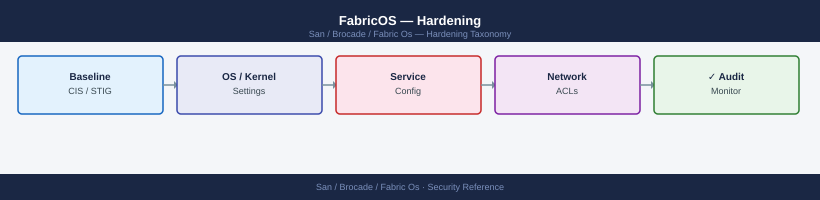

---
tags:
  - san
  - security
description: "FabricOS hardening: disabling unused services (Telnet, HTTP), enforcing HTTPS management, SAN zoning strict mode, and security audit policy baseline."
---
# FabricOS — Hardening

<div class="kb-summary">
FabricOS hardening: disabling unused services (Telnet, HTTP), enforcing HTTPS management, SAN zoning strict mode, and security audit policy baseline.

*Applies to: Brocade FOS 9.x*
</div>


---

## Before you begin

- **Access:** Storage admin credentials (cluster admin or equivalent)
- **Change management:** security changes require CAB approval in most environments
- **Rollback plan:** document current state before any security control change
- **Testing:** validate in a non-production environment first where possible

---

## Hardening Sequence — New Switch

```d2
direction: right

start: "New switch deployed" {shape: oval}
proto: "Disable Telnet + HTTP\nEnable HTTPS only" {shape: rectangle}
snmpHarden: "Remove SNMPv1/v2c\nConfigure SNMPv3 SHA+AES" {shape: rectangle}
aaa: "Configure RADIUS / TACACS+\nauthorder RADIUS;LOCAL" {shape: rectangle}
rbac: "Assign RBAC roles\nswitchadmin · zoneadmin · operator" {shape: rectangle}
ipf: "Apply IPfilter policy\nmanagement subnet only" {shape: rectangle}
ntp: "Configure NTP\n2 internal servers" {shape: rectangle}
syslog: "Forward syslog to SIEM\nsyslogadmin --add" {shape: rectangle}
audit: "Enable audit logging\nauditcfg --class 1,2,3,4" {shape: rectangle}
domainId: "Set static domain ID\ninsistDomainId=1" {shape: rectangle}
fabricBinding: "Enable fabric binding\nfabricbinding --enable" {shape: rectangle}
defZone: "Disable default zone\ndefzone --noaccess" {shape: rectangle}
backup: "configupload post-hardening\nto backup server" {shape: rectangle}
cmdb: "Update CMDB\nhostname · serial · domain ID" {shape: rectangle}
done: "Switch production-ready" {shape: rectangle}

start -> proto
proto -> snmpHarden
snmpHarden -> aaa
aaa -> rbac
rbac -> ipf
ipf -> ntp
ntp -> syslog
syslog -> audit
audit -> domainId
domainId -> fabricBinding
fabricBinding -> defZone
defZone -> backup
backup -> cmdb
cmdb -> done
```

### Remove Default SNMP Community Strings

```bash
# Show existing community strings
snmpconfig --show snmpv1

# Remove each community string found
snmpconfig --delete snmpv1 -user public
snmpconfig --delete snmpv1 -user private

# Configure SNMP v3
snmpconfig --set mibCapability
# Follow interactive prompts: user, SHA auth password, AES-128 priv password

# Verify
snmpconfig --show
```


```text title="Expected output"
SNMP v1 Configuration:
  Community String: public
  Access Level: read-write
  Community String: private
  Access Level: read-only

Deleting community string: public
Community string removed successfully.
Deleting community string: private
Community string removed successfully.

Configuring SNMP v3 with MIB capability...
Enter SNMPv3 username: admin
Enter authentication password (SHA): ••••••••••
Confirm authentication password: ••••••••••
Enter privacy password (AES-128): ••••••••••
Confirm privacy password: ••••••••••
SNMPv3 user 'admin' created successfully.

Current SNMP Configuration:
  SNMPv3 User: admin
  Authentication: SHA
  Privacy: AES-128
  MIB Capability: Enabled
```

!!! warning "Common errors"
    | Error | Fix |
    |---|---|
    | `snmpconfig: command not found` | Verify you are logged into the Brocade switch's management interface (SSH/Telnet) and have administrative privileges. |
    | `Error: Community string 'public' not found` | Check the exact community string name using `snmpconfig --show snmpv1` before attempting deletion. |
    | `Error: SNMPv3 user 'admin' already exists` | Use a different username or delete the existing user with `snmpconfig --delete snmpv3 -user admin` first. |
---

## Audit Logging

Audit logging captures all login events, configuration changes, zone modifications, and firmware operations. These logs must be forwarded to the SIEM in real time.

### Enable Audit Logging

```bash
# Enable audit logging — classes:
# 1 = Fabric events (topology changes, domain changes)
# 2 = Security events (logins, policy changes)
# 3 = Configuration events (zone changes, port config)
# 4 = Firmware events (firmware download, HA failover)
auditcfg --class 1,2,3,4

# Verify audit logging is active
auditcfg --show

# View recent audit log entries
auditlog --show

# View last 100 audit entries
auditlog --show -n 100
```


```text title="Expected output"
Audit class configuration updated successfully.
Classes enabled: 1,2,3,4

Audit Logging Status
====================
Audit Classes: 1,2,3,4
Audit Log Size: 10000 entries
Log Rotation: Enabled
Retention Days: 30
Status: Active

Recent Audit Log Entries
========================
2024-01-15 14:32:18 | USER_LOGIN | admin | 10.50.12.45 | Success
2024-01-15 14:28:05 | ZONE_CHANGE | sysadmin | 10.50.12.46 | Added member: 50:00:09:73:00:1a:2b:3c
2024-01-15 14:15:42 | POLICY_UPDATE | admin | 10.50.12.45 | Security policy modified
2024-01-15 13:58:19 | PORT_CONFIG | netadmin | 10.50.12.47 | Port 0/12 disabled
2024-01-15 13:45:33 | FABRIC_EVENT | system | local | Domain reconfiguration completed
2024-01-15 13:22:11 | FIRMWARE_DOWNLOAD | admin | 10.50.12.45 | FOS v9.1.0 staged
...

Last 100 Audit Entries (showing first 8):
2024-01-15 14:32:18 | USER_LOGIN | admin | 10.50.12.45 | Success
2024-01-15 14:28:05 | ZONE_CHANGE | sysadmin | 10.50.12.46 | Added member: 50:00:09:73:00:1a:2b:3c
2024-01-15 14:15:42 | POLICY_UPDATE | admin | 10.50.12.45 | Security policy modified
2024-01-15 13:58:19 | PORT_CONFIG | netadmin | 10.50.12.47 | Port 0/12 disabled
2024-01-15 13:45:33 | FABRIC_EVENT | system | local | Domain reconfiguration completed
2024-01-15 13:22:11 | FIRMWARE_DOWNLOAD | admin | 10.50.12.45 | FOS v9.1.0 staged
2024-01-15 13:01:47 | USER_LOGOUT | sysadmin | 10.50.12.46 | Session closed
2024-01-15 12:48:22 | ZONE_CHANGE | admin | 10.50.12.45 | Removed member: 50:00:09:73:00:1a:2b:3d
```

!!! warning "Common errors"
    | Error | Fix |
    |---|---|
    | `Error: Invalid audit class specified` | Verify class numbers are 1–4 and separated by commas with no spaces (e.g., `--class 1,2,3,4`). |
    | `Error: Audit log is full. Cannot write new entries` | Increase log retention or manually clear old entries with `auditlog --clear` to free space. |
    | `Error: Permission denied` | Ensure your user account has admin or security-admin role; use `userconfig --show` to verify permissions. |
### Configure Syslog Forwarding

```bash
# Add SIEM syslog destination
syslogadmin --add -ip <siem-ip>

# Verify syslog destinations
syslogadmin --show

# Test by running a command that generates an audit event
# e.g., cfgsave (triggers a zone config save audit event)
# Then check the SIEM for the forwarded log entry
```


```text title="Expected output"
Syslog server added successfully.
IP Address: 192.168.45.120
Facility: local0
Severity: informational
Status: enabled

Syslog Destinations:
=====================================
IP Address       | Port | Facility | Severity      | Status
=====================================
192.168.45.120   | 514  | local0   | informational | enabled
192.168.45.121   | 514  | local0   | informational | enabled

Zone configuration saved.
cfgsave: Configuration saved successfully to flash memory.
```

!!! warning "Common errors"
    | Error | Fix |
    |---|---|
    | `Syslog server add failed: Invalid IP address format` | Verify the SIEM IP address is in valid dotted-decimal notation (e.g., 192.168.45.120) and rerun the command. |
    | `Syslog server add failed: Connection timeout to <siem-ip>:514` | Confirm the SIEM host is reachable on port 514 and that firewall rules permit syslog traffic from the switch. |
    | `cfgsave: Permission denied` | Ensure your user account has admin or zone-config privileges by checking role assignments with `userconfig --show`. |
### Syslog Facility and Severity

Brocade FabricOS sends syslog at facility `LOCAL1` (by default). Configure the SIEM to accept and parse this facility. Log format includes:

```text
<timestamp> <switch-hostname> RASLOG: <severity> [<module>/<id>] <message>
```

Severity levels map to standard syslog levels: `CRITICAL`, `ERROR`, `WARNING`, `INFO`, `DEBUG`.

---

## Default Zone Enforcement

The default zone controls what happens to devices that are not in any active zone. It must be disabled (set to `off`) in all production fabrics. If the default zone is `on`, devices not in any zone can see all other unzoned devices — a significant security risk.

```bash
# Check default zone state
defzone --show

# Disable the default zone (recommended for all production fabrics)
defzone --noaccess

# Activate and save
cfgenable <active-zoneset>
cfgsave

# Verify
defzone --show    # Expected: Default Zone: OFF (no access)
```


```text title="Expected output"
Default Zone: ON (all access)
Default Zone: OFF (no access)
(no output — command completes silently)
(no output — command completes silently)
Default Zone: OFF (no access)
```

!!! warning "Common errors"
    | Error | Fix |
    |---|---|
    | `defzone: command not found` | Ensure you are logged into the Brocade switch via SSH or telnet and have administrative privileges; defzone is a switch-native command, not a Linux utility. |
    | `Error: Active zone configuration not found` | Run `cfgshow` to list available zone configurations and replace `<active-zoneset>` with a valid configuration name (e.g., `cfgenable production-zones`). |
    | `Permission denied: cannot modify zone configuration` | Verify your user account has admin or zone-admin role by running `userconfig --show` and request elevated privileges if needed. |
---

## Security Baselines Summary

| Control | Standard | Command |
|---|---|---|
| Management CLI | SSH only; Telnet disabled | `sshutil --show` |
| Web management | HTTPS only; HTTP disabled | `httpcfg --show` |
| SNMP | SNMPv3 (SHA + AES-128); no v1/v2c | `snmpconfig --show` |
| RADIUS/TACACS+ | Primary auth; local as fallback only | `aaaconfig --show` |
| Local admin | Unique password in vault; break-glass only | Vault policy |
| IPfilter | Management subnet restriction | `ipfilter --show` |
| Audit logging | Classes 1–4 enabled; forwarded to SIEM | `auditcfg --show` |
| Syslog | Forwarded to SIEM | `syslogadmin --show` |
| NTP | Two internal servers; synced | `tsclockserver` |
| Default zone | Disabled (`off`) | `defzone --show` |
| Fabric binding | Enabled | `fabricbinding --show` |
| Static domain ID | Set and documented | `switchshow \| grep Domain` |

---

## Post-Hardening Verification

Run this sequence after completing hardening to verify all controls are applied:

```bash
# 1. Management protocols
sshutil --show        # telnetd disabled
httpcfg --show        # HTTP disabled; HTTPS enabled
snmpconfig --show     # SNMPv3 configured; no community strings

# 2. Authentication
aaaconfig --show      # RADIUS configured; auth order includes LOCAL fallback

# 3. Network access control
ipfilter --show       # Active policy restricting management plane

# 4. Fabric security
defzone --show        # Default zone off (no access)
fabricbinding --show  # Fabric binding enabled

# 5. Audit and logging
auditcfg --show       # Audit classes 1,2,3,4 enabled
syslogadmin --show    # SIEM syslog destination configured

# 6. NTP
tsclockserver         # NTP servers configured
date                  # Clock is synced (matches expected time)

# 7. Domain ID
switchshow | grep Domain    # Static domain ID matches SAN design register
```


```text title="Expected output"
SSH Enabled: No
Telnet Enabled: No
HTTP Enabled: No
HTTPS Enabled: Yes
HTTPS Port: 443

SNMP Version: SNMPv3
Community Strings: None configured
Engine ID: 800007E5-7D2A4B9C-F1E3-92D6

Authentication Order: RADIUS, LOCAL
RADIUS Server: 192.168.100.50
RADIUS Timeout: 30 seconds

IP Filter Policy: ACTIVE
Restricted Management IPs: 10.0.1.0/24, 10.0.2.0/24

Default Zone: OFF
Fabric Binding: ENABLED

Audit Classes Enabled: 1, 2, 3, 4
Syslog Server: 10.50.200.15:514
Syslog Protocol: UDP

NTP Server 1: 10.0.0.1
NTP Server 2: 10.0.0.2
NTP Status: synchronized

Domain ID: 117 (Static)
```

!!! warning "Common errors"
    | Error | Fix |
    |---|---|
    | `RADIUS server unreachable: timeout after 30s` | Verify RADIUS server 192.168.100.50 is online and accessible on port 1812, then test with `aaaconfig --test`. |
    | `Syslog connection failed: Connection refused on 10.50.200.15:514` | Confirm the SIEM syslog listener is running and firewall rules permit traffic from the switch to that destination. |
    | `NTP: unsynchronized, stratum 16` | Check NTP server reachability with `ping 10.0.0.1` and verify the switch can reach port 123 UDP; resync with `tsclockserver --sync`. |
Take a configuration backup after completing verification:

```bash
cfgsave
configupload -all -scp -host <backup-server> -u <user> -f /backups/brocade/<switch>_post-hardening.cfg
```


```text title="Expected output"
Saving configuration to flash memory...
Configuration saved successfully.
Uploading configuration to backup server...
Connecting to 192.168.1.50 as user 'backup_admin'...
Transfer in progress: _post-hardening.cfg
100% complete
Configuration uploaded successfully to /backups/brocade/switch-core-01_post-hardening.cfg
```

!!! warning "Common errors"
    | Error | Fix |
    |---|---|
    | `scp: command not found` | Verify the backup server has SSH/SCP enabled and the switch has network connectivity to it; check firewall rules allowing port 22. |
    | `Authentication failed for user <user>` | Confirm the username and password are correct, and that the backup user account exists on the SCP server with appropriate permissions. |
    | `Permission denied: /backups/brocade/` | Ensure the destination directory exists on the backup server and the SCP user has write permissions to it. |
---

## Periodic Review

Hardening is not a one-time task. Schedule these reviews:

| Review | Frequency | Action |
|---|---|---|
| SNMP password rotation | Quarterly | Rotate auth and priv passwords; update monitoring platform |
| Break-glass password rotation | Quarterly | Rotate local `admin` password; update vault |
| IPfilter policy review | After network changes | Confirm management subnet is still correct |
| Audit log review | Monthly | Review SIEM for unusual login patterns or config changes |
| Firmware currency | Quarterly | Compare installed FOS version against Broadcom release notes |
| CMDB accuracy | After any change | Update switch serial, firmware, port map in CMDB |

---

## See also

- [Fabric Os — Authentication](../authentication/)
- [Fabric Os — Access Control](../access-control/)
- [Fabric Os — Encryption](../encryption/)
