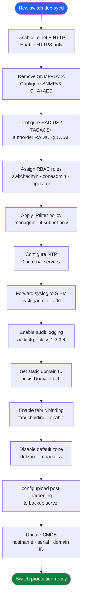

# FabricOS — Hardening


<div class="kb-summary">
> Part of the [Security](../index.md) reference.
</div>

---

## Hardening Sequence — New Switch


```
┌─────────────────────────────── Brocade Fabric OS — Security Hardening ────────────────────────────────┐
│                                                                                                       │
│  Hardening: disable legacy protocols, enforce RBAC, enable security policies, patch FOS.              │
│                                                                                                       │
│   ┌──────────────────────────────────────────────┐  ┌─────────────────────────────────────────────┐   │
│   │         Protocol & Service Hardening         │  │           Account & Auth Hardening          │   │
│   │       Disable Telnet: sshutil disable        │  │          TACACS+ for all admin auth         │   │
│   │        Disable FTP: no sftp fallback         │  │        Remove default admin password        │   │
│   │           Disable HTTP: HTTPS only           │  │       Lockout after 3 failed attempts       │   │
│   │         SNMPv3 only: disable v1/v2c          │  │         Complexity: 10 char + mixed         │   │
│   │         Restrict management IP range         │  │        Expiry: 90-day password policy       │   │
│   └──────────────────────────────────────────────┘  └─────────────────────────────────────────────┘   │
│                                                                                                       │
│  Disable all legacy protocols; enforce TACACS+; limit management access to known IPs.                 │
│                                                                                                       │
│                          ▼                                                 ▼                          │
│                                                                                                       │
│   ┌──────────────────────────────────────────────┐  ┌─────────────────────────────────────────────┐   │
│   │           Fabric Security Policies           │  │         Firmware & Patch Management         │   │
│   │        SCC: restrict switch ISL joins        │  │          FOS patch cycle: quarterly         │   │
│   │          DCC: bind devices to ports          │  │         Check PSIRTs before upgrade         │   │
│   │           DH-CHAP on all ISL ports           │  │        Test upgrade in non-prod first       │   │
│   │           Zoning: deny-by-default            │  │         HA firmware: no-disrupt path        │   │
│   │           MAPS: alert on anomalies           │  │        Rollback plan if upgrade fails       │   │
│   └──────────────────────────────────────────────┘  └─────────────────────────────────────────────┘   │
│                                                                                                       │
│  Physical Infrastructure (the hardware everything above runs on):                                     │
│  Brocade FC switch · dedicated mgmt Ethernet · serial console for recovery                            │
│                                                                                                       │
│  Key terms:                                                                                           │
│                                                                                                       │
│  sshutil         = Fabric OS CLI to enable/disable SSH and Telnet services                            │
│  SCC             = Switch Connection Control; restricts which FC switches can form ISLs               │
│  DCC             = Device Connection Control; binds HBA WWNs to specific switch ports                 │
│  DH-CHAP         = Diffie-Hellman CHAP; authenticates switches before ISL formation                   │
│  MAPS            = Monitoring and Alerting Policy Suite; threshold-based anomaly detection            │
│  PSIRT           = Product Security Incident Response Team advisory; vendor security bulletin         │
│  HA firmware     = non-disruptive FOS upgrade; active CP reboots while standby takes over             │
│  SNMPv3          = SNMP v3; authentication (MD5/SHA) + privacy (AES) mode required                    │
│  Deny-by-default = zone policy: traffic allowed only if explicitly zoned together                     │
│  TACACS+         = centralised CLI auth; all switch admin commands audited centrally                  │
│  Lockout policy  = account locked after N failed logins; unlocked by admin or timeout                 │
│  IP whitelist    = management source IP restriction; configured via acp filter command                │
│                                                                                                       │
└───────────────────────────────────────────────────────────────────────────────────────────────────────┘
```

### Remove Default SNMP Community Strings

```bash
# Show existing community strings
snmpconfig --show snmpv1

# Remove each community string found
snmpconfig --delete snmpv1 -user public
snmpconfig --delete snmpv1 -user private

# Configure SNMP v3
snmpconfig --set mibCapability
# Follow interactive prompts: user, SHA auth password, AES-128 priv password

# Verify
snmpconfig --show
```

---

## Audit Logging

Audit logging captures all login events, configuration changes, zone modifications, and firmware operations. These logs must be forwarded to the SIEM in real time.

### Enable Audit Logging

```bash
# Enable audit logging — classes:
# 1 = Fabric events (topology changes, domain changes)
# 2 = Security events (logins, policy changes)
# 3 = Configuration events (zone changes, port config)
# 4 = Firmware events (firmware download, HA failover)
auditcfg --class 1,2,3,4

# Verify audit logging is active
auditcfg --show

# View recent audit log entries
auditlog --show

# View last 100 audit entries
auditlog --show -n 100
```

### Configure Syslog Forwarding

```bash
# Add SIEM syslog destination
syslogadmin --add -ip <siem-ip>

# Verify syslog destinations
syslogadmin --show

# Test by running a command that generates an audit event
# e.g., cfgsave (triggers a zone config save audit event)
# Then check the SIEM for the forwarded log entry
```

### Syslog Facility and Severity

Brocade FabricOS sends syslog at facility `LOCAL1` (by default). Configure the SIEM to accept and parse this facility. Log format includes:

```text
<timestamp> <switch-hostname> RASLOG: <severity> [<module>/<id>] <message>
```

Severity levels map to standard syslog levels: `CRITICAL`, `ERROR`, `WARNING`, `INFO`, `DEBUG`.

---

## Default Zone Enforcement

The default zone controls what happens to devices that are not in any active zone. It must be disabled (set to `off`) in all production fabrics. If the default zone is `on`, devices not in any zone can see all other unzoned devices — a significant security risk.

```bash
# Check default zone state
defzone --show

# Disable the default zone (recommended for all production fabrics)
defzone --noaccess

# Activate and save
cfgenable <active-zoneset>
cfgsave

# Verify
defzone --show    # Expected: Default Zone: OFF (no access)
```

---

## Security Baselines Summary

| Control | Standard | Command |
|---|---|---|
| Management CLI | SSH only; Telnet disabled | `sshutil --show` |
| Web management | HTTPS only; HTTP disabled | `httpcfg --show` |
| SNMP | SNMPv3 (SHA + AES-128); no v1/v2c | `snmpconfig --show` |
| RADIUS/TACACS+ | Primary auth; local as fallback only | `aaaconfig --show` |
| Local admin | Unique password in vault; break-glass only | Vault policy |
| IPfilter | Management subnet restriction | `ipfilter --show` |
| Audit logging | Classes 1–4 enabled; forwarded to SIEM | `auditcfg --show` |
| Syslog | Forwarded to SIEM | `syslogadmin --show` |
| NTP | Two internal servers; synced | `tsclockserver` |
| Default zone | Disabled (`off`) | `defzone --show` |
| Fabric binding | Enabled | `fabricbinding --show` |
| Static domain ID | Set and documented | `switchshow \| grep Domain` |

---

## Post-Hardening Verification

Run this sequence after completing hardening to verify all controls are applied:

```bash
# 1. Management protocols
sshutil --show        # telnetd disabled
httpcfg --show        # HTTP disabled; HTTPS enabled
snmpconfig --show     # SNMPv3 configured; no community strings

# 2. Authentication
aaaconfig --show      # RADIUS configured; auth order includes LOCAL fallback

# 3. Network access control
ipfilter --show       # Active policy restricting management plane

# 4. Fabric security
defzone --show        # Default zone off (no access)
fabricbinding --show  # Fabric binding enabled

# 5. Audit and logging
auditcfg --show       # Audit classes 1,2,3,4 enabled
syslogadmin --show    # SIEM syslog destination configured

# 6. NTP
tsclockserver         # NTP servers configured
date                  # Clock is synced (matches expected time)

# 7. Domain ID
switchshow | grep Domain    # Static domain ID matches SAN design register
```

Take a configuration backup after completing verification:

```bash
cfgsave
configupload -all -scp -host <backup-server> -u <user> -f /backups/brocade/<switch>_post-hardening.cfg
```

---

## Periodic Review

Hardening is not a one-time task. Schedule these reviews:

| Review | Frequency | Action |
|---|---|---|
| SNMP password rotation | Quarterly | Rotate auth and priv passwords; update monitoring platform |
| Break-glass password rotation | Quarterly | Rotate local `admin` password; update vault |
| IPfilter policy review | After network changes | Confirm management subnet is still correct |
| Audit log review | Monthly | Review SIEM for unusual login patterns or config changes |
| Firmware currency | Quarterly | Compare installed FOS version against Broadcom release notes |
| CMDB accuracy | After any change | Update switch serial, firmware, port map in CMDB |
