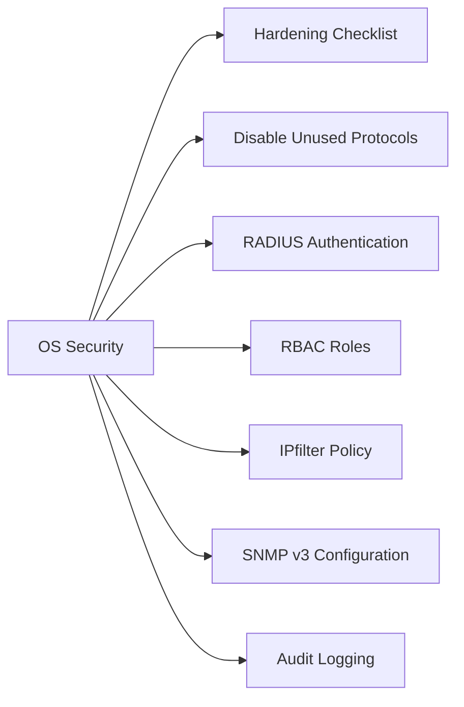

# Brocade Fabric OS Security

> Part of the [Brocade Fabric OS](../) reference.

---



## Hardening Checklist

- [ ] Telnet and HTTP disabled; SSH and HTTPS only
- [ ] Root account password changed; stored in vault; break-glass use only
- [ ] RADIUS configured pointing to Active Directory; local accounts as fallback only
- [ ] RBAC roles assigned — `switchadmin` for ops, `zoneadmin` for zoning-only changes
- [ ] IPfilter policy restricting management plane access to approved management subnet
- [ ] SNMP v3 configured; default community strings removed
- [ ] Audit logging (`auditlog`) enabled and forwarded to SIEM
- [ ] NTP configured and synced (required for log correlation and certificate-based auth)
- [ ] Password policy enforced: minimum length, complexity, expiry

---

## Disable Unused Protocols

```bash
# Disable Telnet
portdisable telnet
# Or via configure
configure
# At "Secure mode" prompt: enable

# Disable HTTP (enable HTTPS only)
httpd --disable   # Disables the web server
httpcfg --set -https 1  # Enable HTTPS

# Verify active services
portshow   # Review management service ports
```

---

## RADIUS Authentication

```bash
# Configure RADIUS server
aaaconfig --add <radius-server-ip> -conf radius -p <port> -s <shared-secret>

# Set authentication order: RADIUS primary, local fallback
aaaconfig --authorder RADIUS;LOCAL

# Verify RADIUS is configured
aaaconfig --show

# Test RADIUS authentication
aaaconfig --validate -user <test-user>
```

**Local fallback account** — retain the local `admin` account as break-glass. Store the password in the enterprise vault.

---

## RBAC Roles

| Role | Access |
|---|---|
| admin | Full switch access — config, firmware, certificates |
| switchadmin | Switch operations — port management, diagnostics |
| zoneadmin | Zoning changes only — cannot modify switch config |
| fabricadmin | Fabric-level operations |
| operator | Read-only — show commands only |
| user | Very limited view access |

```bash
# Assign a role to a local user
userconfig --add <username> -r zoneadmin -p <password>

# View current user accounts and roles
userconfig --show
```

RADIUS-authenticated users receive their role from the RADIUS server via the `Foundry-User-Priv` AV-pair or the configured role-mapping on the switch.

---

## IPfilter Policy

IPfilter restricts which source IP addresses can connect to the switch management plane.

```bash
# Create an IPfilter policy
ipfilter --create mgmt_policy -type ipv4

# Add rules to allow management subnet only
ipfilter --addrule mgmt_policy -sip <mgmt-subnet>/<prefix> -dp 22 -proto tcp -act permit    # SSH
ipfilter --addrule mgmt_policy -sip <mgmt-subnet>/<prefix> -dp 443 -proto tcp -act permit   # HTTPS
ipfilter --addrule mgmt_policy -sip <snmp-server-ip>/32 -dp 161 -proto udp -act permit      # SNMP
ipfilter --addrule mgmt_policy -sip 0.0.0.0/0 -dp 0 -proto any -act deny                   # Default deny

# Save and activate the policy
ipfilter --save mgmt_policy
ipfilter --activate mgmt_policy

# Verify
ipfilter --show mgmt_policy
```

---

## SNMP v3 Configuration

```bash
# Configure SNMP v3 interactively
snmpconfig --set mibCapability
# Follow prompts to configure:
# - User name
# - Authentication type: SHA
# - Authentication password
# - Privacy type: AES-128
# - Privacy password
# - Access level: readOnly or readWrite

# Verify SNMP configuration
snmpconfig --show
```

---

## Audit Logging

```bash
# Enable audit logging
auditcfg --class 1,2,3,4   # Log zone changes (3), security events (2), firmware (4), fabric (1)

# View recent audit log entries
auditlog --show

# Forward audit log via syslog
syslogadmin --add -ip <siem-ip>

# Verify syslog configuration
syslogadmin --show
```
