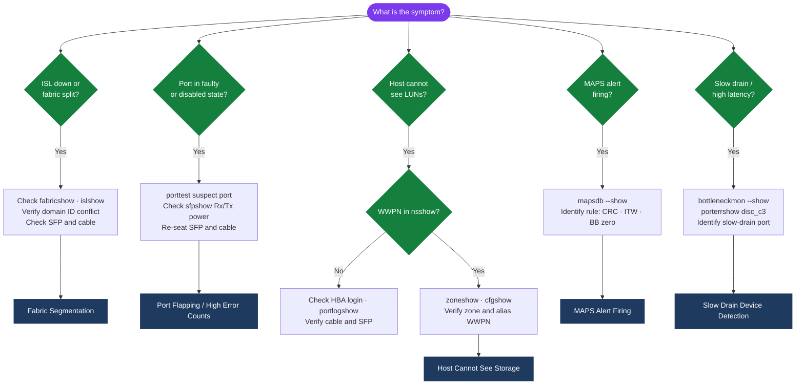
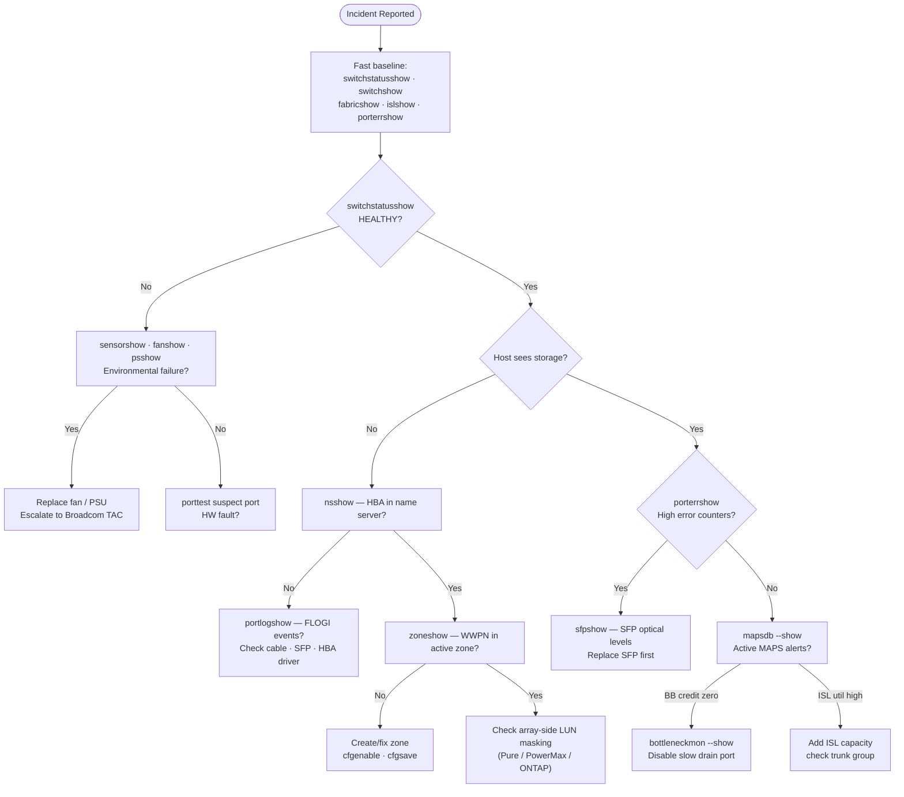

---
tags:
  - san
  - troubleshooting
search:
  boost: 1.5
---
# FabricOS — Common Issues


<div class="kb-summary">
FabricOS troubleshooting: `porterrshow`, `portlogdump`, `errshow`, ISL link bounce causes, zone merge conflicts, and escalation to Brocade TAC.

*Applies to: Brocade FOS 9.x*
</div>

---

## Diagnostic Flow



---

## Before you begin

- **Access:** Storage admin credentials (cluster admin or equivalent)
- **Gather first:** recent error message text, event timestamps, and affected object names
- **Scope:** confirm whether the issue affects a single object, host, cluster, or site
- **Escalation:** open a vendor support ticket before running any destructive step
- **Logging:** document each command and output — required if escalation is needed

---

## Incident Triage Decision Tree


```text
┌────────────────────────── Brocade Fabric OS — Troubleshooting Common Issues ──────────────────────────┐
│                                                                                                       │
│  Common Fabric OS issues: ISL bounce, zone merge fail, port offline, MAPS alerts, login err.          │
│                                                                                                       │
│   ┌──────────────────────────────────────────────┐  ┌─────────────────────────────────────────────┐   │
│   │             ISL & Fabric Issues              │  │             Port & Login Issues             │   │
│   │         ISL bounce: check SFP/cable          │  │        Port offline: portenable check       │   │
│   │         Zone merge conflict: cfgshow         │  │         nsshow: device not logged in        │   │
│   │       Fabric split: check E_Port state       │  │        CRC errors: replace SFP/cable        │   │
│   │        DH-CHAP fail: secret mismatch         │  │         Speed mismatch: portcfgspeed        │   │
│   │       Domain conflict: isolate switch        │  │          F_Port G_Port state error          │   │
│   └──────────────────────────────────────────────┘  └─────────────────────────────────────────────┘   │
│                                                                                                       │
│  ISL and zone issues affect whole fabric; port and login issues affect specific devices.              │
│                                                                                                       │
│                          ▼                                                 ▼                          │
│                                                                                                       │
│   ┌──────────────────────────────────────────────┐  ┌─────────────────────────────────────────────┐   │
│   │          Performance & MAPS Issues           │  │             Firmware & Recovery             │   │
│   │        MAPS: threshold exceeded alert        │  │          firmwareshow: mismatch VER         │   │
│   │        Credit starvation: BB credits         │  │         HA reboot: trigger failover         │   │
│   │          Utilisation: portperfshow           │  │          supportshow for TAC bundle         │   │
│   │         FCIP tunnel congestion drop          │  │         Factory reset: switchdisable        │   │
│   │         Queue depth: host HBA adjust         │  │        Serial console: recovery boot        │   │
│   └──────────────────────────────────────────────┘  └─────────────────────────────────────────────┘   │
│                                                                                                       │
│  Physical Infrastructure (the hardware everything above runs on):                                     │
│  Brocade FC switch · SFP transceivers · FC cables · management Ethernet · serial console              │
│                                                                                                       │
│  Key terms:                                                                                           │
│                                                                                                       │
│  ISL             = Inter-Switch Link; E_Port connection between FC switches                           │
│  Zone merge      = zone database conflict between two fabrics joining; requires resolve               │
│  CRC error       = Cyclic Redundancy Check error on FC frame; indicates bad SFP/cable                 │
│  BB credits      = Buffer-to-Buffer credits; flow control for FC frames between switches              │
│  Credit starvation= receiver has no BB credits; sender must pause; causes latency                     │
│  MAPS            = Monitoring and Alerting Policy Suite; rule-based threshold alerting                │
│  portperfshow    = CLI to display per-port throughput and error counters                              │
│  nsshow          = Name Server show; lists all devices logged into the local switch                   │
│  DH-CHAP fail    = ISL authentication failure; both switches must share same secret                   │
│  Domain conflict = two switches with same domain ID; isolate and renumber one                         │
│  supportshow     = generates full diagnostic tech-support bundle for TAC upload                       │
│  HA reboot       = High Availability failover; active CP reboots to standby CP                        │
│                                                                                                       │
└───────────────────────────────────────────────────────────────────────────────────────────────────────┘
```

**Resolution steps:**

1. Confirm SFP is fully seated — remove and re-seat if in doubt.
2. Check the cable at both ends — particularly if the port was recently cabled.
3. For `No_Light`: no optical signal is reaching the switch. Check the remote end — HBA or storage controller — is powered and the port is enabled.
4. For `Offline (Admin)`: the port was administratively disabled. Enable it:
   ```bash
   portpersistentenable <slot/port>   # persistent enable (survives reboot)
   portenable <slot/port>             # temporary enable only
   ```
5. If the SFP shows `Alarm` or `Warning` on receive power, the SFP or cable is degraded — replace SFP first.
6. If the port still does not come online after re-seating SFP and verifying cable, run a port diagnostic:
   ```bash
   portdisable <slot/port>
   porttest <slot/port>    # internal loopback test — pass = switch port hardware is OK
   portenable <slot/port>
   ```

---

## Host Cannot See Storage (LUN Access Failure)

**Symptoms:** A host HBA is logged into the fabric (visible in `nsshow`) but cannot see any LUNs on the storage array. Host multipath shows 0 paths.

**Triage:**

```bash
# Confirm host HBA WWPN is logged into the name server
nsshow | grep <partial-wwpn>
nsallshow               # Check across all domains in the fabric

# Check the zone the host is in
zoneshow | grep <alias-or-wwpn>

# Confirm the zone is in the active configuration
cfgshow | grep <zone-name>

# Check that alias WWPNs match actual logged-in WWPNs
alishow | grep <alias-name>
nsshow | grep <expected-wwpn>
```

**Common causes and fixes:**

| Cause | Fix |
|---|---|
| Host WWPN not in any zone | Create alias and zone; `cfgenable` |
| Zone not in active zone set | `cfgadd <cfgname> <zone>; cfgenable <cfgname>; cfgsave` |
| Alias WWPN does not match actual host WWPN | Delete alias, recreate with correct WWPN from `nsshow` |
| Wrong zone set active | `cfgenable <correct-zoneset>; cfgsave` |
| FLOGI not completed | Check HBA driver and port state; `portlogshow` for FLOGI events |
| Zoning is correct but array has not presented LUNs | Check array-side masking (Unisphere, Pure, ONTAP) |

If the host WWPN is missing from `nsshow`, the issue is at the physical or login layer — not a zoning problem. Check the port the HBA is connected to:

```bash
switchshow | grep <slot/port>     # confirm port is Online
portshow <slot/port>              # confirm logged-in WWN matches host HBA
portlogshow <slot/port>           # look for FLOGI, PLOGI events
```

---

## Port Flapping / High Error Counts

**Symptoms:** A port repeatedly toggles between `Online` and `No_Light` or `No_Sync`. `porterrshow` shows incrementing `loss_sync`, `loss_sig`, or `enc_in` counters.

**Triage:**

```bash
# Check error counters — note which counters are incrementing
porterrshow
portstatsshow <slot/port>

# Check SFP optical levels — Tx and Rx power
sfpshow <slot/port>

# Check port event log — timestamps of link events
portlogshow <slot/port>

# Check port configuration
portcfgshow <slot/port>
```

**Resolution steps:**

1. Replace the SFP on the switch port first — SFPs are the most common cause of signal quality errors.
2. If the error rate does not drop after SFP replacement, replace the cable.
3. If the remote end is a storage array or server, check the HBA SFP and the host port is configured for the correct speed (do not mix auto-negotiate with fixed speed on ISLs).
4. Clean fibre connectors with appropriate fibre cleaning kit — dust contamination causes intermittent errors.
5. If errors continue after SFP and cable replacement, disable the port and run `porttest` to verify switch hardware:
   ```bash
   portdisable <slot/port>
   porttest <slot/port>
   ```
6. If `porttest` fails, the switch port itself may be faulty — escalate to Broadcom TAC and open a hardware SR.

---

## Fabric Segmentation

**Symptoms:** `fabricshow` shows fewer switches than expected. One or more switches are missing. Some hosts or storage targets are unreachable.

**Triage:**

```bash
# Check for segmented domains
fabricshow            # Missing domain IDs indicate segmentation

# Check ISL state
islshow               # Is the ISL between the affected switch and the fabric down?

# Confirm ISL port state
switchshow | grep E_Port

# Check for domain ID conflict — duplicate domain IDs cause segmentation
fabricshow            # Look for two entries with the same domain ID
switchshow | grep Domain

# Check for E_Port isolation
portshow <isl-port>   # Look for "Disabled (Incompatible)" or "E_Port Isolated"
portlogshow <isl-port>
```

**Common causes and fixes:**

| Cause | Fix |
|---|---|
| ISL cable disconnected or SFP failed | Restore physical connection; check SFP |
| Domain ID conflict | Change one switch's domain ID (`configure`), reconnect ISL |
| Fabric parameters mismatch (BB credit, trunking) | Match fabric parameters on both switches |
| Zone database conflict | Run `cfgtransabort` on both switches, then re-merge |
| Secure Fabric OS policy rejection | Check `secpolicyshow SCC_POLICY` — new switch may be blocked |

If a switch is isolated with domain ID conflict:

```bash
# On the isolated switch — set a unique domain ID before reconnecting
configure
# At "Fabric parameters" prompt: set insistDomainId = 1
# At "Domain:" prompt: enter the unique domain ID assigned in the SAN design register
# Reconnect the ISL cable — the switch should re-join
fabricshow    # Confirm the switch appears with the new domain ID
```

---

## Principal Switch Changed Unexpectedly

**Symptoms:** `fabricshow` shows a different switch has been elected as principal. This may be accompanied by a brief fabric disruption and re-registration of devices.

**Triage:**

```bash
# Identify current principal switch (marked with >)
fabricshow

# Check domain priority on all switches
switchshow | grep Priority

# Review fabric event log
rasshow -l 100
```

**Cause:** The previous principal switch went offline (reboot, power loss, ISL failure), triggering a new principal election. The switch with the highest priority (lowest priority value) or lowest WWN becomes the new principal.

**Resolution:**

1. Identify which switch should be the permanent principal — typically the core director.
2. Set the principal priority explicitly:
   ```bash
   fabricprincipal --priority 1 --enable   # run on the intended principal switch
   ```
3. To force a re-election (requires brief fabric disruption), disable and re-enable the E_Ports on the current unwanted principal.
4. Document the intended principal switch in the SAN design register.

---

## Zone Change Not Persisting After Reboot

**Symptom:** Zoning changes made during a maintenance window are missing after a switch reboot.

**Cause:** `cfgenable` was run to activate the zone set, but `cfgsave` was not run to persist the zone database to flash storage.

**Fix:**

```bash
# Confirm what is currently active
cfgshow | head -20

# Re-apply the correct zone set from the working buffer
cfgenable <zoneset-name>

# Save to flash — mandatory after every cfgenable
cfgsave
```

Prevent this in future: always include `cfgsave` in zoning SOPs and verify the zone database was saved before closing the change window.

---

## MAPS Alert Firing

**Symptoms:** SANnav or SNMP trap shows a MAPS threshold alert — typically for port errors, ISL utilization, or switch health.

**Triage:**

```bash
# Show current MAPS dashboard
mapsdashboard --show

# Show recent MAPS alerts and which rule triggered
mapsdb --show

# Show MAPS policy in use
mapspolicy --show

# Show MAPS rule thresholds
mapsrule --show
```

**Common MAPS alerts and actions:**

| Alert | Meaning | Action |
|---|---|---|
| CRC error threshold | CRC errors on a port exceeded policy limit | `sfpshow`; replace SFP or cable |
| ITW (Invalid Transmission Word) | Signal quality errors | Replace SFP; check cable integrity |
| State change (port flap) | Port toggled online/offline multiple times | Investigate SFP and cable |
| BB credit zero | Buffer-to-buffer credits exhausted (slow drain) | Identify slow drain device; check `portbufshow` |
| ISL utilization | ISL above configured bandwidth threshold | Add ISL capacity; check for slow drain |
| Fan / PSU / temperature | Environmental failure | Physical investigation; replacement if failed |

---

## Slow Drain Device Detection

**Symptoms:** High I/O latency reported by hosts. `islshow` shows ISL utilization is high. Some ports show C3 discards (`disc_c3` in `portstatsshow`).

A slow drain device is a host or storage port that is not consuming FC frames fast enough, causing buffer credit starvation upstream. This can cascade across the fabric.

**Triage:**

```bash
# Check C3 discards — indicates congestion (frames dropped waiting for credits)
porterrshow | grep disc_c3

# Check BB credit status on suspect ports
portbufshow <slot/port>

# Identify bottleneck — which port is generating zero-credit conditions
bottleneckmon --show

# Check ISL utilization
islshow
portperfshow
```

**Resolution:**

1. Identify the specific port showing zero BB credits or highest C3 discards.
2. The device connected to that port is likely the slow drain device.
3. Disable the slow drain device's port temporarily if it is causing fabric-wide impact:
   ```bash
   portdisable <slot/port>    # isolate the problematic port
   ```
4. Check the slow drain device (HBA, storage controller) — look for driver issues, queue depth misconfiguration, or resource exhaustion.
5. Enable MAPS slow drain policy to automatically detect and quarantine future slow drain events.

---

## Switch Showing MARGINAL Status

**Symptoms:** `switchstatusshow` returns `MARGINAL` instead of `HEALTHY`.

```bash
# Show why the switch is marginal
switchstatusshow      # Check which component is in warning state
errshow               # Review error log for hardware events
sensorshow            # Check all environmental sensors
fanshow               # Fan status
psshow                # Power supply status
tempshow              # Temperature thresholds
```

**Common causes:**

| Cause | Action |
|---|---|
| Fan failure | Replace fan module; escalate if dual redundant fans fail |
| PSU failure | Check power input to PSU; replace if faulty |
| High temperature | Check data centre cooling; verify airflow around chassis |
| Port in Faulty state | `porttest` to isolate; replace blade if hardware fault confirmed |
| SFP alarm | Replace affected SFP |

A `MARGINAL` status should not be left unresolved. Escalate to Broadcom TAC if hardware replacement is required.

---

## Known Issues

Document operational known issues here as they are encountered. Include:

- FOS version affected
- Symptom and trigger
- Brocade Field Notice or defect reference
- Workaround and resolution path

---

## Verify resolution

- Confirm the original symptom no longer occurs
- Check logs for any residual errors related to the issue
- Monitor for 10–15 minutes to confirm the fix is stable

---

## See also

- [Fabric Os — Diagnostics](diagnostics/)
- [Fabric Os — Escalation](escalation/)
- [Fabric Os — Health Checks](../operations/health-checks/)
