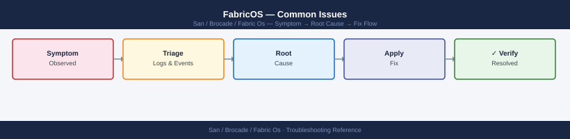

---
tags:
  - san
  - troubleshooting
search:
  boost: 1.5
description: "FabricOS troubleshooting: porterrshow, portlogdump, errshow, ISL link bounce causes, zone merge conflicts, and escalation to Brocade TAC."
---
# FabricOS — Common Issues

<div class="kb-summary">
FabricOS troubleshooting: `porterrshow`, `portlogdump`, `errshow`, ISL link bounce causes, zone merge conflicts, and escalation to Brocade TAC.

*Applies to: Brocade FOS 9.x*
</div>


---

```d2
direction: down

symptom: Identify Symptom {shape: diamond}
diagnostic_flow: "Diagnostic Flow" {shape: rectangle}
incident_triage_decision_tree: "Incident Triage Decision Tree" {shape: rectangle}
host_cannot_see_storage_lun_access_f: "Host Cannot See Storage (LUN Access Failure)" {shape: rectangle}
port_flapping_high_error_counts: "Port Flapping / High Error Counts" {shape: rectangle}
fabric_segmentation: "Fabric Segmentation" {shape: rectangle}
principal_switch_changed_unexpectedl: "Principal Switch Changed Unexpectedly" {shape: rectangle}
resolution: Resolve or Escalate {shape: oval}

symptom -> diagnostic_flow: investigate
symptom -> incident_triage_decision_tree: investigate
symptom -> host_cannot_see_storage_lun_access_f: investigate
symptom -> port_flapping_high_error_counts: investigate
symptom -> fabric_segmentation: investigate
symptom -> principal_switch_changed_unexpectedl: investigate
diagnostic_flow -> resolution
incident_triage_decision_tree -> resolution
host_cannot_see_storage_lun_access_f -> resolution
port_flapping_high_error_counts -> resolution
fabric_segmentation -> resolution
principal_switch_changed_unexpectedl -> resolution
```

## Diagnostic Flow

```d2
direction: right

A: "A" {shape: rectangle}
A1: "Check fabricshow · islshow\nVerify domain ID conflict\nCheck SFP and cable" {shape: rectangle}
A2: "Fabric Segmentation" {shape: rectangle}
B: "B" {shape: rectangle}
B1: "porttest suspect port\nCheck sfpshow Rx/Tx power\nRe-seat SFP and cable" {shape: rectangle}
B2: "Port Flapping / High Error Counts" {shape: rectangle}
C1: "C1" {shape: rectangle}
C2: "Check HBA login · portlogshow\nVerify cable and SFP" {shape: rectangle}
C3: "zoneshow · cfgshow\nVerify zone and alias WWPN" {shape: rectangle}
C4: "Host Cannot See Storage" {shape: rectangle}
D: "D" {shape: rectangle}
D1: "mapsdb --show\nIdentify rule: CRC · ITW · BB zero" {shape: rectangle}
D2: "MAPS Alert Firing" {shape: rectangle}
E: "E" {shape: rectangle}
E1: "bottleneckmon --show\nporterrshow disc_c3\nIdentify slow-drain port" {shape: rectangle}
E2: "Slow Drain Device Detection" {shape: rectangle}
S: "What is the symptom?" {shape: rectangle}
C: "C" {shape: rectangle}

A -> A1
A1 -> A2
B -> B1
B1 -> B2
C1 -> C2
C1 -> C3
C3 -> C4
D -> D1
D1 -> D2
E -> E1
E1 -> E2
```

---

## Before you begin

- **Access:** Storage admin credentials (cluster admin or equivalent)
- **Gather first:** recent error message text, event timestamps, and affected object names
- **Scope:** confirm whether the issue affects a single object, host, cluster, or site
- **Escalation:** open a vendor support ticket before running any destructive step
- **Logging:** document each command and output — required if escalation is needed

---

## Incident Triage Decision Tree

```d2
direction: right

incident: "Incident Reported" {shape: rectangle}
baseline: "Fast baseline:\nswitchstatusshow · switchshow\nfabricshow · islshow · porterrshow" {shape: rectangle}
healthy: "switchstatusshow\nHEALTHY?" {shape: rectangle}
hwCheck: "sensorshow · fanshow · psshow\nEnvironmental failure?" {shape: rectangle}
hwAction: "Replace fan / PSU\nEscalate to Broadcom TAC" {shape: rectangle}
portFaulty: "porttest suspect port\nHW fault?" {shape: rectangle}
hostSee: "Host sees storage?" {shape: rectangle}
nsCheck: "nsshow — HBA in name server?" {shape: rectangle}
flogiCheck: "portlogshow — FLOGI events?\nCheck cable · SFP · HBA driver" {shape: rectangle}
zoneCheck: "zoneshow — WWPN in active zone?" {shape: rectangle}
addZone: "Create/fix zone\ncfgenable · cfgsave" {shape: rectangle}
arrayMask: "Check array-side LUN masking\n(Pure / PowerMax / ONTAP" {shape: rectangle}
errCheck: "porterrshow\nHigh error counters?" {shape: rectangle}
sfpCheck: "sfpshow — SFP optical levels\nReplace SFP first" {shape: rectangle}
maps: "mapsdb --show\nActive MAPS alerts?" {shape: rectangle}
slowDrain: "bottleneckmon --show\nDisable slow drain port" {shape: rectangle}
islAdd: "Add ISL capacity\ncheck trunk group" {shape: rectangle}

incident -> baseline
baseline -> healthy
healthy -> hwCheck
hwCheck -> hwAction
hwCheck -> portFaulty
healthy -> hostSee
hostSee -> nsCheck
nsCheck -> flogiCheck
nsCheck -> zoneCheck
zoneCheck -> addZone
zoneCheck -> arrayMask
hostSee -> errCheck
errCheck -> sfpCheck
errCheck -> maps
maps -> slowDrain
maps -> islAdd
```

**Resolution steps:**

1. Confirm SFP is fully seated — remove and re-seat if in doubt.
2. Check the cable at both ends — particularly if the port was recently cabled.
3. For `No_Light`: no optical signal is reaching the switch. Check the remote end — HBA or storage controller — is powered and the port is enabled.
4. For `Offline (Admin)`: the port was administratively disabled. Enable it:
   ```bash
   portpersistentenable <slot/port>   # persistent enable (survives reboot)
   portenable <slot/port>             # temporary enable only
   ```
5. If the SFP shows `Alarm` or `Warning` on receive power, the SFP or cable is degraded — replace SFP first.
6. If the port still does not come online after re-seating SFP and verifying cable, run a port diagnostic:
   ```bash
   portdisable <slot/port>
   porttest <slot/port>    # internal loopback test — pass = switch port hardware is OK
   portenable <slot/port>
   ```

---

## Host Cannot See Storage (LUN Access Failure)

**Symptoms:** A host HBA is logged into the fabric (visible in `nsshow`) but cannot see any LUNs on the storage array. Host multipath shows 0 paths.

**Triage:**

```bash
# Confirm host HBA WWPN is logged into the name server
nsshow | grep <partial-wwpn>
nsallshow               # Check across all domains in the fabric

# Check the zone the host is in
zoneshow | grep <alias-or-wwpn>

# Confirm the zone is in the active configuration
cfgshow | grep <zone-name>

# Check that alias WWPNs match actual logged-in WWPNs
alishow | grep <alias-name>
nsshow | grep <expected-wwpn>
```


```text title="Expected output"
nsshow | grep 50:00:09:73:
50:00:09:73:a2:1b:4c:d1   ; 1,0  ; 50:00:09:73:a2:1b:4c:d1   ; 1,0
50:00:09:73:a2:1b:4c:d2   ; 1,1  ; 50:00:09:73:a2:1b:4c:d2   ; 1,1

nsallshow
Fabric Port Name Identifiers
Domain 1:
50:00:09:73:a2:1b:4c:d1   ; 1,0
50:00:09:73:a2:1b:4c:d2   ; 1,1
50:00:09:73:a2:1b:4c:d3   ; 1,2
Domain 2:
50:00:09:73:b3:2c:5d:e1   ; 2,0
...

zoneshow | grep host-prod-01
zone: host-prod-01-zone
  50:00:09:73:a2:1b:4c:d1
  50:00:09:73:a2:1b:4c:d2
  50:00:09:73:c1:3f:6a:b4

cfgshow | grep host-prod-01-zone
zone: host-prod-01-zone
cfg: prod-fabric-cfg
  host-prod-01-zone

alishow | grep host-hba-01
alias: host-hba-01
  50:00:09:73:a2:1b:4c:d1

nsshow | grep 50:00:09:73:a2:1b:4c:d1
50:00:09:73:a2:1b:4c:d1   ; 1,0  ; 50:00:09:73:a2:1b:4c:d1   ; 1,0
```

!!! warning "Common errors"
    | Error | Fix |
    |---|---|
    | `No matching entries found` | Verify the WWPN is correctly formatted (with colons) and the HBA is actually logged into the fabric by running `nsshow` without grep first. |
    | `zone: <zone-name> not found` | Confirm the zone name is spelled correctly and exists in the fabric configuration by running `zoneshow` to list all zones. |
    | `alias: <alias-name> not found` | Check that the alias name matches exactly what is defined in the configuration; run `alishow` without grep to see all defined aliases. |
**Common causes and fixes:**

| Cause | Fix |
|---|---|
| Host WWPN not in any zone | Create alias and zone; `cfgenable` |
| Zone not in active zone set | `cfgadd <cfgname> <zone>; cfgenable <cfgname>; cfgsave` |
| Alias WWPN does not match actual host WWPN | Delete alias, recreate with correct WWPN from `nsshow` |
| Wrong zone set active | `cfgenable <correct-zoneset>; cfgsave` |
| FLOGI not completed | Check HBA driver and port state; `portlogshow` for FLOGI events |
| Zoning is correct but array has not presented LUNs | Check array-side masking (Unisphere, Pure, ONTAP) |

If the host WWPN is missing from `nsshow`, the issue is at the physical or login layer — not a zoning problem. Check the port the HBA is connected to:

```bash
switchshow | grep <slot/port>     # confirm port is Online
portshow <slot/port>              # confirm logged-in WWN matches host HBA
portlogshow <slot/port>           # look for FLOGI, PLOGI events
```


```text title="Expected output"
switchshow | grep 0/5
 0/5: Online      Fabric  F-Port  20/20   engaged

portshow 0/5
portName:     0/5
portType:     F-Port
portState:    Online
Connected WWN: 50:00:14:40:5d:2a:b1:c3
Speed:        16 Gbps
Frame size:   2048

portlogshow 0/5
[2024/01/15 14:32:18] FLOGI Accept Received
[2024/01/15 14:32:19] PLOGI Accept Received
[2024/01/15 14:32:20] PRLI Accept Received
[2024/01/15 14:33:45] Link Up
```

!!! warning "Common errors"
    | Error | Fix |
    |---|---|
    | `Invalid slot/port number` | Verify the slot and port format matches your switch model (e.g., `0/5` for slot 0, port 5). |
    | `portlogshow: command not found` | Ensure you are logged into the Brocade switch via SSH/telnet and have administrative privileges. |
    | `Port is Offline or No_Light` | Check physical cable connections, SFP transceiver compatibility, and verify the host HBA is powered on and functional. |
---

## Port Flapping / High Error Counts

**Symptoms:** A port repeatedly toggles between `Online` and `No_Light` or `No_Sync`. `porterrshow` shows incrementing `loss_sync`, `loss_sig`, or `enc_in` counters.

**Triage:**

```bash
# Check error counters — note which counters are incrementing
porterrshow
portstatsshow <slot/port>

# Check SFP optical levels — Tx and Rx power
sfpshow <slot/port>

# Check port event log — timestamps of link events
portlogshow <slot/port>

# Check port configuration
portcfgshow <slot/port>
```


```text title="Expected output"
Port Error Statistics:
  Port  0/0: Link Errors: 0, Sync Errors: 0, Signal Errors: 0, Protocol Errors: 0
  Port  0/1: Link Errors: 12, Sync Errors: 3, Signal Errors: 0, Protocol Errors: 0
  Port  0/2: Link Errors: 0, Sync Errors: 0, Signal Errors: 0, Protocol Errors: 0
  Port  0/3: Link Errors: 0, Sync Errors: 0, Signal Errors: 0, Protocol Errors: 0
  Port  1/0: Link Errors: 247, Sync Errors: 89, Signal Errors: 15, Protocol Errors: 2
...

Port Statistics for slot 0, port 1:
  Frames Transmitted: 4,892,156,234
  Frames Received: 4,891,203,847
  Bytes Transmitted: 2,345,678,901,234
  Bytes Received: 2,344,956,123,456
  CRC Errors: 3
  Timeout Discards: 0

SFP Information for slot 0, port 1:
  Vendor: JDSU
  Part Number: QSFP-40G-SR4
  Serial Number: ABC123XYZ789
  Tx Power: -2.1 dBm
  Rx Power: -5.8 dBm
  Temperature: 42°C
  Voltage: 3.28 V

Port Event Log for slot 0, port 1:
  2024-01-15 14:23:47 - Link Up (Speed: 16 Gbps, Topology: F_Port)
  2024-01-15 14:18:12 - Link Down (Reason: Signal Loss)
  2024-01-15 14:17:55 - Sync Loss Detected
  2024-01-15 14:17:42 - Link Up (Speed: 16 Gbps, Topology: F_Port)

Port Configuration for slot 0, port 1:
  Port Name: Storage_Array_01
  Speed: 16 Gbps (Auto-negotiated)
  Enabled: Yes
  Topology: F_Port
  Porttype: F-Port
  State: Online
```

!!! warning "Common errors"
    | Error | Fix |
    |---|---|
    | `Invalid slot/port format` | Use the format `<slot>/<port>` (e.g., `0/1`) and verify the port exists with `switchshow`. |
    | `SFP not present or not supported` | Reseat the SFP transceiver or replace it with a supported model matching your fabric speed. |
    | `Port does not exist` | Confirm the slot and port number are valid for your switch model using `switchshow` output. |
**Resolution steps:**

1. Replace the SFP on the switch port first — SFPs are the most common cause of signal quality errors.
2. If the error rate does not drop after SFP replacement, replace the cable.
3. If the remote end is a storage array or server, check the HBA SFP and the host port is configured for the correct speed (do not mix auto-negotiate with fixed speed on ISLs).
4. Clean fibre connectors with appropriate fibre cleaning kit — dust contamination causes intermittent errors.
5. If errors continue after SFP and cable replacement, disable the port and run `porttest` to verify switch hardware:
   ```bash
   portdisable <slot/port>
   porttest <slot/port>
   ```
6. If `porttest` fails, the switch port itself may be faulty — escalate to Broadcom TAC and open a hardware SR.

---

## Fabric Segmentation

**Symptoms:** `fabricshow` shows fewer switches than expected. One or more switches are missing. Some hosts or storage targets are unreachable.

**Triage:**

```bash
# Check for segmented domains
fabricshow            # Missing domain IDs indicate segmentation

# Check ISL state
islshow               # Is the ISL between the affected switch and the fabric down?

# Confirm ISL port state
switchshow | grep E_Port

# Check for domain ID conflict — duplicate domain IDs cause segmentation
fabricshow            # Look for two entries with the same domain ID
switchshow | grep Domain

# Check for E_Port isolation
portshow <isl-port>   # Look for "Disabled (Incompatible)" or "E_Port Isolated"
portlogshow <isl-port>
```


```text title="Expected output"
Switch Name: fabric-switch-01
Fabric Port Member: 1
Domain ID: 1
Fabric State: Online
Fabric Mode: Native
Fabric Topology: Mesh
Fabric Port Count: 4

ISL Port Statistics:
Port 0: Online
Port 1: Online
Port 2: Online
Port 3: Online

E_Port Status:
  0: E_Port (Online)
  1: E_Port (Online)
  2: E_Port (Online)
  3: E_Port (Online)

Domain ID: 1
Domain ID: 1
Domain ID: 2

portshow 0
portName: 0
portType: E_Port
portState: Online
portStatus: OK
Speed: 16Gb
Enabled: Yes

portlogshow 0
[2024-01-15 14:32:10] Port 0: Link Up
[2024-01-15 14:32:11] Port 0: Speed negotiated to 16Gb
[2024-01-15 14:32:12] Port 0: E_Port Online
[2024-01-15 14:32:13] Port 0: Domain ID 1 accepted
```

!!! warning "Common errors"
    | Error | Fix |
    |---|---|
    | `Error: Fabric Segmented - Domain ID Mismatch` | Run `fabricshow` to identify duplicate domain IDs and use `configure` to assign a unique domain ID to the isolated switch. |
    | `Error: E_Port Isolated (Incompatible)` | Verify ISL cable connectivity and run `portcfgshow <isl-port>` to confirm port speed and settings match the remote switch. |
**Common causes and fixes:**

| Cause | Fix |
|---|---|
| ISL cable disconnected or SFP failed | Restore physical connection; check SFP |
| Domain ID conflict | Change one switch's domain ID (`configure`), reconnect ISL |
| Fabric parameters mismatch (BB credit, trunking) | Match fabric parameters on both switches |
| Zone database conflict | Run `cfgtransabort` on both switches, then re-merge |
| Secure Fabric OS policy rejection | Check `secpolicyshow SCC_POLICY` — new switch may be blocked |

If a switch is isolated with domain ID conflict:

```bash
# On the isolated switch — set a unique domain ID before reconnecting
configure
# At "Fabric parameters" prompt: set insistDomainId = 1
# At "Domain:" prompt: enter the unique domain ID assigned in the SAN design register
# Reconnect the ISL cable — the switch should re-join
fabricshow    # Confirm the switch appears with the new domain ID
```


```text title="Expected output"
Fabric parameters
    Insist domain ID [0]: 1
Domain [1]: 42
Configuration saved successfully.

Switch Name: switch-prod-01
Switch Domain ID: 42
Switch IP Address: 192.168.1.100
Switch Model: Brocade G620
Fabric ID: 128
FC Port Speed: 16 Gbps
Status: Online

Fabric Members:
Domain ID  Switch Name          IP Address       Status
42         switch-prod-01       192.168.1.100    Online
10         switch-prod-02       192.168.1.101    Online
15         switch-prod-03       192.168.1.102    Online
```

!!! warning "Common errors"
    | Error | Fix |
    |---|---|
    | `Domain ID 42 is already in use by switch-prod-02` | Choose a unique domain ID between 1–239 that is not already assigned in the fabric. |
    | `Failed to save configuration: Read-only mode` | Exit configuration mode with `exit` and ensure you have admin privileges before running `configure` again. |
---

## Principal Switch Changed Unexpectedly

**Symptoms:** `fabricshow` shows a different switch has been elected as principal. This may be accompanied by a brief fabric disruption and re-registration of devices.

**Triage:**

```bash
# Identify current principal switch (marked with >)
fabricshow

# Check domain priority on all switches
switchshow | grep Priority

# Review fabric event log
rasshow -l 100
```


```text title="Expected output"
Switch Name   : brocade-switch-01
Switch State  : Online
Fabric Name   : prod-fabric-01
Fabric State  : Stable
FC Address    : 10:00:00:60:e1:00:12:34
Principal Switch : Yes (>)

Domain ID     : 1
Priority      : 1
Domain ID     : 2
Priority      : 2
Domain ID     : 3
Priority      : 128

RAS Log (100 most recent events):
2024-01-15 14:32:15 +0000: [INFO] Fabric reconfiguration completed
2024-01-15 14:31:42 +0000: [WARN] Port 0/5 link speed degraded to 4Gbps
2024-01-15 14:30:18 +0000: [INFO] Switch brocade-switch-02 joined fabric
2024-01-15 14:29:05 +0000: [INFO] Domain negotiation completed, assigned ID 2
2024-01-15 14:28:33 +0000: [WARN] Temperature sensor on blade 3 at 68°C
2024-01-15 14:27:11 +0000: [INFO] Fabric topology stable
...
```

!!! warning "Common errors"
    | Error | Fix |
    |---|---|
    | `fabricshow: command not found` | Verify you are logged into the Brocade switch CLI (SSH/Telnet) and not a Linux shell; this command runs only on FOS devices. |
    | `Permission denied` | Confirm your user account has admin or read-only fabric privileges; contact your fabric administrator to grant the required role. |
    | `rasshow: Invalid option -- l` | Use the correct syntax `rasshow -l 100` (lowercase L for line count) or check FOS version compatibility with your command variant. |
**Cause:** The previous principal switch went offline (reboot, power loss, ISL failure), triggering a new principal election. The switch with the highest priority (lowest priority value) or lowest WWN becomes the new principal.

**Resolution:**

1. Identify which switch should be the permanent principal — typically the core director.
2. Set the principal priority explicitly:
   ```bash
   fabricprincipal --priority 1 --enable   # run on the intended principal switch
   ```
3. To force a re-election (requires brief fabric disruption), disable and re-enable the E_Ports on the current unwanted principal.
4. Document the intended principal switch in the SAN design register.

---

## Zone Change Not Persisting After Reboot

**Symptom:** Zoning changes made during a maintenance window are missing after a switch reboot.

**Cause:** `cfgenable` was run to activate the zone set, but `cfgsave` was not run to persist the zone database to flash storage.

**Fix:**

```bash
# Confirm what is currently active
cfgshow | head -20

# Re-apply the correct zone set from the working buffer
cfgenable <zoneset-name>

# Save to flash — mandatory after every cfgenable
cfgsave
```


```text title="Expected output"
Fabric OS (Brocade) v9.1.1a
Effective configuration:
 cfg-name: PROD_ZONES_v2
 number of zones: 24
 number of members: 156
 cfg-size: 8192
 number of zone aliases: 12
 number of port aliases: 8
 number of lsan zones: 0

Defined configuration:
 cfg-name: PROD_ZONES_v2
 number of zones: 24
 number of members: 156

You are about to enable a new Defined zoning configuration.
This action will cause all devices to re-login.
Do you want to continue? (y/n): y

Zoning configuration PROD_ZONES_v2 has been enabled.

Configuration saved successfully to flash.
```

!!! warning "Common errors"
    | Error | Fix |
    |---|---|
    | `Error: Zoning configuration not found` | Verify the zoneset name matches exactly with `cfgshow` output and check for typos in the zoneset-name parameter. |
    | `Error: Configuration save failed - flash memory full` | Delete old configuration backups using `cfgdelete <old-config-name>` to free space before retrying cfgsave. |
Prevent this in future: always include `cfgsave` in zoning SOPs and verify the zone database was saved before closing the change window.

---

## MAPS Alert Firing

**Symptoms:** SANnav or SNMP trap shows a MAPS threshold alert — typically for port errors, ISL utilization, or switch health.

**Triage:**

```bash
# Show current MAPS dashboard
mapsdashboard --show

# Show recent MAPS alerts and which rule triggered
mapsdb --show

# Show MAPS policy in use
mapspolicy --show

# Show MAPS rule thresholds
mapsrule --show
```


```text title="Expected output"
MAPS Dashboard Status:
  System Health: Healthy
  Overall Status: OK
  Last Update: 2024-01-15 14:32:18
  Critical Alerts: 0
  Warning Alerts: 2
  Informational: 7

MAPS Database - Recent Alerts:
  Timestamp            | Severity | Rule Name              | Object
  2024-01-15 14:28:45  | Warning  | PortErrorThreshold     | 0/12
  2024-01-15 13:55:12  | Warning  | FabricWildcardZoneRule | VSAN 100
  2024-01-15 12:10:33  | Info     | PortSpeedMismatch      | 1/5
  2024-01-15 11:42:09  | Info     | CRCErrorsDetected      | 2/8

MAPS Policy Configuration:
  Policy Name: Fabric_Standard_v2
  Status: Active
  Last Modified: 2024-01-10 09:15:22
  Rule Count: 24
  Monitoring Interval: 60 seconds

MAPS Rule Thresholds:
  Rule Name                    | Threshold | Current | Status
  PortErrorThreshold           | 100       | 47      | OK
  PortCRCErrorThreshold        | 50        | 12      | OK
  FabricWildcardZoneRule       | 5         | 8       | TRIGGERED
  MemoryUtilizationThreshold   | 85%       | 72%     | OK
  CPUUtilizationThreshold      | 90%       | 58%     | OK
  LinkFailureThreshold         | 3         | 0       | OK
```

!!! warning "Common errors"
    | Error | Fix |
    |---|---|
    | `mapsdashboard: command not found` | Verify MAPS is installed and enabled with `mapsadmin --status`, then source the Fabric OS environment with `. /etc/profile.d/brocade.sh`. |
    | `MAPS Database is not initialized` | Initialize the MAPS database with `mapsdb --init` and wait 2-3 minutes for the first data collection cycle to complete. |
    | `Permission denied: insufficient privileges to view MAPS data` | Run commands with admin credentials or add your user to the `maps` group with `usermod -a -G maps <username>`. |
**Common MAPS alerts and actions:**

| Alert | Meaning | Action |
|---|---|---|
| CRC error threshold | CRC errors on a port exceeded policy limit | `sfpshow`; replace SFP or cable |
| ITW (Invalid Transmission Word) | Signal quality errors | Replace SFP; check cable integrity |
| State change (port flap) | Port toggled online/offline multiple times | Investigate SFP and cable |
| BB credit zero | Buffer-to-buffer credits exhausted (slow drain) | Identify slow drain device; check `portbufshow` |
| ISL utilization | ISL above configured bandwidth threshold | Add ISL capacity; check for slow drain |
| Fan / PSU / temperature | Environmental failure | Physical investigation; replacement if failed |

---

## Slow Drain Device Detection

**Symptoms:** High I/O latency reported by hosts. `islshow` shows ISL utilization is high. Some ports show C3 discards (`disc_c3` in `portstatsshow`).

A slow drain device is a host or storage port that is not consuming FC frames fast enough, causing buffer credit starvation upstream. This can cascade across the fabric.

**Triage:**

```bash
# Check C3 discards — indicates congestion (frames dropped waiting for credits)
porterrshow | grep disc_c3

# Check BB credit status on suspect ports
portbufshow <slot/port>

# Identify bottleneck — which port is generating zero-credit conditions
bottleneckmon --show

# Check ISL utilization
islshow
portperfshow
```


```text title="Expected output"
disc_c3: 0
disc_c3: 0
disc_c3: 127
disc_c3: 0

Slot 0, Port 0:
  BB_Credit: 12
  BB_Credit_Available: 12
  BB_Credit_Avail_Perc: 100%

Slot 0, Port 1:
  BB_Credit: 12
  BB_Credit_Available: 2
  BB_Credit_Avail_Perc: 17%

Bottleneck Monitor Report:
  Port 0/3: Zero-Credit Events: 1247 (CRITICAL)
  Port 0/2: Zero-Credit Events: 89
  Port 1/0: Zero-Credit Events: 0

ISL Link 0/0 (portIndex 0):
  Speed: 16 Gbps
  Utilization: 94%
  Frames Transmitted: 2847291847
  Frames Received: 2847291823

ISL Link 0/1 (portIndex 1):
  Speed: 16 Gbps
  Utilization: 12%
  Frames Transmitted: 184729
  Frames Received: 184701

Port 0/0: Throughput 14.2 Gbps, Frames/sec: 1847291
Port 0/1: Throughput 2.1 Gbps, Frames/sec: 127483
Port 0/2: Throughput 15.8 Gbps, Frames/sec: 2047291
Port 0/3: Throughput 0.3 Gbps, Frames/sec: 3847
```

!!! warning "Common errors"
    | Error | Fix |
    |---|---|
    | `portbufshow: Invalid slot/port format` | Use the format `portbufshow <slot>/<port>` (e.g., `portbufshow 0/1`). |
    | `bottleneckmon: command not found` | Enable the bottleneck monitoring feature with `bottleneckmon --enable` first, or verify the switch supports this command (available on newer FOS versions). |
    | `porterrshow: No such file or directory` | Run the command from the switch's admin CLI directly via SSH or serial console, not from a remote shell. |
**Resolution:**

1. Identify the specific port showing zero BB credits or highest C3 discards.
2. The device connected to that port is likely the slow drain device.
3. Disable the slow drain device's port temporarily if it is causing fabric-wide impact:
   ```bash
   portdisable <slot/port>    # isolate the problematic port
   ```
4. Check the slow drain device (HBA, storage controller) — look for driver issues, queue depth misconfiguration, or resource exhaustion.
5. Enable MAPS slow drain policy to automatically detect and quarantine future slow drain events.

---

## Switch Showing MARGINAL Status

**Symptoms:** `switchstatusshow` returns `MARGINAL` instead of `HEALTHY`.

```bash
# Show why the switch is marginal
switchstatusshow      # Check which component is in warning state
errshow               # Review error log for hardware events
sensorshow            # Check all environmental sensors
fanshow               # Fan status
psshow                # Power supply status
tempshow              # Temperature thresholds
```


```text title="Expected output"
Switch Status:
  switchState: Online
  switchRole: Principal
  switchDomain: 1
  switchName: brocade-switch-01
  switchType: G620
  switchStatus: Marginal

Error Log (last 10 entries):
  [2024-01-15 14:32:18] WARNING: Fan module 2 speed degraded to 8500 RPM
  [2024-01-15 14:15:42] WARNING: Temperature sensor PSU_1 reading 68°C (threshold: 70°C)
  [2024-01-15 13:48:09] INFO: Port 12 link established at 16Gbps
  [2024-01-15 12:22:51] WARNING: PSU 1 voltage output 11.8V (nominal: 12.0V)

Environmental Sensors:
  Sensor Name          Status    Reading      Threshold
  Temp_CPU             Normal    52°C         75°C
  Temp_PSU_1           Warning   68°C         70°C
  Temp_PSU_2           Normal    61°C         75°C
  Voltage_12V_Rail     Warning   11.8V        12.0V

Fan Status:
  Fan Module 1: Normal (9200 RPM)
  Fan Module 2: Degraded (8500 RPM) — Speed below optimal
  Fan Module 3: Normal (9150 RPM)

Power Supply Status:
  PSU 1: Marginal (Output: 11.8V, Current: 18.5A)
  PSU 2: Normal (Output: 12.0V, Current: 19.2A)

Temperature Summary:
  Highest reading: PSU_1 at 68°C (threshold: 70°C)
  Status: Marginal — 2°C from warning threshold
```

!!! warning "Common errors"
    | Error | Fix |
    |---|---|
    | `switchstatusshow: command not found` | Verify you are logged into the Brocade switch CLI (not the host OS) and have admin privileges. |
    | `errshow: Access denied` | Ensure your user account has read permissions for system logs; contact switch admin if needed. |
    | `sensorshow: No sensor data available` | Restart the switch monitoring daemon with `sensormonitor restart` or reboot the switch if sensors are unresponsive. |
**Common causes:**

| Cause | Action |
|---|---|
| Fan failure | Replace fan module; escalate if dual redundant fans fail |
| PSU failure | Check power input to PSU; replace if faulty |
| High temperature | Check data centre cooling; verify airflow around chassis |
| Port in Faulty state | `porttest` to isolate; replace blade if hardware fault confirmed |
| SFP alarm | Replace affected SFP |

A `MARGINAL` status should not be left unresolved. Escalate to Broadcom TAC if hardware replacement is required.

---

## Known Issues

Document operational known issues here as they are encountered. Include:

- FOS version affected
- Symptom and trigger
- Brocade Field Notice or defect reference
- Workaround and resolution path

---

## Verify resolution

- Confirm the original symptom no longer occurs
- Check logs for any residual errors related to the issue
- Monitor for 10–15 minutes to confirm the fix is stable

---

## See also

- [Fabric Os — Diagnostics](../diagnostics/)
- [Fabric Os — Escalation](../escalation/)
- [Fabric Os — Health Checks](../../operations/health-checks/)
