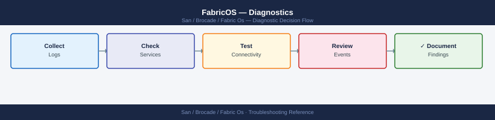
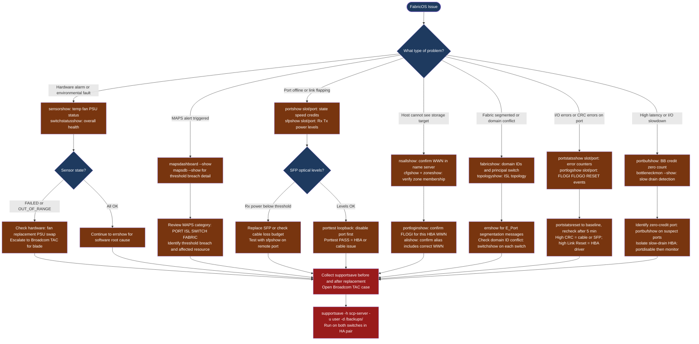

---
tags:
  - san
  - troubleshooting
search:
  boost: 1.5
---
# FabricOS — Diagnostics

<div class="kb-summary">
Brocade FabricOS diagnostic commands: check hardware sensors and MAPS alerts with sensorshow and mapsdashboard, inspect per-port state and SFP optical levels with portshow and sfpshow, diagnose fabric segmentation with fabricshow and nsallshow, identify slow-drain devices and credit starvation with portbufshow, and collect the full supportsave diagnostic bundle for Broadcom TAC escalation.

*Applies to: Brocade FOS 9.x*
</div>





```d2
direction: down

symptom: Identify Symptom {shape: diamond}
step_1_check_environmental_sensors_a: "Step 1 — Check environmental sensors and switch health" {shape: rectangle}
step_2_port_diagnostics: "Step 2 — Port diagnostics" {shape: rectangle}
step_3_fabriclevel_diagnostics: "Step 3 — Fabric-level diagnostics" {shape: rectangle}
step_4_buffer_credit_diagnostics: "Step 4 — Buffer credit diagnostics" {shape: rectangle}
step_5_collect_tac_support_bundle: "Step 5 — Collect TAC support bundle" {shape: rectangle}
log_locations: "Log locations" {shape: rectangle}
resolution: Resolve or Escalate {shape: oval}

symptom -> step_1_check_environmental_sensors_a: investigate
symptom -> step_2_port_diagnostics: investigate
symptom -> step_3_fabriclevel_diagnostics: investigate
symptom -> step_4_buffer_credit_diagnostics: investigate
symptom -> step_5_collect_tac_support_bundle: investigate
symptom -> log_locations: investigate
step_1_check_environmental_sensors_a -> resolution
step_2_port_diagnostics -> resolution
step_3_fabriclevel_diagnostics -> resolution
step_4_buffer_credit_diagnostics -> resolution
step_5_collect_tac_support_bundle -> resolution
log_locations -> resolution
```

## Before you begin

- **Access:** SSH to the Fabric OS switch as admin; serial console access for unresponsive switches; SCP server or USB drive accessible for `supportsave`
- **Gather first:** the specific symptom (port offline, MAPS alert category, I/O error on which host and storage target, fabric segmentation message), the affected switch name and domain ID, and the approximate time the issue started
- **Scope:** confirm whether the issue affects one port, one switch, or the entire fabric — `switchstatusshow` gives an overall switch health verdict before drilling into specifics

---

## Step 1 — Check environmental sensors and switch health

```bash
# Overall switch health summary
switchstatusshow
# Expected: Switch Status: HEALTHY

# All environmental sensors
sensorshow

# Individual sensor categories
fanshow        # Fan tray status and RPM
psshow         # Power supply status and input voltage
tempshow       # Temperature sensors — blade, chassis, ASIC

# Recent error log entries
errshow | head -50
# Shows most recent fabric errors with timestamp, severity, and message

# Full RAS event log (detailed)
raslog --show | head -100

# Firmware and license status
firmwareshow
licenseshow
```

All sensors should report `OK`. A sensor in `FAILED`, `ABSENT`, or `OUT_OF_RANGE` state requires immediate attention. Temperature thresholds vary by platform — refer to the hardware installation guide for the specific chassis.

### MAPS dashboard

```bash
# Current health dashboard — summary of all MAPS categories
mapsdashboard --show

# All triggered MAPS alerts
mapsdb --show

# Active MAPS policy details
mapspolicy --show

# All MAPS rules and thresholds
mapsrule --show

# MAPS configuration for a specific port
mapsrule --show -ports <slot/port>
```

MAPS categories:

| Category | What it monitors |
|---|---|
| PORT | Per-port error counters, link state changes, CRC errors |
| ISL | ISL utilization, C3 discards, trunk health |
| SWITCH | Switch health, hardware faults |
| FABRIC | Principal switch changes, domain changes, fabric events |
| SECURITY | Failed login attempts, policy violations |
| CIRCUIT | FCoE or FCIP circuit health |

---

## Step 2 — Port diagnostics

### Port status and detail

```bash
# Full port detail — state, speed, connected WWN, buffer credits
portshow <slot/port>

# Port configuration — speed, state, trunk membership, QoS settings
portcfgshow <slot/port>

# Port error counter summary (all ports)
porterrshow

# Per-port detailed error counters
portstatsshow <slot/port>

# Reset port counters (do this after baselining, not before)
portstatsreset <slot/port>

# SFP optical levels — Tx/Rx power, temperature, voltage
sfpshow <slot/port>
sfpshow               # All installed SFPs
```

### SFP optical levels

`sfpshow` output shows each SFP's measured Tx power, Rx power, temperature, and voltage.

| Field | Normal Range | Alarm Condition |
|---|---|---|
| Rx Power | -10 to 0 dBm (short-range) | Below -10 dBm = weak signal — SFP or cable |
| Tx Power | -4 to 0 dBm | Below -8 dBm = failing SFP |
| Temperature | 0–70°C | Above 80°C = SFP thermal issue |
| Voltage | 3.0–3.6V | Outside range = SFP power issue |

If Rx power is within range but Tx power is low, the SFP is failing. If Rx power is low but the remote Tx power is fine, the problem is the cable or the local SFP's receive path.

### Port event log

```bash
# Show recent events on a port
portlogshow <slot/port>

# Dump the full port log buffer
portlogdump <slot/port>
```

Common events in `portlogshow`:

| Event | Meaning |
|---|---|
| `FLOGI` | Host or target logged into the fabric — normal |
| `FLOGO` | Device logged out — HBA driver restart or cable pull |
| `RESET` | Link reset — normal during negotiation; not normal repeatedly |
| `LIP` | Loop Initialisation Primitive — FC-AL legacy; investigate on F_Port |
| `ERR` | Error event — check timestamp and error code |

### Port loopback test

```bash
# Disable the port before testing
portdisable <slot/port>

# Run internal loopback test (SFP may need to be removed — check platform docs)
porttest <slot/port>

# Re-enable the port after testing
portenable <slot/port>
```

`porttest PASS` confirms switch port ASIC is functioning. `porttest FAIL` indicates switch hardware damage — escalate to Broadcom TAC.

### Fabric diagnostic (spinFab)

```bash
# Send test frames across the fabric between two switch ports
spinfab -ports <slot/port>,<slot/port>
```

---

## Step 3 — Fabric-level diagnostics

### Fabric and name server

```bash
# All switches in fabric — domain IDs, principal switch, WWN
fabricshow

# Physical ISL topology
topologyshow

# All devices registered in the name server
nsshow         # Local switch name server
nsallshow      # Name server across entire fabric

# Look up a specific device
nslookup <wwpn>

# FLOGI database — devices that have logged into the fabric
portloginshow
```

### ISL diagnostics

```bash
# ISL port status and throughput
islshow

# Trunk group membership and master port
trunkshow

# Per-port real-time throughput (ISL and host/storage ports)
portperfshow

# Detailed ISL statistics
portstatsshow <isl-slot/port>
```

### Routing and path

```bash
# FSPF routing topology
fspfshow

# Trace the path a specific target WWN would take
pathinfo <target-wwn>

# Domain routing table
routeshow
```

---

## Step 4 — Buffer credit diagnostics

Buffer-to-buffer (BB) credits control flow on each FC link. Credit starvation causes I/O to stall. This is the primary mechanism behind slow-drain device impact.

```bash
# Show BB credit status on a port
portbufshow <slot/port>

# MAPS monitors for zero-credit conditions
mapsdb --show | grep -i credit
mapsdb --show | grep -i slow

# Bottleneck detection status
bottleneckmon --show

# Enable bottleneck detection if not active
bottleneckmon --enable
```

When a port shows persistent zero BB credits, the connected device is not returning credits fast enough — it is the slow-drain device. Identify it, disable the port temporarily, and work with the host or storage team to resolve the queue depth or driver issue.

---

## Step 5 — Collect TAC support bundle

`supportsave` is the single most important thing to do when opening a Broadcom TAC case.

### supportsave — full diagnostic bundle

```bash
# Run supportsave with SCP parameters
supportsave -h <scp-server-ip> -u <username> -p <password> -d /backups/supportsave/

# Alternative: configure SCP destination interactively first
supportshow --ftp <ftp-server-ip>
supportsave
```

`supportsave` takes 3–8 minutes on a director and produces a `.tar.gz` archive. Upload it to the TAC SR immediately. It contains:

- Running configuration, zone database, name server state
- All logs (RAS log, audit log, port logs)
- Port statistics, SFP data, SNMP trap history
- Platform diagnostics (ASIC registers, CP health)

### supportshow — console diagnostic dump

```bash
# Dump all diagnostics to console (capture with terminal logging enabled)
supportshow
```

Capture the output by enabling logging in your SSH client (PuTTY: Session → Logging; SecureCRT: File → Log Session) before running `supportshow`.

### Targeted data collection

```bash
# Port-specific issue — collect all port data
portshow <slot/port>
sfpshow <slot/port>
portstatsshow <slot/port>
portlogshow <slot/port>
portcfgshow <slot/port>

# Fabric segmentation — collect fabric state
fabricshow
topologyshow
islshow
portlogshow <isl-port>
errshow

# Zoning issue — collect zone database
cfgshow
zoneshow
alishow
nsshow
nsallshow

# Performance issue — collect throughput and credit data
portperfshow
islshow
portbufshow <slot/port>
porterrshow
```

---

## Log locations

| Log | Access Command | Contents |
|---|---|---|
| RAS log (hardware and fabric events) | `errshow` / `errdump` | Hardware alerts, fabric topology changes, port events |
| Audit log (security and config changes) | `auditlog --show` | Login events, zone changes, config modifications |
| Port event log | `portlogshow <slot/port>` | Per-port FLOGI, link state, errors |
| MAPS alerts | `mapsdb --show` | Threshold breach events across all monitored resources |
| System message log | `rasshow` | System-level RAS events with severity |
| Firmware download log | `firmwaredownloadstatus` | Firmware upgrade history and status |
| TAC bundle | `supportsave` | All-in-one — required for Broadcom TAC SR |

---

## See also

- [Fabric OS — Common Issues](common-issues/)
- [Fabric OS — Escalation](escalation/)
- [Fabric OS — Health Checks](../operations/health-checks/)

## Verify resolution

- `switchstatusshow` returns `Switch Status: HEALTHY` with no degraded components
- `sensorshow` shows all sensors reporting `OK` (temperature, fan, PSU)
- `portshow <slot/port>` shows the affected port in `Online` state with expected speed and `No_Light` or `Online` — not `Faulty` or `No_Module`
- `sfpshow <slot/port>` shows Rx power within the normal range (-10 to 0 dBm for short-range)
- `errshow | head -20` shows no new ERROR-level events since the fix was applied
- `nsallshow | grep <wwpn>` confirms the host or target WWN is registered in the fabric name server
- `mapsdashboard --show` shows no active threshold violations in the affected port or category
