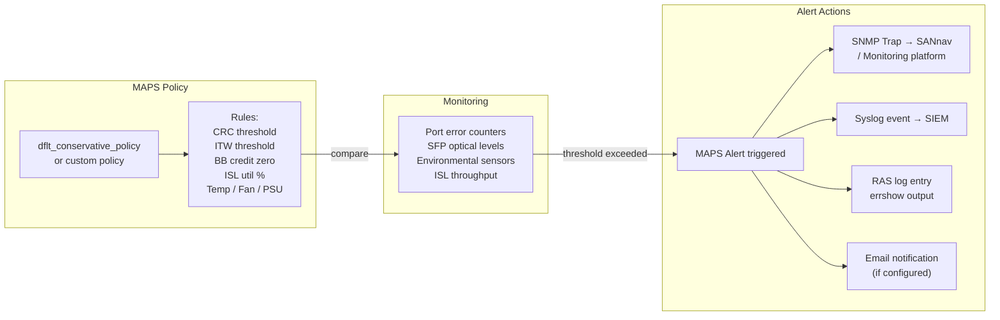

# FabricOS — Diagnostics

> Part of the [Troubleshooting](../index.md) reference.

---

## MAPS Policy → Alert → Action Flow


┌─────────────────────────────────── Brocade Fabric OS — Diagnostics ───────────────────────────────────┐
│                                                                                                       │
│  Diagnostics: error logs, portshow, MAPS rules, raslog, supportshow, and port tests.                  │
│                                                                                                       │
│   ┌──────────────────────────────────────────────┐  ┌─────────────────────────────────────────────┐   │
│   │           Log & Event Diagnostics            │  │         Port & Hardware Diagnostics         │   │
│   │          errshow: fabric error log           │  │         portshow: port state + stats        │   │
│   │         raslog: RAS event log detail         │  │        portstatsshow: counters delta        │   │
│   │           errdump: dump to syslog            │  │        porttest: loopback diagnostic        │   │
│   │        MAPS: mapsconfig + mapspolicy         │  │         sensorshow: temp + fan + PSU        │   │
│   │         syslogdipadd: send to syslog         │  │        diagstatus: blade diagnostics        │   │
│   └──────────────────────────────────────────────┘  └─────────────────────────────────────────────┘   │
│                                                                                                       │
│  errshow and raslog are the primary event sources; portshow for per-port analysis.                    │
│                                                                                                       │
│                          ▼                                                 ▼                          │
│                                                                                                       │
│   ┌──────────────────────────────────────────────┐  ┌─────────────────────────────────────────────┐   │
│   │           Fabric-Level Diagnostics           │  │        Collection for TAC Escalation        │   │
│   │             nsshow + fabricshow              │  │           supportshow: full bundle          │   │
│   │        cfgshow: zone config snapshot         │  │         supportsave: save to USB/SCP        │   │
│   │        islshow: ISL utilisation data         │  │         portdump: binary port trace         │   │
│   │          switchstatusshow: overall           │  │           mgmtshow: management NIC          │   │
│   │        licenseshow: FOS license check        │  │           pcap: port frame capture          │   │
│   └──────────────────────────────────────────────┘  └─────────────────────────────────────────────┘   │
│                                                                                                       │
│  Physical Infrastructure (the hardware everything above runs on):                                     │
│  Brocade FC switch · serial console · USB drive for supportsave · syslog server                       │
│                                                                                                       │
│  Key terms:                                                                                           │
│                                                                                                       │
│  errshow         = displays fabric error log; most recent errors first with severity                  │
│  raslog          = RAS (Reliability/Availability/Serviceability) detailed event log                   │
│  portshow        = per-port status: state, speed, SFP type, credits, error counters                   │
│  portstatsshow   = per-port frame counter snapshot; use twice for delta                               │
│  porttest        = in-service loopback; port must be disabled first                                   │
│  sensorshow      = hardware sensor readings: temperature, fan RPM, PSU voltage                        │
│  diagstatus      = blade/chassis diagnostic test results and pass/fail status                         │
│  supportshow     = full diagnostic bundle; run on both switches in HA pair                            │
│  supportsave     = saves supportshow output to SCP/FTP/USB for offline analysis                       │
│  MAPS            = Monitoring and Alerting Policy Suite; tracks thresholds over time                  │
│  pcap            = port frame capture; captures FC frames for protocol analysis                       │
│  syslogdipadd    = adds a syslog server IP; Fabric OS sends events to SIEM                            │
│                                                                                                       │
└───────────────────────────────────────────────────────────────────────────────────────────────────────┘
```

## Switch-Level Diagnostics

### Overall Health

```bash
# Overall switch health status — expected: HEALTHY
switchstatusshow

# Switch identity, port count, fabric membership
switchshow

# Chassis hardware inventory — blades, CPs, SFPs
chassisshow

# Slot-level blade status
slotshow

# Uptime and last reboot cause
uptime
```

### Environmental Sensors

```bash
# All environmental sensors in one output
sensorshow

# Individual sensor categories
fanshow         # Fan tray status and RPM
psshow          # Power supply status and input voltage
tempshow        # Temperature sensors — blade, chassis, asic

# High-level environmental summary (included in switchstatusshow)
switchstatusshow
```

All sensors should report `OK`. A sensor in `FAILED`, `ABSENT`, or `OUT_OF_RANGE` state requires immediate attention. Temperature thresholds vary by platform — refer to the hardware installation guide for the specific chassis.

---

## Port Diagnostics

### Port Status and Detail

```bash
# Full port detail — state, speed, connected WWN, buffer credits
portshow <slot/port>

# Port configuration — speed, state, trunk membership, QoS settings
portcfgshow <slot/port>

# Port error counter summary (all ports)
porterrshow

# Per-port detailed error counters
portstatsshow <slot/port>

# Reset port counters (do this after baselining, not before)
portstatsreset <slot/port>

# SFP optical levels — Tx/Rx power, temperature, voltage
sfpshow <slot/port>
sfpshow               # All installed SFPs
```

### SFP Optical Levels

`sfpshow` output shows each SFP's measured Tx power, Rx power, temperature, and voltage. Thresholds are defined by the SFP vendor.

Key fields to check:

| Field | Normal Range | Alarm Condition |
|---|---|---|
| Rx Power | -10 to 0 dBm (short-range) | Below -10 dBm = weak signal — SFP or cable |
| Tx Power | -4 to 0 dBm | Below -8 dBm = failing SFP |
| Temperature | 0–70°C | Above 80°C = SFP thermal issue |
| Voltage | 3.0–3.6V | Outside range = SFP power issue |

If Rx power is within range but Tx power is low, the SFP is failing. Replace the SFP first. If Rx power is low but the remote Tx power is fine, the problem is the cable or the local SFP's receive path.

### Port Event Log

The port log captures low-level link events — FLOGI (fabric login), PLOGI (port login), link resets, and error events. This is the most detailed per-port trace available.

```bash
# Show recent events on a port
portlogshow <slot/port>

# Dump the full port log buffer
portlogdump <slot/port>

# Clear the port log (rarely needed — do not clear before collecting diagnostics)
portlogclear <slot/port>
```

Common events in `portlogshow`:

| Event | Meaning |
|---|---|
| `FLOGI` | Host or target logged into the fabric — normal |
| `FLOGO` | Device logged out — could be HBA driver restart or cable pull |
| `RESET` | Link reset — normal during link negotiation; not normal repeatedly |
| `LIP` | Loop Initialisation Primitive — FC-AL legacy; investigate if seen on F_Port |
| `SC` | State change notification |
| `ERR` | Error event — check timestamp and error code |

### Port Loop-back Test

Use `porttest` to verify the switch port hardware is functioning correctly. The port must be offline (disabled) and the SFP removed before running this test.

```bash
# Disable the port
portdisable <slot/port>

# Remove the SFP (or leave in for internal loopback — check FOS documentation for platform)
# Run the internal loopback test
porttest <slot/port>

# Re-enable the port after testing
portenable <slot/port>
```

`porttest` result of `PASS` confirms the switch port ASIC and internal data path are functioning. A `FAIL` result indicates switch hardware damage — escalate to Broadcom TAC for blade replacement.

### Fabric Diagnostic (spinFab)

`spinFab` sends test frames across the fabric between two switch ports to verify inter-switch frame forwarding.

```bash
# Run spinFab between two ports on the same or different switches
spinfab -ports <slot/port>,<slot/port>
```

Use spinFab to validate a new ISL is forwarding frames correctly after cabling, or to verify frame delivery after a fabric topology change.

---

## Fabric-Level Diagnostics

### Fabric and Name Server

```bash
# All switches in fabric — domain IDs, principal switch, WWN
fabricshow

# Physical ISL topology
topologyshow

# All devices registered in the name server
nsshow         # Local switch name server
nsallshow      # Name server across entire fabric

# Look up a specific device
nslookup <wwpn>

# FLOGI database — devices that have logged into the fabric
portloginshow
```

### ISL Diagnostics

```bash
# ISL port status and throughput
islshow

# Trunk group membership and master port
trunkshow

# Per-port real-time throughput (ISL and host/storage ports)
portperfshow

# Detailed ISL statistics
portstatsshow <isl-slot/port>
```

### Routing and Path

```bash
# Show the routing table
topologyshow

# Show FSPF (Fibre Channel Shortest Path First) topology
fspfshow

# Trace the path a specific target WWN would take
pathinfo <target-wwn>

# Show domain routing table
routeshow
```

### MAPS Dashboard

MAPS (Monitoring and Alerting Policy Suite) aggregates health metrics across all ports and reports against configured thresholds.

```bash
# Current health dashboard — summary of all MAPS categories
mapsdashboard --show

# All triggered MAPS alerts
mapsdb --show

# Active MAPS policy details
mapspolicy --show

# All MAPS rules and thresholds
mapsrule --show

# MAPS configuration for a specific port
mapsrule --show -ports <slot/port>
```

MAPS categories:

| Category | What it monitors |
|---|---|
| PORT | Per-port error counters, link state changes, CRC errors |
| ISL | ISL utilization, C3 discards, trunk health |
| SWITCH | Switch health, hardware faults |
| FABRIC | Principal switch changes, domain changes, fabric events |
| SECURITY | Failed login attempts, policy violations |
| CIRCUIT | FCoE or FCIP circuit health |

---

## Log Locations

| Log | Access Command | Contents |
|---|---|---|
| RAS log (hardware and fabric events) | `errshow` / `errdump` | Hardware alerts, fabric topology changes, port events |
| Audit log (security and config changes) | `auditlog --show` | Login events, zone changes, config modifications |
| Port event log | `portlogshow <slot/port>` | Per-port FLOGI, link state, errors |
| MAPS alerts | `mapsdb --show` | Threshold breach events across all monitored resources |
| System message log | `rasshow` | System-level RAS events with severity |
| Firmware download log | `firmwaredownloadstatus` | Firmware upgrade history and status |

---

## Data Collection for TAC Cases

### supportsave — Full Diagnostic Bundle

`supportsave` collects a complete diagnostic snapshot and saves it to a remote server. This is the single most important thing to do when opening a Broadcom TAC case.

```bash
# Configure SCP destination (if not already set)
# Interactive — prompts for server IP, username, password, path
supportshow --ftp <ftp-server-ip>

# Run supportsave — saves to the configured destination
supportsave

# Alternative: run directly with SCP parameters
supportsave -h <scp-server-ip> -u <username> -p <password> -d /backups/supportsave/
```

`supportsave` takes 3–8 minutes on a director and produces a `.tar.gz` archive. Upload this to the TAC SR immediately — it contains:

- Running configuration
- All logs (RAS log, audit log, port logs)
- Fabric database (zone configuration, name server state, routing)
- Port statistics and SFP data
- SNMP trap history
- Platform diagnostics (ASIC registers, CP health)

### supportshow — Console Diagnostic Dump

`supportshow` prints the full diagnostic bundle to the console — useful for capturing to a terminal log when SCP is not available.

```bash
# Dump all diagnostics to console (pipe to a log file from your terminal)
supportshow
```

Capture the output by enabling logging in your SSH client (PuTTY: Session → Logging; SecureCRT: File → Log Session) before running `supportshow`.

### Targeted Data Collection

For targeted investigations, collect the specific commands relevant to the symptom and include them in the SR notes.

```bash
# Port-specific issue — collect all port data
portshow <slot/port>
sfpshow <slot/port>
portstatsshow <slot/port>
portlogshow <slot/port>
portcfgshow <slot/port>

# Fabric segmentation — collect fabric state
fabricshow
topologyshow
islshow
portlogshow <isl-port>
errshow

# Zoning issue — collect zone database
cfgshow
zoneshow
alishow
nsshow
nsallshow

# Performance issue — collect throughput and credit data
portperfshow
islshow
portbufshow <slot/port>
porterrshow
```

---

## Buffer Credit Diagnostics

Buffer-to-buffer (BB) credits control flow on each FC link. Credit starvation causes I/O to stall. This is the primary mechanism behind slow drain device impact.

```bash
# Show BB credit status on a port
portbufshow <slot/port>

# Identify ports with zero BB credits (credit starvation)
# Run portbufshow on all suspect ports

# MAPS monitors for zero-credit conditions — check
mapsdb --show | grep -i credit
mapsdb --show | grep -i slow
```

Bottleneck detection commands:

```bash
# Show bottleneck detection status
bottleneckmon --show

# Enable bottleneck detection if not active
bottleneckmon --enable
```

When a port shows persistent zero BB credits, the connected device is not returning credits fast enough. The connected device is the slow drain device. Identify it, disable the port temporarily, and work with the host or storage team to resolve the queue depth or driver issue.
