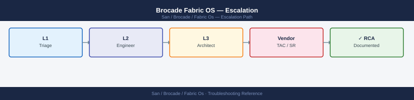
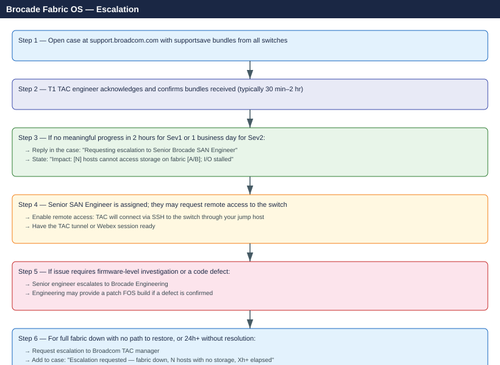

---
tags:
  - san
  - troubleshooting
search:
  boost: 1.5
---
# Brocade Fabric OS — Escalation

<div class="kb-summary">
How to escalate Brocade SAN switch issues to Broadcom TAC: what data to collect, how to run supportsave, step-by-step case creation on the Broadcom support portal, and the escalation path when progress stalls.

*Applies to: Brocade Fabric OS 9.x*
</div>



---

```d2
direction: down

symptom: Identify Symptom {shape: diamond}
preescalation_selfcheck: "Pre-Escalation Self-Check" {shape: rectangle}
stepbystep_data_collection: "Step-by-Step Data Collection" {shape: rectangle}
how_to_open_the_case_on_broadcom_sup: "How to Open the Case on Broadcom Support Portal" {shape: rectangle}
escalation_path: "Escalation Path" {shape: rectangle}
what_not_to_do: "What NOT to Do" {shape: rectangle}
useful_commands_for_case_updates: "Useful Commands for Case Updates" {shape: rectangle}
resolution: Resolve or Escalate {shape: oval}

symptom -> preescalation_selfcheck: investigate
symptom -> stepbystep_data_collection: investigate
symptom -> how_to_open_the_case_on_broadcom_sup: investigate
symptom -> escalation_path: investigate
symptom -> what_not_to_do: investigate
symptom -> useful_commands_for_case_updates: investigate
preescalation_selfcheck -> resolution
stepbystep_data_collection -> resolution
how_to_open_the_case_on_broadcom_sup -> resolution
escalation_path -> resolution
what_not_to_do -> resolution
useful_commands_for_case_updates -> resolution
```

## Before you begin

- **Access required:** SSH access to each Brocade switch (admin credentials); Broadcom support account with the switch serial numbers registered
- **Do this first:** collect supportsave from ALL affected switches before touching anything. TAC will ask for it in their first response
- **Enforce a change freeze:** no zoning changes, no FOS upgrades, no port disabling during the incident. Every change adds a variable and delays diagnosis
- **Do NOT reboot** any switch unless Broadcom TAC explicitly instructs you to — reboots may break fabric stability and overwrite critical log data

---

## Pre-Escalation Self-Check

Run these from each switch's SSH session before opening the case.

| Check | Command | Expected result |
|---|---|---|
| FOS version | `version` | Note full version string (e.g. `v9.2.1d`) |
| Switch health | `switchstatusshow` | All LEDs/ports green; status HEALTHY |
| Fabric status | `fabricshow` | All expected switches present; no unknown domains |
| ISL status | `islshow` | All ISLs show state `Up` |
| Port errors | `porterrshow` | No ports with high CRC, loss-of-sync, or loss-of-signal counts |
| Zone config active | `cfgshow` | Active zone config matches expected baseline |
| Recent errors | `errshow` | Review last 20 entries for hardware faults or segmentation events |
| Principal switch | `fabricshow` | Only one principal switch per fabric; Domain ID stable |

---

## Step-by-Step Data Collection

Run on each affected Brocade switch. SSH as `admin`.

### 1. Get the FOS version and switch serial number

```bash
# FOS version — include in TAC case description
version

# Switch information — chassis model + serial number
switchshow | head -20

# For the full chassis serial number (required to open TAC case)
chassisshow | grep -i serial
```


```text title="Expected output"
FOS v9.1.0b
Fabric OS v9.1.0b

Switch State:   Online
Switch Mode:    Native
Switch Role:    Principal
Switch Domain:  1
Switch Name:    brocade-switch-01
Switch WWN:     10:00:00:27:f1:5a:bc:d0
Enet IP Addr:   192.168.1.100
FC Port Count:  16
FC Port Speed:  16Gb
Health Status:  OK

Chassis WWN:    10:00:00:27:f1:5a:bc:d0
Chassis Name:   brocade-switch-01
Chassis Model:  Brocade G630
Chassis Serial: SN-BR-G630-0847291
Fabric ID:      128
...

Chassis Serial Number: SN-BR-G630-0847291
```

!!! warning "Common errors"
    **`switchshow: command not found`** — Ensure you are logged into the Brocade switch via SSH/Telnet, not your local workstation; these commands run on the switch itself.
    **`Permission denied`** — Verify your user account has admin privileges on the switch; use `userconfig --show` to check your role.
### 2. Capture fabric state (before anything changes)

```bash
# Full fabric topology — shows all switches, domain IDs, and ISLs
fabricshow

# Zone configuration — active and saved databases
cfgshow

# ISL state — all inter-switch links
islshow

# Port-level error counters — look for CRC, loss-sync, loss-sig
porterrshow
```


```text title="Expected output"
Switch Name: fabric-switch-01
Switch Domain ID: 1
Switch IP Address: 192.168.1.10
Switch Model: Brocade 6510
Switch Firmware: v8.2.1b
Switch Status: Online

Fabric Members:
  Domain 1: fabric-switch-01 (192.168.1.10)
  Domain 2: fabric-switch-02 (192.168.1.11)
  Domain 3: fabric-switch-03 (192.168.1.12)

ISL Ports:
  Port 0/24: fabric-switch-01 to fabric-switch-02 (Online)
  Port 0/25: fabric-switch-01 to fabric-switch-03 (Online)
  Port 1/24: fabric-switch-02 to fabric-switch-03 (Online)

Current configuration: cfg_prod
Defined zones: 25
Active zones: 25

Port Error Summary:
  Port 0/1: CRC=0, Loss-Sync=0, Loss-Sig=0
  Port 0/2: CRC=2, Loss-Sync=0, Loss-Sig=0
  Port 0/15: CRC=0, Loss-Sync=1, Loss-Sig=0
  Port 1/8: CRC=15, Loss-Sync=3, Loss-Sig=1
  ...
```

!!! warning "Common errors"
    **`fabricshow: command not found`** — Verify you are logged into the Brocade switch CLI (not the host OS) by checking the prompt shows `switch>` or `switch#`.
    **`Access denied: insufficient privileges`** — Ensure your user account has admin or read-only permissions; use `userconfig --show` to verify role assignments.
    **`ISL port offline or isolated`** — Check physical cable connections and run `portshow <port>` to diagnose link state; verify switch firmware versions match across the fabric.
Copy the full output of each command into a text file. Paste this into the TAC case description — it gives TAC an immediate view of the fabric state at the time of the issue.

### 3. Run supportsave on each affected switch (takes 2–5 minutes per switch)

```bash
# Configure the SCP destination first (do this once per switch)
ssave --scp <username>@<scp-server-ip>:<path>

# Run supportsave — generates a full diagnostic archive
supportsave

# The archive is transferred automatically to the SCP destination
# It includes: running config, all logs, zone database, port stats, SNMP history
```


```text title="Expected output"
Preparing support save archive...
Collecting system information...
Collecting configuration data...
Collecting log files...
Collecting zone database...
Collecting port statistics...
Collecting SNMP history...
Creating archive: support_sw-fcswitch01_20240115_143022.tar.gz
Archive size: 287 MB
Transferring to scp-server.corp.local:/backups/fabric-logs/
Transfer complete: support_sw-fcswitch01_20240115_143022.tar.gz
Archive stored at: /backups/fabric-logs/support_sw-fcswitch01_20240115_143022.tar.gz
```

!!! warning "Common errors"
    **`Permission denied (publickey,password).`** — Verify SSH credentials and that the SCP server's SSH key is configured with `ssave --scp <username>@<scp-server-ip>:<path>` using a valid user account.
    **`No space left on device`** — Check available disk space on the SCP destination with `df -h` and ensure at least 500 MB is free, or configure an alternate SCP path.
    **`Connection refused`** — Confirm the SCP server is reachable and SSH is running on port 22 by testing with `ping <scp-server-ip>` and `telnet <scp-server-ip> 22` from the switch.
Run supportsave on **every** switch in the affected fabric, not just the one that appears to be the source. Fabric issues often show on the downstream switch, not the root cause switch.

### 4. Capture the error log (timeline of events)

```bash
# Switch event log — last 100 entries; paste into TAC case
errshow | head -100

# For long-running incidents, save the full errshow to a file
errshow > /tmp/errshow-$(hostname)-$(date +%Y%m%d).txt
```


```text title="Expected output"
Error Log ID: 0x000001a2 | Severity: INFORMATIONAL | Time: 2024-01-15 14:32:18 UTC
  Message: Port 0/1 link up at 16Gbps
  Source: portLogicalModule

Error Log ID: 0x000001a1 | Severity: WARNING | Time: 2024-01-15 14:28:45 UTC
  Message: Temperature sensor reading 62°C (threshold: 70°C)
  Source: environmentalMonitoring

Error Log ID: 0x000001a0 | Severity: INFORMATIONAL | Time: 2024-01-15 14:15:22 UTC
  Message: Fabric reconfiguration completed successfully
  Source: fabricManager

Error Log ID: 0x0000019f | Severity: CRITICAL | Time: 2024-01-15 13:52:10 UTC
  Message: Port 1/3 link down - signal loss detected
  Source: portLogicalModule

Error Log ID: 0x0000019e | Severity: WARNING | Time: 2024-01-15 13:48:33 UTC
  Message: SFP module temperature elevated on port 2/5
  Source: sfpMonitoring

Error Log ID: 0x0000019d | Severity: INFORMATIONAL | Time: 2024-01-15 13:30:15 UTC
  Message: Configuration backup completed to remote server 10.50.12.8
  Source: configManager

...
(94 additional entries)

/tmp/errshow-switch-prod-01-20240115.txt
```

!!! warning "Common errors"
    **`errshow: command not found`** — Verify you are logged into a Brocade Fabric OS switch (not a Linux host); this command only exists on switch CLI.
    **`Permission denied`** — Ensure your user account has administrative privileges; request `admin` role assignment from the fabric administrator.
### 5. Write the timeline

```text
FOS version: v9.2.1d build 2023120
Switch affected: brocade-core-01.corp.local (Domain ID 1)
Switch serial: BRCxxxxxxx (from chassisshow)
Fabric: Fabric A (two-switch core-edge)
Issue first observed: 2026-06-14 14:30 UTC
Last known good state: 2026-06-14 09:00 UTC
Changes in the 24h before the issue:
  - 09:00: Firmware upgrade FOS 9.2.0 → 9.2.1d applied to brocade-edge-02
  - 14:25: brocade-core-01 reported "ISL E-Port Isolated" on port 16
  - 14:30: 12 hosts lost access to storage on fabric A
Steps already taken:
  - fabricshow: brocade-edge-02 now shows as unknown domain (not in fabric)
  - ISL between core-01 port 16 and edge-02 port 0 is now disabled (zoning conflict)
  - Did NOT change any zone configuration or reboot switches
Blast radius: 12 hosts on fabric A cannot see storage; VMs on those hosts have I/O stalled
```

---

## How to Open the Case on Broadcom Support Portal

1. Go to **support.broadcom.com** and sign in with your Broadcom account. If you do not have one: click **Register** and use your company email — your switch serial numbers must be registered under your account for entitlement.

2. Click **Open a New Case** in the top navigation.

3. Under **Select Product Family**, choose **Brocade** → **Brocade Fibre Channel Switches**.

4. Under **Product**, select your switch model (e.g. Brocade G720, Brocade X7).

5. Under **Serial Number**, enter the chassis serial number from `chassisshow`. This is required to validate your support entitlement.

6. Under **Severity**, select:
   - **Severity 1 — Critical**: Fabric completely down; all hosts on this fabric cannot access storage; VMs have I/O stalled; production outage; no workaround
   - **Severity 2 — High**: Partial fabric degradation; some hosts affected; ISLs down but alternate paths still exist; production impact with temporary workaround
   - **Severity 3 — Medium**: Single switch or port issue; fabric topology intact; no immediate data path loss
   - **Severity 4 — Low**: How-to question, pre-upgrade planning, or non-urgent configuration review

7. In the **Summary** field: switch model + symptom + scope. Example: `Brocade G720 core-01 Domain 1 — ISL isolated after FOS 9.2.1d upgrade; 12 hosts lost fabric-A storage access at 14:30 UTC`.

8. In the **Description** field, paste:
   - FOS version and switch serial from Step 1
   - fabricshow output showing the isolation
   - errshow output around the time of failure
   - The timeline from Step 5
   - What you have already tried

9. Under **Attachments**, upload:
   - The supportsave archive from each affected switch (one ZIP per switch)
   - The errshow text file from Step 4

10. Click **Submit**. You will receive a case number by email immediately.

11. **Severity 1 only:** call Broadcom TAC after submission:
    - Find the number for your region at **support.broadcom.com → Contact Support**
    - State "Severity 1 — fabric down, hosts have no storage access" at the start of the call.
    - Have the case number and switch serial number ready.

---

## Escalation Path



---

## What NOT to Do

| Do NOT do this | Why | What to do instead |
|---|---|---|
| Change or commit zone configuration during investigation | Changes enforcement state; makes TAC diagnosis harder | Freeze all zone changes until TAC gives explicit go-ahead |
| Reboot the principal switch during an active incident | Can cause domain ID conflicts and worsen fabric stability | Only reboot if TAC says it is safe and has seen the current supportsave |
| Replace SFPs or ISL cables without TAC guidance | The fault may be in switch firmware, not hardware | Let TAC confirm the hardware is the root cause first |
| Upgrade FOS during the incident | Adds variables; may not fix the issue; can worsen state | Only upgrade FOS if TAC confirms it is the fix and provides the build |
| Disable and re-enable ISL ports randomly | Can trigger additional segmentation events | Follow TAC's specific port sequence |
| Remove switches from the fabric manually | Loses diagnostic data from those switches | Keep all switches connected; let TAC analyse the full topology |

---

## Useful Commands for Case Updates

Paste these into case replies to show TAC the current state.

```bash
# Fabric topology (paste after every significant change or update)
fabricshow

# ISL state
islshow

# Port state with speed and status
switchshow

# Error log snapshot
errshow | head -50

# Port error counters (flag any high CRC or loss-of-sync)
porterrshow

# Zone config — confirm active config name
cfgshow | grep -E "cfg:|Defined|Effective"

# SNMP trap history (shows hardware events)
snmpconfig --show

# Firmware revision
version
```


```text title="Expected output"
Switch Name:   brocade-switch-01
Switch State:  Online
Fabric ID:     100
FC Address ID: 010000
Fabric Parameters (Max R_A_TOV): 32 seconds
Connection Parameters (E_D_TOV): 2 seconds
Ports:  16
PortName  PortType  State     Proto  Connected PortWWN
0         F-Port    Online    FC-4   host-01   50:00:09:73:a1:20:00:01
1         F-Port    Online    FC-4   host-02   50:00:09:73:a1:20:00:02
2         E-Port    Online    FC-4   switch-02 50:00:09:73:a1:20:00:03
3         F-Port    Online    FC-4   storage   50:00:09:73:a1:20:00:04
4-15      F-Port    Offline   -      -         -

ISL Port List:
Port 2 (brocade-switch-01) <-> Port 2 (brocade-switch-02)
Port 3 (brocade-switch-01) <-> Port 3 (brocade-switch-02)

Port Status and Counters:
Port 0: Online, Speed: 16Gb, State: Enabled, Frames: 1,234,567
Port 1: Online, Speed: 16Gb, State: Enabled, Frames: 987,654
Port 2: Online, Speed: 16Gb, State: Enabled, Frames: 2,456,789
Port 3: Online, Speed: 16Gb, State: Enabled, Frames: 654,321
Port 4-15: Offline

Error Log (last 50 entries):
[2024-01-15 14:32:10] Port 0: Link up
[2024-01-15 14:31:45] Port 1: Link up
[2024-01-15 14:25:12] Fan module 1: Status OK
[2024-01-15 14:20:33] Temperature sensor: 42°C (Normal)
[2024-01-15 13:45:22] Port 2: ISL established
[2024-01-15 13:44:55] Port 3: ISL established

Port Error Counters:
Port 0: CRC: 0, Loss-of-Sync: 0, Timeout: 0
Port 1: CRC: 0, Loss-of-Sync: 0, Timeout: 0
Port 2: CRC: 0, Loss-of-Sync: 0, Timeout: 0
Port 3: CRC: 0, Loss-of-Sync: 0, Timeout: 0

cfg: prod_config
Defined configurations:
prod_config
test_config
Effective configuration:
prod_config

SNMP Trap History:
Trap ID: 1001, Type: linkUp, Port: 0, Timestamp: 2024-01-15 14:32:10
Trap ID: 1002, Type: linkUp, Port: 1, Timestamp: 2024-01-15 14:31:45
Trap ID: 1003, Type:
```
---

## Support Tiers and SLA Reference

| Severity | Definition | Initial Response SLA |
|---|---|---|
| Sev 1 — Critical | Fabric down; all hosts without storage; production outage | 30 minutes (24×7) |
| Sev 2 — High | Partial fabric degradation; alternate paths exist | 4 hours |
| Sev 3 — Medium | Single switch/port issue; no I/O impact | 1 business day |
| Sev 4 — Low | How-to, planning, non-urgent configuration | 2 business days |

---

## See also

- [Brocade Fabric OS — Diagnostics](../diagnostics/)
- [Brocade Fabric OS — Common Issues](../common-issues/)

---

## Verify resolution

- Run `fabricshow` and confirm all expected switches appear with correct domain IDs
- Run `islshow` and confirm all ISLs show `Up`
- Run `porterrshow` and confirm port error counters are not incrementing
- Verify all initiator-target zones are active: `cfgshow` shows the expected active config
- On the affected hosts: run an I/O test (e.g. `dd if=/dev/sdb bs=1M count=100 of=/dev/null`) and confirm storage is accessible
- Monitor `errshow` for 15 minutes and confirm no new fabric isolation or port fault events
