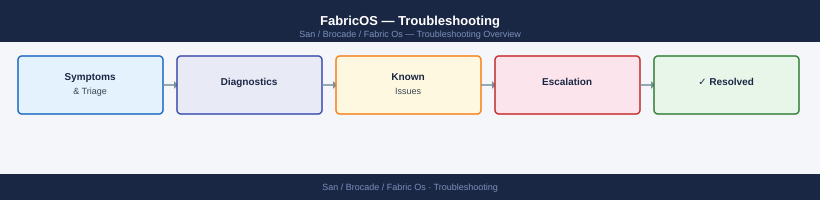

---
tags:
  - san
  - troubleshooting
search:
  boost: 1.5
---
# FabricOS — Troubleshooting

Diagnosing FabricOS fabric errors, port faults, FLOGI failures, zone conflicts, and principal switch elections.

*Applies to: Brocade FOS 9.x*

<a class="kb-card" href="common-issues/">
  <strong>Common Issues</strong>
  Known problems, symptoms, and resolution steps.
</a>

<a class="kb-card" href="diagnostics/">
  <strong>Diagnostics</strong>
  Diagnostic commands, log locations, and data collection.
</a>

<a class="kb-card" href="escalation/">
  <strong>Escalation</strong>
  When and how to escalate to Broadcom TAC with the right data.
</a>

> Part of the [Brocade Fabric OS](../index.md) reference.

