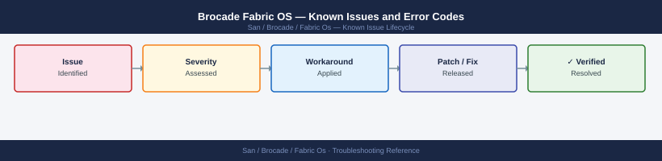

---
tags:
  - troubleshooting
  - brocade
  - fabric-os
  - san
  - known-issues
---
# Brocade Fabric OS — Known Issues and Error Codes

Catalog of known Fabric OS bugs, error codes, and workarounds covering switch health, zoning, and ISL issues.

*Applies to: Fabric OS 9.x*

## Before you begin

- Run `switchshow` for port status; `fabricshow` for fabric topology.
- `supportshow` generates full diagnostic output for support escalation.
- FOS RAS messages are logged in `errdump` — check for persistent error patterns.

## Switch and Port Health

| Error / Symptom | Affected Versions | Cause | Workaround / Fix | Fixed In |
|---|---|---|---|---|
| Port `Faulty` state | FOS 9.x | SFP fault, dirty connector, or link training failure | Clean SFP; replace SFP; run `portdisable/portenable` to re-init | N/A |
| `Too many errors — port disabled` | FOS 9.x | CRC error count threshold exceeded on port | Check fiber connector; replace SFP; inspect cable | N/A |
| F_Port stuck in `Initializing` | FOS 9.x | HBA not completing FLOGI | Check zoning for HBA WWN; verify HBA driver; check `nsshow` for login | N/A |

## Zoning

| Error / Symptom | Affected Versions | Cause | Workaround / Fix | Fixed In |
|---|---|---|---|---|
| `Zone not found` after fabric merge | FOS 9.x | Zone databases conflict during merge; merge aborted | Resolve zone conflict: `cfgshow` on both switches; manually align zone DBs | N/A |
| Host sees extra devices after zoning change | FOS 9.x | Host HBA cached old RSCNs; did not re-query name server | Rescan HBA on host: `echo "- - -" > /sys/class/scsi_host/hostX/scan` | N/A |

## ISL / Trunking

| Error / Symptom | Affected Versions | Cause | Workaround / Fix | Fixed In |
|---|---|---|---|---|
| ISL `Offline` after maintenance | FOS 9.x | ISL port disabled; or speed mismatch between switches | Verify speed: `portcfgspeed`; re-enable ISL port | N/A |
| FSPF routing suboptimal — traffic not using fastest ISL | FOS 9.x | FSPF cost metric not reflecting ISL bandwidth | Set FSPF link cost proportional to bandwidth: `linkCost` command | N/A |

## See also

- [Brocade Fabric OS — Common Issues](common-issues/)
- [Brocade SANnav — Known Issues](../../sannav/troubleshooting/known-issues.md)
