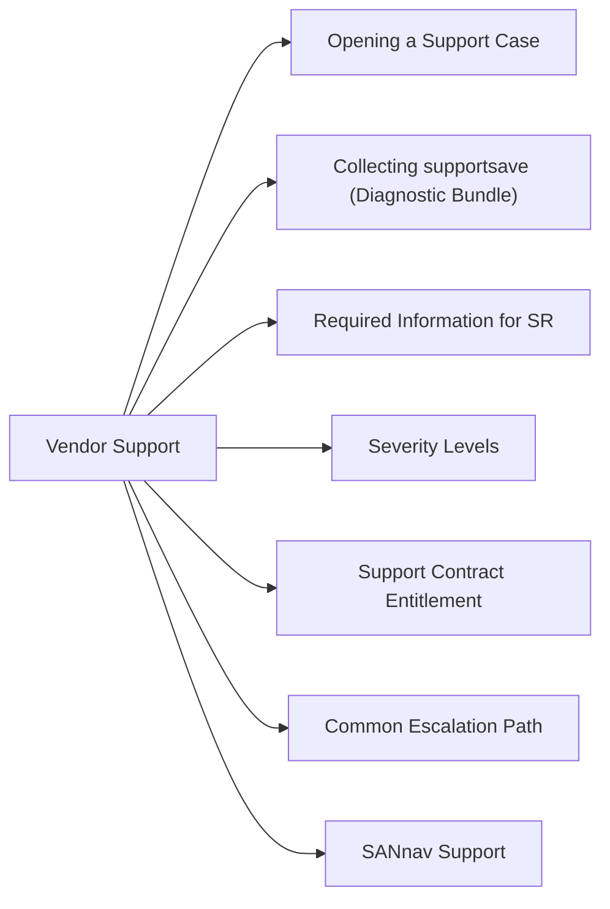

# Brocade Fabric OS Vendor Support



## Opening a Support Case

Support portal: [support.broadcom.com](https://support.broadcom.com)

1. Log in with the team account
2. Create Service Request → select Brocade SAN Switching as the product area
3. Enter the switch serial number to link the SR to the support contract
4. Upload the `supportsave` bundle (see below) immediately — dramatically speeds up triage

## Collecting supportsave (Diagnostic Bundle)

Run `supportsave` on the affected switch before opening the case:

```bash
# Configure FTP/SCP target first (if not already set)
ssave --ftp <ftp-server-ip> <username> <password> <path>
# Or SCP:
ssave --scp <username>@<scp-server-ip>:<path>

# Run supportsave (takes 2–5 minutes)
supportsave

# The output archive includes:
# - Running configuration
# - All logs (raslog, auditlog, switch event log)
# - Fabric database (zone, device, routing)
# - Port statistics
# - SNMP trap history
```

Attach the generated `.tar.gz` to the support case.

## Required Information for SR

| Field | Where to Find |
|---|---|
| Fabric OS version | `version` command on affected switch |
| Switch serial number | `chassisshow` or chassis label |
| Fabric topology | `fabricshow` — list of all switches in fabric |
| Zone count | `zoneshow --count` |
| Error message / log excerpts | `rasshow -l 200` — last 200 RAS events |
| Timestamps | When the issue first occurred (timezone) |

## Severity Levels

| Severity | Criteria | Response Time |
|---|---|---|
| P1 | Fabric-wide outage; production I/O impacted | 1–2 hours (24/7) |
| P2 | Significant degradation; redundancy lost | Same business day |
| P3 | Non-critical issue; workaround available | 2–3 business days |
| P4 | Enhancement, cosmetic, how-to question | Best effort |

## Support Contract Entitlement

Verify support coverage before opening a case:
- Serial number lookup: [support.broadcom.com](https://support.broadcom.com) → Entitlement
- `chassisshow` shows serial number; check against CMDB entry

## Common Escalation Path

1. Initial SR — Tier 1 support review
2. No progress within SLA → comment "Request escalation to Tier 2 SAN engineering"
3. For fabric-wide outage (P1): phone TAC directly; provide SR number from web submission
4. For chronic issues: request TAC account manager involvement

## SANnav Support

For SANnav-related issues, open the SR against "Brocade Network Advisor / SANnav" product:

```bash
# Collect SANnav support bundle
# SANnav UI → Administration → Support → Generate Support Bundle
```
