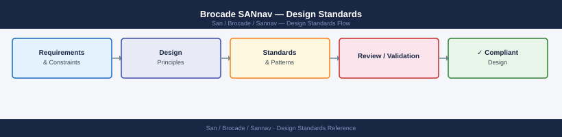

---
tags:
  - architecture
  - san
---
# Brocade SANnav — Design Standards



```bash
# Add SNMPv3 user matching SANnav credentials
snmpconfig --set snmpv3 -index 1 -username sannav_mgmt \
  -authtype MD5 -authpasswd <auth-pass> \
  -privtype AES128 -privpasswd <priv-pass> \
  -rwcommunity sannav_rw

# Add SANnav as trap recipient
snmpconfig --set trapdest -index 1 \
  -trapdest <sannav-ip> -severity 4 \
  -username sannav_mgmt -authtype MD5 -authpasswd <auth-pass> \
  -privtype AES128 -privpasswd <priv-pass> -trapport 162

# Verify
snmpconfig --show snmpv3
snmpconfig --show trapdest
```


---

```d2
direction: right

center: "SANnav" {shape: hexagon}
component_a: "Component A" {shape: rectangle}
component_b: "Component B" {shape: rectangle}
component_c: "Component C" {shape: rectangle}

center -> component_a
center -> component_b
center -> component_c
```

## See also

- [Sannav — How It Works](how-it-works/)
- [Sannav — Integrations](integrations/)
- [Sannav — Deploy](../deploy/)
