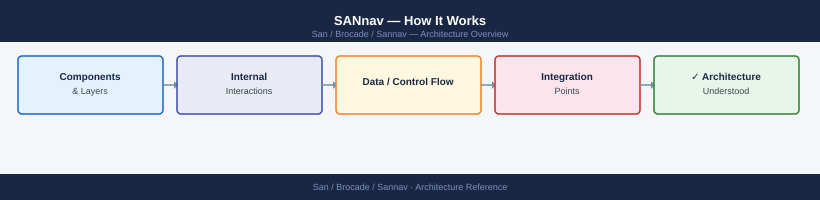
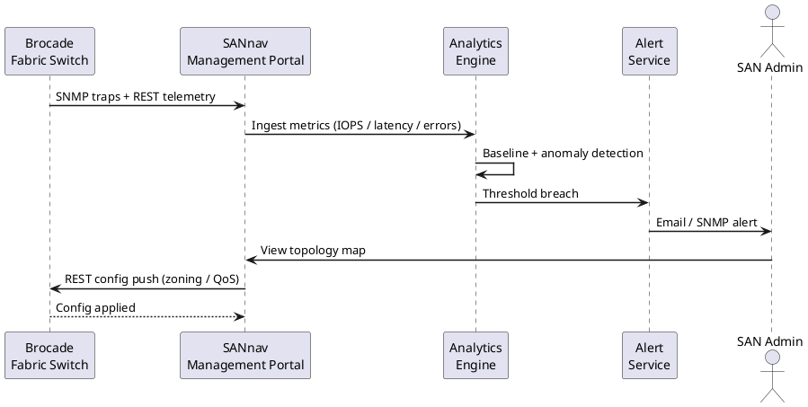
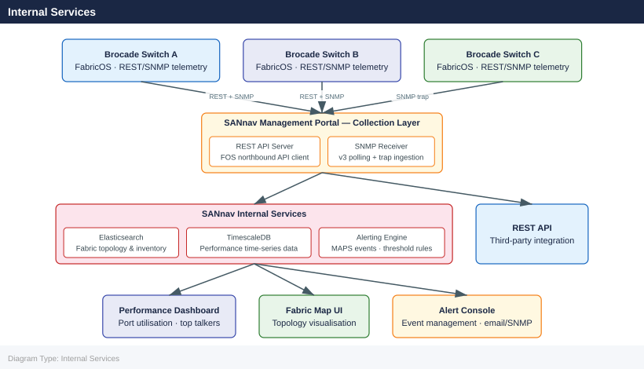

---
tags:
  - architecture
  - san
---
# SANnav — How It Works

How It Works reference covering Overview, Deployment Topology, Supported Hardware, Network Requirements, VM Sizing and 2 more sections.

*Applies to: Brocade FOS 9.x*

## Overview

Brocade SANnav is a SAN management platform delivered in two variants:

- **SANnav Management Portal** — single-fabric or multi-fabric management for day-to-day operations: zoning, firmware management, MAPS policies, performance dashboards, inventory, and event management. Deployed as a standalone virtual appliance (OVA/ISO).
- **SANnav Global View** — aggregation layer for large environments with multiple portal instances. Provides a consolidated dashboard, cross-fabric health summary, and centralised alert aggregation.

## Deployment Topology

## Supported Hardware

| Platform | Gen | Max Ports | Notes |
|---|---|---|---|
| G730 Director | Gen 7 | 384 | 64G FC, NVMe-oF |
| G720 Director | Gen 7 | 192 | 32/64G FC |
| G630 Director | Gen 6 | 384 | 32G FC |
| G620 Director | Gen 6 | 128 | 32G FC |
| X7-8 Director | Gen 7 | 512 | 64G FC, high density |
| X6-8 Director | Gen 6 | 512 | 32G FC |

Legacy Gen 5 hardware (6510, 6520, DCX 8510) is supported in monitoring mode with reduced feature availability.

## Network Requirements

| Communication | Protocol | Port | Direction |
|---|---|---|---|
| SANnav → switch | HTTPS | 443 | Outbound from SANnav |
| SANnav → switch | SNMP v3 | 161/UDP | Outbound from SANnav |
| Switch → SANnav | SNMP trap | 162/UDP | Inbound to SANnav |
| Browser → SANnav | HTTPS | 443 | Inbound to SANnav |
| SANnav → LDAP | LDAPS | 636 | Outbound from SANnav |
| Portal → Global View | HTTPS | 443 | Outbound from Portal |

## VM Sizing

### Management Portal

| Environment | vCPU | RAM | Storage | Max Switches |
|---|---|---|---|---|
| Small (≤ 50 switches) | 8 | 32 GB | 300 GB | 50 |
| Medium (≤ 150 switches) | 16 | 64 GB | 500 GB | 150 |
| Large (≤ 300 switches) | 24 | 96 GB | 1 TB | 300 |

### Global View

| Environment | vCPU | RAM | Storage | Max Portals |
|---|---|---|---|---|
| Standard | 8 | 32 GB | 500 GB | 10 |

Hypervisors supported: VMware ESXi 6.7+, 7.x; KVM.

## Internal Services

| Service | Role |
|---|---|
| Discovery engine | Continuous fabric topology polling via HTTPS/SNMP |
| Event engine | SNMP trap processing, alert evaluation, email/SNMP forwarding |
| MAPS analytics | MAPS policy violation monitoring and trending |
| SAN analytics | I/O performance data ingestion and visualisation |
| Image management | Firmware repository, staged upgrades |
| Zone manager | Zoning configuration push, alias management |
| Time-series DB | Performance metric retention (internal InfluxDB) |
| PostgreSQL | Configuration, inventory, user, and event data |

## Integrations

| System | Integration |
|---|---|
| VMware vCenter | Pulls host WWN data for end-to-end path visibility |
| ServiceNow / ticketing | Alert forwarding via email or webhook (HTTPS POST) |
| SIEM | Syslog forwarding from SANnav; SNMP trap forwarding |
| Active Directory / LDAP | User authentication and group-based role assignment |

---

## See also

- [Sannav — Design Standards](../design-standards/)
- [Sannav — Integrations](../integrations/)
- [Sannav — Deploy](../../deploy/)
