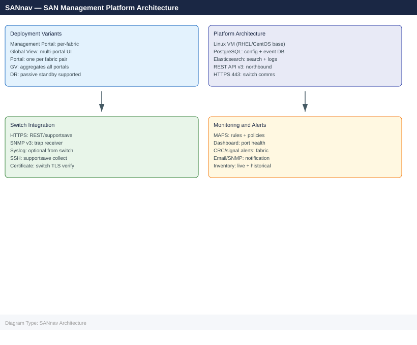
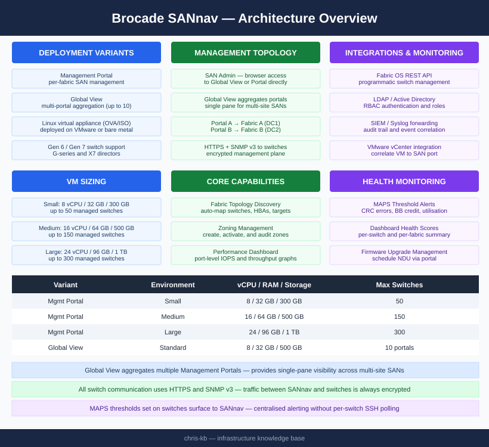

---
tags:
  - architecture
  - san
description: "Brocade SANnav is a SAN management platform in two variants: Management Portal (per-fabric operations) and Global View (multi-portal aggregation)..."
---
# SANnav — Architecture

Brocade SANnav is a SAN management platform in two variants: Management Portal (per-fabric operations) and Global View (multi-portal aggregation). Deployed as Linux virtual appliances; communicates with switches via HTTPS and SNMP v3.

*Applies to: Brocade FOS 9.x*

<a class="kb-card" href="how-it-works/"><strong>How It Works</strong>How it works, integrations, and design standards.</a>
<a class="kb-card" href="integrations/"><strong>Integrations</strong>Integration with Brocade FC switches, vCenter, LDAP, and SIEM.</a>
<a class="kb-card" href="design-standards/"><strong>Design Standards</strong>Sizing guidelines, HA design, and deployment best practices.</a>

## VM Sizing

| Variant | Environment | vCPU | RAM | Storage | Max Switches |
|---|---|---|---|---|---|
| Management Portal | Small | 8 | 32 GB | 300 GB | 50 |
| Management Portal | Medium | 16 | 64 GB | 500 GB | 150 |
| Management Portal | Large | 24 | 96 GB | 1 TB | 300 |
| Global View | Standard | 8 | 32 GB | 500 GB | 10 portals |

## Management Topology

