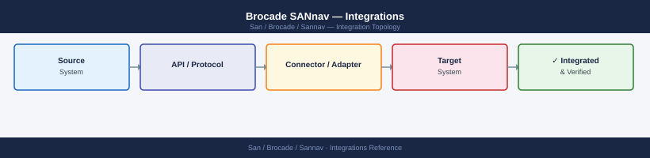

---
tags:
  - architecture
  - san
---
# Brocade SANnav — Integrations


```bash
# SSH to SANnav appliance
ssh admin@sannav-mgmt.corp.example.com

# Edit rsyslog configuration
sudo vi /etc/rsyslog.d/sannav-forward.conf

# Add:
*.* @10.10.3.50:514        # UDP syslog
# or
*.* @@10.10.3.50:514       # TCP syslog (more reliable)

# Restart rsyslog
sudo systemctl restart rsyslog

# Verify forwarding
logger -t sannav-test "Test syslog message from SANnav"
# Check SIEM for the test message
```


```text title="Expected output"
admin@sannav-mgmt.corp.example.com's password: 
Last login: Wed Mar 13 14:22:18 2024 from 10.10.2.45
sannav-mgmt:~$ sudo vi /etc/rsyslog.d/sannav-forward.conf
sannav-mgmt:~$ sudo systemctl restart rsyslog
sannav-mgmt:~$ logger -t sannav-test "Test syslog message from SANnav"
sannav-mgmt:~$ tail -f /var/log/syslog | grep sannav-test
Mar 13 14:23:42 sannav-mgmt sannav-test: Test syslog message from SANnav
```

!!! warning "Common errors"
    **`sudo: vi: command not found`** — Use `sudo nano /etc/rsyslog.d/sannav-forward.conf` or install vim with `sudo apt-get install vim`.
    **`Job for rsyslog.service failed because the control process exited with error code.`** — Check syntax errors in the config file with `sudo rsyslogd -N1` before restarting.
    **`Connection refused`** — Verify the syslog server at 10.10.3.50:514 is listening with `nc -zv 10.10.3.50 514` and firewall rules allow outbound traffic.
---

## See also

- [Sannav — How It Works](../how-it-works/)
- [Sannav — Design Standards](../design-standards/)
