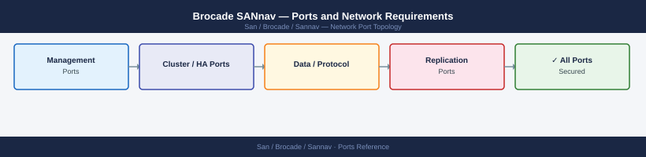

---
tags:
  - brocade
  - sannav
  - san
  - networking
  - firewall
  - ports
---
# Brocade SANnav — Ports and Network Requirements

<div class="kb-summary">
Firewall port reference for Brocade SANnav Management Portal. SANnav is the SAN management and analytics platform for Brocade FC switches. It collects telemetry, manages zoning, and provides dashboards for SAN health.

*Applies to: SANnav 2.3.x+*
</div>


## Before you begin

- SANnav runs as a virtual appliance (OVA); all admin access uses HTTPS on 443
- SANnav discovers and manages switches via SSH (22) and optionally SNMP — both are outbound from SANnav to switches
- SNMP traps are inbound from switches to SANnav on 162
- No inbound connection from SANnav to switches is required on any port other than 22 and 443/161 (all initiated from SANnav side)

---

## Inbound — Admin to SANnav

| Port | Protocol | Source | Purpose |
|---|---|---|---|
| 443 | TCP | Admin browsers, REST API clients | SANnav web UI and REST API |
| 22 | TCP | Jump hosts | SSH — SANnav appliance OS management |
| 5480 | TCP | Admin workstations | VAMI appliance management (if OVA-based deployment) |

---

## SANnav to Managed Switches

| Port | Protocol | Source | Destination | Purpose |
|---|---|---|---|---|
| 22 | TCP | SANnav | FC switch management IPs | SSH — device management, telemetry collection, zoning push |
| 443 | TCP | SANnav | FC switch management IPs | REST API (FOS 9.x) — modern device management |
| 161 | UDP | SANnav | FC switch management IPs | SNMP polling |

---

## Inbound — SNMP Traps from Switches

| Port | Protocol | Source | Destination | Purpose |
|---|---|---|---|---|
| 162 | UDP | FC switch management IPs | SANnav | SNMP traps — hardware events, port state changes |

---

## SANnav to External Services

| Port | Protocol | Destination | Purpose |
|---|---|---|---|
| 443 | TCP | *.broadcom.com | License check, support bundles, Call Home |
| 123 | UDP | NTP server | Time synchronisation |
| 25 | TCP | SMTP relay | Email alert delivery |
| 514 | UDP/TCP | Syslog server | SANnav event log forwarding |
| 389/636 | TCP | Active Directory DCs | Admin user LDAP/LDAPS authentication |

---

## Firewall Zone Summary

| From | To | Ports | Notes |
|---|---|---|---|
| Admin browsers | SANnav | 443 | UI and REST API |
| SANnav | FC switch mgmt IPs | 22, 443, 161 UDP | Discovery and management |
| FC switches | SANnav | 162 UDP | SNMP traps (inbound to SANnav) |
| SANnav | *.broadcom.com | 443 | License and support (outbound) |
| SANnav | LDAP/AD | 636 TCP | Admin authentication |

---

## Verify

```bash
# From admin workstation — test SANnav UI
curl -sk -o /dev/null -w "%{http_code}" https://<sannav-ip>/

# From SANnav SSH — test switch SSH connectivity
ssh admin@<switch-mgmt-ip> switchshow | head -5

# From monitoring host — test SNMP trap receiver (SANnav side)
nc -zu <sannav-ip> 162

# From switch CLI — verify SANnav is registered as SNMP trap target
snmpconfig --show snmpv1

# From SANnav — verify discovered switches
# Navigate: SANnav UI → Dashboard → Switches view
```

---

## See also

- [Brocade SANnav — Architecture](how-it-works/)
- [Brocade FOS — Ports](../../fabric-os/architecture/ports.md)
- [Cisco MDS — Ports](../../../cisco/mds/architecture/ports.md)
