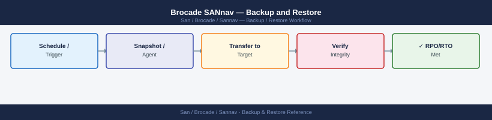

---
tags:
  - operations
  - san
---
# Brocade SANnav — Backup and Restore


```bash
ssh admin@sannav-dc1.corp.example.com

# Trigger a manual backup
sannav backup --type full --destination /opt/sannav/backups/

# Monitor backup progress
sannav backup --status

# List available local backups
ls -lh /opt/sannav/backups/

# Copy backup to remote server (if not using SANnav's built-in remote transfer)
scp /opt/sannav/backups/sannav-backup-20260506.tar.gz \
    bkp-user@backup-server.corp.example.com:/backups/sannav/dc1/
```


```text title="Expected output"
admin@sannav-dc1.corp.example.com's password: 
Welcome to Brocade SANnav Management System v9.2.1
Last login: Mon May 6 10:34:22 2026 from 203.0.113.45

sannav-dc1> sannav backup --type full --destination /opt/sannav/backups/
[INFO] Starting full backup of SANnav configuration and database
[INFO] Backup ID: bkp-20260506-143052-a7f2c9e1
[INFO] Destination: /opt/sannav/backups/
[INFO] Estimated time: 8-12 minutes
Backup initiated successfully. Job ID: a7f2c9e1

sannav-dc1> sannav backup --status
Backup Job Status Report
Job ID: a7f2c9e1
Status: IN_PROGRESS
Progress: 67%
Elapsed Time: 5m 23s
Estimated Remaining: 2m 45s
Current Phase: Database export (table 12 of 18)

sannav-dc1> ls -lh /opt/sannav/backups/
total 2.3G
-rw-r--r-- 1 sannav sannav 1.2G May  5 18:22 sannav-backup-20260505.tar.gz
-rw-r--r-- 1 sannav sannav 1.1G May  6 14:30 sannav-backup-20260506.tar.gz
drwxr-xr-x 2 sannav sannav 4.0K May  6 14:35 staging

sannav-dc1> scp /opt/sannav/backups/sannav-backup-20260506.tar.gz \
>     bkp-user@backup-server.corp.example.com:/backups/sannav/dc1/
sannav-backup-20260506.tar.gz          100%  1.1GB   45.2MB/s   00:24
```

!!! warning "Common errors"
    **`sannav backup --type full --destination /opt/sannav/backups/: command not found`** — Verify the SANnav CLI is in your PATH by running `which sannav` or source the SANnav environment setup script.
    **`Permission denied (publickey,password).`** — Ensure the SSH key or credentials for `bkp-user@backup-server.corp.example.com` are configured correctly and the user has write permissions to `/backups/sannav/dc1/`.
    **`sannav backup --status: Job not found or expired`** — Run `sannav backup --list` to retrieve the correct active job ID and ensure the backup hasn't already completed or timed out.
## Before you begin

- **Access:** Storage admin credentials (cluster admin or equivalent)
- **Timing:** safe to run during business hours unless a step is marked ⚠ (causes interruption)
- **Dependencies:** no active upgrades or migrations on the same infrastructure
- **Logging:** capture command output — paste into the change record on completion

---

---

## Verify

- Confirm the operation completed without errors in the log or management UI
- Verify the expected state change is visible (service running, object created, config applied)
- Document the outcome in the change record

---

## See also

- [Sannav — Procedures](../procedures/)
- [Sannav — Health Checks](../health-checks/)
- [Sannav — Common Issues](../../troubleshooting/common-issues/)
