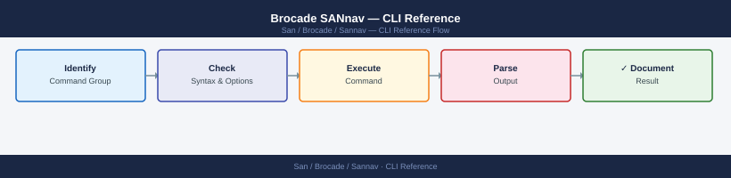

---
tags:
  - operations
  - san
---
# Brocade SANnav — CLI Reference



```bash
# Show status of all SANnav services
sannav status

# Start all services
sannav start

# Stop all services (maintenance only)
sannav stop

# Restart all services
sannav restart

# Show current version
sannav version

# Show license summary
sannav license
```

```bash
# Show current IP configuration
ip addr show eth0

# Show hostname
hostname

# Show DNS configuration
cat /etc/resolv.conf

# Test connectivity to a managed switch
curl -sk -o /dev/null -w "%{http_code}" https://<switch-ip>/rest/loginresult
# Expected: 200 or 401 (reachable); anything else = connectivity problem

# Test LDAP connectivity
ldapsearch -H ldaps://ldap.corp.example.com \
  -D "CN=sannav-svc,OU=Service Accounts,DC=corp,DC=example,DC=com" \
  -w <password> -b "DC=corp,DC=example,DC=com" "(sAMAccountName=testuser)"
```
```bash
# Main application log
tail -f /opt/sannav/logs/server.log

# Discovery engine log
tail -f /opt/sannav/logs/discovery.log

# Event processing log
tail -f /opt/sannav/logs/event-engine.log

# Upgrade log
cat /opt/sannav/logs/upgrade.log

# Search logs for errors in the last 100 lines
grep -i "ERROR\|FATAL\|Exception" /opt/sannav/logs/server.log | tail -100

# Show system journal (OS-level)
journalctl -u sannav -n 100 --no-pager
```
```bash
# Disk usage
df -h

# Check SANnav data directory size
du -sh /opt/sannav/data/

# Check database sizes individually
du -sh /opt/sannav/data/postgres/
du -sh /opt/sannav/data/influxdb/

# Memory usage
free -h

# CPU load
uptime
```
```bash
# Login — obtain token
TOKEN=$(curl -sk -X POST https://sannav-dc1.corp.example.com/rest/login \
  -H "Content-Type: application/json" \
  -d '{"credentials":{"loginName":"svc-monitor","password":"<password>"}}' \
  | python3 -c "import sys,json; print(json.load(sys.stdin)['authToken'])")

echo "Token: $TOKEN"

# Logout (always clean up sessions)
curl -sk -X DELETE https://sannav-dc1.corp.example.com/rest/logout \
  -H "Authorization: Bearer $TOKEN"
```
```bash
# List all resource groups (fabrics)
curl -sk https://sannav-dc1.corp.example.com/rest/resourcegroups \
  -H "Authorization: Bearer $TOKEN" | python3 -m json.tool

# List all switches
curl -sk https://sannav-dc1.corp.example.com/rest/resourcegroups/all/switches \
  -H "Authorization: Bearer $TOKEN" | python3 -m json.tool

# Get a specific switch (replace <switchId>)
curl -sk "https://sannav-dc1.corp.example.com/rest/resourcegroups/all/switches/<switchId>" \
  -H "Authorization: Bearer $TOKEN" | python3 -m json.tool

# List all ports (can be large — pipe through grep for filtering)
curl -sk https://sannav-dc1.corp.example.com/rest/resourcegroups/all/ports \
  -H "Authorization: Bearer $TOKEN" \
  | python3 -m json.tool | grep -E '"portState"|"portType"|"portWwn"'
```
```bash
# Get active alerts (last 100)
curl -sk "https://sannav-dc1.corp.example.com/rest/resourcegroups/all/events?limit=100&filter=acknowledged:false" \
  -H "Authorization: Bearer $TOKEN" | python3 -m json.tool

# Get events for a specific switch
curl -sk "https://sannav-dc1.corp.example.com/rest/resourcegroups/all/events?switchId=<switchId>" \
  -H "Authorization: Bearer $TOKEN" | python3 -m json.tool
```
```bash
# Get defined zone set for a fabric
curl -sk "https://sannav-dc1.corp.example.com/rest/resourcegroups/<fabricId>/zonedb" \
  -H "Authorization: Bearer $TOKEN" | python3 -m json.tool

# Get active zone set
curl -sk "https://sannav-dc1.corp.example.com/rest/resourcegroups/<fabricId>/zones/active" \
  -H "Authorization: Bearer $TOKEN" | python3 -m json.tool
```
```bash
# Export all switches to CSV (use Accept header for CSV format)
curl -sk https://sannav-dc1.corp.example.com/rest/resourcegroups/all/switches \
  -H "Authorization: Bearer $TOKEN" \
  -H "Accept: text/csv" -o switches-$(date +%Y%m%d).csv

echo "Exported to switches-$(date +%Y%m%d).csv"
```
```bash
# List available firmware images
curl -sk https://sannav-dc1.corp.example.com/rest/firmware/images \
  -H "Authorization: Bearer $TOKEN" | python3 -m json.tool

# Initiate firmware upgrade on a switch
curl -sk -X POST "https://sannav-dc1.corp.example.com/rest/firmware/upgrade" \
  -H "Authorization: Bearer $TOKEN" \
  -H "Content-Type: application/json" \
  -d '{
    "switchIds": ["<switchId>"],
    "firmwareVersion": "9.2.1a",
    "activationMode": "AUTO"
  }' | python3 -m json.tool
```
```bash
# Count managed switches by connectivity state
curl -sk https://sannav-dc1.corp.example.com/rest/resourcegroups/all/switches \
  -H "Authorization: Bearer $TOKEN" \
  | python3 -c "
import sys, json, collections
data = json.load(sys.stdin)
states = collections.Counter(s.get('connectivityState') for s in data.get('switches', []))
print(dict(states))
"

# List all offline F_Ports (potential host/storage connectivity issues)
curl -sk https://sannav-dc1.corp.example.com/rest/resourcegroups/all/ports \
  -H "Authorization: Bearer $TOKEN" \
  | python3 -c "
import sys, json
data = json.load(sys.stdin)
for p in data.get('ports', []):
    if p.get('portType') == 'F_PORT' and p.get('portState') != 'ONLINE':
        print(p.get('switchName'), p.get('portIndex'), p.get('portState'))
"
```

## Before you begin

- **Access:** Storage admin credentials (cluster admin or equivalent)
- **Timing:** safe to run during business hours unless a step is marked ⚠ (causes interruption)
- **Dependencies:** no active upgrades or migrations on the same infrastructure
- **Logging:** capture command output — paste into the change record on completion

---

---

## Verify

- Confirm the operation completed without errors in the log or management UI
- Verify the expected state change is visible (service running, object created, config applied)
- Document the outcome in the change record

---

## See also

- [Sannav — Procedures](procedures/)
- [Sannav — Scripts](scripts/)
- [Sannav — Health Checks](health-checks/)
