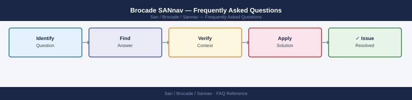

---
tags:
  - sannav
  - faq
  - operations
description: "Common questions about Brocade SANnav operations, configuration, and troubleshooting. For step-by-step procedures, see the Operations section."
---
# Brocade SANnav — Frequently Asked Questions

*Applies to: Brocade FOS 9.x*

Common questions about Brocade SANnav operations, configuration, and troubleshooting. For step-by-step procedures, see the <a href="index.md">Operations</a> section.

## General

**Q: What SANnav version is recommended?**
A: SANnav 2.3.x is the current release. Check via SANnav UI → Administration → About SANnav. SANnav runs as a Docker-based appliance — update via `sannav upgrade` CLI.

**Q: How do I check the current Brocade SANnav version?**
A: `sannav --version`

## Configuration

**Q: What is the default performance polling interval and when should it change?**
A: Default is 60 seconds. Reduce to 30 seconds for high-density environments where you need tighter visibility into congestion events. Increasing to 300 seconds reduces database growth for large fabrics.

**Q: How do I enable SANnav Flow Vision for latency monitoring?**
A: Flow Vision is enabled per-fabric under Fabric → Flow Vision → Enable. Requires FOS 8.2.1+ on monitored switches. Generates per-flow latency metrics visible in SANnav dashboards.

## Operations

**Q: How do I upgrade SANnav without losing historical data?**
A: Back up the SANnav database before upgrade (`sannav backup`). Run the upgrade via `sannav upgrade <image>`. Historical data is preserved in the PostgreSQL backend. Verify fabric connectivity post-upgrade.

**Q: What is the correct procedure to add a new fabric to SANnav?**
A: Navigate to Fabrics → Add Fabric. Provide the seed switch IP and credentials. SANnav discovers the entire fabric via SNMP and REST. Verify all switches appear under the fabric view within 5 minutes.

## Troubleshooting

**Q: SANnav shows 'Switch Not Reachable'. What does it mean?**
A: SANnav cannot reach the switch via management IP. Check network connectivity, SNMP community strings, and firewall rules (port 161/UDP, 443/TCP). Verify the switch management IP matches what SANnav has configured.

**Q: SANnav UI is slow — where do I start?**
A: Check SANnav server resource usage (`docker stats`). Increase JVM heap if under-allocated. Review the number of discovered switches — very large fabrics (500+ switches) require the large-deployment sizing. Purge old performance data.

## Backup and Recovery

**Q: How often should I back up SANnav?**
A: Weekly automated backup via `sannav backup --schedule`. Store backups off the SANnav host. Include the backup in your overall infrastructure backup strategy. Test restore to a secondary SANnav instance annually.

**Q: Can I restore SANnav to a previous version if an upgrade fails?**
A: Yes — if the upgrade fails and a rollback is needed, restore from the pre-upgrade backup using `sannav restore <backup-file>`. This restores both the application and database to the pre-upgrade state.

## See Also

- [Brocade SANnav Operations](index.md)
- [Brocade SANnav Troubleshooting](../troubleshooting/index.md)
