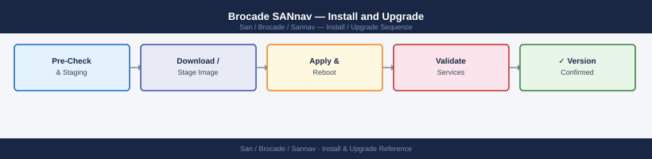

---
tags:
  - operations
  - san
---
# Brocade SANnav — Install and Upgrade

*Applies to: Brocade FOS 9.x*


```bash
# After VM powers on, access the console or SSH with default credentials
# Default credentials: admin / passw0rd (change on first login)
ssh admin@<sannav-ip>

# Verify network connectivity
ping 8.8.8.8       # or internal NTP/DNS server
hostname           # should return configured FQDN

# Check service startup
sannav status
# Wait 5-10 minutes for all services to start on first boot

# Change default admin password
passwd admin
```


```text title="Expected output"
admin@192.168.1.50's password: 
Last login: Thu Jan 16 10:23:47 2025 from 10.0.0.15
Welcome to Brocade SANnav Management Server
admin@sannav-prod-01:~$ ping 8.8.8.8
PING 8.8.8.8 (8.8.8.8) 56(84) bytes of data.
64 bytes from 8.8.8.8: icmp_seq=1 ttl=119 time=12.4 ms
64 bytes from 8.8.8.8: icmp_seq=2 ttl=119 time=11.8 ms
--- 8.8.8.8 statistics ---
2 packets transmitted, 2 received, 0% packet loss, time 1001ms
admin@sannav-prod-01:~$ hostname
sannav-prod-01.corp.local
admin@sannav-prod-01:~$ sannav status
SANnav Platform Services Status:
  sannav-platform: running (PID 2847)
  sannav-database: running (PID 2891)
  sannav-web: running (PID 2934)
  sannav-snmp: running (PID 2978)
admin@sannav-prod-01:~$ passwd admin
Changing password for user admin.
Current password: 
New password: 
Retype new password: 
passwd: password updated successfully
```

!!! warning "Common errors"
    | Error | Fix |
    |---|---|
    | `ssh: connect to host <sannav-ip> port 22: Connection refused` | Wait 2–3 minutes for SSH daemon to start after VM powers on, then retry. |
    | `sannav status: command not found` | Source the SANnav environment or add `/opt/sannav/bin` to PATH with `export PATH=$PATH:/opt/sannav/bin`. |
    | `Permission denied (publickey,password)` | Verify default credentials are `admin`/`passw0rd` and that the admin account has not been locked; reset via console if needed. |
```bash
# On each switch (FOS CLI)
snmpconfig --set trapdest -index <n> -trapdest 0.0.0.0   # clear trap destination
userconfig --delete sannav_svc
```


```text title="Expected output"
Trap destination at index 1 cleared successfully.
User sannav_svc deleted successfully.
```

!!! warning "Common errors"
    | Error | Fix |
    |---|---|
    | `Invalid index <n>` | Replace `<n>` with a valid integer (typically 1–4) matching your switch's trap destination configuration. |
    | `User sannav_svc does not exist` | Verify the exact username with `userconfig --show` before deletion; the service account name may differ per environment. |
## Before you begin

- **Access:** Storage admin credentials (cluster admin or equivalent)
- **Timing:** safe to run during business hours unless a step is marked ⚠ (causes interruption)
- **Dependencies:** no active upgrades or migrations on the same infrastructure
- **Logging:** capture command output — paste into the change record on completion

---

---

## Verify

- Confirm the operation completed without errors in the log or management UI
- Verify the expected state change is visible (service running, object created, config applied)
- Document the outcome in the change record

---

## See also

- [Sannav — Procedures](../procedures/)
- [Sannav — Health Checks](../health-checks/)
- [Sannav — Deploy](../../deploy/)
