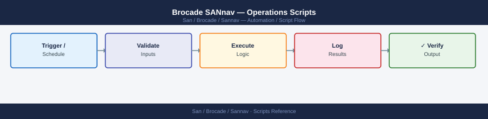

---
tags:
  - operations
  - san
---
# Brocade SANnav — Operations Scripts



```bash
#!/usr/bin/env bash
# sannav-auth.sh — obtain and export a SANnav API token

SANNAV_HOST="https://sannav-dc1.corp.example.com"
SANNAV_USER="svc-automation"
SANNAV_PASS="${SANNAV_PASS:-}"  # pass via env variable

if [[ -z "$SANNAV_PASS" ]]; then
  echo "ERROR: Set SANNAV_PASS environment variable"
  exit 1
fi

export SANNAV_TOKEN=$(curl -sk -X POST "${SANNAV_HOST}/rest/login" \
  -H "Content-Type: application/json" \
  -d "{\"credentials\":{\"loginName\":\"${SANNAV_USER}\",\"password\":\"${SANNAV_PASS}\"}}" \
  | python3 -c "import sys,json; print(json.load(sys.stdin).get('authToken',''))")

if [[ -z "$SANNAV_TOKEN" ]]; then
  echo "ERROR: Failed to obtain SANnav token"
  exit 1
fi

echo "Authenticated as ${SANNAV_USER}"

cleanup() {
  curl -sk -X DELETE "${SANNAV_HOST}/rest/logout" \
    -H "Authorization: Bearer ${SANNAV_TOKEN}" > /dev/null
  echo "Session logged out"
}
trap cleanup EXIT
```

```python
#!/usr/bin/env python3
# sannav-offline-ports.py

import sys, json, os, csv
import urllib.request, ssl

HOST = "https://sannav-dc1.corp.example.com"
USER = "svc-monitor"
PASS = os.environ.get("SANNAV_PASS", "")

ctx = ssl.create_default_context()
ctx.check_hostname = False
ctx.verify_mode = ssl.CERT_NONE

def api_get(path, token):
    req = urllib.request.Request(HOST + path,
          headers={"Authorization": f"Bearer {token}"})
    with urllib.request.urlopen(req, context=ctx) as r:
        return json.load(r)

# Login
import urllib.parse
req = urllib.request.Request(HOST + "/rest/login", method="POST",
      data=json.dumps({"credentials": {"loginName": USER, "password": PASS}}).encode(),
      headers={"Content-Type": "application/json"})
with urllib.request.urlopen(req, context=ctx) as r:
    TOKEN = json.load(r)["authToken"]

try:
    data = api_get("/rest/resourcegroups/all/ports", TOKEN)
    writer = csv.writer(sys.stdout)
    writer.writerow(["Switch", "Port", "Type", "State", "Connected WWN"])
    for p in data.get("ports", []):
        ptype = p.get("portType", "")
        state = p.get("portState", "")
        if ptype in ("F_PORT", "E_PORT") and state != "ONLINE":
            writer.writerow([
                p.get("switchName", ""),
                p.get("portIndex", ""),
                ptype,
                state,
                p.get("connectedWwn", "")
            ])
finally:
    req = urllib.request.Request(HOST + "/rest/logout", method="DELETE",
          headers={"Authorization": f"Bearer {TOKEN}"})
    urllib.request.urlopen(req, context=ctx).close()
```
```bash
#!/usr/bin/env bash
# sannav-zone-export.sh
# Cron: 0 2 * * * /opt/scripts/sannav-zone-export.sh >> /var/log/sannav-zone-export.log 2>&1

SANNAV_HOST="https://sannav-dc1.corp.example.com"
EXPORT_DIR="/opt/sannav-exports/zones"
DATE=$(date +%Y%m%d)

mkdir -p "${EXPORT_DIR}"

# Get token
TOKEN=$(curl -sk -X POST "${SANNAV_HOST}/rest/login" \
  -H "Content-Type: application/json" \
  -d "{\"credentials\":{\"loginName\":\"svc-automation\",\"password\":\"${SANNAV_PASS}\"}}" \
  | python3 -c "import sys,json; print(json.load(sys.stdin)['authToken'])")

# Get list of fabric IDs
FABRICS=$(curl -sk "${SANNAV_HOST}/rest/resourcegroups" \
  -H "Authorization: Bearer ${TOKEN}" \
  | python3 -c "
import sys,json
data = json.load(sys.stdin)
for rg in data.get('resourceGroups',[]):
    print(rg['id'], rg['name'].replace(' ','-'))
")

# Export zone set for each fabric
while IFS=' ' read -r FABRIC_ID FABRIC_NAME; do
  OUTPUT="${EXPORT_DIR}/${FABRIC_NAME}-zones-${DATE}.json"
  curl -sk "${SANNAV_HOST}/rest/resourcegroups/${FABRIC_ID}/zonedb" \
    -H "Authorization: Bearer ${TOKEN}" \
    -o "${OUTPUT}"
  echo "Exported: ${OUTPUT}"
done <<< "${FABRICS}"

# Cleanup old exports (keep 90 days)
find "${EXPORT_DIR}" -name "*.json" -mtime +90 -delete

# Logout
curl -sk -X DELETE "${SANNAV_HOST}/rest/logout" \
  -H "Authorization: Bearer ${TOKEN}" > /dev/null

echo "Zone export complete: $(date)"
```
```python
#!/usr/bin/env python3
# sannav-firmware-check.py

import sys, json, os
import urllib.request, ssl
from packaging.version import Version  # pip install packaging

HOST = "https://sannav-dc1.corp.example.com"
PASS = os.environ.get("SANNAV_PASS", "")

# Minimum approved firmware by model prefix
BASELINE = {
    "G730": "9.2.1a",
    "G720": "9.2.1a",
    "G630": "9.1.1c",
    "G620": "9.1.1c",
    "G610": "9.1.1c",
}

ctx = ssl.create_default_context()
ctx.check_hostname = False
ctx.verify_mode = ssl.CERT_NONE

req = urllib.request.Request(HOST + "/rest/login", method="POST",
      data=json.dumps({"credentials": {"loginName": "svc-monitor", "password": PASS}}).encode(),
      headers={"Content-Type": "application/json"})
with urllib.request.urlopen(req, context=ctx) as r:
    TOKEN = json.load(r)["authToken"]

req = urllib.request.Request(HOST + "/rest/resourcegroups/all/switches",
      headers={"Authorization": f"Bearer {TOKEN}"})
with urllib.request.urlopen(req, context=ctx) as r:
    switches = json.load(r).get("switches", [])

non_compliant = []
for sw in switches:
    model = sw.get("model", "")
    fw = sw.get("firmwareVersion", "")
    for prefix, min_ver in BASELINE.items():
        if model.startswith(prefix):
            try:
                if Version(fw.replace("v","")) < Version(min_ver):
                    non_compliant.append((sw["name"], model, fw, min_ver))
            except Exception:
                pass

if non_compliant:
    print(f"NON-COMPLIANT SWITCHES ({len(non_compliant)}):")
    for name, model, fw, required in non_compliant:
        print(f"  {name:<30} {model:<10} current={fw:<10} required>={required}")
    sys.exit(1)
else:
    print(f"All {len(switches)} switches meet firmware baseline.")

req = urllib.request.Request(HOST + "/rest/logout", method="DELETE",
      headers={"Authorization": f"Bearer {TOKEN}"})
urllib.request.urlopen(req, context=ctx).close()
```

## Before you begin

- **Access:** Storage admin credentials (cluster admin or equivalent)
- **Timing:** safe to run during business hours unless a step is marked ⚠ (causes interruption)
- **Dependencies:** no active upgrades or migrations on the same infrastructure
- **Logging:** capture command output — paste into the change record on completion

---

---

## Verify

- Confirm the operation completed without errors in the log or management UI
- Verify the expected state change is visible (service running, object created, config applied)
- Document the outcome in the change record

---

## See also

- [Sannav — Procedures](procedures/)
- [Sannav — CLI Reference](cli-reference/)
- [Sannav — Health Checks](health-checks/)
