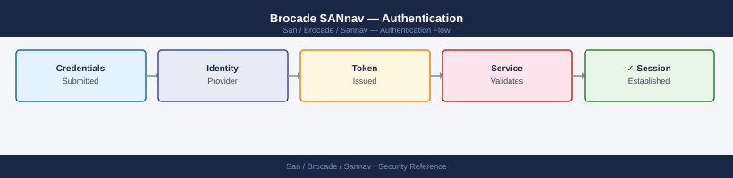

---
tags:
  - san
  - security
---
# Brocade SANnav — Authentication

*Applies to: Brocade FOS 9.x*


```bash
# Copy CA cert to SANnav appliance
scp corp-ca.crt admin@sannav-dc1.corp.example.com:/tmp/

# SSH to appliance and import
ssh admin@sannav-dc1.corp.example.com

# Import CA certificate into Java truststore used by SANnav
sudo keytool -import -trustcacerts -alias corp-ldap-ca \
  -file /tmp/corp-ca.crt \
  -keystore /opt/sannav/jre/lib/security/cacerts \
  -storepass changeit -noprompt

# Restart SANnav to pick up new truststore
sudo sannav restart
```


```text title="Expected output"
corp-ca.crt                                           100% 1847     2.1MB/s   00:00
admin@sannav-dc1.corp.example.com's password: 
Welcome to SANnav Appliance v8.4.2
Last login: Mon Jan 15 10:23:47 2024 from 10.42.18.55

Certificate was added to keystore
Restarting SANnav services...
  Stopping SANnav Portal...                           [  OK  ]
  Stopping SANnav Database...                         [  OK  ]
  Starting SANnav Database...                         [  OK  ]
  Starting SANnav Portal...                           [  OK  ]
SANnav restart completed successfully
```

!!! warning "Common errors"
    | Error | Fix |
    |---|---|
    | `keytool error: java.lang.Exception: Input not an X.509 certificate` | Verify the CA cert is in PEM format (not DER) and contains the correct `-----BEGIN CERTIFICATE-----` header. |
    | `sudo: keytool: command not found` | Run the keytool command with the full path `/opt/sannav/jre/bin/keytool` instead of relying on PATH. |
    | `Permission denied (publickey,password)` | Ensure the admin user's SSH key is configured or password authentication is enabled on the SANnav appliance. |
## Before you begin

- **Access:** Storage admin credentials (cluster admin or equivalent)
- **Change management:** security changes require CAB approval in most environments
- **Rollback plan:** document current state before any security control change
- **Testing:** validate in a non-production environment first where possible

---

---

## See also

- [Sannav — Access Control](../access-control/)
- [Sannav — Hardening](../hardening/)
- [Sannav — Encryption](../encryption/)
