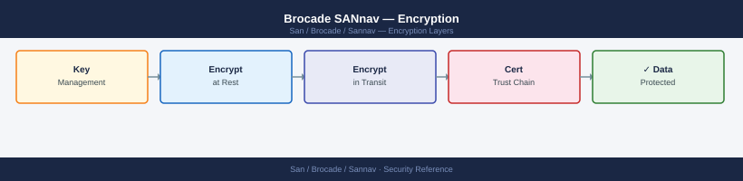

---
tags:
  - san
  - security
---
# Brocade SANnav — Encryption


```bash
ssh admin@sannav-dc1.corp.example.com

# Generate a 4096-bit RSA key and CSR
openssl req -new -newkey rsa:4096 -nodes \
  -keyout /tmp/sannav.key \
  -out /tmp/sannav.csr \
  -subj "/CN=sannav-dc1.corp.example.com/OU=Infrastructure/O=Corp/C=AU" \
  -addext "subjectAltName=DNS:sannav-dc1.corp.example.com,IP:10.10.5.20"

# Submit /tmp/sannav.csr to your CA
# After receiving sannav.crt (and any intermediate certs):

cat sannav.crt intermediate-ca.crt > /tmp/sannav-bundle.crt

sudo install -m 640 /tmp/sannav.key    /opt/sannav/conf/ssl/server.key
sudo install -m 644 /tmp/sannav-bundle.crt /opt/sannav/conf/ssl/server.crt

# Reload NGINX without service interruption
sudo systemctl reload nginx

# Verify the new certificate is served
openssl s_client -connect sannav-dc1.corp.example.com:443 -servername sannav-dc1.corp.example.com \
  </dev/null 2>/dev/null | openssl x509 -noout -subject -issuer -dates
```


```text title="Expected output"
admin@sannav-dc1.corp.example.com's password: 
Generating a 4096 bit RSA private key
.....................................................................++
.....................................................................++
writing new request to /tmp/sannav.csr
subject=C = AU, O = Corp, OU = Infrastructure, CN = sannav-dc1.corp.example.com

subject=C = AU, O = Corp, OU = Infrastructure, CN = sannav-dc1.corp.example.com
issuer=C = AU, O = Corp, CN = Corp Intermediate CA
notBefore=Jan 15 10:23:45 2025 GMT
notAfter=Jan 15 10:23:45 2026 GMT
```

!!! warning "Common errors"
    **`sudo: no tty present and no askpass program specified`** — Run `ssh -t admin@sannav-dc1.corp.example.com` to allocate a pseudo-terminal for sudo commands.
    **`cat: sannav.crt: No such file or directory`** — Ensure the CA-signed certificate file is in the current working directory or provide the full path to the certificate.
    **`openssl s_client: connect: Connection refused`** — Verify NGINX reloaded successfully with `sudo systemctl status nginx` and confirm port 443 is listening with `sudo netstat -tlnp | grep 443`.
## Before you begin

- **Access:** Storage admin credentials (cluster admin or equivalent)
- **Change management:** security changes require CAB approval in most environments
- **Rollback plan:** document current state before any security control change
- **Testing:** validate in a non-production environment first where possible

---

---

## See also

- [Sannav — Hardening](../hardening/)
- [Sannav — Authentication](../authentication/)
- [Sannav — Access Control](../access-control/)
