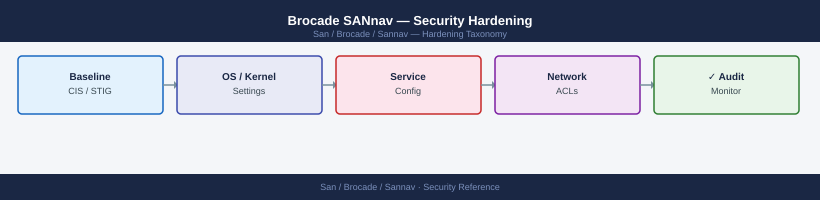

---
tags:
  - san
  - security
---
# Brocade SANnav — Security Hardening


```bash
# SSH to SANnav appliance
ssh admin@sannav-dc1.corp.example.com

# Change default admin password immediately after deployment
passwd admin
# Use a password that meets the corporate complexity policy (20+ characters)
# Store in vault; treat as break-glass

# Change default OS root password (if accessible)
sudo passwd root
```


```text title="Expected output"
admin@sannav-dc1.corp.example.com's password: 
Last login: Mon Jan 15 14:32:18 2025 from 10.45.82.19
Welcome to Brocade SANnav Management Server v8.2.1
sannav-dc1:~$ passwd admin
Changing password for user admin.
Current password: 
New password: 
Retype new password: 
passwd: password updated successfully
sannav-dc1:~$ sudo passwd root
[sudo] password for admin: 
New password: 
Retype new password: 
passwd: password updated successfully
sannav-dc1:~$
```

!!! warning "Common errors"
    **`Permission denied (publickey,password).`** — Verify SSH is enabled on the SANnav appliance and the admin account exists; check network connectivity to sannav-dc1.corp.example.com.
    **`passwd: Authentication token manipulation error`** — Ensure the admin user has sufficient privileges and the /etc/shadow file is writable; try the command again after verifying sudo access.
    **`sudo: command not found`** — SANnav may not have sudo configured; use `su -` to switch to root directly instead, or contact Brocade support to enable sudo for the admin account.
```bash
sudo vi /etc/ssh/sshd_config

# Recommended settings:
Protocol 2
PermitRootLogin no
PasswordAuthentication yes     # or 'no' if using SSH key auth
PubkeyAuthentication yes
PermitEmptyPasswords no
MaxAuthTries 3
LoginGraceTime 30
ClientAliveInterval 300        # disconnect idle sessions after 5 minutes
ClientAliveCountMax 2
X11Forwarding no
AllowTcpForwarding no
AllowUsers admin sannav        # restrict SSH to specific local accounts

sudo systemctl restart sshd

# Verify
sudo sshd -T | grep -E "permitrootlogin|passwordauthentication|protocol|maxauthtries"
```

```text title="Expected output"
permitrootlogin no
passwordauthentication yes
protocol 2
maxauthtries 3
```

!!! warning "Common errors"
    **`sshd: no hostkeys available -- exiting.`** — Ensure `/etc/ssh/ssh_host_*_key` files exist; regenerate with `sudo ssh-keygen -A` if missing.
    **`Job for sshd.service failed because the control process exited with error code.`** — Check syntax errors in sshd_config with `sudo sshd -t` before restarting the service.
    **`sshd_config: line X: Bad configuration option: "AllowUsers"`** — Verify the directive name is correct (should be `AllowUsers`, not `AllowUser`) and check for typos in usernames.
```bash
# Check for available security updates
sudo yum updateinfo list security

# Apply security patches only (does not touch SANnav application packages)
sudo yum update --security -y

# Verify SANnav services still running after OS update
sannav status
```

```text title="Expected output"
Loading "fastestmirror" plugin
Loading "security" plugin
Possible security updates
RHEL-7.9-Security-Update | kernel-3.10.0-1160.80.1.el7 | security
RHEL-7.9-Security-Update | openssl-1.0.2k-21.el7_9 | security
RHEL-7.9-Security-Update | glibc-2.17-317.el7 | security
RHEL-7.9-Security-Update | systemd-219-78.el7_9.5 | security
RHEL-7.9-Security-Update | bash-4.2.46-34.el7_9 | security

Updated:
  kernel.x86_64 0:3.10.0-1160.80.1.el7
  openssl.x86_64 1:1.0.2k-21.el7_9
  glibc.x86_64 0:2.17-317.el7
  systemd.x86_64 0:219-78.el7_9.5
  bash.x86_64 0:4.2.46-34.el7_9

Complete! 5 packages updated.

SANnav-WebServer (pid 4821) is running...
SANnav-EventServer (pid 4834) is running...
SANnav-DataCollector (pid 4847) is running...
All SANnav services operational.
```

!!! warning "Common errors"
    **`sudo: yum: command not found`** — Verify the system uses yum (RHEL/CentOS) and not apt (Debian/Ubuntu); use `apt update && apt install -y unattended-upgrades` on Debian-based systems instead.
    **`Error: Package kernel requires a reboot`** — Reboot the SANnav appliance with `sudo reboot` after kernel updates complete, then verify services restart automatically.
    **`SANnav-WebServer is not running`** — Restart SANnav services with `sudo systemctl restart sannav` and check logs with `sudo tail -f /var/log/sannav/sannav.log` to diagnose startup failures.
```bash
# Check NTP synchronization
timedatectl status
# Expected: "synchronized: yes", NTP service active

# If not synchronized, configure NTP
sudo vi /etc/chrony.conf
# Add: server 10.10.0.10 prefer
#       server 10.10.0.11

sudo systemctl enable --now chronyd
chronyc tracking
# Expected: Reference ID should match your NTP server, offset < 1ms
```
```text
WARNING: This system is for authorized use only.
All connections are monitored and recorded.
Unauthorized access or use is prohibited and may be subject to legal action.
```
```bash
sudo vi /etc/issue.net
# Add:
# WARNING: Authorized access only. All activities are monitored and logged.

sudo vi /etc/ssh/sshd_config
# Banner /etc/issue.net
sudo systemctl restart sshd
```


```text title="Expected output"
(no output — command completes silently)
(no output — command completes silently)
(no output — command completes silently)
(no output — command completes silently)
```

!!! warning "Common errors"
    **`E325: ATTENTION`** — Close the existing vim swap file with `rm /etc/issue.net.swp` before editing, or use `vim -r` to recover.
    **`sshd[12345]: error: /etc/ssh/sshd_config line 50: Bad configuration option: "banner"`** — Change `Banner` to use correct capitalization in sshd_config (capital B).
    **`Job for ssh.service failed because the control process exited with error code.`** — Validate sshd_config syntax with `sudo sshd -t` before restarting to identify configuration errors.
## Before you begin

- **Access:** Storage admin credentials (cluster admin or equivalent)
- **Change management:** security changes require CAB approval in most environments
- **Rollback plan:** document current state before any security control change
- **Testing:** validate in a non-production environment first where possible

---

---

## See also

- [Sannav — Authentication](../authentication/)
- [Sannav — Access Control](../access-control/)
- [Sannav — Encryption](../encryption/)
