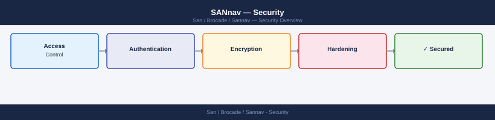

---
tags:
  - san
  - security
---
# SANnav — Security

SANnav hardening — RBAC, TLS configuration, user management, and secure communication with managed switches.

*Applies to: Brocade FOS 9.x*

<a class="kb-card" href="authentication/">
  <strong>Authentication</strong>
  LDAP/RADIUS integration, local accounts, and session management.
</a>

<a class="kb-card" href="access-control/">
  <strong>Access Control</strong>
  RBAC roles, privilege assignment, and least-privilege configuration.
</a>

<a class="kb-card" href="encryption/">
  <strong>Encryption</strong>
  TLS configuration, certificate management, and data protection.
</a>

<a class="kb-card" href="hardening/">
  <strong>Hardening</strong>
  Security baseline, audit logging, and compliance settings.
</a>

