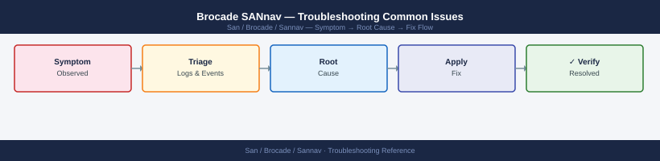

---
tags:
  - san
  - troubleshooting
search:
  boost: 1.5
---
# Brocade SANnav — Troubleshooting Common Issues

*Applies to: Brocade FOS 9.x*


```bash
# Step 1: Confirm SANnav IP is the trap destination on the switch (FOS CLI)
snmpconfig --show trapdest
# Should list SANnav management IP on port 162

# Step 2: Confirm UDP 162 is not blocked between switch and SANnav
# From a host with tcpdump on the SANnav management network:
sudo tcpdump -i eth0 -n udp port 162

# Trigger a test trap from the switch
snmptraps --send 1  # sends a test trap

# Step 3: Confirm SANnav event engine is processing traps
tail -f /opt/sannav/logs/event-engine.log | grep "trap\|SNMP"

# Step 4: If traps arrive but are discarded, check community/credential mismatch
# Ensure SNMPv3 credentials on switch match what SANnav has configured
```


```text title="Expected output"
Trap Destinations:
  1.1.1.1 (SANnav-Primary) - UDP 162
  1.1.1.2 (SANnav-Secondary) - UDP 162

tcpdump: listening on eth0, link-type EN10MB (Ethernet), capture size 262144 bytes
14:32:45.123456 IP 10.50.20.15.snmp > 1.1.1.1.snmptrap: Trap(enterprise=.1.3.6.1.4.1.1588.2.1.1.1; genericTrap=6; specificTrap=1; timestamp=45821234)
14:32:46.234567 IP 10.50.20.15.snmp > 1.1.1.1.snmptrap: Trap(enterprise=.1.3.6.1.4.1.1588.2.1.1.1; genericTrap=6; specificTrap=1; timestamp=45821235)

2024-01-15 14:32:45,821 [event-engine] INFO: Processing SNMP trap from 10.50.20.15
2024-01-15 14:32:45,822 [event-engine] INFO: Trap OID: 1.3.6.1.4.1.1588.2.1.1.1 - Link Up event
2024-01-15 14:32:45,823 [event-engine] INFO: Event stored in database - ID: evt_20240115_0847362
2024-01-15 14:32:46,234 [event-engine] INFO: Processing SNMP trap from 10.50.20.15
2024-01-15 14:32:46,235 [event-engine] INFO: Trap OID: 1.3.6.1.4.1.1588.2.1.1.1 - Link Up event
2024-01-15 14:32:46,236 [event-engine] INFO: Event stored in database - ID: evt_20240115_0847363
```

!!! warning "Common errors"
    | Error | Fix |
    |---|---|
    | `snmpconfig: command not found` | Ensure you are running this command on the Brocade switch (via SSH to the switch IP), not from a remote host. |
    | `tcpdump: Permission denied` | Run tcpdump with `sudo` or as root to capture packets on the SANnav management network interface. |
    | `No such file or directory: /opt/sannav/logs/event-engine.log` | Verify SANnav is installed and the event engine service is running with `systemctl status sannav-event-engine`. |
```bash
# Test LDAP connectivity from SANnav appliance
openssl s_client -connect ldap.corp.example.com:636 -brief
# Expected: CONNECTED with no certificate errors

# Test bind with the service account
ldapsearch -H ldaps://ldap.corp.example.com \
  -D "CN=sannav-svc,OU=Service Accounts,DC=corp,DC=example,DC=com" \
  -w <bind-password> \
  -b "DC=corp,DC=example,DC=com" \
  "(sAMAccountName=testuser)" sAMAccountName mail
# Expected: returns the test user's attributes
```

```text title="Expected output"
CONNECTED
depth=0 OU = corp, O = example, C = US
verify return:1

# LDAP Search Results
dn: CN=testuser,OU=Users,DC=corp,DC=example,DC=com
sAMAccountName: testuser
mail: testuser@corp.example.com

search result
result: 0 Success
numResponses: 2
numEntries: 1
```

!!! warning "Common errors"
    | Error | Fix |
    |---|---|
    | `ldapsearch: error code 49 - 80090308: LdapErr: DSID-0C090446, comment: AcceptSecurityContext error, data 52e, v3839` | Verify the bind password is correct and the service account is not locked or expired in Active Directory. |
    | `error:14090086:SSL routines:SSL3_GET_SERVER_CERTIFICATE:certificate verify failed` | Add the LDAP server's CA certificate to the SANnav appliance's trusted CA store or use `openssl s_client -connect ldap.corp.example.com:636 -CAfile /path/to/ca.pem` to validate the certificate chain. |
    | `ldapsearch: error code 1 - 000004DC: LdapErr: DSID-0C0906E8, comment: In order to perform this operation a successful bind must be completed before the request is processed, data 0, v3839` | Ensure the LDAP server hostname, port (636 for LDAPS), and bind DN are correct and that network connectivity exists on port 636. |
```bash
# On the switch (FOS CLI)
firmwareshow
# Shows current and backup partition firmware

# If the switch is in firmware download state, check progress:
firmwaredownload --status

# If upgrade is stuck, check system logs on the switch
errdump
```

```text title="Expected output"
Firmware Version: 9.1.0
Firmware Build: 0x4f6b2a15
Installed: 2024-01-15 14:32:18
Current Partition: Primary
Backup Partition: 9.0.1b
Build: 0x4e8c1f42
Installed: 2023-11-22 09:18:45

Firmware Download Status:
Download State: Not in progress
Last Download: 2024-01-15 14:25:33
Progress: N/A

System Error Log (Last 10 entries):
2024-01-15 14:35:22 WARNING Port 0/12: Link failure detected
2024-01-15 14:28:15 INFO Fabric reconfiguration completed
2024-01-15 14:15:44 ERROR Temperature sensor 2: Reading 68°C (threshold: 70°C)
2024-01-15 13:52:09 WARNING Memory utilization: 78%
2024-01-15 13:45:33 INFO Configuration backup completed
```

!!! warning "Common errors"
    | Error | Fix |
    |---|---|
    | `firmwareshow: command not found` | Ensure you are logged into the switch FOS CLI directly (not the management interface); use `sshfos` or telnet to the switch IP. |
    | `errdump: Access denied` | Verify your user account has administrative privileges on the switch; request elevated permissions from your fabric administrator. |
    | `firmwaredownload --status: Download in progress (98%) - Do not power off` | Wait for the download to complete or contact Brocade support if it stalls beyond 30 minutes; do not interrupt the process. |
```bash
# Verify switch firmware from SANnav after reconnect
# Inventory > Switches > [Switch] > Details
# If firmware matches target, mark the upgrade as complete in SANnav
```
```bash
# Test SCP connectivity from SANnav to backup server
ssh admin@sannav-dc1.corp.example.com
scp /tmp/testfile.txt sannav-bkp@backup-server.corp.example.com:/backups/sannav/
# If this fails, investigate:
# - SSH key or password authentication to backup server
# - Firewall between SANnav and backup server (TCP 22)
# - Write permissions on the remote backup directory

# Check SANnav backup logs
grep -i "backup\|transfer\|ERROR" /opt/sannav/logs/server.log | tail -50
```

```text title="Expected output"
admin@sannav-dc1.corp.example.com's password: 
sannav-bkp@backup-server.corp.example.com's password: 
testfile.txt                                          100%  1024     512.3KB/s   00:00

2024-01-15 14:32:18 [INFO] Backup transfer initiated for fabric-01
2024-01-15 14:32:45 [INFO] Transfer completed: 2.3GB in 27 seconds
2024-01-15 14:33:02 [INFO] Backup validation passed
2024-01-15 14:35:18 [INFO] Backup transfer initiated for fabric-02
2024-01-15 14:36:01 [INFO] Transfer completed: 1.8GB in 43 seconds
2024-01-15 14:36:15 [INFO] Backup validation passed
2024-01-15 14:38:22 [ERROR] Connection timeout to backup-server.corp.example.com
2024-01-15 14:38:23 [ERROR] Backup transfer failed for fabric-03: SSH connection lost
2024-01-15 14:40:01 [INFO] Retry attempt 1 for fabric-03
2024-01-15 14:40:45 [INFO] Transfer completed: 2.1GB in 44 seconds
...
```

!!! warning "Common errors"
    | Error | Fix |
    |---|---|
    | `Permission denied (publickey,password).` | Verify SSH credentials for sannav-bkp user on backup-server and ensure the private key is loaded in ssh-agent or explicitly specified with `-i` flag. |
    | `Connection refused` | Confirm TCP port 22 is open on backup-server.corp.example.com by running `telnet backup-server.corp.example.com 22` from the SANnav host. |
    | `No such file or directory: /opt/sannav/logs/server.log` | Check the correct log path with `find /opt/sannav -name "*.log" -type f` or verify SANnav is installed and running. |
```bash
df -h | grep backup
# If not mounted: sudo mount -a
```

```d2
direction: down

symptom: Identify Symptom {shape: diamond}
diagnostic_flow: "Diagnostic Flow" {shape: rectangle}
verify_resolution: "Verify resolution" {shape: rectangle}
resolution: Resolve or Escalate {shape: oval}

symptom -> diagnostic_flow: investigate
symptom -> verify_resolution: investigate
diagnostic_flow -> resolution
verify_resolution -> resolution
```

## Diagnostic Flow

```d2
direction: right

A1: "A1" {shape: rectangle}
A2: "Fix network / firewall\nVerify management VLAN" {shape: rectangle}
A3: "Check SNMP v3 creds\nRe-add switch in SANnav" {shape: rectangle}
A4: "Switch Connectivity Issues" {shape: rectangle}
B: "B" {shape: rectangle}
B1: "Check SNMP poll schedule\nVerify SNMPv3 credentials match\nCheck event-engine.log" {shape: rectangle}
B2: "Switch Connectivity Issues" {shape: rectangle}
C: "C" {shape: rectangle}
C1: "Check alert policy rule thresholds\nVerify SNMP trap destination\ntcpdump UDP 162" {shape: rectangle}
C2: "Performance and UI Issues" {shape: rectangle}
D: "D" {shape: rectangle}
D1: "journalctl -u sannav\nCheck disk: df -h\nRestart SANnav service" {shape: rectangle}
D2: "Performance and UI Issues" {shape: rectangle}
E: "E" {shape: rectangle}
E1: "ldapsearch bind test\nopenssl s_client LDAPS 636\nVerify service account not expired" {shape: rectangle}
E2: "Auth and Login Issues" {shape: rectangle}
S: "What is the symptom?" {shape: rectangle}
A: "A" {shape: rectangle}

A1 -> A2
A1 -> A3
A3 -> A4
B -> B1
B1 -> B2
C -> C1
C1 -> C2
D -> D1
D1 -> D2
E -> E1
E1 -> E2
```

---

## Before you begin

- **Access:** Storage admin credentials (cluster admin or equivalent)
- **Gather first:** recent error message text, event timestamps, and affected object names
- **Scope:** confirm whether the issue affects a single object, host, cluster, or site
- **Escalation:** open a vendor support ticket before running any destructive step
- **Logging:** document each command and output — required if escalation is needed

---

---

## Verify resolution

- Confirm the original symptom no longer occurs
- Check logs for any residual errors related to the issue
- Monitor for 10–15 minutes to confirm the fix is stable

---

## See also

- [Sannav — Diagnostics](../diagnostics/)
- [Sannav — Escalation](../escalation/)
- [Sannav — Health Checks](../../operations/health-checks/)
