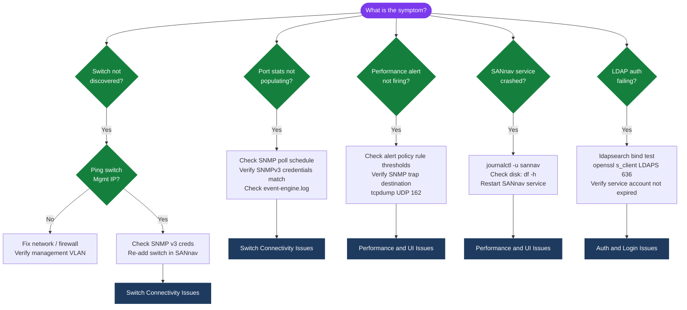

---
tags:
  - san
  - troubleshooting
search:
  boost: 1.5
---
# Brocade SANnav — Troubleshooting Common Issues

```bash
# Step 1: Confirm SANnav IP is the trap destination on the switch (FOS CLI)
snmpconfig --show trapdest
# Should list SANnav management IP on port 162

# Step 2: Confirm UDP 162 is not blocked between switch and SANnav
# From a host with tcpdump on the SANnav management network:
sudo tcpdump -i eth0 -n udp port 162

# Trigger a test trap from the switch
snmptraps --send 1  # sends a test trap

# Step 3: Confirm SANnav event engine is processing traps
tail -f /opt/sannav/logs/event-engine.log | grep "trap\|SNMP"

# Step 4: If traps arrive but are discarded, check community/credential mismatch
# Ensure SNMPv3 credentials on switch match what SANnav has configured
```
```text
┌─────────────────────────── Brocade SANnav — Troubleshooting Common Issues ────────────────────────────┐
│                                                                                                       │
│  Common SANnav issues: switch unreachable, zone push fail, auth error, stale data, UI slow.           │
│                                                                                                       │
│   ┌──────────────────────────────────────────────┐  ┌─────────────────────────────────────────────┐   │
│   │          Switch Connectivity Issues          │  │            Zone Management Issues           │   │
│   │        Switch unreachable: ping test         │  │           Zone push fail: FOS auth          │   │
│   │         SNMP poll fail: check creds          │  │         Conflict: out-of-band change        │   │
│   │         Wrong mgmt IP: re-add switch         │  │           Stale zone: re-discover           │   │
│   │         Discovery timeout: increase          │  │        Zone diff: confirm before push       │   │
│   │           FOS version unsupported            │  │        Config lock: cfgdisable first        │   │
│   └──────────────────────────────────────────────┘  └─────────────────────────────────────────────┘   │
│                                                                                                       │
│  Switch connectivity must be verified first; zone failures often trace to FOS auth.                   │
│                                                                                                       │
│                          ▼                                                 ▼                          │
│                                                                                                       │
│   ┌──────────────────────────────────────────────┐  ┌─────────────────────────────────────────────┐   │
│   │             Auth & Login Issues              │  │           Performance & UI Issues           │   │
│   │        TACACS+ timeout: check server         │  │         UI slow: browser cache clear        │   │
│   │         LDAP bind fail: verify creds         │  │         Elasticsearch overload: disk        │   │
│   │           Token expired: re-login            │  │         DB size: run prune old data         │   │
│   │         Local fallback: TACACS+ down         │  │           Sannav service: restart           │   │
│   │        Audit log: check failed logins        │  │          Log: journalctl -u sannav          │   │
│   └──────────────────────────────────────────────┘  └─────────────────────────────────────────────┘   │
│                                                                                                       │
│  Physical Infrastructure (the hardware everything above runs on):                                     │
│  SANnav VM · management network · TACACS+ server · Brocade FC switches                                │
│                                                                                                       │
│  Key terms:                                                                                           │
│                                                                                                       │
│  SNMP poll       = SANnav polls switches every 5 minutes; fail = switch shows red                     │
│  FOS auth        = SANnav stores per-switch FOS login credentials for zone push                       │
│  Out-of-band change= zone change made directly on switch bypassing SANnav                             │
│  Config lock     = FOS zone config locked if another session is editing                               │
│  Re-discover     = SANnav re-polls switch to refresh stale topology and zone data                     │
│  TACACS+ timeout = SANnav login fails if TACACS+ server unreachable; uses local                       │
│  LDAP bind       = service account bind to AD; check password expiry                                  │
│  JWT token       = expires after configured period; re-login to get new token                         │
│  Elasticsearch   = performance data store; disk full causes SANnav UI slowness                        │
│  Prune old data  = sannav-admin command to remove old perf data and free disk                         │
│  journalctl      = Linux systemd log; check for SANnav service errors and restarts                    │
│  Config diff     = SANnav compares its zone db to switch; shows out-of-band changes                   │
│                                                                                                       │
└───────────────────────────────────────────────────────────────────────────────────────────────────────┘
```
```bash
# Test LDAP connectivity from SANnav appliance
openssl s_client -connect ldap.corp.example.com:636 -brief
# Expected: CONNECTED with no certificate errors

# Test bind with the service account
ldapsearch -H ldaps://ldap.corp.example.com \
  -D "CN=sannav-svc,OU=Service Accounts,DC=corp,DC=example,DC=com" \
  -w <bind-password> \
  -b "DC=corp,DC=example,DC=com" \
  "(sAMAccountName=testuser)" sAMAccountName mail
# Expected: returns the test user's attributes
```
```bash
# On the switch (FOS CLI)
firmwareshow
# Shows current and backup partition firmware

# If the switch is in firmware download state, check progress:
firmwaredownload --status

# If upgrade is stuck, check system logs on the switch
errdump
```
```bash
# Verify switch firmware from SANnav after reconnect
# Inventory > Switches > [Switch] > Details
# If firmware matches target, mark the upgrade as complete in SANnav
```
```bash
# Test SCP connectivity from SANnav to backup server
ssh admin@sannav-dc1.corp.example.com
scp /tmp/testfile.txt sannav-bkp@backup-server.corp.example.com:/backups/sannav/
# If this fails, investigate:
# - SSH key or password authentication to backup server
# - Firewall between SANnav and backup server (TCP 22)
# - Write permissions on the remote backup directory

# Check SANnav backup logs
grep -i "backup\|transfer\|ERROR" /opt/sannav/logs/server.log | tail -50
```
```bash
df -h | grep backup
# If not mounted: sudo mount -a
```

## Diagnostic Flow



---

## Before you begin

- **Access:** Storage admin credentials (cluster admin or equivalent)
- **Gather first:** recent error message text, event timestamps, and affected object names
- **Scope:** confirm whether the issue affects a single object, host, cluster, or site
- **Escalation:** open a vendor support ticket before running any destructive step
- **Logging:** document each command and output — required if escalation is needed

---

---

## Verify resolution

- Confirm the original symptom no longer occurs
- Check logs for any residual errors related to the issue
- Monitor for 10–15 minutes to confirm the fix is stable

---

## See also

- [Sannav — Diagnostics](diagnostics/)
- [Sannav — Escalation](escalation/)
- [Sannav — Health Checks](../operations/health-checks/)
