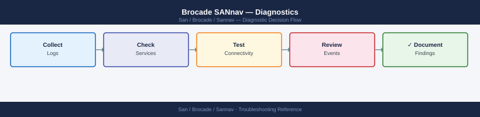
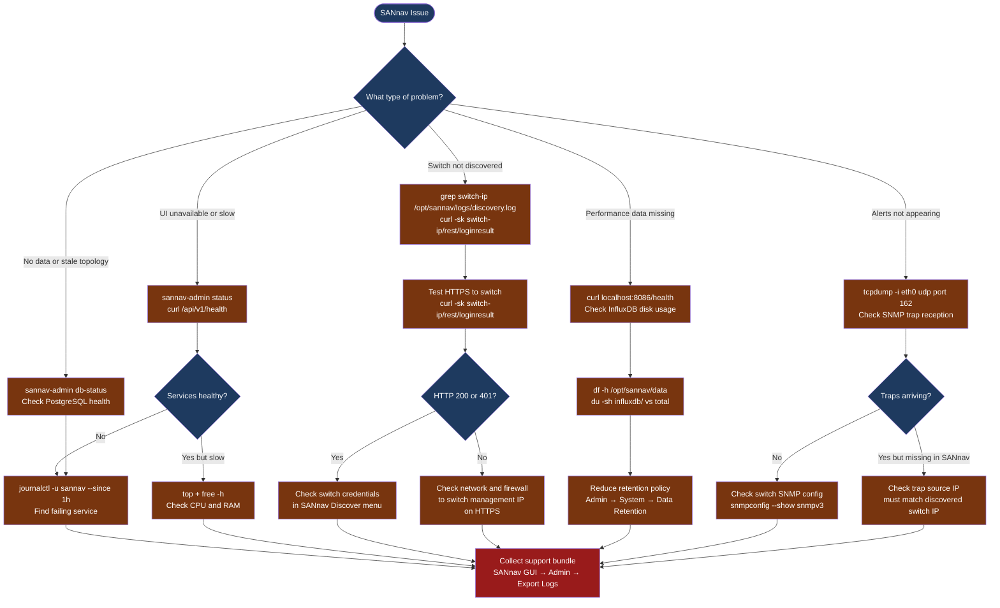

---
tags:
  - san
  - troubleshooting
search:
  boost: 1.5
---
# Brocade SANnav — Diagnostics

<div class="kb-summary">
SANnav diagnostic commands: check service health with sannav-admin and journalctl, test the REST API health endpoint, check PostgreSQL and InfluxDB database status, diagnose switch discovery failures, verify SNMP trap reception, and export the SANnav support bundle for Broadcom TAC cases.

*Applies to: Brocade SANnav 2.x*
</div>





## Before you begin

- **Access:** SSH to the SANnav VM as `admin`; SANnav web UI admin credentials; Brocade switch CLI access via SSH
- **Gather first:** the symptom (switch missing, alert missing, UI error, performance data gap), the affected switch IP or fabric name, and whether any changes were made recently (firmware update, IP change, credential rotation)
- **Scope:** confirm whether the issue affects one switch, one fabric, or all of SANnav

---

## Step 1 — Check SANnav service health

```bash
# SSH to the SANnav VM
ssh admin@<sannav-ip>

# Check all SANnav micro-services
sannav-admin status
# Expected: all services showing "running" or "healthy"
# Problem: any service in "stopped", "error", or "unhealthy"

# REST API health check (run from SANnav VM or any host that can reach it)
curl -sk https://<sannav-ip>/api/v1/health | python3 -m json.tool
# Expected: HTTP 200 with each service status = "UP"

# SANnav systemd journal (service start/stop and crash events)
journalctl -u sannav --since "1 hour ago" | tail -100

# System resources
top -b -n 1 | head -20
free -h
df -h /opt/sannav /var
# Alert if RAM < 20% free or disk > 80% used on /opt/sannav
```

---

## Step 2 — Check database health

```bash
# PostgreSQL database status (stores SANnav config, topology, events)
sannav-admin db-status
# Expected: "PostgreSQL is running and healthy"

# InfluxDB health (stores SAN performance metrics: IOPS, throughput, latency)
curl -sk http://localhost:8086/health
# Expected: {"name":"influxdb","status":"pass","message":"ready for queries and writes",...}

# Check InfluxDB disk usage (largest common cause of performance data loss)
du -sh /opt/sannav/data/influxdb/
df -h /opt/sannav/data
# If InfluxDB is > 80% of the disk: reduce retention policy

# Reduce InfluxDB retention to free space
# Navigate to: SANnav UI → Administration → System → Data Retention
# Set "SAN Analytics" retention to 14 days (default: 30)
# This runs asynchronously; reclaimed space appears after compaction (may take hours)
```

---

## Step 3 — Diagnose switch discovery failures

```bash
# Check discovery log for the affected switch IP
grep "<switch-ip>" /opt/sannav/logs/discovery.log | tail -50
# Look for: connection refused, authentication failed, SSL error

# Test HTTPS connectivity to the switch management port
curl -sk -o /dev/null -w "HTTP status: %{http_code}\n" https://<switch-ip>/rest/loginresult
# Expected: 200 (unauthenticated) or 401 (HTTPS works; credentials needed)
# If curl fails with connection refused or SSL error: fix at network level

# Test switch REST API authentication
curl -sk -X POST https://<switch-ip>/rest/login \
  -H "Content-Type: application/json" \
  -d '{"credentials":{"loginName":"<sannav-svc-user>","password":"<password>"}}'
# Expected: { "authToken": "..." }
# If you get 401: the password for the service account on the switch needs resetting
# If you get a connection error: firewall or HTTPS on the switch is disabled

# Check the switch has FOS HTTPS management enabled
# On the switch via SSH:
#   switchshow (verify switch is online)
#   httpcfg --show (verify HTTPS REST API is enabled)
```

---

## Step 4 — Check SNMP trap reception

SANnav relies on SNMP traps from switches for real-time alerts. If traps are not arriving, alerts appear with a delay or not at all.

```bash
# Verify UDP 162 is listening on the SANnav VM
ss -tulnp | grep 162
# Expected: udp UNCONN with port 162 listening

# Capture SNMP traps arriving at the SANnav VM (run for 60 seconds then Ctrl-C)
sudo tcpdump -i eth0 -n udp port 162 -c 20
# Expected: packets with source IP = switch management IP arriving at :162
# No packets: switch is not sending traps, or firewall is blocking UDP 162

# Check SNMP configuration on the switch (run on the switch via SSH)
snmpconfig --show snmpv3
# Verify: SANnav IP is listed as a trap recipient

# If traps arrive but SANnav does not show alerts:
# The trap source IP must match the discovered switch IP in SANnav
# Traps from an IP not in the SANnav inventory are silently discarded
# Check: SANnav UI → Discover → Inventory → switch → IP address shown

# Restart SANnav event engine only (without full restart, if traps are arriving but not processed)
sudo systemctl restart sannav-event-engine
```

---

## Step 5 — Check SANnav host system performance

```bash
# CPU — identify which SANnav process is consuming the most CPU
ps aux --sort=-%cpu | head -15

# Memory — check for near-OOM conditions
free -h
# If available memory < 2 GB: SANnav processes may be swapping; consider increasing VM RAM

# Disk I/O — check if slow storage is causing SANnav latency
iostat -x 2 5
# High %util on the SANnav datastore disk = storage bottleneck

# Network — check for dropped packets on the management NIC
ip -s link show eth0
# RX errors or drops = network issue, not SANnav

# REST API response time (should be < 2 seconds for login)
time curl -sk -X POST https://<sannav-ip>/rest/login \
  -H "Content-Type: application/json" \
  -d '{"credentials":{"loginName":"<admin>","password":"<pass>"}}'
# > 5 seconds: SANnav server under load or PostgreSQL is slow
```

---

## Step 6 — Collect support bundle for Broadcom TAC

```bash
# Via SANnav GUI (recommended — includes all service logs and DB state)
# Navigate to: Administration → Support → Export Support Bundle
# Wait for download (5–15 minutes)

# Via CLI (if GUI is unavailable)
sannav-admin support-bundle --output /tmp/sannav-support-$(date +%F).tar.gz
# Then download from the VM:
scp admin@<sannav-ip>:/tmp/sannav-support-*.tar.gz ./

# Also collect supportsave from each affected Brocade switch (run on each switch via SSH)
supportsave
# Saves to the switch; download via FTP/SCP from the switch
# Required for TAC cases involving switch-SANnav interoperability

# Include in the Broadcom/SANnav TAC case:
# - SANnav support bundle
# - switch supportsave files for each affected fabric
# - Timeline of the issue and any recent changes
# - SANnav version: GUI → Administration → System → Version
```

---

## Log locations

| Component | Path | What to look for |
|---|---|---|
| SANnav service | `journalctl -u sannav --since "1h ago"` | Service start/stop, fatal errors |
| Discovery | `/opt/sannav/logs/discovery.log` | Switch discovery connection and auth errors |
| Event engine | `/opt/sannav/logs/event-engine.log` | Trap processing, event rule matching |
| Application | `/opt/sannav/logs/application.log` | General application errors |
| InfluxDB | `curl localhost:8086/health` | Metric DB health and query status |
| PostgreSQL | `sannav-admin db-status` | Database health and replication |

---

## See also

- [SANnav — Common Issues](common-issues/)
- [SANnav — Escalation](escalation/)
- [SANnav — Health Checks](../operations/health-checks/)

## Verify resolution

- `sannav-admin status` shows all services running
- `curl -sk https://<sannav-ip>/api/v1/health` returns `"status": "UP"` for all services
- The previously missing switch appears in SANnav UI → Inventory with a green health icon
- SNMP trap test: trigger a manual MAPS alert on the switch and confirm it appears in SANnav Alerts within 60 seconds
- `curl localhost:8086/health` shows InfluxDB `"status": "pass"`; performance charts show current data
