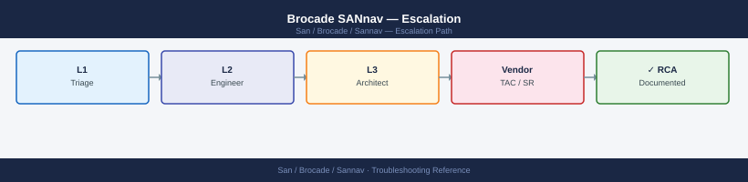
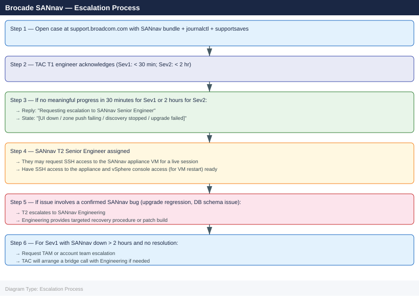

---
tags:
  - san
  - troubleshooting
search:
  boost: 1.5
---
# Brocade SANnav — Escalation

<div class="kb-summary">
How to escalate Brocade SANnav Management Portal issues to Broadcom support: what data to collect, how to generate the SANnav support bundle, step-by-step case creation on support.broadcom.com, and the escalation path when progress stalls.

*Applies to: SANnav Management Portal 2.x*
</div>



---

```d2
direction: down

symptom: Identify Symptom {shape: diamond}
preescalation_selfcheck: "Pre-Escalation Self-Check" {shape: rectangle}
stepbystep_data_collection: "Step-by-Step Data Collection" {shape: rectangle}
how_to_open_the_sr_on_supportbroadco: "How to Open the SR on support.broadcom.com" {shape: rectangle}
escalation_path: "Escalation Path" {shape: rectangle}
what_not_to_do: "What NOT to Do" {shape: rectangle}
useful_commands_for_case_updates: "Useful Commands for Case Updates" {shape: rectangle}
resolution: Resolve or Escalate {shape: oval}

symptom -> preescalation_selfcheck: investigate
symptom -> stepbystep_data_collection: investigate
symptom -> how_to_open_the_sr_on_supportbroadco: investigate
symptom -> escalation_path: investigate
symptom -> what_not_to_do: investigate
symptom -> useful_commands_for_case_updates: investigate
preescalation_selfcheck -> resolution
stepbystep_data_collection -> resolution
how_to_open_the_sr_on_supportbroadco -> resolution
escalation_path -> resolution
what_not_to_do -> resolution
useful_commands_for_case_updates -> resolution
```

## Before you begin

- **Access required:** SSH access to the SANnav appliance VM; SANnav admin UI credentials; Broadcom support account at support.broadcom.com with active SANnav entitlement; FOS admin credentials on the managed switches
- **Freeze all fabric changes** during an active SANnav incident — zone configuration changes pushed to switches during a SANnav failure can leave fabrics in a partially committed state
- **Do NOT restart the SANnav service** during a failed upgrade without TAC direction — an incomplete restart during upgrade recovery can corrupt the SANnav database
- **Do NOT delete the SANnav database** (`/opt/brocade/sannav/postgres/data/`) without explicit TAC instruction — the database contains the only record of the historical fabric state TAC uses to diagnose the failure

---

## Pre-Escalation Self-Check

Run these before opening the case.

| Check | Command / Location | Expected result |
|---|---|---|
| SANnav version | SSH: `sannav version` | Note full version (e.g. 2.3.0a) |
| SANnav UI accessibility | Browse to `https://<sannav-ip>/` | Login page loads |
| SANnav services | SSH: `sannav-admin status` | All services Running |
| Database status | SSH: `sannav-admin db-status` | PostgreSQL service running |
| Disk space | SSH: `df -h /opt/brocade/sannav` | Below 80% used |
| Switch discovery | SANnav UI → Inventory → Switches | All expected switches shown as Reachable |
| FOS version per switch | SANnav UI → Inventory → Switches → [switch] → Details | Note FOS version; check compatibility matrix |
| Recent alerts | SANnav UI → Alerts → Active | Note any critical alerts on the SANnav appliance itself |

---

## Step-by-Step Data Collection

### 1. Get the SANnav version and appliance health

```bash
# SSH to the SANnav appliance as admin
ssh admin@<sannav-ip>

# SANnav version
sannav version

# Service status
sannav-admin status

# Database status
sannav-admin db-status

# Disk space (SANnav data and log partitions)
df -h /opt/brocade/sannav
df -h

# Memory and CPU
free -h
uptime
```

### 2. Generate the SANnav support bundle

```bash
# SSH to the SANnav appliance
ssh admin@<sannav-ip>

# Generate the support bundle — this is mandatory for any TAC case
sannav support-bundle --output /tmp/sannav-diag-$(date +%Y%m%d).tar.gz

# Verify and check file size
ls -lh /tmp/sannav-diag-*.tar.gz

# Copy to a local workstation for upload
scp admin@<sannav-ip>:/tmp/sannav-diag-*.tar.gz /tmp/
```

### 3. Collect the SANnav service log (journalctl)

```bash
# SSH to the SANnav appliance
ssh admin@<sannav-ip>

# Collect the full SANnav service log from systemd journal
sudo journalctl -u sannav --no-pager --output short-iso > /tmp/sannav-journal-$(date +%Y%m%d).log

# Or last 2000 lines
sudo journalctl -u sannav -n 2000 --no-pager > /tmp/sannav-journal-recent.log

# Capture resource stats over a few minutes (for intermittent issues)
for i in {1..5}; do
  echo "=== $(date) ==="
  free -h
  df -h /opt/brocade/sannav
  uptime
  sleep 30
done > /tmp/sannav-perf-$(date +%Y%m%d).txt
```

### 4. Run supportsave on affected switches

```bash
# SSH to each affected Brocade switch as admin
ssh admin@<switch-ip>

# Generate the switch support bundle
supportsave

# Switch version
firmwareshow

# Zoning status
cfgshow
nsshow
fabricshow
```

Repeat `supportsave` on every switch in the affected fabric. TAC needs the switch-level data alongside the SANnav data.

### 5. Export the SANnav audit log

In the SANnav UI:
1. Click **Audit** (or navigate to **Administration → Audit Log**).
2. Set the time range to cover the 48 hours before the issue started.
3. Click **Export** → CSV.
4. Download and attach to the case.

The audit log shows every zone change, discovery action, and admin operation that occurred before the failure.

### 6. Write the timeline

```text
SANnav version: 2.3.0a build XXXXXXXX
Appliance: sannav-01.corp.local (VMware VM, 16 vCPU, 32 GB RAM)
Managed fabrics: 2 fabrics (Fabric-A: 12 switches, Fabric-B: 8 switches)
FOS versions: 9.1.0a, 9.0.1d (mixed — check compatibility matrix)
Issue first observed: 2026-06-14 13:00 UTC
Last confirmed working: 2026-06-14 12:00 UTC
Changes in 24h before the issue:
  - 11:30: SANnav upgrade 2.2.0 to 2.3.0a initiated via VAMI
  - 12:00: Upgrade completed; SANnav UI shows "Services Starting..."
  - 13:00: SANnav UI returns 502 Bad Gateway; login page not loading
  - 13:05: SSH: sannav-admin status shows "sannav-api" service in "Stopped" state
Steps already taken:
  - Did NOT restart the sannav-api service (awaiting TAC guidance)
  - Did NOT make any zone changes
  - sannav-journal: "FATAL: relation 'sannav.audit_log' does not exist" repeated
Blast radius: SANnav UI completely unavailable; zone changes not possible; fabric health monitoring blind
```

---

## How to Open the SR on support.broadcom.com

1. Go to **support.broadcom.com** and sign in with your Broadcom account.

2. Click **Open a Support Request**.

3. Under **Product Group**, select **Brocade Storage Networking** → **SANnav Management Portal**.

4. Under **Version**, select your SANnav version from Step 1.

5. Under **Severity**, select:
   - **Severity 1 — Critical**: SANnav UI completely unreachable; fabric management unavailable; zone changes impossible; switch discovery has stopped for all fabrics; no workaround
   - **Severity 2 — High**: Zone change operations failing; discovery partially working; SANnav UI accessible but specific operations fail; switch telemetry missing
   - **Severity 3 — Medium**: Single switch not discovered; specific feature broken; report generation failing; workaround exists
   - **Severity 4 — Low**: How-to question, pre-upgrade planning, feature question

6. In the **Summary** field: product + symptom + scope. Example: `SANnav 2.3.0a — UI inaccessible after upgrade from 2.2.0, sannav-api service stopped, 20 switches unmanaged`.

7. In the **Description** field, paste:
   - SANnav version and appliance resource state from Step 1
   - The journal error from Step 3 (the FATAL or ERROR line)
   - FOS versions across the fabric
   - The timeline from Step 6

8. Under **Attachments**, upload:
   - The SANnav support bundle from Step 2
   - The journalctl log from Step 3
   - supportsave archives from affected switches (Step 4)
   - The audit log CSV from Step 5

9. Click **Submit**. You receive a case number immediately.

10. **Severity 1 only:** call Broadcom TAC after submission:
    - North America: +1 877-486-9273 (24×7 for Severity 1)
    - EMEA: +44 (0)3453 700 100
    - State "Severity 1 — SANnav Management Portal down, 20 switches unmanaged, case XXXXXXXX" at the start of the call.

---

## Escalation Path



---

## What NOT to Do

| Do NOT do this | Why | What to do instead |
|---|---|---|
| Restart the SANnav service during a failed upgrade | An incomplete restart during upgrade recovery can corrupt the SANnav database, making recovery impossible without a full redeploy | Wait for TAC to review the journalctl log before any service restart |
| Push zone changes to switches during a SANnav incident | Zone changes pushed while SANnav is partially available can be committed to the switch but not recorded in the SANnav database, causing a configuration drift | Freeze all zone changes until SANnav is fully operational and confirmed in sync with the fabric |
| Delete the SANnav database directory | The database at `/opt/brocade/sannav/postgres/data/` contains historical fabric state; deleting it makes DB-level recovery impossible | Only delete if TAC explicitly instructs, after they have confirmed the data cannot be recovered |
| Change switch SNMP credentials or SSH credentials during the case | Changing credentials mid-case breaks SANnav's connection to the switches and changes the auth state TAC is diagnosing | Hold all credential changes until TAC confirms the issue is not auth-related |
| Upgrade SANnav again immediately after a failed upgrade | A second upgrade on a partially failed state may push the SANnav database into an unrecoverable mixed-version schema | Let TAC examine the failed upgrade log before any retry |
| Power off the SANnav VM during the investigation | Removes the ability for TAC to access live state via SSH; in-memory diagnostic data is lost | Request a controlled shutdown from TAC if a VM restart is needed |

---

## Useful Commands for Case Updates

```bash
# SSH to SANnav appliance as admin — paste these into every case update

# SANnav version
sannav version

# All service states
sannav-admin status

# Database status
sannav-admin db-status

# Disk space
df -h /opt/brocade/sannav

# Recent journal errors
sudo journalctl -u sannav --no-pager -n 200 | grep -i "error\|fatal\|exception"

# Resource state
free -h && uptime
```

---

## Support SLA Reference

| Severity | Definition | Initial Response SLA |
|---|---|---|
| Sev 1 — Critical | SANnav down; zone management unavailable; all discovery stopped | < 30 min (24×7) |
| Sev 2 — High | Zone push failing; discovery partially working; specific operation broken | < 2 hours (24×7) |
| Sev 3 — Medium | Single switch not discovered; specific feature broken; workaround exists | < 8 hours |
| Sev 4 — Low | How-to, planning, compatibility question | Next business day |

---

## See also

- [SANnav — Diagnostics](diagnostics/)
- [SANnav — Common Issues](common-issues/)

---

## Verify resolution

- Browse to the SANnav UI at `https://<sannav-ip>/` and confirm the login page loads
- Log in and navigate to **Inventory → Switches** — all previously discovered switches appear as Reachable
- Navigate to **Zoning** and confirm zone changes can be pushed to the fabric (test with a non-production fabric or create a dummy zone)
- Run `sannav-admin status` on the appliance and confirm all services show Running
- Check the **Alerts** view for any critical alerts on the SANnav appliance itself
- Monitor for 15 minutes to confirm discovery remains active and no services enter a failed state
