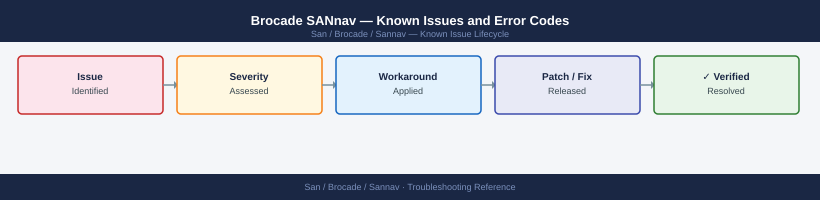

---
tags:
  - troubleshooting
  - sannav
  - brocade
  - san
  - known-issues
---
# Brocade SANnav — Known Issues and Error Codes

<div class="kb-summary">
Catalog of known SANnav bugs, error codes, and workarounds covering switch discovery, performance data, and upgrade issues.

*Applies to: SANnav 2.3.x*
</div>



```d2
direction: down

symptom: Identify Symptom {shape: diamond}
switch_discovery: "Switch Discovery" {shape: rectangle}
performance_data: "Performance Data" {shape: rectangle}
resolution: Resolve or Escalate {shape: oval}

symptom -> switch_discovery: investigate
symptom -> performance_data: investigate
switch_discovery -> resolution
performance_data -> resolution
```

## Before you begin

- SANnav errors appear in Dashboard → Events and in SANnav → Administration → Logs.
- Most discovery failures are SNMP or SSH connectivity issues from SANnav to switches.

## Switch Discovery

| Error / Symptom | Affected Versions | Cause | Workaround / Fix | Fixed In |
|---|---|---|---|---|
| Switch not appearing after add | SANnav 2.3 | SNMP community mismatch or UDP 161 blocked | Verify SNMP community string; verify UDP 161 from SANnav to switch | N/A |
| `SSH authentication failed` during discovery | SANnav 2.3 | SANnav credentials incorrect for switch admin | Update switch credentials in SANnav → Administration → Credentials | N/A |
| SNMP trap not appearing in SANnav | SANnav 2.3 | Switch SNMP trap destination not pointing to SANnav | Configure trap on switch: `snmpconfig --set snmpv1` with SANnav IP | N/A |

## Performance Data

| Error / Symptom | Affected Versions | Cause | Workaround / Fix | Fixed In |
|---|---|---|---|---|
| Performance graphs empty for discovered switch | SANnav 2.3 | Performance monitoring not enabled for switch | Enable monitoring: SANnav → Monitoring → Performance Monitoring → Add Targets | N/A |
| Port utilization showing 0% for active ports | SANnav 2.3 | Counter polling interval set too high | Reduce polling interval to 30 seconds for active monitoring | N/A |

## See also

- [Brocade SANnav — Common Issues](../common-issues/)
- [Brocade Fabric OS — Known Issues](../../fabric-os/troubleshooting/known-issues.md)
