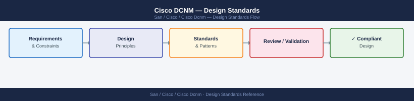

---
tags:
  - architecture
  - san
---
# Cisco DCNM — Design Standards


```bash
# On each MDS switch (NX-OS CLI)
zone default-zone permit vsan 10
# Expected after setting deny:
no zone default-zone permit vsan 10
# Verify:
show zone status vsan 10
# Mode: Basic, Default-zone: deny
```


```text title="Expected output"
mds-switch-01# zone default-zone permit vsan 10
mds-switch-01# no zone default-zone permit vsan 10
mds-switch-01# show zone status vsan 10
VSAN: 10
Mode: Basic
Default-zone: deny
Session: None
Interop Mode: Off
mds-switch-01#
```

!!! warning "Common errors"
    **`% Invalid command`** — Verify the switch is in config mode with `config t` before entering zone commands.
    **`% VSAN 10 does not exist`** — Create the VSAN first using `vsan 10` command before configuring zone policies.
---

## See also

- [Cisco Dcnm — How It Works](../how-it-works/)
- [Cisco Dcnm — Integrations](../integrations/)
- [Cisco Dcnm — Deploy](../../deploy/)
