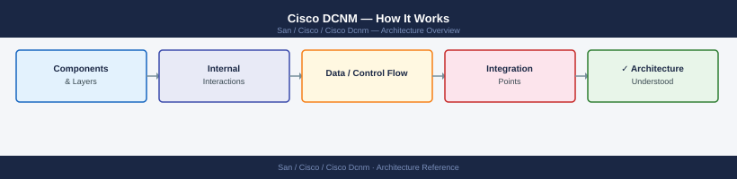
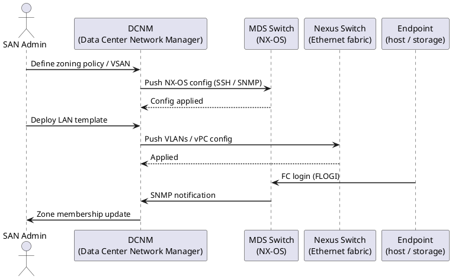
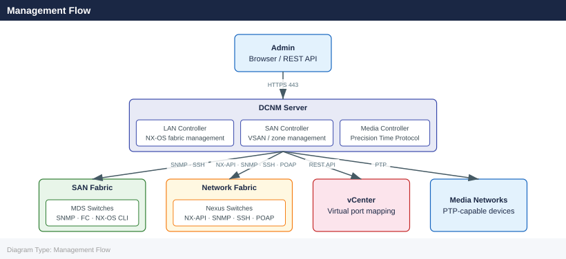

---
tags:
  - architecture
  - san
---
# Cisco DCNM — How It Works

How It Works reference covering Overview, Deployment Models, Management Flow, Network Requirements, VM Sizing (Standalone, 11.x) and 1 more sections.

*Applies to: Cisco MDS · Nexus*

## Overview

Cisco Data Center Network Manager (DCNM) is Cisco's SAN and LAN management platform for Cisco MDS 9000 Fibre Channel switches. DCNM 11.x is the last standalone appliance release. Starting with version 12.0 (2022), DCNM was renamed **Nexus Dashboard Fabric Controller (NDFC)** and runs as an application on the Cisco Nexus Dashboard platform.

## Deployment Models

### Standalone Mode

Single DCNM server. Suitable for environments up to approximately 1,000 managed devices. No high availability.

### Native HA Mode

Two DCNM servers (active + standby) with shared external database (Oracle or PostgreSQL). Requires a Virtual IP (VIP) for client access.

### Federation Mode

Multiple DCNM instances managing separate fabrics, federated under a single login (available in 11.5+). Useful for large environments spanning multiple data centres.

## Management Flow

1. **Discovery** — DCNM discovers switches via SNMP and SSH/Telnet (SNMPv3 preferred)
2. **Inventory** — Discovered devices added to inventory; topology built from CDP/LLDP and SNMP MIB data
3. **Configuration push** — Zone changes, VSAN configuration, device alias updates pushed via SSH (NX-OS CLI) or SNMP
4. **Monitoring** — SNMP traps, syslog, and performance MIB polling provide real-time and historical data
5. **Reporting** — Built-in reports cover inventory, performance, events, and compliance

## Network Requirements

| Communication | Protocol | Port | Direction |
|---|---|---|---|
| DCNM → switch | SSH | 22 | Outbound from DCNM |
| DCNM → switch | SNMP v3 | 161/UDP | Outbound from DCNM |
| Switch → DCNM | SNMP trap | 162/UDP | Inbound to DCNM |
| Switch → DCNM | Syslog | 514/UDP | Inbound to DCNM |
| Browser → DCNM | HTTPS | 443 | Inbound to DCNM |

## VM Sizing (Standalone, 11.x)

| Environment | vCPU | RAM | Storage | Max Switches |
|---|---|---|---|---|
| Small | 8 | 32 GB | 500 GB | 50 |
| Medium | 16 | 64 GB | 1 TB | 200 |
| Large | 24 | 128 GB | 2 TB | 1,000 |

## DCNM 11.x vs. NDFC 12.x

| DCNM 11.x (standalone) | NDFC 12.x (on Nexus Dashboard) |
|---|---|
| Monolithic Java appliance | Application running on ND cluster |
| OVA or ISO deployment | ND cluster + NDFC app install |
| Standalone HA (2-node) | 3 or 5-node ND cluster |
| Limited multi-site | Native multi-site via ND |
| EoL announced | Active development |

Migration from DCNM 11.x to NDFC requires re-deploying ND and re-discovering managed switches. Zone databases and device aliases can be exported and re-imported into NDFC.

---

## See also

- [Cisco Dcnm — Design Standards](../design-standards/)
- [Cisco Dcnm — Integrations](../integrations/)
- [Cisco Dcnm — Deploy](../../deploy/)
